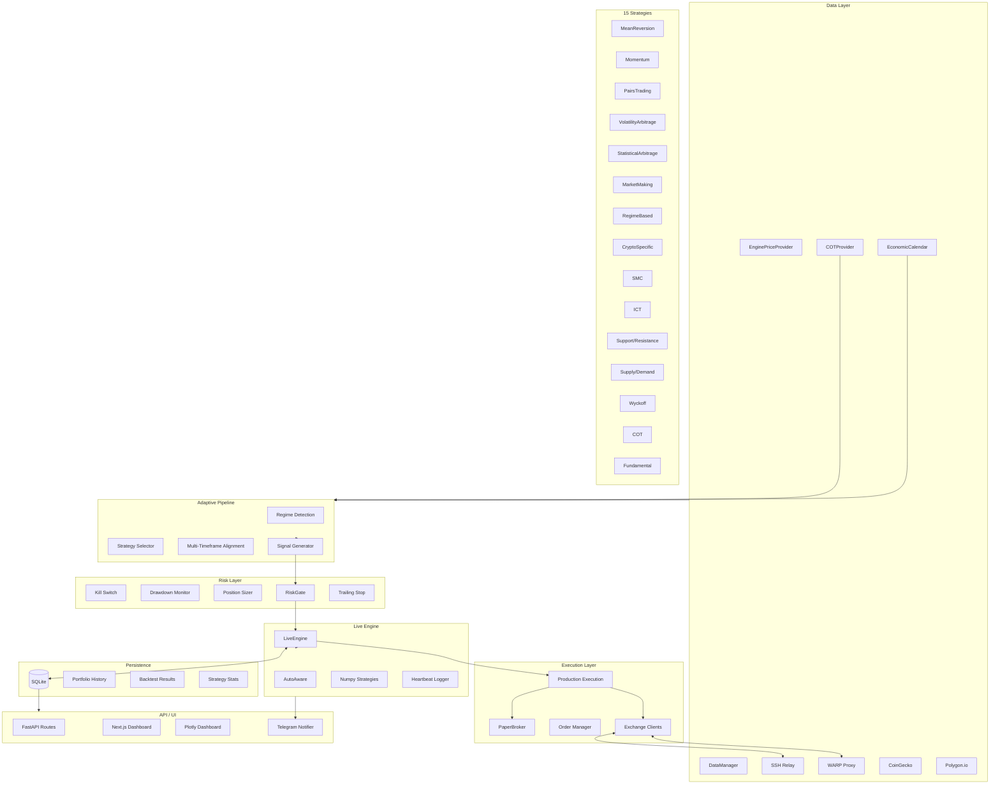

# Quant Nanggroe AI – Consolidated Documentation

## Architecture Diagram

*(Generated by `scripts/graphify.py`)*

## System Overview

*(Excerpt from `docs/SYSTEM.md`)*

Quant Nanggroe AI (QNA) is a multi‑agent quantitative trading framework with:
- LangGraph StateGraph orchestration (8 nodes, conditional edges)
- 15 trading strategies across 7 categories
- 11‑agent council with LLM‑driven bull/bear & risk debates
- 9‑checkpoint constitutional risk gate (deterministic, non‑negotiable)
- Paper exchange broker (≈900 LOC) + Alpaca live integration
- FastAPI REST API + WebSocket + Next.js dashboard
- Docker multi‑stage build & docker‑compose (3 services)
- Telegram bot integration (`qna_prod.py --telegram`)
- Auto Ω singularity kernel (8 consciousness layers)

Full system file‑by‑file reference is available in `docs/SYSTEM.md`.

## Memory Architecture

*(Excerpt from `docs/MEMORY_ARCHITECTURE.md`)*

The AI‑MultiColony‑Ecosystem implements a three‑layer memory model:
- **Working Memory** – current task context, active agent states, in‑memory cache (~1000 entries).
- **Episodic Memory** – past interactions, workflow history, task results stored in SQLite.
- **Semantic Memory** – knowledge base, external APIs (Wikipedia, news), agent metrics.

Memory consolidates upward (working → episodic → semantic) with importance weighting and TTL‑based expiration. See `docs/MEMORY_ARCHITECTURE.md` for full diagrams and API details.

## Pipeline Flow

*(Excerpt from `README.md`)*

1. **DATA INGESTION** – CoinGecko / Bybit / Polygon → Historical Cache → DataManager (auto fallback + circuit breaker).
2. **REGIME DETECTION** – HMM (4 regimes) + Ensemble voting.
3. **STRATEGY SELECTION** – Regime → optimal subset of 15 strategies (multi‑timeframe alignment).
4. **SIGNAL GENERATION** – Active strategies emit BUY/SELL signals with Bayesian confidence.
5. **RISK ASSESSMENT** – 9‑checkpoint constitutional gate (kill switch, drawdown, VaR, etc.).
6. **EXECUTION** – PaperBroker (default) or Alpaca → Order Manager → Fill.
7. **PERSISTENCE** – SQLite stores candles, orders, trades; Redis provides fast cache & pub/sub.
8. **API / UI** – FastAPI endpoints + Next.js dashboard with real‑time WebSocket updates.

## CI / Workflow

The repository uses GitHub Actions defined in `.github/workflows/ci.yml`:
- Runs on pushes to `main`/`develop` and PRs to `main`.
- Tests against Python 3.11 & 3.12.
- Installs development dependencies (`.[dev]`).
- Lints with **ruff** (ignoring line‑length & unused imports).
- Executes pytest with coverage (minimum 60 %).
- Runs a Bandit security scan on the `quant_nanggroe/` package.

## File Index

A concise index of the repository structure is maintained in [`FILE_INDEX.md`](FILE_INDEX.md).

---

*Generated on $(date) – keep this document up‑to‑date with any structural changes.*