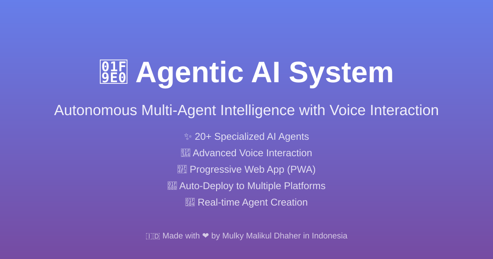
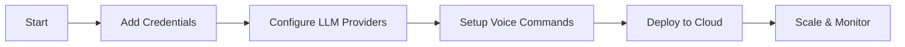
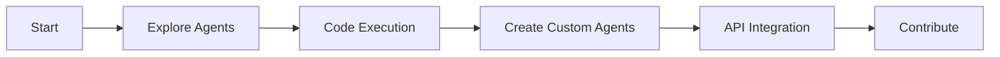
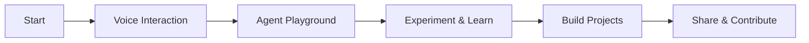

# 🚀 Agentic AI System - Flow Start Guide

<div align="center">



**🌟 Your Journey to AI Automation Excellence Starts Here 🌟**

**Created by Mulky Malikul Dhaher from Indonesia 🇮🇩**

</div>

---

## 🎯 Welcome to the Future of AI Automation

**Agentic AI System v2.1.0** is your gateway to revolutionary AI-powered automation. This Flow Start guide will take you from zero to AI automation hero in minutes, not hours.

### 🌟 **What You're About to Experience:**
- **40+ AI Agents** working in perfect harmony — including new GitHub Agent, Voice Agent, Web3 Plugin, and Agent Watcher
- **Voice Control** in 10+ languages with offline support
- **Military-grade Security** with enterprise encryption and Nginx rate limiting
- **Multi-LLM Gateway** with free LLM7 priority
- **Production Monitoring** with Prometheus + Grafana observability stack
- **Progressive Web App** that works offline
- **One-click Deployment** to 8+ cloud platforms
- **Blockchain Integration** with read-only Web3 queries across 8 networks

---

## ⚡ Quick Start Flow (5 Minutes to AI Power)

### **Step 1: Clone & Install (2 minutes)**
```bash
# 🚀 Get the system
git clone https://codeberg.org/Dhaher-Labs/Quant-Nanggroe-AI.git
cd Agentic-AI-Ecosystem

# 📦 Install magic
pip install -r requirements.txt

# ⚙️ Quick setup
cp .env.example .env
```

### **Step 2: Launch System (1 minute)**
```bash
# 🐳 Start with full monitoring stack (recommended)
docker compose up -d

# OR: Start standalone
python web_interface/app.py

# 🌐 Open your browser to: http://localhost:5000
# 📊 Grafana dashboard: http://localhost:3000
# 🔍 Prometheus metrics: http://localhost:9090
```

### **Step 3: Voice Activation (30 seconds)**
```bash
# 🎤 Press Ctrl+Space anywhere and say:
"Hello, show me the agent network"
"Create a new data analysis agent"
"Execute Python code for me"
```

### **Step 4: Install as App (30 seconds)**
- Click **"Install App"** button in browser
- **Add to Home Screen** on mobile
- **Pin to Taskbar** on desktop

### **Step 5: Explore & Automate (Forever)**
- 🤖 **Agent Network**: `/agents` - See all 40+ AI agents
- 🔐 **Credentials**: `/credentials` - Secure platform access
- 🧠 **LLM Providers**: `/llm_providers` - Multi-AI management
- 💻 **Code Execution**: `/code` - Multi-language playground
- 🐙 **GitHub Agent**: Manage repos, PRs, and issues via voice or API
- 🔊 **Voice Agent**: Transcribe audio, generate speech, route voice commands
- ⛓️ **Web3 Plugin**: Query blockchain data, DeFi protocols, token balances
- 👁️ **Agent Watcher**: Monitor agent health, get alerts, auto-restart failed agents
- 📊 **Monitoring**: Grafana dashboards for system and agent metrics

---

## 🎨 Flow Paths - Choose Your Adventure

### 🏢 **Enterprise Flow (Business Users)**


**Perfect for:** CEOs, CTOs, Business Managers
- **Time to Value:** 15 minutes
- **Key Benefits:** Instant productivity, cost savings, automation

### 👨‍💻 **Developer Flow (Technical Users)**


**Perfect for:** Developers, DevOps, Technical Leads
- **Time to Value:** 10 minutes
- **Key Benefits:** Code automation, AI-powered development, extensibility

### 🎓 **Learning Flow (Students & Enthusiasts)**


**Perfect for:** Students, Researchers, AI Enthusiasts
- **Time to Value:** 5 minutes
- **Key Benefits:** Learn AI, hands-on experience, community

---

## 🚀 Power User Flows

### **🎤 Voice-First Flow**
1. **Activate**: Press `Ctrl+Space`
2. **Command**: Say your intent in any language
3. **Execute**: Watch AI agents work
4. **Iterate**: Give feedback and refine

**Voice Commands to Try:**
```
"Create a web scraping agent"
"Analyze this CSV file for insights"
"Deploy my app to production"
"Optimize system performance"
"Login to all my platforms"
"Check my GitHub repositories"
"Monitor agent health"
"What's the ETH balance for 0x..."
```

### **🔐 Security-First Flow**
1. **Encrypt**: Store all credentials securely with AES-256
2. **Authenticate**: Use basic auth endpoints with Nginx rate limiting
3. **Monitor**: Track all security activities via audit logs
4. **Audit**: Review security logs and Prometheus metrics

**Security Features:**
- 🔒 AES-256 encryption with PBKDF2HMAC (100k iterations)
- 🛡️ Nginx reverse proxy with TLS 1.2/1.3
- 🚦 Rate limiting (general: 30r/s, API: 10r/s, auth: 5r/s)
- 🔗 CORS configuration via `CORS_ALLOWED_ORIGINS`
- ⛓️ Web3 read-only mode — no transaction signing
- 📊 Comprehensive audit logs
- 🔄 Automatic session management

### **🧠 AI-First Flow**
1. **Connect**: Link multiple LLM providers
2. **Optimize**: Use free LLM7 as primary
3. **Scale**: Auto-failover when needed
4. **Analyze**: Track usage and costs

**LLM Providers:**
- 🆓 LLM7 (Free, Priority #1)
- 🔄 OpenRouter (Multi-model hub)
- 🧠 DeepSeek (Advanced reasoning)
- 🤖 OpenAI (GPT models)
- 👥 Anthropic (Claude models)

---

## 📱 Platform-Specific Flows

### **💻 Desktop Flow**
- **Install PWA**: Full offline capabilities
- **Voice Hotkeys**: Ctrl+Space activation
- **Multi-monitor**: Drag agents across screens
- **Keyboard Shortcuts**: Power user efficiency

### **📱 Mobile Flow**
- **Add to Home**: Native app experience
- **Touch Voice**: Tap to activate voice
- **Offline Sync**: Works without internet
- **Push Notifications**: Real-time updates

### **☁️ Cloud Flow**
- **One-click Deploy**: Railway, Vercel, Netlify
- **Auto-scale**: Handle any load
- **Global CDN**: Worldwide performance
- **Enterprise SSO**: Corporate integration

---

## 🔄 Integration Flows

### **🔗 GitHub Flow**
```bash
# Connect GitHub account (set GITHUB_TOKEN in .env)
"List my GitHub repositories"

# Automate workflow
"Create a new repository for my AI project"
"Deploy latest changes to production"
"Generate documentation from code"
"List open pull requests"
"Check CI status for the main branch"
```

### **⛓️ Web3 Flow**
```bash
# Query blockchain data (read-only)
"What's the ETH balance for 0x..."
"Get token info for USDT on Ethereum"
"Estimate gas for a transaction"
"Check the latest block on Polygon"
"Get the current ETH price"
```

### **👁️ Agent Watcher Flow**
```bash
# Monitor agent health
"Monitor agents"
"Check agent health"
"Get metrics for all agents"
"Generate health report"
```

### **📊 Data Flow**
```python
# Upload data
"Analyze this sales data CSV"

# Get insights
"Show me trends and predictions"

# Create reports
"Generate executive summary"
```

### **🤖 Agent Flow**
```bash
# Create specialized agent
"Create an agent for social media management"

# Train and deploy
"Train this agent with my data"
"Deploy agent to handle customer support"
```

---

## 🛠️ Customization Flows

### **🎨 UI Customization**
```css
/* Custom themes */
:root {
    --primary-color: #your-brand-color;
    --secondary-color: #your-accent-color;
}
```

### **🔧 Agent Development**
```python
# Create custom agent
class MyBusinessAgent:
    def __init__(self):
        self.capabilities = ["custom_automation"]
    
    async def process_task(self, task):
        # Your business logic here
        return {"success": True}
```

### **🌐 Platform Integration**
```python
# Add new platform
PLATFORMS = {
    'my_platform': {
        'name': 'My Business Platform',
        'auth_methods': ['api_key', 'oauth'],
        'capabilities': ['automation', 'analytics']
    }
}
```

---

## 📈 Success Metrics & KPIs

### **📊 Track Your Progress**

| Metric | Beginner | Intermediate | Expert |
|--------|----------|--------------|--------|
| **Agents Created** | 1-3 | 4-10 | 10+ |
| **Platforms Connected** | 1-2 | 3-5 | 5+ |
| **Voice Commands/Day** | 5-10 | 10-50 | 50+ |
| **Automation Hours Saved** | 1-2h | 3-8h | 8h+ |
| **Cost Savings** | $10-50 | $50-200 | $200+ |
| **Web3 Queries/Day** | 1-5 | 5-20 | 20+ |

### **🎯 Achievement Unlocks**
- 🥉 **Bronze**: First agent created
- 🥈 **Silver**: 5 platforms connected
- 🥇 **Gold**: Custom agent deployed
- 💎 **Diamond**: Community contributor
- 🏆 **Legend**: Enterprise deployment

---

## 🌍 Community Flows

### **🤝 Contribution Flow**
1. **Fork**: Create your version
2. **Develop**: Add amazing features
3. **Test**: Ensure quality
4. **Submit**: Open pull request
5. **Celebrate**: Join the community

### **📚 Learning Flow**
1. **Documentation**: Read comprehensive guides
2. **Examples**: Try sample implementations
3. **Community**: Join Discord discussions
4. **Mentorship**: Help others learn
5. **Innovation**: Create something new

### **🌟 Recognition Flow**
1. **Contribute**: Make meaningful additions
2. **Document**: Share your knowledge  
3. **Teach**: Help community members
4. **Lead**: Drive innovation
5. **Recognition**: Hall of fame

---

## 🚀 Deployment Flows

### **🔥 Instant Deployment (2 minutes)**
```bash
# Docker Compose with full monitoring stack (Recommended)
docker compose up -d
# Includes: Flask app, Nginx, Prometheus, Grafana, PostgreSQL, Redis

# Railway
npm install -g @railway/cli
railway login && railway init && railway up

# Vercel (Serverless)  
npm install -g vercel && vercel

# Netlify (JAMstack)
npm install -g netlify-cli && netlify deploy --prod
```

### **🏢 Enterprise Deployment**
```bash
# Docker
docker build -t agentic-ai .
docker run -p 5000:5000 agentic-ai

# Kubernetes
kubectl apply -f k8s-deployment.yaml
kubectl scale deployment agentic-ai --replicas=10

# With monitoring stack
docker compose --profile monitoring up -d
```

### **🌐 Global Deployment**
- **Multi-region**: Deploy across continents
- **Load balancing**: Handle millions of users
- **Auto-scaling**: Scale based on demand
- **Monitoring**: 24/7 health checks

---

## 🎯 Next Steps & Advanced Flows

### **🚀 Immediate Actions (Next 15 minutes)**
1. ✅ **Complete Quick Start** (if not done)
2. ✅ **Create first agent** with voice command
3. ✅ **Add one credential** for automation
4. ✅ **Test code execution** in preferred language
5. ✅ **Install PWA** for native experience

### **📈 Short-term Goals (Next week)**
1. 🎯 **Connect 3+ platforms** for automation
2. 🎯 **Configure multiple LLM providers** for reliability
3. 🎯 **Create custom workflow** for your use case
4. 🎯 **Deploy to cloud** for global access
5. 🎯 **Join community** and share experience

### **🌟 Long-term Vision (Next month)**
1. 🚀 **Build custom agents** for your domain
2. 🚀 **Integrate with existing systems** 
3. 🚀 **Scale to enterprise level**
4. 🚀 **Contribute to open source**
5. 🚀 **Become AI automation expert**

---

## 💡 Pro Tips & Best Practices

### **⚡ Performance Optimization**
- Use **LLM7 free provider** for cost savings
- Enable **response caching** for faster responses
- Configure **auto-scaling** for high load
- Monitor **health metrics** continuously via Grafana dashboards
- Use **Agent Watcher** to detect and auto-restart unhealthy agents

### **🔒 Security Best Practices**
- Store all credentials in **encrypted vault** (AES-256)
- Enable **audit logging** for compliance
- Use **strong master passwords** for `CREDENTIAL_MASTER_PASSWORD`
- Regular **security audits**
- Configure **CORS origins** via `CORS_ALLOWED_ORIGINS`
- Enable **Nginx rate limiting** for production deployments
- Keep **Web3 Plugin in read-only mode** unless transaction signing is explicitly needed

### **🎤 Voice Command Mastery**
- Speak **clearly and naturally**
- Use **specific commands** for better results
- Try **different languages** for fun
- Practice **complex workflows**
- Use **Voice Agent** for speech-to-text transcription and text-to-speech generation

### **🤝 Community Engagement**
- **Share your use cases** for inspiration
- **Help newcomers** get started
- **Report bugs** constructively
- **Suggest features** thoughtfully

---

## 🆘 Troubleshooting & Support

### **🔧 Common Issues & Solutions**

| Issue | Solution |
|-------|----------|
| **Voice not working** | Check microphone permissions, try Ctrl+Space |
| **Agents not responding** | Check Agent Watcher health, restart system, check logs |
| **Credentials not saving** | Verify encryption setup, check `CREDENTIAL_MASTER_PASSWORD` |
| **Slow performance** | Enable caching, check system resources, review Grafana dashboards |
| **Deployment fails** | Check environment variables, verify platform setup |
| **GitHub Agent errors** | Verify `GITHUB_TOKEN` is set, check API rate limits |
| **Web3 queries fail** | Verify RPC URL, install `web3.py`, check network connectivity |
| **Prometheus not scraping** | Check `monitoring/prometheus.yml`, verify targets are reachable |
| **Agent Watcher alerts** | Check `data/health_reports/` for reports, review watcher configuration |

### **📞 Get Help**
- **🐛 Bug Reports**: [GitHub Issues](https://codeberg.org/Dhaher-Labs/Quant-Nanggroe-AI/issues)
- **💬 Community**: [Discord Server](https://discord.gg/agentic-ai)
- **📚 Documentation**: [Complete Wiki](https://codeberg.org/Dhaher-Labs/Quant-Nanggroe-AI/wiki)
- **📧 Direct Support**: support@agentic-ai.com

---

## 🎉 Welcome to the AI Revolution!

<div align="center">

**🎯 You're now ready to transform your productivity with AI automation!**

### **Choose Your Starting Point:**

[](#-quick-start-flow-5-minutes-to-ai-power)
[](#-enterprise-flow-business-users)
[](#-developer-flow-technical-users)
[](#-learning-flow-students--enthusiasts)

### **🌟 Remember: The future of AI automation is in your hands!**

**🇮🇩 Built with Indonesian innovation for global impact 🇮🇩**

*Mulky Malikul Dhaher - Pioneering AI automation from Indonesia to the world*

</div>

---

<div align="center">

**© 2024-2026 Mulky Malikul Dhaher • Made with ❤️ in Indonesia 🇮🇩**

*Your journey to AI mastery starts now. Welcome to the future!*

</div>
