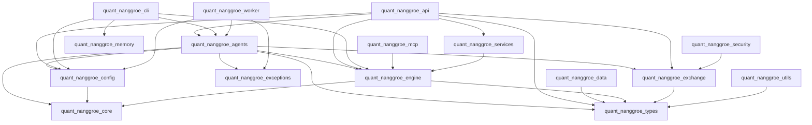

# Quant Nanggroe AI — Code Map (GRAPHIFY)

Generated: 2026-07-09 22:22:59  ·  Python files: 1336  ·  Total: 15 MB on disk

## Repository Overview

Production-grade multi-agent quantitative trading hedge fund system. LangGraph agent orchestration, MCP protocol tool integration, constitutional risk management (9-checkpoint deterministic gates).

| Layer | Description | Key Directories |
|-------|-------------|-----------------|
| **Data** | Multi-provider with failover | `data/providers/`, `exchange/clients/` |
| **Engine** | Backtest, Risk, Factors, ML, Execution | `engine/backtest/`, `engine/risk/`, `engine/factors/`, `engine/ml/`, `engine/execution/` |
| **Memory** | Letta-style paging, Knowledge Graph, Journal | `memory/` |
| **Agents** | 9 specialized agents + LangGraph DAG | `agents/` |
| **API/CLI** | FastAPI + Click + WebSocket streaming | `api/`, `cli.py`, `api.py` |
| **Exchange** | 100+ exchanges (CCXT), Solana, MT5, IBKR | `exchange/` |
| **MCP** | Model Context Protocol tool integration | `mcp/` |
| **AI Colony** | Multi-agent AI colony system | `ai_multicolony/` |

## Directory Tree

```
Quant-Nanggroe-AI/
├── ai_multicolony/
│   ├── agents/
│   │   ├── browser/
│   │   ├── coder/
│   │   ├── colony/
│   │   ├── executor/
│   │   ├── legacy/
│   │   ├── manus/
│   │   ├── planner/
│   │   ├── researcher/
│   │   ├── security/
│   │   └── voice/
│   ├── api/
│   │   └── routes/
│   ├── browser/
│   ├── channels/
│   ├── colony/
│   ├── config/
│   ├── core/
│   │   └── legacy/
│   ├── finance/
│   ├── harness/
│   ├── integrations/
│   ├── mcp/
│   ├── memory/
│   ├── organism/
│   ├── sandbox/
│   ├── security/
│   ├── sources/
│   ├── tools/
│   └── types/
├── alembic/
│   └── versions/
├── config/
├── connectors/
├── database/
├── examples/
├── packages/
│   ├── agentic-legacy/
│   │   ├── config/
│   │   ├── examples/
│   │   ├── src/
│   │   │   ├── agents/
│   │   │   ├── core/
│   │   │   └── integrations/
│   │   ├── tests/
│   │   └── web_interface/
│   ├── deer-flow/
│   │   ├── backend/
│   │   │   ├── app/
│   │   │   │   ├── channels/
│   │   │   │   └── gateway/
│   │   │   │       ├── auth/
│   │   │   │       │   └── repositories/
│   │   │   │       └── routers/
│   │   │   ├── packages/
│   │   │   │   └── harness/
│   │   │   │       └── deerflow/
│   │   │   │           ├── agents/
│   │   │   │           │   ├── lead_agent/
│   │   │   │           │   ├── memory/
│   │   │   │           │   └── middlewares/
│   │   │   │           ├── community/
│   │   │   │           │   ├── aio_sandbox/
│   │   │   │           │   ├── ddg_search/
│   │   │   │           │   ├── exa/
│   │   │   │           │   ├── firecrawl/
│   │   │   │           │   ├── image_search/
│   │   │   │           │   ├── infoquest/
│   │   │   │           │   ├── jina_ai/
│   │   │   │           │   ├── serper/
│   │   │   │           │   └── tavily/
│   │   │   │           ├── config/
│   │   │   │           ├── guardrails/
│   │   │   │           ├── mcp/
│   │   │   │           ├── models/
│   │   │   │           ├── persistence/
│   │   │   │           │   ├── feedback/
│   │   │   │           │   ├── migrations/
│   │   │   │           │   ├── models/
│   │   │   │           │   ├── run/
│   │   │   │           │   ├── thread_meta/
│   │   │   │           │   └── user/
│   │   │   │           ├── reflection/
│   │   │   │           ├── runtime/
│   │   │   │           │   ├── checkpointer/
│   │   │   │           │   ├── events/
│   │   │   │           │   │   └── store/
│   │   │   │           │   ├── store/
│   │   │   │           │   └── stream_bridge/
│   │   │   │           ├── sandbox/
│   │   │   │           │   └── local/
│   │   │   │           ├── skills/
│   │   │   │           │   └── storage/
│   │   │   │           ├── subagents/
│   │   │   │           │   └── builtins/
│   │   │   │           ├── tools/
│   │   │   │           │   └── builtins/
│   │   │   │           ├── tracing/
│   │   │   │           ├── uploads/
│   │   │   │           └── utils/
│   │   │   ├── scripts/
│   │   │   └── tests/
│   │   │       ├── blocking_io/
│   │   │       └── support/
│   │   │           └── detectors/
│   │   ├── docker/
│   │   │   └── provisioner/
│   │   ├── scripts/
│   │   │   └── wizard/
│   │   │       └── steps/
│   │   ├── skills/
│   │   │   └── public/
│   │   │       ├── data-analysis/
│   │   │       │   └── scripts/
│   │   │       ├── github-deep-research/
│   │   │       │   └── scripts/
│   │   │       ├── image-generation/
│   │   │       │   └── scripts/
│   │   │       ├── music-generation/
│   │   │       │   └── scripts/
│   │   │       ├── podcast-generation/
│   │   │       │   └── scripts/
│   │   │       ├── ppt-generation/
│   │   │       │   └── scripts/
│   │   │       ├── skill-creator/
│   │   │       │   ├── eval-viewer/
│   │   │       │   └── scripts/
│   │   │       ├── systematic-literature-review/
│   │   │       │   └── scripts/
│   │   │       └── video-generation/
│   │   │           └── scripts/
│   │   └── tests/
│   │       └── skills/
│   └── hermes-quant/
│       ├── config/
│       ├── scripts/
│       ├── src/
│       │   └── tools/
│       └── tests/
├── quant_nanggroe/
│   ├── agents/
│   │   ├── bridges/
│   │   ├── council/
│   │   ├── crypto/
│   │   ├── debate/
│   │   ├── execution/
│   │   ├── forex/
│   │   ├── geopolitics/
│   │   ├── macro/
│   │   ├── personas/
│   │   ├── portfolio/
│   │   ├── researcher/
│   │   ├── risk/
│   │   ├── smc/
│   │   ├── strategist/
│   │   ├── tools/
│   │   └── trader/
│   ├── api/
│   │   └── routes/
│   ├── config/
│   ├── core/
│   ├── data/
│   │   └── providers/
│   ├── engine/
│   │   ├── backtest/
│   │   │   ├── engines/
│   │   │   ├── loaders/
│   │   │   └── optimizers/
│   │   ├── execution/
│   │   │   ├── brokers/
│   │   │   └── guards/
│   │   ├── factors/
│   │   ├── ml/
│   │   ├── models/
│   │   ├── nvidia_nim/
│   │   ├── options/
│   │   ├── risk/
│   │   ├── screener/
│   │   ├── shadow/
│   │   ├── simulation/
│   │   ├── strategies/
│   │   └── strategy/
│   │       └── strategies/
│   ├── exchange/
│   │   ├── clients/
│   │   └── solana/
│   ├── mcp/
│   ├── memory/
│   ├── security/
│   ├── types/
│   └── utils/
├── scripts/
├── skills/
│   ├── aminer-academic-search/
│   │   └── scripts/
│   ├── aminer-daily-paper/
│   │   └── scripts/
│   ├── blog-writer/
│   ├── docx/
│   │   └── scripts/
│   ├── dream-interpreter/
│   │   └── scripts/
│   ├── get-fortune-analysis/
│   ├── gift-evaluator/
│   ├── interview-prep/
│   │   └── scripts/
│   ├── jd-resume-tailor/
│   │   └── scripts/
│   ├── job-intent-tracker/
│   │   └── scripts/
│   ├── market-research-reports/
│   │   └── scripts/
│   ├── pdf/
│   │   └── scripts/
│   ├── pptx/
│   │   ├── ooxml/
│   │   │   └── scripts/
│   │   │       └── validation/
│   │   └── scripts/
│   ├── qingyan-research/
│   ├── quiz-html/
│   │   └── scripts/
│   ├── quiz-mastery/
│   │   ├── scripts/
│   │   └── src/
│   │       └── quiz_mastery/
│   ├── resume-builder/
│   │   └── scripts/
│   ├── skill-creator/
│   │   ├── eval-viewer/
│   │   └── scripts/
│   ├── storyboard-manager/
│   │   └── scripts/
│   ├── ui-ux-pro-max/
│   │   └── scripts/
│   └── xlsx/
│       └── templates/
├── src/
├── tests/
│   ├── test_agents/
│   ├── test_api/
│   ├── test_backtest/
│   ├── test_browser/
│   ├── test_channels/
│   ├── test_colony/
│   ├── test_core/
│   ├── test_data/
│   ├── test_engine/
│   ├── test_exchange/
│   ├── test_finance/
│   ├── test_harness/
│   ├── test_mcp/
│   ├── test_memory/
│   ├── test_nvidia_nim/
│   ├── test_organism/
│   ├── test_sandbox/
│   ├── test_security/
│   ├── test_sources/
│   ├── test_strategy/
│   ├── test_tools/
│   └── test_types/
└── web_interface/
├── dashboard/
├── docs/
├── tests/
├── docker/
├── pyproject.toml
├── requirements.txt
├── Dockerfile
└── README.md
```

## Entry Points

| File | Description |
|------|-------------|
| `main.py` ✅ | System orchestrator — starts all components |
| `cli.py` ✅ | Click CLI — `python -m quant_nanggroe.cli` |
| `quant_nanggroe/cli.py` ✅ | Main CLI — `qnai run|backtest|serve|agents|portfolio|risk` |
| `quant_nanggroe/api.py` ✅ | FastAPI app factory — REST + WebSocket API |
| `quant_nanggroe/worker.py` ✅ | Background trading worker — periodic graph runner |
| `quant_nanggroe/services.py` ✅ | Shared singletons for engine state |
| `quant_nanggroe/agents/graph.py` ✅ | LangGraph StateGraph — full trading pipeline DAG |
| `daemon_manager.py` ✅ | Daemon lifecycle manager |
| `start_system.py` ✅ | System bootstrap orchestrator |
| `deploy.py` ✅ | CloudFormation / CDK deployment entry |

## Package Dependency Map

Cross-package import relationships within `quant_nanggroe.*`. Edges show `source → target` (source imports target). Only inter-package edges (different second-level package) are shown.



### Cross-Package Dependency Matrix

Rows = source package, Columns = dependency. `←` marks an edge.

| Source \ Target | quant_nanggroe.agents | quant_nanggroe.api | quant_nanggroe.cli | quant_nanggroe.config | quant_nanggroe.core | quant_nanggroe.data | quant_nanggroe.engine | quant_nanggroe.exceptions | quant_nanggroe.exchange | quant_nanggroe.mcp | quant_nanggroe.memory | quant_nanggroe.security | quant_nanggroe.services | quant_nanggroe.types | quant_nanggroe.utils | quant_nanggroe.worker |
|---|---|---|---|---|---|---|---|---|---|---|---|---|---|---|---|---|
| quant_nanggroe.agents |   |   |   | ← | ← |   | ← | ← | ← |   |   |   |   | ← |   |   |
| quant_nanggroe.api | ← |   |   | ← |   |   | ← |   | ← |   |   |   | ← | ← |   |   |
| quant_nanggroe.cli | ← |   |   | ← |   |   | ← |   |   |   | ← |   |   |   |   |   |
| quant_nanggroe.config |   |   |   |   | ← |   |   |   |   |   |   |   |   |   |   |   |
| quant_nanggroe.core |   |   |   |   |   |   |   |   |   |   |   |   |   |   |   |   |
| quant_nanggroe.data |   |   |   |   |   |   |   |   |   |   |   |   |   | ← |   |   |
| quant_nanggroe.engine |   |   |   |   | ← |   |   |   |   |   |   |   |   | ← |   |   |
| quant_nanggroe.exceptions |   |   |   |   |   |   |   |   |   |   |   |   |   |   |   |   |
| quant_nanggroe.exchange |   |   |   |   |   |   |   |   |   |   |   |   |   | ← |   |   |
| quant_nanggroe.mcp |   |   |   |   |   |   | ← |   |   |   |   |   |   |   |   |   |
| quant_nanggroe.memory |   |   |   |   |   |   |   |   |   |   |   |   |   |   |   |   |
| quant_nanggroe.security |   |   |   |   |   |   |   |   | ← |   |   |   |   |   |   |   |
| quant_nanggroe.services |   |   |   |   |   |   | ← |   |   |   |   |   |   |   |   |   |
| quant_nanggroe.types |   |   |   |   |   |   |   |   |   |   |   |   |   |   |   |   |
| quant_nanggroe.utils |   |   |   |   |   |   |   |   |   |   |   |   |   | ← |   |   |
| quant_nanggroe.worker | ← |   |   | ← |   |   |   | ← |   |   |   |   |   |   |   |   |

## Key Classes by Layer

### Exchange / Broker Layer

| Class | File | Description |
|------|------|-------------|
| `ExchangeInterface` | `quant_nanggroe/exchange/base.py:162` | Abstract exchange broker interface |
| `CCXTBroker` | `quant_nanggroe/exchange/ccxt_broker.py:102` | CCXT-based unified exchange broker (100+ exchanges) |
| `PaperExchangeBroker` | `quant_nanggroe/exchange/paper_broker.py:51` | Paper trading with slippage/commission simulation |
| `AlpacaBroker` | `quant_nanggroe/exchange/alpaca_broker.py:177` | Alpaca API broker for US equities |
| `PolymarketBroker` | `quant_nanggroe/exchange/polymarket_broker.py:241` | Polymarket CLOB prediction market trader |
| `MT5Broker` | `quant_nanggroe/exchange/mt5_broker.py:134` | MetaTrader 5 forex/CFD broker |
| `IBKRBroker` | `quant_nanggroe/exchange/ibkr_broker.py:105` | Interactive Brokers TWS/Gateway adapter |
| `SolanaBroker` | `quant_nanggroe/exchange/solana/broker.py:55` | Solana on-chain swap broker via Jupiter V6 |
| `JupiterV6Client` | `quant_nanggroe/exchange/solana/jupiter.py:153` | Jupiter V6 aggregator client |
| `SolanaWallet` | `quant_nanggroe/exchange/solana/wallet.py:67` | Solana keypair/balance management |
| `RugChecker` | `quant_nanggroe/exchange/solana/rugcheck.py:128` | Solana token safety analyzer |
| `ExchangeManager` | `quant_nanggroe/exchange/manager.py:93` | Multi-exchange orchestration with failover |
| `ExchangeFactory` | `quant_nanggroe/exchange/factory.py:244` | Dynamic exchange client factory |
| `GuardPipeline` | `quant_nanggroe/exchange/guards.py:454` | Pre-trade validation pipeline |

### Agent Layer

| Class | File | Description |
|------|------|-------------|
| `TradingGraph` | `quant_nanggroe/agents/graph.py:71` | LangGraph StateGraph — full trading pipeline DAG |
| `BaseAgent` | `quant_nanggroe/agents/base.py:127` | Abstract agent base class |

### Engine — Risk

| Class | File | Description |
|------|------|-------------|
| `RiskManager` | `quant_nanggroe/engine/risk/manager.py:74` | Constitutional risk manager (9 checkpoints) |
| `KellyCriterion` | `quant_nanggroe/engine/risk/kelly.py:86` | Kelly criterion position sizing calculator |
| `VaRCalculator` | `quant_nanggroe/engine/risk/var.py:54` | Value-at-Risk calculator |
| `RiskParityOptimizer` | `quant_nanggroe/engine/risk/risk_parity.py:77` | Risk parity portfolio optimizer |
| `KillSwitch` | `quant_nanggroe/engine/risk/kill_switch.py:30` | Drawdown-based kill switch |
| `DrawdownMonitor` | `quant_nanggroe/engine/risk/drawdown.py:41` | Drawdown tracking monitor |
| `PositionSizer` | `quant_nanggroe/engine/risk/position_sizing.py:37` | Position sizing calculator |
| `CorrelationMonitor` | `quant_nanggroe/engine/risk/correlation.py:38` | Cross-asset correlation tracker |
| `RiskCheckGate` | `quant_nanggroe/engine/risk/checks.py:39` | 9-checkpoint deterministic risk gate |
| `EmotionalLockoutGuard` | *(not found)* | |

### Engine — Backtest

| Class | File | Description |
|------|------|-------------|
| `BacktestEngine` | `quant_nanggroe/engine/backtest/engine.py:81` | Multi-asset backtest engine |
| `BacktestConfig` | `quant_nanggroe/engine/backtest/engine.py:51` | Backtest configuration |
| `WalkForwardAnalyzer` | `quant_nanggroe/engine/backtest/walk_forward.py:67` | Walk-forward analysis for overfitting detection |
| `MonteCarloSimulator` | `quant_nanggroe/engine/backtest/monte_carlo.py:67` | Monte Carlo simulation engine |
| `BacktestReport` | `quant_nanggroe/engine/backtest/report.py:32` | Backtest report generator |
| `FamaFrench` | *(not found)* | |
| `MeanVarianceOptimizer` | `quant_nanggroe/engine/backtest/optimizers/mean_variance_optimizer.py:22` | Mean-variance portfolio optimizer |
| `RiskParityOptimizer` | `quant_nanggroe/engine/backtest/optimizers/risk_parity_optimizer.py:19` | Risk parity portfolio optimizer |
| `EqualVolatilityOptimizer` | `quant_nanggroe/engine/backtest/optimizers/equal_volatility_optimizer.py:20` | Equal volatility portfolio optimizer |
| `BaseOptimizer` | `quant_nanggroe/engine/backtest/optimizers/base_optimizer.py:18` | Abstract portfolio optimizer base |
| `NautilusAdapter` | *(not found)* | |
| `BaseLoader` | `quant_nanggroe/engine/backtest/loaders/base_loader.py:127` | Abstract data loader for backtest |
| `CCXTLoader` | `quant_nanggroe/engine/backtest/loaders/ccxt_loader.py:45` | CCXT data loader for backtest |
| `YFinanceLoader` | `quant_nanggroe/engine/backtest/loaders/yfinance_loader.py:217` | Yahoo Finance data loader for backtest |

### Engine — Strategies

| Class | File | Description |
|------|------|-------------|
| `BaseStrategy` | `quant_nanggroe/engine/strategy/strategies/base_strategy.py:22` | Abstract strategy base class |
| `MeanReversionStrategy` | `quant_nanggroe/engine/strategy/strategies/mean_reversion.py:30` | Mean reversion trading strategy |
| `MomentumStrategy` | `quant_nanggroe/engine/strategy/strategies/momentum.py:33` | Momentum trading strategy |
| `PairsTradingStrategy` | `quant_nanggroe/engine/strategy/strategies/pairs_trading.py:35` | Pairs trading / cointegration strategy |
| `StatisticalArbitrageStrategy` | `quant_nanggroe/engine/strategy/strategies/statistical_arbitrage.py:33` | Statistical arbitrage strategy |
| `VolatilityArbitrageStrategy` | `quant_nanggroe/engine/strategy/strategies/volatility_arbitrage.py:168` | Volatility arbitrage strategy |
| `RegimeBasedStrategy` | `quant_nanggroe/engine/strategy/strategies/regime_based.py:38` | Regime-based adaptive strategy |
| `MarketMakingStrategy` | `quant_nanggroe/engine/strategy/strategies/market_making.py:34` | Market making strategy |
| `CryptoSpecificStrategy` | `quant_nanggroe/engine/strategy/strategies/crypto_specific.py:32` | Crypto-specific strategy |

### Engine — Core

| Class | File | Description |
|------|------|-------------|
| `MarketStateEngine` | `quant_nanggroe/engine/market_state.py:42` | Market regime classification engine |
| `DecisionSynthesisEngine` | `quant_nanggroe/engine/decision.py:137` | Deterministic decision synthesis |
| `PressureNormalizationEngine` | `quant_nanggroe/engine/pressure.py:61` | Multi-signal pressure normalization |
| `StrategyLifecycleManager` | `quant_nanggroe/engine/strategy_lifecycle.py:44` | Strategy evolution lifecycle manager |
| `AutoSwitchEngine` | `quant_nanggroe/engine/autoswitch.py:46` | Provider health auto-failover |
| `AuditLogger` | `quant_nanggroe/engine/audit.py:35` | Full audit trail logger |
| `LLMRouter` | `quant_nanggroe/engine/llm_router.py:183` | Multi-provider LLM router with cost tracking |

### Data Provider Layer

| Class | File | Description |
|------|------|-------------|
| `DataManager` | *(not found)* | |
| *(none)* | | |

### Memory Layer

| Class | File | Description |
|------|------|-------------|
| `MemoryManager` | *(not found)* | |
| `KnowledgeGraph` | `quant_nanggroe/memory/knowledge_graph.py:213` | Persistent knowledge graph for trading insights |

## Hot Paths (Most Imported Internal Packages)

Internal packages ranked by how many files import them — changes here have broadest impact.

| # | Package | Imported By (files) |
|---|---------|--------------------|
| 1 | `quant_nanggroe.engine` | 243 |
| 2 | `quant_nanggroe.agents` | 172 |
| 3 | `quant_nanggroe.types` | 84 |
| 4 | `quant_nanggroe.exchange` | 60 |
| 5 | `quant_nanggroe.data` | 25 |
| 6 | `quant_nanggroe.api` | 13 |
| 7 | `quant_nanggroe.config` | 12 |
| 8 | `quant_nanggroe.services` | 9 |
| 9 | `quant_nanggroe.memory` | 8 |
| 10 | `quant_nanggroe.mcp` | 8 |
| 11 | `quant_nanggroe.exceptions` | 5 |
| 12 | `quant_nanggroe.core` | 5 |
| 13 | `quant_nanggroe.security` | 4 |
| 14 | `quant_nanggroe.utils` | 3 |

## CLI / API Reference

| Command | Action |
|---------|--------|
| `python -m quant_nanggroe.cli run --symbols AAPL,MSFT` | Run trading pipeline |
| `python -m quant_nanggroe.cli backtest --strategy momentum` | Run backtest |
| `python -m quant_nanggroe.cli serve` | Start FastAPI server |
| `python -m quant_nanggroe.cli agents list` | List agents |
| `python -m quant_nanggroe.cli portfolio status` | Portfolio status |
| `python -m quant_nanggroe.cli risk check SYMBOL` | Risk assessment |
| `python -m quant_nanggroe.worker` | Background trading worker |
| `python -m ai_multicolony.cli` | AI Colony CLI |

## Worker Architecture (`quant_nanggroe/worker.py`)

The `TradingWorker` runs as a long-lived asyncio event loop with 4 concurrent tasks:

| Task | Purpose |
|------|---------|
| **Graph Runner** | Invokes trading graph (LangGraph) on configurable interval per symbol |
| **Position Monitor** | Updates current prices and unrealized PnL for open positions |
| **Portfolio Snapshotter** | Records portfolio state at intervals (equity curve) |
| **Health Reporter** | Emits health metrics for observability |

## Agent Trading Pipeline (`quant_nanggroe/agents/graph.py`)

```
market_analysis → signal_generation → risk_assessment (LLM)
  → deterministic_risk_gate [HARD GATE — 9 checkpoints]
  → portfolio_optimization → execution_decision
  → order_execution → reflection (council debate)
```

The deterministic risk gate uses 9 constitutional checkpoints and **cannot be bypassed**. If it fails → trade halted. Conditional edge: low confidence → council debate. Kill switch active → emergency exit.

## Exchange Architecture (`quant_nanggroe/exchange/`)

```
ExchangeInterface (abstract base)
├── CCXTBroker           100+ crypto exchanges via CCXT
├── PaperExchangeBroker  Paper trading (slippage, commission, PnL)
├── AlpacaBroker         Alpaca US equities/crypto
├── PolymarketBroker     Polymarket prediction markets
├── MT5Broker            MetaTrader 5 forex/CFD
├── IBKRBroker           Interactive Brokers TWS/Gateway
├── QuantDingerFactory   Multi-exchange factory (9+ exchanges)
└── SolanaBroker         Solana/Jupiter V6 on-chain swaps

ExchangeManager — multi-exchange orchestration, failover, portfolio sync
ExchangeFactory — dynamic client creation with capability detection
GuardPipeline  — pre-trade validation (Whitelist/Cooldown/MaxPosition)
```

## File Size (quant_nanggroe only)

- **311 files**, **3,581.6 KB** total, **11.5 KB** average

Largest files:
  - `quant_nanggroe/engine/factors/gtja191.py` — 163.0 KB
  - `quant_nanggroe/engine/factors/qlib158.py` — 140.5 KB
  - `quant_nanggroe/engine/factors/alpha101.py` — 114.3 KB
  - `quant_nanggroe/engine/backtest/risk_models.py` — 52.1 KB
  - `quant_nanggroe/memory/paging.py` — 44.6 KB
  - `quant_nanggroe/mcp/tools.py` — 44.2 KB
  - `quant_nanggroe/exchange/mt5_broker.py` — 36.2 KB
  - `quant_nanggroe/memory/knowledge_graph.py` — 36.2 KB
