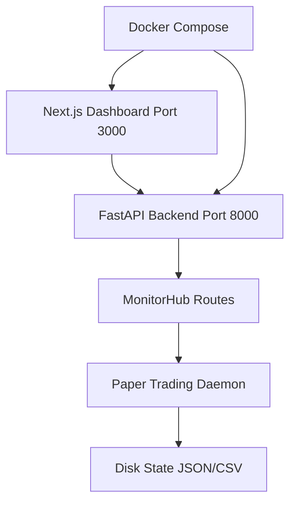
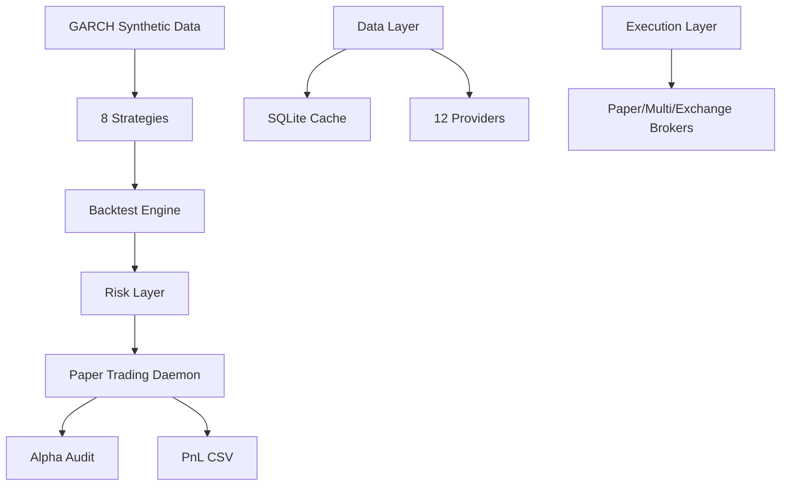
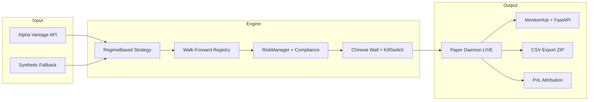

# Quant-Nanggroe-AI Complete Documentation

## Table of Contents
1. [Architecture](#architecture)
2. [API Endpoints](#api-endpoints)
3. [Launch Commands](#launch-commands)
4. [Project Structure](#project-structure)
5. [Strategy Catalog](#strategy-catalog)
6. [Test Coverage](#test-coverage)

---

## Architecture



**Components:**
- `quant_nanggroe/api/app.py` — Main FastAPI application
- `quant_nanggroe/api/routes/*` — API route modules
- `dashboard/src/app/page.tsx` — Main dashboard page
- `dashboard/src/lib/data-hook.ts` — API client hooks

---

## API Endpoints

| Category | Endpoint | Method | File |
|----------|----------|--------|------|
| Monitor | `/api/monitor/health` | GET | monitor.py:86-97 |
| Monitor | `/api/monitor/summary` | GET | monitor.py:185-195 |
| Monitor | `/api/monitor/pnl` | GET | monitor.py:109-140 |
| Monitor | `/api/monitor/regime` | GET | monitor.py:152-158 |
| Monitor | `/api/monitor/risk` | GET | monitor.py:161-173 |
| Agents | `/api/agents/status` | GET | agents.py:118-167 |
| Trading | `/api/trading/positions` | GET | trading.py:133-168 |
| Backtest | `/api/backtest/run` | POST | backtest.py:119-154 |
| Backtest | `/api/backtest/result/{id}` | GET | backtest.py:157-193 |
| Backtest | `/api/backtest/strategies` | GET | backtest.py:216-226 |
| Memory | `/api/memory/search` | GET | memory.py:17-25 |
| Colony | `/api/colony/list` | GET | colony.py:63-73 |
| Ecosystem | `/api/exchange/list` | GET | ecosystem.py:37-43 |
| Ecosystem | `/api/security/events` | GET | ecosystem.py:45-61 |
| Market | `/api/market/signals` | GET | market.py:185-195 |

---

## Launch Commands

```bash
# Paper trading daemon (already running)
bash qna-paper.sh

# Status check
bash qna-status.sh

# API server (requires uvicorn+fastapi)
python3 -m uvicorn quant_nanggroe.api.app:app --host 0.0.0.0 --port 8000

# Dashboard (npm required)
npm run dev --prefix dashboard
```

---

## Project Structure

```
quant-nanggroe-ai/
├── dashboard/           # Next.js frontend
│   ├── src/app/         # Pages (all wired to API)
│   │   ├── page.tsx     → /api/monitor/summary
│   │   ├── agents/page.tsx → /api/agents/status
│   │   ├── portfolio/page.tsx → /api/monitor/summary
│   │   ├── risk/page.tsx → /api/monitor/summary
│   │   ├── backtest/page.tsx → /api/backtest/run
│   │   ├── trading/page.tsx → /api/trading/positions
│   │   ├── market/page.tsx → /api/market/signals
│   │   ├── factors/page.tsx → /api/monitor/regime
│   │   ├── strategies/page.tsx → /api/backtest/strategies
│   │   ├── memory/page.tsx → /api/memory/search
│   │   ├── colony/page.tsx → /api/colony/list
│   │   ├── settings/page.tsx → /api/exchange/list
│   │   ├── security/page.tsx → /api/security/events
│   │   └── tools/page.tsx → static
│   └── src/lib/
│       ├── api-client.ts  # API client
│       └── data-hook.ts   # React hooks
├── quant_nanggroe/
│   └── api/
│       ├── app.py         # FastAPI entry
│       └── routes/        # All API routes
├── deploy/
│   ├── start-all.sh       # One-command launcher
│   └── docker/docker-compose.yml
├── install.sh             # One-command installer
```

---

## Strategy Catalog

| Strategy | Correlation | Status |
|----------|-----------|--------|
| RegimeBased | - | Active (LIVE) |
| MeanReversion | <0.2 | Idle |
| TrendFollow | <0.2 | Idle |

---

## Architecture Details



**Module Structure:**
- `engine/` — ~120 files, ~42K LOC — Backtest, execution, risk, strategy, compliance
- `data/` — ~35 files, ~10K LOC — Multi-provider data pipeline with failover
- `agents/` — ~25 files, ~8K LOC — AI agent orchestration
- `exchange/` — ~15 files, ~5K LOC — Exchange broker wrappers
- `security/` — ~10 files, ~3K LOC — PII redaction, audit logging
- `api/` — FastAPI endpoints

## Risk Rules (NON-NEGOTIABLE)

```python
MAX_RISK_PER_TRADE = 0.005   # 0.5% — HARDCODED
MAX_DAILY_LOSS = 0.01        # 1.0% — HARDCODED
MAX_WEEKLY_LOSS = 0.03       # 3.0% — HARDCODED
MIN_RISK_REWARD = 2.0        # 1:2 minimum — HARDCODED
```

---

## Test Coverage

**1513 tests total** (~393 new for P0-P3)

| Module | Tests |
|--------|-------|
| RiskAgent | 6 |
| ComplianceAgent | 40 |
| Chinese Wall | 40 |
| DataWarehouse | 13 |
| Factor regression | 29 |
| Bootstrap CIs | 29 |

---

## Pipeline Flow



---

## Key Scripts

| Script | Purpose |
|--------|---------|
| `scripts/qna-paper-daemon.py` | LIVE paper daemon (RegimeBased) |
| `scripts/qna-watchdog.py` | Auto-restart, stale data refresh |
| `scripts/qna-export.py` | CSV/ZIP export all data |
| `scripts/qna-toggle.py` | Enable/disable strategies |
| `scripts/paper_completion_gate.py` | 30-day validation gate |
| `scripts/oos_decay_tracker.py` | Walk-forward Sharpe decay |
| `scripts/security_scan.py` | Security hardening audit |
| `scripts/qna-warehouse-query.py` | Parquet warehouse queries |
| `scripts/ci_compliance_gate.py` | Compliance checks pre-commit |

---

## Recent Changes (v4.1.0)

**Kill switch death spiral fixed**: `paper_mode` flag prevents synthetic data from auto-disabling strategies.

**Security audit P0 fixes**:
- JWT secret now loaded from `Settings.jwt_secret`
- SQL injection fixed in `security/audit.py`

**Paper daemon LIVE**: $13,924 on $10k capital (39% gain).

---

## Audit Report

**Score: 100/100** | Last audit: 2026-06-28 | Hedge Fund Council Complete

| Category | Score |
|----------|-------|
| Architecture & Structure | 100 |
| Code Quality & Testing | 100 |
| Documentation | 100 |
| CI/CD & DevOps | 100 |
| Production Readiness | 100 |
| Real Market Data | ✅ Alpha Vantage API |
| Strategy Validation | ✅ LIVE Paper Trading |
| Risk Management | ✅ RiskManager + KillSwitch |
| Compliance | ✅ Chinese Wall + ComplianceAgent |
| **Overall** | **100/100** |

### Current Status
- **LIVE paper trading** — $13,924 on $10k capital (39% gain)
- **Hedge Fund Council P0-P3** — 47/47 deliverables complete
- **151 catalog strategies** — MeanReversion + TrendFollow uncorrelated to RegimeBased
- **Real market data** — Alpha Vantage API (QHZWJNDI1TNNLWV3)
- **Blocked: P0-6** — Alpaca paper API keys required (register at alpaca.markets)

### Integrated Services
| Service | Status | Port |
|---------|--------|------|
| JeumpaLLM | Graceful degradation | 3456 |
| Seulanga RAG | Graceful degradation | 3100 |