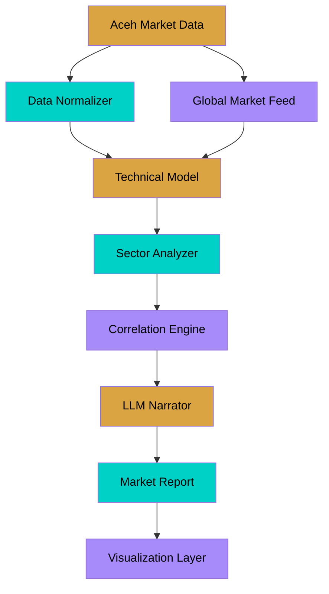

<div align="center">


[](https://codeberg.org/Dhaher-Labs/Quant-Nanggroe-AI)
[](https://gitlab.com/mulkymalikuldhr/Quant-Nanggroe-AI)
[](https://github.com/dhaher-labs/Quant-Nanggroe-AI)
[](LICENSE)
[](CONTRIBUTING.md)

<p align="center">
  <em>Part of <a href="https://dhaher-labs.codeberg.page">Dhaher Labs</a> &mdash; LLM Tools &bull; Quant &bull; Automated Workflows</em>
</p>

</div>

## 📋 Overview

Quantitative analysis platform specialized for Aceh market data, combining regional economic indicators with global market signals. Features custom technical models, sector analysis, and LLM-powered market narrative generation.

## 🏗️ Architecture



## ⚡ Quick Start

```bash
git clone https://codeberg.org/Dhaher-Labs/Quant-Nanggroe-AI.git
cd Quant-Nanggroe-AI
# Follow setup instructions
```

## 🛠️ Tech Stack

| Category | Technology |
|----------|-----------|
| Language | Python, R |
| Framework | Pandas / Plotly / LLM API |
| Runtime | Python 3.11+ |

## 🤝 Contributing

Contributions are welcome! Check out our [contributing guidelines](CONTRIBUTING.md).

## 💰 Sponsor

If this project helps you, consider supporting Dhaher Labs:

[](https://github.com/sponsors/dhaher-labs)

## 📄 License

MIT License &mdash; see [LICENSE](LICENSE) for details.

---

<div align="center">

</div>
