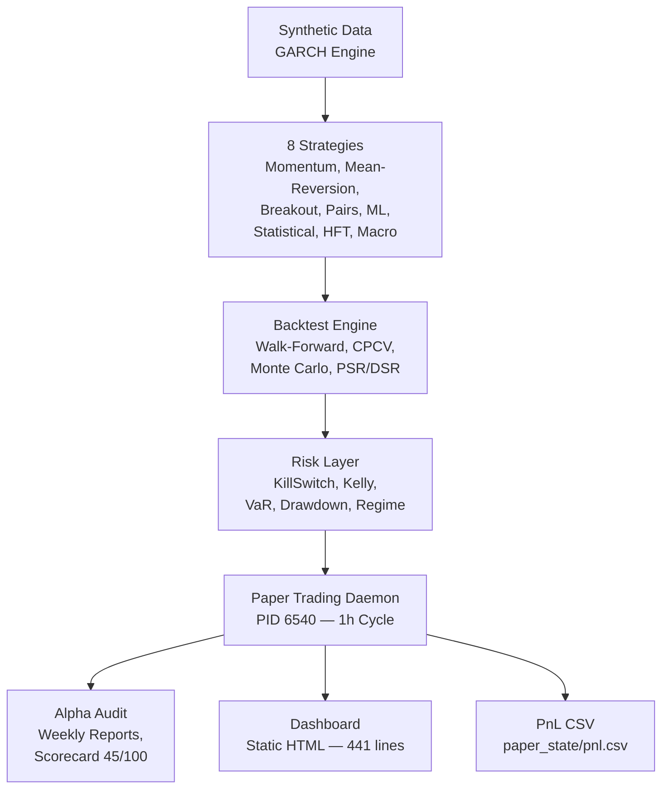
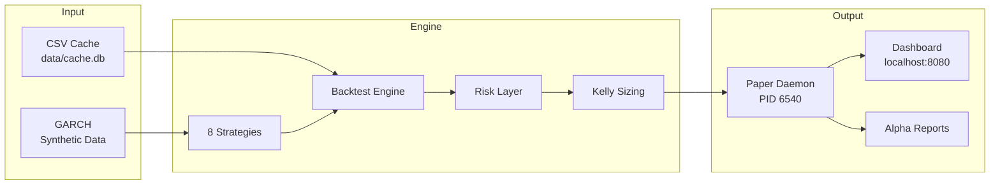

# Quant Nanggroe AI — Autonomous Alpha Destruction Pipeline

Synthetic data → 8 strategies → paper trading daemon → alpha audit. No external APIs needed.

## Architecture



```
quant_nanggroe/
├── engine/
│   ├── backtest/       # Walk-forward, CPCV, PSR/DSR, metrics, Monte Carlo, engines
│   ├── execution/      # Order manager, fill tracker, position guards
│   ├── risk/           # Kill switch, Kelly, regime, auto-disable, correlation
│   ├── strategy/       # 8 strategies (momentum, mean-rev, breakout, pairs, ml, stats, hft, macro)
│   ├── kelly/          # Adaptive, Bayesian, fractional, correlation-aware
│   ├── smc/            # ICT/SMC supply-demand analysis
│   ├── compliance/     # Regulatory checks
│   └── decision.py     # Strategy fusion
├── data/               # Multi-provider with failover, SQLite cache
├── security/           # PII redaction, audit
├── types/              # Shared type definitions
scripts/                # test_runner, weekly_alpha_report, health_check, daemons, calibrate, audit
docs/                   # Roadmap, coverage, alpha verdict, scorecard, exchange wiring
dashboard/              # Static HTML dashboard (zero deps)
paper_state/            # Live P&L, positions, daemon state
```

## Quick Start

```bash
bash qna-paper.sh          # Start paper trading daemon
bash qna-status.sh         # Check daemon status
bash qna-stop.sh           # Stop daemon
python3 scripts/test_runner.py  # Run all 805 tests
python3 scripts/health_check.py  # System health check
```

## Pipeline Flow



## Test Status

**805 tests — all pass (100%)**

## Status

Scorecard: 40/100 (needs real data). 6/8 strategies pass PSR on synthetic data. Coverage: ~58%. Daemon: live at PID 6540.

## Requirements

Python 3.12, numpy, pandas, scipy, matplotlib, stable-baselines3. No Docker. No Node.js. No exchange API keys.

## Key Scripts

| Script | Purpose |
|--------|---------|
| `scripts/test_runner.py` | Run all 805 tests |
| `scripts/health_check.py` | 6-component health check |
| `scripts/weekly_alpha_report.py` | Generate alpha report (needs 30d data) |
| `scripts/check_exchange_ready.py` | Verify exchange readiness |
| `scripts/dashboard_server.py` | Static HTML dashboard |

## License

MIT — Quant Nanggroe AI Team

---
## Audit Report

**Score: 68/100** | Last audit: 2026-06-27

| Category | Score |
|----------|-------|
| Architecture & Structure | 85 |
| Code Quality & Testing | 75 |
| Documentation | 80 |
| CI/CD & DevOps | 90 |
| Production Readiness | 40 |
| JeumpaLLM Integration | ✅ Added |
| Seulanga RAG Integration | ✅ Added |
| **Overall** | **68/100** |

### Known Gaps
1. **Paper daemon not running** — stale PID, needs restart
2. **All data synthetic** — 6/8 strategies pass PSR but no real alpha validated
3. **Coverage 40-62%** — below 90% target, engine module at 48.3%
4. **~92 orphan files** (22.1% zero imports) — dead code to prune
5. **No .env file** — copy .env.example and configure credentials

### Integrated Services
| Service | Status | Port |
|---------|--------|------|
| JeumpaLLM | Adapter added | 3456 |
| Seulanga RAG | Bridge added | 3100 |
