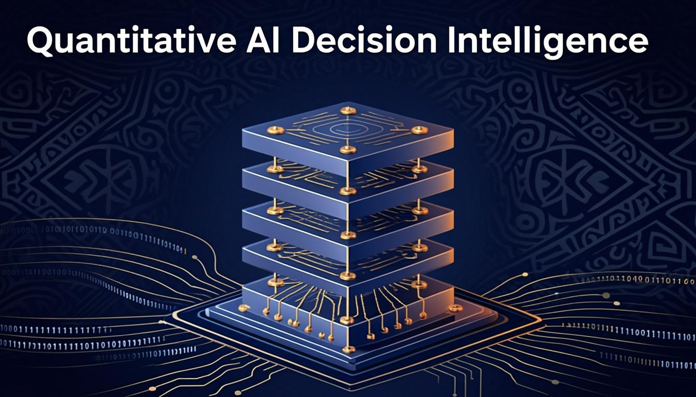
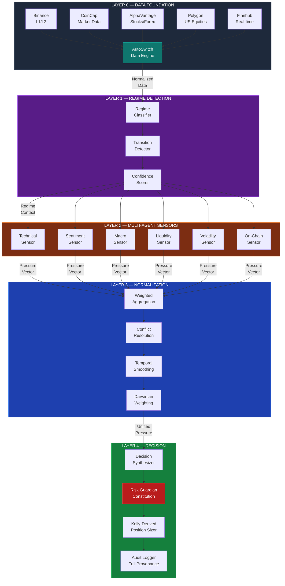
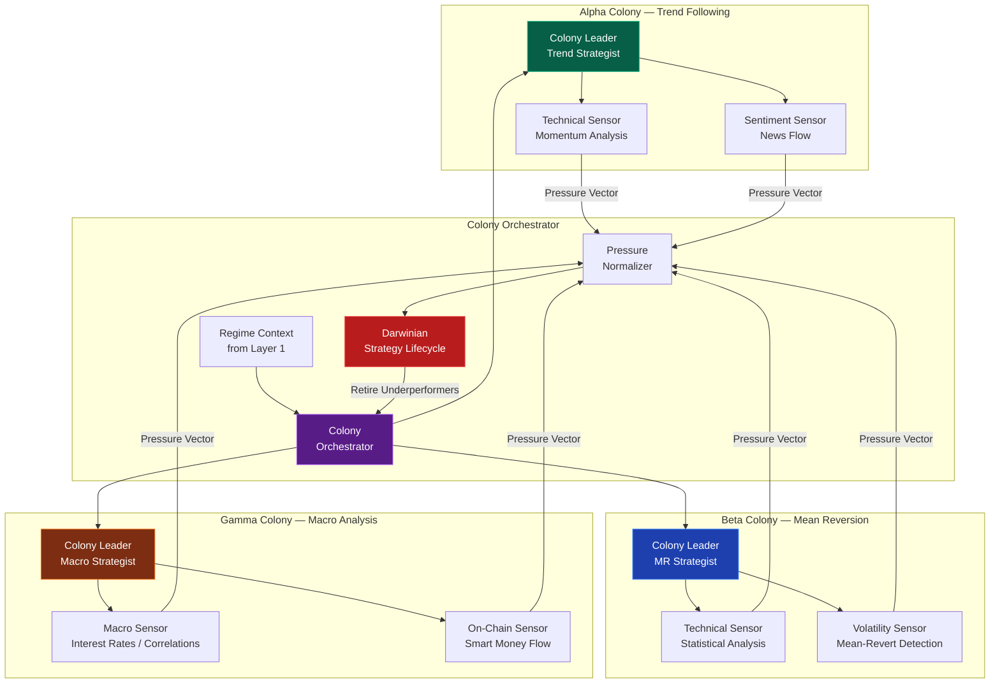
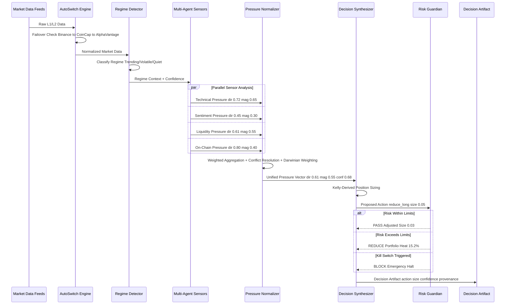
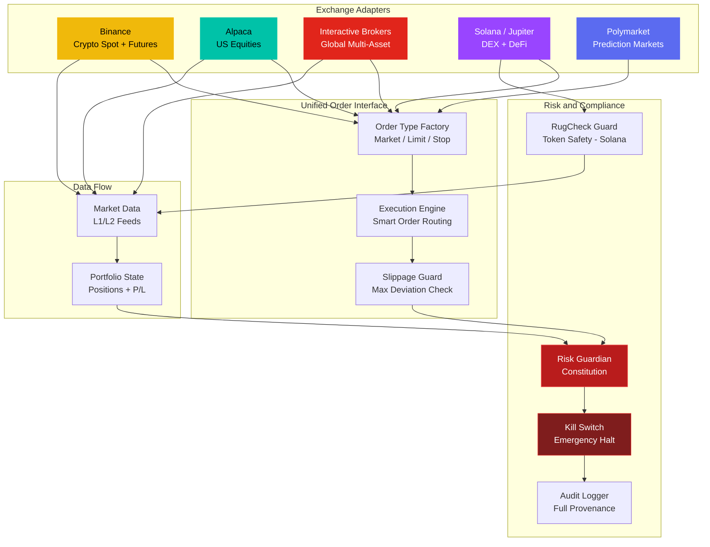
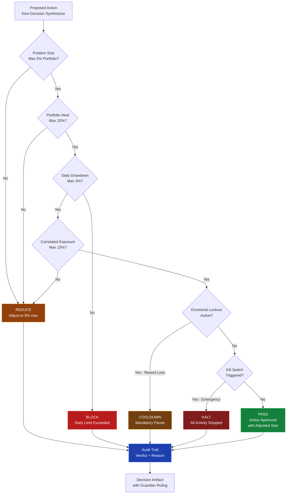

<a href="https://github.com/mulkymalikuldhrs/Quant-Nanggroe-AI">
  
</a>

<div align="center">

[](https://git.io/typing-svg)

<br/>

[](https://www.typescriptlang.org/)
[](https://react.dev)
[](https://www.binance.com)
[](#)
[](#)
[](LICENSE)

<br/>

[](https://github.com/mulkymalikuldhrs/Quant-Nanggroe-AI/stargazers)
[](https://github.com/mulkymalikuldhrs/Quant-Nanggroe-AI/fork)
[](https://github.com/mulkymalikuldhrs/Quant-Nanggroe-AI/issues)

<br/>

**Language / Bahasa / 语言**

[](README.md)
[](README_id.md)
[](README_zh.md)

</div>

---

## Overview

**Quant Nanggroe AI** is a **Multi-Agent Decision Intelligence Operating System** for quantitative research and systematic trading in financial markets.

Built on the principle of **Deterministic Decision Intelligence**, the platform treats LLMs as Logical Reasoning Engines operating under strict contracts that forbid subjective opinions, mandate data grounding, and require pressure-based numerical outputs rather than direct trade signals.

The system implements a **5-Layer Execution Stack** that processes market data from raw L1/L2 feeds through regime detection, multi-agent sensor analysis, pressure normalization, and decision synthesis with risk enforcement. It features a **Darwinian Strategy Lifecycle** that automatically retires underperforming strategies and a **Risk Guardian Constitution** as an independent layer of hard-coded safety rules.

> **Honest Note**: This is a **decision-support and research tool**, not an autonomous trading system that guarantees profits. "Deterministic Decision Intelligence" means the data flow pipeline is deterministic — **not** that its outputs are guaranteed correct. All trading involves risk of loss. The Risk Guardian reduces but cannot eliminate risk.

---

## Visual Architecture

### 1. 5-Layer Execution Stack — Visual Pipeline



### 2. Agent Colony Architecture — How Agents Form Colonies



### 3. Decision Flow — From Market Data to Trade Decision



### 4. Multi-Exchange Integration — How Exchanges Connect



### 5. Risk Guardian Constitution — Risk Gate Flow



---

## 5-Layer Execution Stack

The core of Quant Nanggroe AI is its layered execution architecture. Each layer has a single responsibility and strict data contracts with the layers above and below it. This is what makes the pipeline **deterministic** — the same inputs always follow the same processing path, producing auditable, traceable decision artifacts.

```
┌─────────────────────────────────────────────────────────┐
│                    LAYER 4 — DECISION                   │
│              Decision Synthesis & Risk Enforcement       │
│         Final pressure vector → action recommendation    │
├─────────────────────────────────────────────────────────┤
│                  LAYER 3 — NORMALIZATION                 │
│            Pressure Normalization & Conflict Resolution   │
│       Multi-agent outputs → unified pressure vector      │
├─────────────────────────────────────────────────────────┤
│                   LAYER 2 — SENSORS                      │
│          Multi-Agent Sensor Analysis & Interpretation    │
│       Regime context → specialized agent analysis        │
├─────────────────────────────────────────────────────────┤
│                    LAYER 1 — REGIME                      │
│            Market Regime Detection & Classification      │
│       Raw market data → regime labels & transitions      │
├─────────────────────────────────────────────────────────┤
│                     LAYER 0 — DATA                       │
│          Data Foundation & Market Feeds (L1/L2)          │
│       External feeds → normalized internal data model    │
└─────────────────────────────────────────────────────────┘
```

### Layer 0 — Data Foundation

The bedrock layer ingests raw market data from multiple providers and normalizes it into a unified internal data model.

- **L1/L2 Feed Ingestion** — Real-time order book snapshots, trade prints, and ticker updates from Binance and fallback providers
- **AutoSwitch Data Engine** — Automatic failover between data providers (Binance → CoinCap → AlphaVantage → Polygon → Finnhub) with latency tracking
- **Normalization Pipeline** — All incoming data is mapped to a canonical schema regardless of source, ensuring upstream layers never need provider-specific logic
- **Historical Replay** — Cached tick data enables deterministic replay for backtesting and audit trails

### Layer 1 — Regime Detection

Processes normalized data to identify the current market regime, which governs how all downstream agents interpret signals.

- **Regime Classification** — Labels market state (trending, mean-reverting, volatile, quiet, transitional) using statistical and structural indicators
- **Transition Detection** — Identifies regime shifts in real-time, triggering agent reconfiguration
- **Context Propagation** — Broadcasts regime labels to all Layer 2 sensors, ensuring every agent operates within the correct market context
- **Confidence Scoring** — Each regime label carries a confidence score; low-confidence regimes trigger conservative agent behavior

### Layer 2 — Multi-Agent Sensors

Specialized agents analyze the market within the context provided by Layer 1. Each agent is a narrow expert, not a generalist.

- **Technical Sensor** — Pattern recognition, momentum, mean-reversion, and volatility analysis
- **Sentiment Sensor** — NLP-based sentiment extraction from news, social, and on-chain data
- **Macro Sensor** — Interest rates, funding rates, correlation shifts, and cross-asset analysis
- **Liquidity Sensor** — Order book depth analysis, slippage estimation, and flow detection
- **Volatility Sensor** — Realized vs. implied volatility, regime-adjusted volatility forecasting
- **On-Chain Sensor** — Whale movements, exchange flows, and smart money tracking (crypto markets)

Each sensor produces a **pressure vector** (directional bias + magnitude) rather than a binary signal, enabling nuanced downstream synthesis.

### Layer 3 — Pressure Normalization

Receives pressure vectors from all active sensors and resolves conflicts into a unified assessment.

- **Weighted Aggregation** — Sensor pressures are weighted by historical accuracy in the current regime
- **Conflict Resolution** — When sensors disagree, the system reduces overall confidence rather than picking a winner
- **Temporal Smoothing** — Prevents whipsaw by requiring sustained pressure before adjusting the aggregate
- **Darwinian Weighting** — Sensors with consistently poor performance in a given regime have their weights automatically reduced (linked to the Strategy Lifecycle)

### Layer 4 — Decision Synthesis & Risk Enforcement

The final layer combines the normalized pressure vector with portfolio state and risk constraints to produce an action recommendation.

- **Position Sizing** — Kelly-derived sizing modulated by current portfolio heat and regime confidence
- **Risk Guardian Gate** — Every recommendation passes through the Risk Guardian Constitution before reaching the execution layer. The Guardian can **block, reduce, or modify** any action
- **Audit Trail** — Every decision is logged with full provenance: which sensors contributed, their weights, regime context, and Guardian rulings
- **Action Output** — The system outputs a structured decision artifact (not a direct trade order), which a human operator or downstream execution system can act upon

---

## Features

- **5-Layer Execution Stack** — Deterministic data flow from raw feeds to decision artifacts, with strict layer contracts and full audit trails
- **Deterministic Pipeline** — Every decision is traceable, auditable, and defensible. The same inputs follow the same processing path every time
- **Darwinian Strategy Lifecycle** — Strategies and sensors are continuously evaluated; underperformers are automatically retired and replaced with evolved variants
- **Risk Guardian Constitution** — Independent hard-coded safety rules immune to AI reasoning that can block, reduce, or modify any action regardless of agent confidence
- **Desktop-OS UI** — React 19 interface with draggable windows, macOS-style dock, OmniBar command palette, and real-time visualization of agent states and pressure vectors
- **AutoSwitch Data Engine** — Automatic failover between data providers (Binance, CoinCap, AlphaVantage, Polygon, Finnhub) with latency-aware routing
- **Pressure-Based Outputs** — Agents produce continuous pressure vectors (direction + magnitude), not binary signals, enabling nuanced decision-making
- **Regime-Aware Analysis** — All agents operate within detected market regime context, reducing false signals from regime-inappropriate strategies
- **Full Provenance Audit** — Every decision artifact includes which sensors contributed, their weights, regime context, and Guardian rulings

---

## Architecture

```
                          ┌──────────────────────┐
                          │   Desktop-OS UI      │
                          │   (React 19)         │
                          │   ┌──────────────┐   │
                          │   │  OmniBar     │   │
                          │   │  Dock        │   │
                          │   │  Windows     │   │
                          │   └──────┬───────┘   │
                          └─────────┼────────────┘
                                    │
                          ┌─────────▼────────────┐
                          │   Layer 4: Decision   │
                          │  ┌─────────────────┐  │
                          │  │ Risk Guardian ◄────── Constitution
                          │  │ Position Sizer  │  │  (Hard Rules)
                          │  │ Audit Logger    │  │
                          │  └────────┬────────┘  │
                          └───────────┼───────────┘
                                      │
                          ┌───────────▼───────────┐
                          │  Layer 3: Normalizer  │
                          │  ┌─────────────────┐  │
                          │  │ Weighted Agg    │  │
                          │  │ Conflict Res    │  │
                          │  │ Darwinian Wt    │◄──── Strategy
                          │  └────────┬────────┘  │  Lifecycle
                          └───────────┼───────────┘
                                      │
                   ┌──────────┬───────▼───────┬──────────┐
                   │          │               │          │
             ┌─────▼───┐ ┌───▼─────┐ ┌───────▼──┐ ┌────▼────┐
             │Technical│ │Sentiment│ │Liquidity │ │On-Chain │
             │ Sensor  │ │ Sensor  │ │  Sensor  │ │ Sensor  │
             └─────┬───┘ └───┬─────┘ └───────┬──┘ └────┬────┘
                   │         │               │         │
             ┌─────▼─────────▼───────────────▼─────────▼────┐
             │        Layer 1: Regime Detection             │
             │   ┌──────────────────────────────────────┐   │
             │   │ Classifier │ Transitions │ Confidence │   │
             │   └──────────────────────────────────────┘   │
             └──────────────────────┬───────────────────────┘
                                    │
             ┌──────────────────────▼───────────────────────┐
             │         Layer 0: Data Foundation             │
             │  ┌───────┐ ┌─────────┐ ┌───────┐ ┌───────┐ │
             │  │Binance│ │CoinCap  │ │Polygn │ │Finnhb │ │
             │  └───────┘ └─────────┘ └───────┘ └───────┘ │
             │        AutoSwitch Data Engine                │
             └─────────────────────────────────────────────┘
```

---

## Honest Notes

> We believe in radical transparency. Here are the limitations and clarifications you should know before using this project.

| Claim | Reality |
|-------|---------|
| "Deterministic Decision Intelligence" | The **data flow pipeline** is deterministic — same inputs follow the same path. This does **not** mean outputs are guaranteed correct. |
| "Decision Intelligence OS" | This is a **decision-support tool**. It produces structured decision artifacts for human review, not autonomous trade execution. |
| "Risk Guardian" | Reduces risk through hard-coded safety rules, but **cannot eliminate risk**. Market conditions can exceed any risk model. |
| "Darwinian Strategy Lifecycle" | Automatically retires poor strategies based on metrics, but **past performance does not guarantee future results**. |
| "Multi-Agent Analysis" | Multiple agents provide diverse perspectives, but **diverse analysis does not equal correct analysis**. |

**Critical reminders:**
- All trading involves **significant risk of loss**
- This software is for **education and research** purposes
- Always test with **paper trading** before committing real capital
- Never risk more than you can afford to lose
- Past backtest results do not predict future performance

---

## Quick Start

### Prerequisites

- **Node.js** >= 18.x
- **npm** >= 9.x (or pnpm/yarn)
- Binance API key (use **testnet** first)

### Installation

```bash
# Clone the repository
git clone https://github.com/mulkymalikuldhrs/Quant-Nanggroe-AI.git
cd Quant-Nanggroe-AI

# Install dependencies
npm install

# Configure environment
cp .env.example .env
# Edit .env with your API keys (use testnet keys for initial testing)

# Start development server
npm run dev
```

### Environment Variables

```env
# Required — Data Provider
BINANCE_API_KEY=your_testnet_key
BINANCE_API_SECRET=your_testnet_secret

# Optional — Fallback Data Providers
COINCAP_API_KEY=
ALPHAVANTAGE_API_KEY=
POLYGON_API_KEY=
FINNHUB_API_KEY=

# Optional — LLM Reasoning Engine
OPENAI_API_KEY=

# Risk Guardian Configuration
MAX_POSITION_SIZE_PCT=5
MAX_PORTFOLIO_HEAT_PCT=20
MAX_DAILY_DRAWDOWN_PCT=3
```

> **Important**: Always start with Binance Testnet. Never connect to mainnet with untested configurations.

---

## API Reference

### Core Modules

#### Layer 0 — Data Engine

```typescript
import { DataEngine } from '@quant-nanggroe/data-engine';

const engine = new DataEngine({
  primary: 'binance',
  fallbacks: ['coincap', 'alphavantage'],
  autoSwitch: true,
});

// Subscribe to real-time L2 order book
engine.onOrderBook('BTC/USDT', (snapshot) => {
  console.log(snapshot.bids, snapshot.asks);
});

// Get historical ticks with deterministic replay
const ticks = await engine.getHistoricalTicks('BTC/USDT', {
  start: '2025-01-01',
  end: '2025-01-31',
  source: 'cache', // ensures deterministic replay
});
```

#### Layer 1 — Regime Detector

```typescript
import { RegimeDetector } from '@quant-nanggroe/regime';

const detector = new RegimeDetector({
  lookback: 100,
  transitionSensitivity: 0.7,
});

detector.onRegimeChange((current, previous, confidence) => {
  console.log(`Regime: ${previous} → ${current} (confidence: ${confidence})`);
  // Regime labels: 'trending' | 'mean-reverting' | 'volatile' | 'quiet' | 'transitional'
});
```

#### Layer 2 — Sensor Agents

```typescript
import { SensorOrchestrator } from '@quant-nanggroe/sensors';

const sensors = new SensorOrchestrator({
  enabled: ['technical', 'sentiment', 'liquidity', 'onchain'],
  regimeAware: true, // sensors auto-configure based on regime
});

// Each sensor outputs a pressure vector
sensors.onPressure('BTC/USDT', (readings) => {
  // readings.technical → { direction: 0.72, magnitude: 0.65, confidence: 0.81 }
  // readings.sentiment → { direction: 0.45, magnitude: 0.30, confidence: 0.52 }
  // ...
});
```

#### Layer 3 — Pressure Normalizer

```typescript
import { PressureNormalizer } from '@quant-nanggroe/normalizer';

const normalizer = new PressureNormalizer({
  darwinianWeighting: true,
  conflictThreshold: 0.4,
  smoothingWindow: 5,
});

const unified = normalizer.aggregate(pressureReadings, regimeContext);
// → { direction: 0.61, magnitude: 0.55, confidence: 0.68, contributingSensors: 4 }
```

#### Layer 4 — Decision Synthesizer

```typescript
import { DecisionSynthesizer } from '@quant-nanggroe/decision';

const synthesizer = new DecisionSynthesizer({
  riskGuardianEnabled: true,
  auditLogging: true,
});

const decision = synthesizer.evaluate(unifiedPressure, portfolioState);
// decision → {
//   action: 'reduce_long',
//   size: 0.03,
//   confidence: 0.68,
//   guardianRulings: ['portfolio_heat_within_limits'],
//   provenance: { sensors: [...], regime: 'volatile', weights: {...} }
// }
```

### Risk Guardian Constitution

```typescript
import { RiskGuardian } from '@quant-nanggroe/guardian';

const guardian = new RiskGuardian({
  maxPositionSizePct: 5,     // max 5% per position
  maxPortfolioHeatPct: 20,    // max 20% total portfolio heat
  maxDailyDrawdownPct: 3,    // max 3% daily drawdown
  maxCorrelatedExposure: 15,  // max 15% in correlated assets
  killSwitchEnabled: true,    // emergency halt capability
});

// The Guardian acts as a gate — it can BLOCK, REDUCE, or MODIFY actions
const ruling = guardian.evaluate(proposedAction, portfolioState);
// ruling → { verdict: 'REDUCE', originalSize: 0.05, adjustedSize: 0.03, reason: 'portfolio_heat_15.2pct' }
```

---

## Contributing

Contributions are welcome! We especially value contributions that improve transparency, risk management, and honest documentation.

### How to Contribute

1. **Fork** the repository
2. Create a **feature branch** (`git checkout -b feature/amazing-feature`)
3. **Commit** your changes (`git commit -m 'Add amazing feature'`)
4. **Push** to the branch (`git push origin feature/amazing-feature`)
5. Open a **Pull Request**

### Contribution Guidelines

- **Do not** add features that overclaim about trading performance or guaranteed returns
- **Do** improve risk management, error handling, and audit trail capabilities
- **Do** add tests for any new logic in the execution stack
- **Do** update documentation to reflect any behavioral changes
- Code style follows the existing TypeScript strict configuration

### Development Setup

```bash
# Install dependencies
npm install

# Run in development mode with hot reload
npm run dev

# Run type checking
npm run typecheck

# Run linting
npm run lint

# Run tests
npm run test

# Build for production
npm run build
```

---

## Disclaimer

**FOR EDUCATION AND RESEARCH PURPOSE ONLY**

This project is provided strictly for educational and research purposes. The authors and contributors assume **no responsibility or liability** for any financial damages, losses, or risks arising from the use of this software.

**Key risks:**

- **All trading involves significant risk of loss.** You can lose your entire investment and more.
- **Past performance does not guarantee future results.** Backtested strategies may fail in live markets.
- **The Risk Guardian reduces but cannot eliminate risk.** Market conditions can exceed any risk model's assumptions.
- **Decision-support outputs are not financial advice.** The system produces structured decision artifacts — you are solely responsible for any trading decisions you make.
- **We do not bear any responsibility or risk** for how this software is used.
- **Always use testnet/paper trading** before connecting to live markets with real capital.

---

## Related Projects

| Project | Description |
|---------|-------------|
| [AI-MultiColony-Ecosystem](https://github.com/mulkymalikuldhrs/AI-MultiColony-Ecosystem) | 5-Package Multi-Agent AI Monorepo (OSINT + Agents + Trading + Autonomous) |
| [HermesQuantOS](https://github.com/mulkymalikuldhrs/HermesQuantOS) | Unified Trading Intelligence Platform |
| [ProxyGateLLM](https://github.com/mulkymalikuldhrs/ProxyGateLLM) | Multi-LLM Gateway with Priority Fallback |
| [autonomous-organism](https://github.com/mulkymalikuldhrs/autonomous-organism) | Self-Evolving Digital Entity Research Project |

## License

This project is licensed under the **MIT License** — see the [LICENSE](LICENSE) file for details.

---

## Author

**Mulky Malikul Dhaher**

[](https://github.com/mulkymalikuldhrs)
[](mailto:mulkymalikudhr@mail.com)

---

<a href="https://github.com/mulkymalikuldhrs/Quant-Nanggroe-AI">
  
</a>
