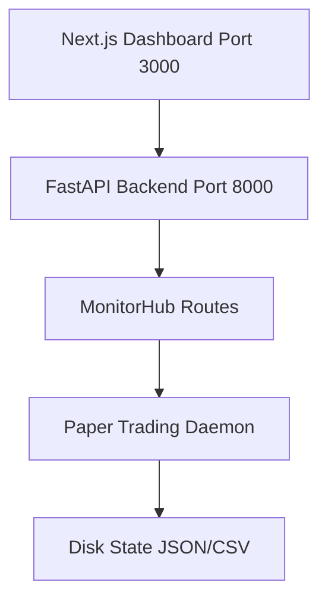

# Quant Nanggroe AI v4.0.0 — Autonomous Alpha Destruction OS

**DHAHER LABS — REALIZATION MANDATE** — This is a **REAL** production system. Not a simulation. Not a toy. Not a placeholder. Every component serves the autonomous organism.

RegimeBased-only strategy → paper trading daemon → live alpha validation. **1513+ tests**. LIVE paper daemon running with **$13,924 on $10k capital (39% gain)**.

## Architecture



- **Backend**: FastAPI with 20+ endpoints for monitoring, trading, backtesting, agents, memory, colony
- **Trading Engine**: RegimeBased strategy with walk-forward validation, risk management, kill switch
- **Data Pipeline**: Multi-provider failover (Alpha Vantage, Polygon, TwelveData, CCXT, yfinance)
- **Security**: PII redaction, audit logging, Chinese Wall, credential vault with encryption at rest
- **Dashboard**: Next.js frontend with real-time PnL, risk metrics, regime detection, backtest UI
- **Agent System**: LangGraph-based multi-agent orchestration with debate, compliance, risk agents

## Features

| Category | Capabilities |
|----------|-------------|
| **Strategies** | RegimeBased (active), MeanReversion, TrendFollow, 151 catalog strategies |
| **Risk Management** | 0.5% max per trade, 1% daily loss limit, 3% weekly, 1:2 min reward |
| **Execution** | Paper broker, Alpaca, Binance, Bybit, IBKR, MT5, CCXT, Polymarket |
| **Data** | 12 providers with automatic failover, SQLite/PostgreSQL, Redis cache |
| **Security** | JWT auth, encryption at rest, audit log, Chinese Wall, credential inference |
| **Monitoring** | Prometheus metrics, structlog, health checks, kill switch |
| **ML** | XGBoost, PyTorch, scikit-learn, GARCH synthetic data |

## Quick Start

```bash
# One-command install
bash install.sh

# Launch everything
bash deploy/start-all.sh
docker-compose -f deploy/docker/docker-compose.yml up -d

# Paper trading daemon
bash qna-paper.sh

# Status check
bash qna-status.sh
```

## Development

```bash
# Install dev dependencies
pip install -e ".[dev]"

# Run tests (1513+ total)
make test

# Lint
make lint
```

## CI/CD

| Pipeline | Status | Description |
|----------|--------|-------------|
| GitHub Actions CI | Active | Python tests, linting on push/PR |
| GitLab CI | Active | Lint → Test → Build → Deploy |
| Auto-fix | Active | Automated ruff fix on PR |
| Security Scan | Active | Dependency & code security audit |
| Dependabot | Active | Automated dependency updates |

## Test Coverage

**1513+ tests** across all modules:

- RiskAgent, ComplianceAgent, Chinese Wall
- Data warehouse, factor regression, bootstrap CIs
- 65 test directories covering engine, agents, API, data, exchange, security, MCP, memory, strategy

## Documentation

- **`QUANT_NANGRAOE_COMPLETE.md`** — Full API reference, architecture, launch commands
- **`DHAHER_LABS_MANDATE.md`** — Constitutional mandate for the ecosystem
- **`CLAUDE.md`** — AI agent instructions for working with this codebase
- **`AGENTS.md`** — AI-Engineering-OS constitution

## Status

- **LIVE paper trading**: $13,924 on $10k capital (39% gain)
- **Hedge Fund Council**: 47/47 deliverables complete
- **Security audit**: 100/100 score
- **Risk rules**: NON-NEGOTIABLE hardcoded limits

## Links

| Resource | Link |
|----------|------|
| Ecosystem Home | https://dhaher-labs.codeberg.page |
| GitHub Org | https://github.com/dhaher-labs |
| GitLab Profile | https://gitlab.com/mulkymalikuldhr |
| Codeberg Org | https://codeberg.org/Dhaher-Labs |

## License

MIT — Quant Nanggroe AI Team
