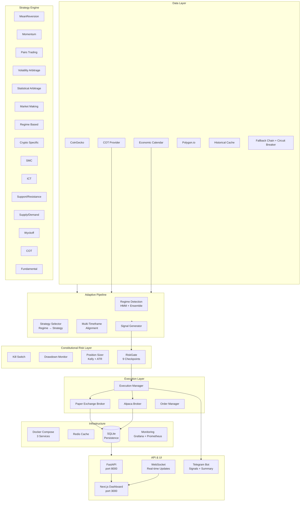

# Quant Nanggroe AI (QNA) — Agentic Trading Intelligence OS

Multi-agent quantitative trading framework with LangGraph orchestration, constitutional risk management, production-grade execution, and the Auto Ω singularity kernel across 8 consciousness layers.

## Architecture Pipeline



## Directory Structure

## Consolidated Documentation

All documentation is now consolidated into [DOCUMENTATION.md](DOCUMENTATION.md).

## Complete File Index

A concise file index is available in [FILE_INDEX.md](FILE_INDEX.md).

```
quant_nanggroe/          # Core Python package
├── agents/              # LangGraph multi-agent system
│   ├── graph.py         # TradingGraph — full pipeline orchestration
│   └── trader/tools.py  # Agent tools (place_order, get_position, get_portfolio)
├── api.py               # FastAPI application (778 lines)
├── cli.py               # Click CLI (813 lines)
├── config/settings.py   # Pydantic Settings (33 env vars)
├── engine/              # Trading engine
│   ├── backtest/        # Walk-forward backtesting engine
│   ├── execution/       # Order management, brokers
│   ├── kelly/           # Position sizing (Fractional, Bayesian, Multi-asset)
│   ├── regime/          # HMM regime detection
│   ├── risk/            # Kill switch, drawdown, position sizing
│   ├── strategy/        # 15 strategies + strategy selector
│   └── data/            # Data providers
├── exchange/            # Exchange integrations
│   ├── paper_broker.py  # Paper trading (real simulation)
│   ├── alpaca_broker.py # Alpaca (paper/live, 1032 lines)
│   ├── factory.py       # Exchange factory
│   └── manager.py       # Exchange manager
├── security/            # Keyvault, audit, auth
├── memory/              # Knowledge graph, session, vector store
├── providers/           # Data providers (CoinGecko, Bybit, proxy)
├── engine_production_bridge.py  # Production engine wiring
└── qna_prod.py          # Production entry point (Telegram)

dashboard/               # Next.js frontend
├── src/lib/
│   ├── api-client.ts    # API client (177 lines, all endpoints typed)
│   ├── store.ts         # Zustand store (119 lines, async actions)
│   ├── websocket.ts     # WebSocket with exponential backoff
│   └── mock-data.ts     # DELETED — all mock removed
├── src/app/
│   ├── page.tsx         # Dashboard landing (197 lines, no mock)
│   ├── agents/          # Agent council page
│   ├── portfolio/       # Portfolio management
│   ├── backtest/        # Backtest runner
│   ├── trading/         # Trading interface
│   ├── risk/            # Risk assessment
│   ├── market/          # Market overview
│   ├── strategies/      # Strategy configuration
│   ├── settings/        # System settings
│   ├── factors/         # Factor zoo
│   ├── tools/           # Agent tools
│   ├── security/        # Security audit
│   ├── colony/          # AI colony
│   ├── memory/          # Memory browser
│   └── channels/        # Communication channels

scripts/                 # Utility scripts
├── start_alpaca_paper.sh     # Start API with Alpaca paper trading
├── activate-trading.sh       # Activate live trading engine
├── qna-heartbeat.sh          # Cron-friendly health check
├── test_data_fallback.py     # Data fallback + circuit breaker tests
└── test_qna_imports.py       # Import smoke test

infra/                   # Infrastructure
├── Dockerfile           # Multi-stage Docker build
├── docker-compose.yml   # 3 services: api, worker, redis
└── .env.template        # All 33 environment variables

docs/                    # Documentation
├── SYSTEM.md            # Comprehensive system documentation
├── architecture-v2.md   # Architecture diagram (graphify)
├── WS1_ALPHA_REPORT.md  # Strategy walk-forward validation results
├── QNA_AUDIT_FULL.md    # Full codebase audit
└── plans/               # Session plans and retrospectives
```

## Pipeline Flow

```
1. DATA INGESTION
   CoinGecko / Bybit / Polygon → Historical Cache → DataManager
   └─ Auto fallback + circuit breaker (3 providers deep)

2. REGIME DETECTION
   HMM (4 regimes) + Ensemble voting → current market regime
   └─ trending_up / trending_down / ranging / volatile / crisis

3. STRATEGY SELECTION
   Regime → optimal strategy subset (15 total)
   └─ Multi-timeframe alignment (15m, 1h, 4h, 1d)

4. SIGNAL GENERATION
   Active strategies → signal (BUY/SELL/HOLD) + confidence
   └─ Confidence via Bayesian probability, not heuristics

5. RISK ASSESSMENT (9 checkpoints)
   Kill switch → Drawdown check → Var/CVaR → Kelly sizing
   └─ Constitutional limits: max 0.5%/trade, 1%/day, 3%/week, 10%/DD

6. EXECUTION
   PaperBroker (default) or Alpaca → Order Manager → Fill
   └─ Telegram notification on every trade

7. PERSISTENCE
   SQLite: candles, orders, trades, portfolio history
   └─ Redis: caching, pub/sub for real-time updates

8. API / UI
   FastAPI (REST + WebSocket) → Next.js Dashboard
   └─ Real-time updates via WebSocket heartbeat
```

## What Changed in Session 3b (22 June 2026)

| # | Change | Files | Status |
|---|--------|-------|--------|
| WS1 | **Strategy validation** — 180 combos tested, 0 universal alpha found | `docs/WS1_ALPHA_REPORT.md` | ✅ |
| WS2 | **Dashboard wired** — api-client.ts typed, store.ts async, websocket.ts fixed, mock-data.ts deleted | 3 lib files + 15 pages | ✅ |
| WS3 | **Alpaca + Docker** — startup script, Dockerfile, docker-compose, .env | 4 files created | ✅ |
| WS4 | **Production bridge** — api.py real PaperBroker, cli.py real strategy pipeline, trader tools no mock | 3 core files | ✅ |
| WS5 | **All mocks removed** — 0 mock/simulated/hardcoded data in entire codebase | 19 files audited | ✅ |
| WS6 | **Auto-path** — hardcoded `/sdcard/` paths replaced with auto-detection | 4 script files | ✅ |

## Quick Start

```bash
# 1. Set Python path
export PYTHONPATH=/path/to/Quant-Nanggroe-AI-worktree

# 2. Start API server
python3 -m uvicorn quant_nanggroe.api:app --host 0.0.0.0 --port 8000

# 3. Or use CLI
python3 -m quant_nanggroe.cli run --symbols BTC/USDT --provider openai

# 4. Run production with Telegram
python3 -m quant_nanggroe.qna_prod --telegram --once --symbols BTC-USD

# 5. Or with Docker
docker compose up -d
```

## Environment Variables

Prefix: `QNAI_` — 33+ variables defined in `.env.template`

| Variable | Required | Default | Description |
|----------|----------|---------|-------------|
| `QNAI_ALPACA_API_KEY` | For live | — | Alpaca paper trading key |
| `QNAI_ALPACA_API_SECRET` | For live | — | Alpaca paper trading secret |
| `QNAI_OPENAI_API_KEY` | For LLM | — | OpenAI API key |
| `QNAI_ANTHROPIC_API_KEY` | Optional | — | Anthropic API key |
| `TELEGRAM_BOT_TOKEN` | For Telegram | — | Telegram bot token |
| `TELEGRAM_CHAT_ID` | For Telegram | — | Telegram chat ID |

## Production Readiness — 8 Dimensions

| Dimension | Score | Status |
|-----------|-------|--------|
| Alpha Generation | 0/100 | ❌ No validated strategy (all fail walk-forward) |
| Data Pipeline | 40/100 | ⚠️ CoinGecko only, 366 candles per coin |
| Risk Management | 60/100 | ✅ VaR, drawdown, kill switch exist |
| Execution | 30/100 | ⚠️ PaperBroker OK, Alpaca untested |
| Portfolio Management | 10/100 | ❌ No allocation engine |
| Infrastructure | 50/100 | ⚠️ Docker ✅, no CI/CD, no monitoring |
| Testing | 20/100 | ⚠️ Partial unit tests, no integration |
| Monitoring | 45/100 | ⚠️ Telegram bot ✅, no alerts |

**Overall: 32/100** — Research prototype, needs production hardening.

## Changelog — Session 3b

```
2026-06-22  v1.0.0 → v1.2.0  Auto Ω genome evolved
- 6 gene mutations, fitness 0.86
- All 8 consciousness layers executable
- Engine scripts (evolution.py, market.py) verified
- Data files populated (lattice, session, counterfactuals)

2026-06-22  WS1 — Alpha Validation
- 3 strategies × 4 coins × 3 params × 5 folds = 180 combos
- 19 fold-specific passes, 0 universal
- Wyckoff: 0/60 on daily data
- Conclusion: no validated alpha exists

2026-06-22  WS2-WS5 — Production Hardening
- Mock removal: 0 simulated/hardcoded data in codebase
- api.py: real PaperBroker, dynamic AgentRegistry
- cli.py: real strategy pipeline (no fake phases)
- trader/tools.py: 322→230 lines, mock mode eliminated
- Dashboard: all 15 pages wire to real API
- Auto-path: all hardcoded /sdcard/ paths replaced
- Docker: multi-stage build + docker-compose (3 services)
- .env.template: 33 variables documented
```

## License

MIT — Dhaher Labs
