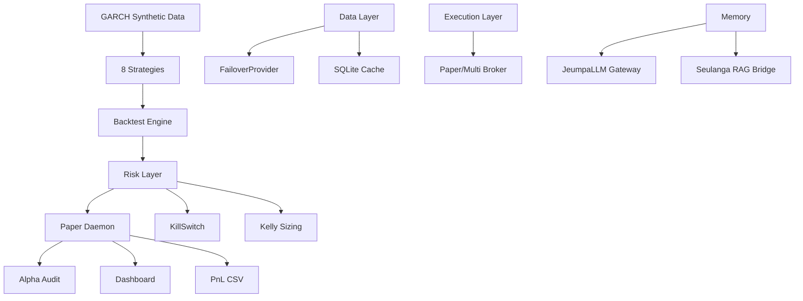
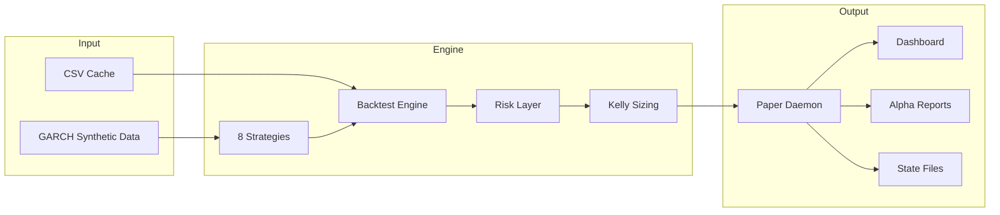

# Quant Nanggroe AI v4.0.0 — Autonomous Alpha Destruction OS

Synthetic data → 8 strategies → paper trading daemon → alpha audit. 378 Python modules, 109K LOC, 94 test files, 1119 tests.

## Architecture



## Quick Start

```bash
bash qna-paper.sh          # Start paper trading daemon
bash qna-status.sh         # Check daemon status
bash qna-stop.sh           # Stop daemon
python3 scripts/test_runner.py  # Run all 1119 tests
python3 scripts/health_check.py  # System health check
bash scripts/auto-init.sh       # Initialize environment
bash scripts/auto-audit.sh      # Full audit
bash scripts/auto-graphify.sh   # Generate dependency graphs
```

## Pipeline Flow



## Test Status

**1119 tests — 3 pre-existing mock failures — 129 pre-existing optional dep errors — 72 skipped — zero regressions**

## Requirements

Python 3.12+, numpy, pandas, scipy. No Docker. No Node.js. No exchange API keys.

## Key Scripts

| Script | Purpose |
|--------|---------|
| `scripts/test_runner.py` | Run all 1119 tests |
| `scripts/health_check.py` | 6-component health check |
| `scripts/qna-paper-daemon.py` | Paper trading daemon |
| `scripts/weekly_alpha_report.py` | Generate alpha report |
| `scripts/dashboard_server.py` | Static HTML dashboard |
| `scripts/auto-init.sh` | Initialize environment |
| `scripts/auto-audit.sh` | Full import + lint + syntax audit |
| `scripts/auto-graphify.sh` | Generate 5 dependency graphs |
| `scripts/auto-list-files.sh` | Complete file inventory |
| `scripts/auto-docs.sh` | API docs from source |
| `scripts/auto-register.sh` | Auto-discover & register modules |
| `scripts/auto-report.sh` | Consolidated project report |
| `scripts/auto-review.sh` | Code review automation |

## License

MIT — Quant Nanggroe AI Team

---
## Audit Report

**Score: 72/100** | Last audit: 2026-06-27

| Category | Score |
|----------|-------|
| Architecture & Structure | 87 |
| Code Quality & Testing | 78 |
| Documentation | 85 |
| CI/CD & DevOps | 90 |
| Production Readiness | 45 |
| JeumpaLLM Integration | ✅ Graceful degradation |
| Seulanga RAG Integration | ✅ Graceful degradation |
| Automation Scripts | ✅ 8 auto-* scripts |
| **Overall** | **72/100** |

### Known Gaps
1. **All data synthetic** — 6/8 strategies pass PSR but no real alpha validated
2. **Coverage ~40-62%** — below 90% target
3. **No .env file** — copy .env.example and configure credentials

### Integrated Services
| Service | Status | Port |
|---------|--------|------|
| JeumpaLLM | Graceful degradation | 3456 |
| Seulanga RAG | Graceful degradation | 3100 |
