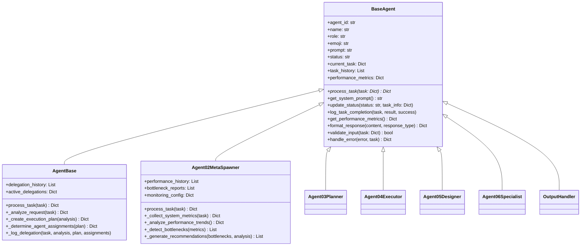
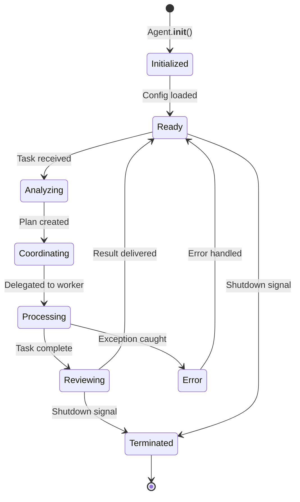
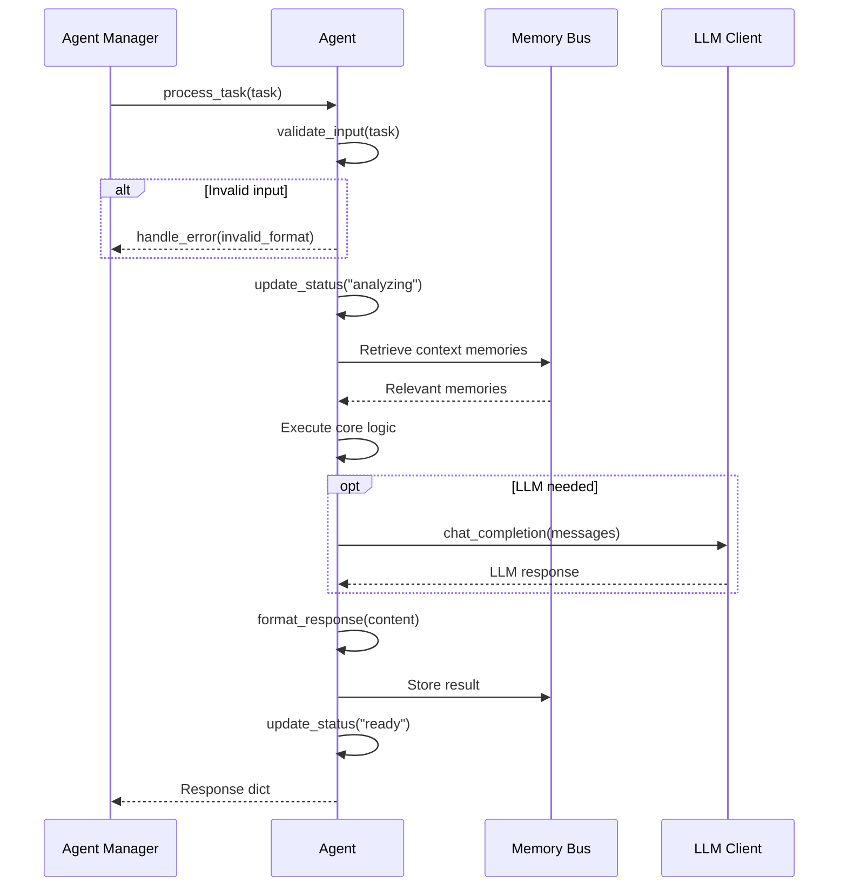
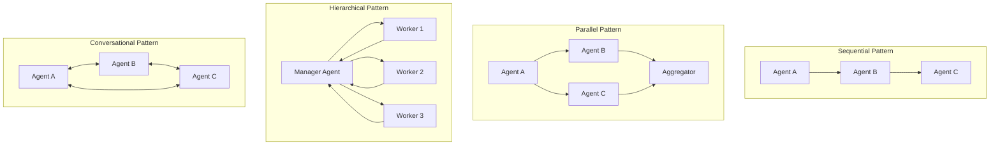
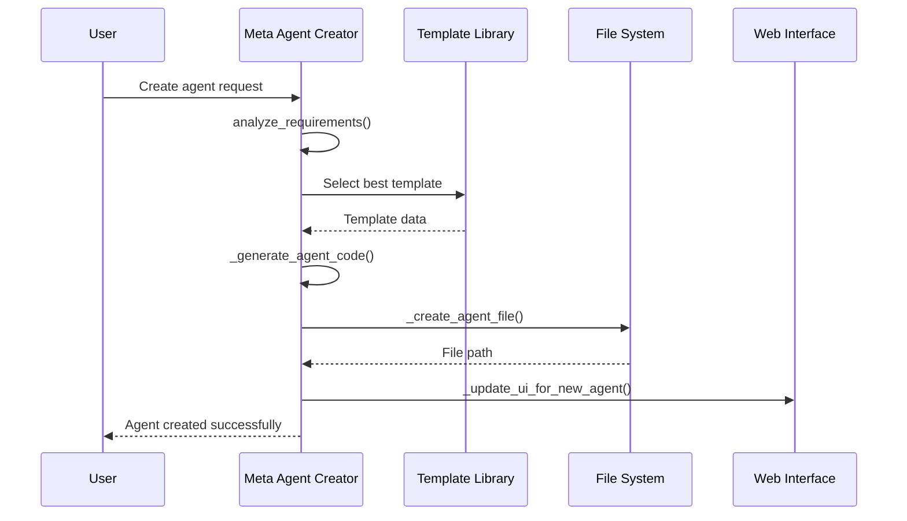

# Agent Architecture — AI-MultiColony-Ecosystem

> Comprehensive guide to the agent system design, lifecycle, and taxonomy
> Version 2.0.0 | Cluster 2 — AI-MULTICOLONY-ECOSYSTEM

---

## Table of Contents

1. [Overview](#overview)
2. [Base Agent Interface](#base-agent-interface)
3. [Agent Taxonomy](#agent-taxonomy)
4. [36+ Specialized Agents](#36-specialized-agents)
5. [Agent Lifecycle](#agent-lifecycle)
6. [Inter-Agent Communication](#inter-agent-communication)
7. [Agent Spawning and Meta-Agent Creation](#agent-spawning-and-meta-agent-creation)
8. [Agent Performance Metrics](#agent-performance-metrics)
9. [Framework Integration Adapters](#framework-integration-adapters)

---

## Overview

The AI-MultiColony-Ecosystem operates on a **colony model** where each agent is a specialized worker with distinct capabilities. Agents are organized into a hierarchical structure with clear delegation paths, communication channels, and lifecycle management.

### Core Design Principles

| Principle | Implementation |
|-----------|---------------|
| Single Responsibility | Each agent handles a specific domain |
| Composition over Inheritance | Agents combine tools to build skills |
| Self-Improvement | Meta-agents create and optimize other agents |
| Graceful Degradation | Agents handle errors and fallbacks autonomously |
| Observable | All actions are logged and measurable |

---

## Base Agent Interface

Every agent in the system inherits from `BaseAgent` (defined in `src/core/base_agent.py`):



### BaseAgent Properties

| Property | Type | Description |
|----------|------|-------------|
| `agent_id` | `str` | Unique identifier (e.g., `"agent_base"`) |
| `name` | `str` | Display name loaded from config |
| `role` | `str` | Agent role description |
| `emoji` | `str` | Status emoji (e.g., 🤖, 🛡️, 🚀) |
| `prompt` | `str` | System prompt from `prompts.yaml` |
| `status` | `str` | Current status: `initialized`, `ready`, `processing`, `error` |
| `current_task` | `Dict` | Currently executing task |
| `task_history` | `List` | Completed task logs |
| `performance_metrics` | `Dict` | Tasks completed, success rate, response time, errors |

### BaseAgent Methods

| Method | Purpose | Returns |
|--------|---------|---------|
| `process_task(task)` | **Abstract** — Process a task | `Dict` with result |
| `get_system_prompt()` | Build system prompt with agent info | `str` |
| `update_status(status, task_info)` | Update agent status | `None` |
| `log_task_completion(task, result, success)` | Log completed task | `None` |
| `get_performance_metrics()` | Get current metrics | `Dict` |
| `format_response(content, response_type)` | Format standardized response | `Dict` |
| `validate_input(task)` | Validate task has required fields | `bool` |
| `handle_error(error, task)` | Graceful error handling | `Dict` |

### Task Input Format

All agents accept tasks in this standard format:

```python
task = {
    'task_id': 'unique_task_identifier',
    'request': 'Human-readable task description',
    'context': {
        'priority': 'medium',  # low, medium, high, urgent
        'workflow_id': 'optional_workflow_id',
        'step_number': 0,
        # Additional context keys vary by agent
    }
}
```

### Task Output Format

All agents return responses in this format:

```python
response = {
    'agent_id': 'agent_base',
    'agent_name': 'Agent Base',
    'emoji': '🤖',
    'response_type': 'coordination_plan',  # or 'error', 'standard'
    'content': 'Human-readable result content',
    'timestamp': '2025-07-13T10:00:00.000000',
    'status': 'ready'
}
```

---

## Agent Taxonomy

```mermaid
graph TB
    subgraph "Coordination Layer"
        PM[Prompt Master<br/>Central Coordinator]
        AB[Agent Base<br/>Task Coordinator]
        A2[Agent 02<br/>Meta-Spawner / Monitor]
    end

    subgraph "Planning Layer"
        A3[Agent 03<br/>Planner]
        MAC[Meta Agent Creator<br/>Agent Factory]
    end

    subgraph "Execution Layer"
        A4[Agent 04<br/>Executor]
        CS[CyberShell<br/>Shell Execution]
        FS[Fullstack Dev<br/>App Development]
        CE[Code Executor<br/>Code Running]
    end

    subgraph "Design Layer"
        A5[Agent 05<br/>Designer]
        UI[UI Designer<br/>Interface Creation]
    end

    subgraph "Specialist Layer"
        A6[Agent 06<br/>Specialist]
        AI[AI Research Agent<br/>Research & Analysis]
        BH[Bug Hunter Bot<br/>Security Testing]
        QC[Quality Control<br/>Code Review]
        MK[Marketing Agent<br/>Promotion]
    subgraph "Operations Layer"
        DM[Deploy Manager<br/>Multi-Platform Deploy]
        DS[Data Sync Agent<br/>Database Operations]
        BK[Backup Colony<br/>Data Safety]
        AM2[Authentication Agent<br/>Access Control]
        LM[LLM Provider Manager<br/>Model Routing]
    end

    subgraph "Security Layer"
        CAG[Commander AGI<br/>Security & Monitoring]
    end

    subgraph "Business Layer"
        MM[Money Making Agent<br/>Revenue Generation]
        PG[Prompt Generator<br/>Prompt Optimization]
    end

    PM --> AB
    AB --> A2
    AB --> A3
    AB --> A4
    AB --> A5
    AB --> A6
    A3 --> MAC
    A4 --> CS
    A4 --> FS
    A4 --> CE
    A5 --> UI
    A6 --> AI
    A6 --> BH
    A6 --> QC
    A6 --> MK
    A4 --> DM
    A4 --> DS
    A4 --> BK
    A4 --> AM2
    A4 --> LM
    AB --> CAG
    AB --> MM
    AB --> PG
```

---

## 36+ Specialized Agents

### Core Framework Agents (src/agents/)

| # | Agent ID | Name | Role | Key Capabilities |
|---|----------|------|------|-----------------|
| 1 | `agent_base` | Agent Base | Master Controller & Task Coordinator | Request analysis, execution planning, agent delegation |
| 2 | `agent_02_meta_spawner` | Agent 02 | Performance Monitor & Bottleneck Analyzer | System metrics, trend analysis, bottleneck detection |
| 3 | `agent_03_planner` | Agent 03 | Strategic Planner | Task decomposition, plan creation, dependency mapping |
| 4 | `agent_04_executor` | Agent 04 | Task Executor | Script execution, API calls, automation |
| 5 | `agent_05_designer` | Agent 05 | Visual Designer | UI components, visual assets, layout design |
| 6 | `agent_06_specialist` | Agent 06 | Domain Specialist | Domain expertise, validation, quality review |
| 7 | `output_handler` | Output Handler | Result Compiler | Output formatting, compilation, delivery |

### Specialized Agents (agents/)

| # | Agent ID | Name | Category | Capabilities |
|---|----------|------|----------|-------------|
| 8 | `cybershell` | CyberShell Agent | Execution | Shell execution, process management, system monitoring, automation, file ops, network commands |
| 9 | `deploy_manager` | Deploy Manager Agent | Operations | Multi-platform deployment (7 platforms), infrastructure management, CI/CD, rollback |
| 10 | `fullstack_dev` | Full Stack Developer | Development | Frontend + backend development, 4 tech stacks, auth setup, database design, API creation |
| 11 | `ui_designer` | UI Designer Agent | Design | React/Vue/Angular/Svelte UI generation, Tailwind CSS, component creation |
| 12 | `dev_engine` | Development Engine | Development | Project scaffolding, multi-language support, template generation |
| 13 | `agent_maker` | Agent Maker | Meta | Dynamic agent creation, template management, capability assignment |
| 14 | `meta_agent_creator` | Meta Agent Creator | Meta | Advanced agent creation, 8 templates, code generation, UI updates |
| 15 | `commander_agi` | Commander AGI | Security | Security monitoring, threat detection, agent coordination, robotics control |
| 16 | `ai_research_agent` | AI Research Agent | Research | ArXiv monitoring, trend analysis, technology assessment, improvement suggestions |
| 17 | `marketing_agent` | Marketing Agent | Business | Social media, content creation, influencer outreach, SEO, analytics |
| 18 | `bug_hunter_bot` | Bug Hunter Bot | Security | Ethical hacking, vulnerability discovery, security testing |
| 19 | `money_making_agent` | Money Making Agent | Business | Revenue generation, monetization strategies |
| 20 | `prompt_generator` | Prompt Generator | AI | Prompt optimization, pattern library, test prompts |
| 21 | `data_sync` | Data Sync Agent | Operations | Database sync, data processing, multi-DB support |
| 22 | `quality_control_specialist` | Quality Control Specialist | Quality | Code review, testing, quality assurance |
| 23 | `system_optimizer` | System Optimizer | Operations | Performance optimization, resource management |
| 24 | `backup_colony_system` | Backup Colony System | Operations | Data backup, disaster recovery |
| 25 | `authentication_agent` | Authentication Agent | Security | Access control, session management |
| 26 | `credential_manager` | Credential Manager | Security | API key management, secret storage |
| 27 | `llm_provider_manager` | LLM Provider Manager | AI | Model routing, provider management, failover |
| 28 | `knowledge_management_agent` | Knowledge Management Agent | Knowledge | Knowledge base, RAG, information retrieval |
| 29 | `deployment_specialist` | Deployment Specialist | Operations | Specialized deployment, platform-specific config |
| 30 | `code_executor` | Code Executor | Execution | Code running, sandboxed execution |

### Framework Integration Agents (src/agents/)

| # | Agent ID | Name | Category | Purpose |
|---|----------|------|----------|---------|
| 31 | `launcher_agent` | Launcher Agent | Orchestration | System startup and initialization |
| 32 | `dynamic_agent_factory` | Dynamic Agent Factory | Meta | Runtime agent instantiation |
| 33 | `advanced_agent_creator` | Advanced Agent Creator | Meta | Complex agent generation with LLM |
| 34 | `web_automation_agent` | Web Automation Agent | Automation | Browser automation, web scraping |
| 35 | `deployment_agent` | Deployment Agent (v2) | Operations | Enhanced deployment with monitoring |
| 36 | `agi_colony_connector` | AGI Colony Connector | Orchestration | Cross-colony communication |

### Agent Capability Matrix

| Agent | Code | Deploy | Design | Research | Security | Business | Monitor | Shell |
|-------|------|--------|--------|----------|----------|----------|---------|-------|
| Agent Base | ● | ○ | ○ | ○ | ○ | ○ | ○ | ○ |
| CyberShell | ● | ○ | ○ | ○ | ○ | ○ | ● | ● |
| Deploy Manager | ○ | ● | ○ | ○ | ○ | ○ | ● | ○ |
| Fullstack Dev | ● | ● | ● | ○ | ○ | ○ | ○ | ○ |
| UI Designer | ○ | ○ | ● | ○ | ○ | ○ | ○ | ○ |
| Commander AGI | ○ | ○ | ○ | ○ | ● | ○ | ● | ○ |
| AI Research | ○ | ○ | ○ | ● | ○ | ○ | ○ | ○ |
| Marketing | ○ | ○ | ● | ○ | ○ | ● | ● | ○ |
| Bug Hunter | ○ | ○ | ○ | ○ | ● | ○ | ● | ○ |
| Meta Agent Creator | ● | ○ | ○ | ○ | ○ | ○ | ○ | ○ |

● = Primary | ○ = Secondary

---

## Agent Lifecycle



### Lifecycle Phases

#### 1. Spawn (Initialization)

```python
# Agent initialization sequence
def __init__(self, config_path="config/prompts.yaml"):
    self.agent_id = "unique_id"
    self.config = self._load_config(config_path)     # Load YAML config
    self.name = config.get('name', agent_id)          # Set display name
    self.role = config.get('role', 'Unknown')         # Set role
    self.status = "initialized"                        # Initial status
    self.performance_metrics = {                       # Initialize metrics
        'tasks_completed': 0,
        'success_rate': 1.0,
        'avg_response_time': 0.0,
        'errors': 0
    }
```

| Step | Action | Implementation |
|------|--------|---------------|
| 1 | Load config | `_load_config()` reads `prompts.yaml` |
| 2 | Set identity | `agent_id`, `name`, `role`, `emoji` |
| 3 | Initialize state | `status = "initialized"` |
| 4 | Setup metrics | `performance_metrics` dict |
| 5 | Register with manager | `AgentManager.register_agent()` |

#### 2. Execute (Task Processing)



#### 3. Review (Quality Check)

After execution, the agent:
1. Logs task completion via `log_task_completion()`
2. Updates performance metrics
3. Recalculates success rate
4. If part of a workflow, passes result to next agent

#### 4. Terminate (Shutdown)

Agents can be terminated gracefully:
- Via AgentManager workflow completion
- Via AgentScheduler for scheduled tasks
- Via error recovery for failed agents
- The `AgentScheduler` supports auto-restart with exponential backoff

---

## Inter-Agent Communication

### Communication Patterns



### Communication via Agent Manager

```python
# Inter-agent message format
result = await agent_manager.send_message_between_agents(
    from_agent_id="agent_03_planner",
    to_agent_id="agent_04_executor",
    message={
        'request': 'Execute the following plan...',
        'context': {'plan_details': execution_plan}
    }
)
```

### Communication via Memory Bus

Agents also communicate indirectly through the shared `MemoryBus`:

| Method | Purpose | Example |
|--------|---------|---------|
| `store_workflow_step()` | Store step result | Executor stores output for next agent |
| `store_agent_result()` | Store agent result | Designer stores generated UI code |
| `store_agent_interaction()` | Log interaction | For debugging and audit trails |
| `get_relevant_memories()` | Retrieve context | Agent retrieves prior work context |

### Communication via Framework Adapters

| Framework | Pattern | Class |
|-----------|---------|-------|
| LangGraph | Graph-based sequential/parallel | `LangGraphAdapter` |
| CrewAI | Crew missions with roles | `CrewAIAdapter` |
| AutoGen | Group chat conversations | `AutoGenAdapter` |

---

## Agent Spawning and Meta-Agent Creation

### Meta Agent Creator

The `MetaAgentCreator` (in `agents/meta_agent_creator.py`) can dynamically create new specialized agents:



### Agent Templates

| Template | Description | Capabilities |
|----------|-------------|-------------|
| `data_scientist` | Data analysis & ML modeling | data_analysis, ml_modeling, statistical_analysis, data_visualization |
| `web_developer` | Web development (front/back) | html_css, javascript, react, nodejs, api_development |
| `devops_engineer` | Deployment & infrastructure | docker, kubernetes, ci_cd, cloud_deployment, monitoring |
| `content_creator` | Content & social media | content_writing, social_media, seo, copywriting |
| `mobile_developer` | Mobile app development | react_native, flutter, ios, android, mobile_ui |
| `security_specialist` | Cybersecurity | security_audit, penetration_testing, vulnerability_assessment |
| `ai_researcher` | AI research & models | ai_research, model_development, paper_analysis, experiment_design |
| `business_analyst` | Business strategy | market_analysis, business_planning, financial_modeling |

### Dynamic Agent Factory

The `DynamicAgentFactory` (in `src/agents/dynamic_agent_factory.py`) provides additional runtime agent creation capabilities, complementing the Meta Agent Creator with:

- Runtime agent instantiation without file creation
- In-memory agent deployment for temporary tasks
- Agent pooling and reuse
- Configuration-driven agent generation

### Agent Specializations

The system supports fine-grained specializations:

| Category | Options |
|----------|---------|
| Programming Languages | python, javascript, java, go, rust, cpp, csharp |
| Frameworks | react, vue, angular, django, flask, fastapi, express, spring |
| Databases | postgresql, mysql, mongodb, redis, elasticsearch |
| Cloud Platforms | aws, gcp, azure, digitalocean, heroku |
| AI/ML | tensorflow, pytorch, scikit_learn, huggingface, openai |
| Industries | fintech, healthcare, ecommerce, education, gaming, media |

---

## Agent Performance Metrics

### Metrics Collection

Every agent tracks these metrics via `BaseAgent.performance_metrics`:

```python
performance_metrics = {
    'tasks_completed': 0,      # Total tasks processed
    'success_rate': 1.0,       # Successful / total ratio
    'avg_response_time': 0.0,  # Average processing time (seconds)
    'errors': 0                # Total errors encountered
}
```

### Simulated Baseline Metrics (from Agent 02)

| Agent | Avg Response Time | Task Count | Success Rate | Resource Usage |
|-------|------------------|------------|--------------|----------------|
| Agent Base | 2.5s | 25 | 98% | 25% |
| Agent 03 Planner | 8.2s | 12 | 95% | 35% |
| Agent 04 Executor | 15.7s | 18 | 88% | 75% |
| Agent 05 Designer | 45.3s | 8 | 92% | 85% |
| Agent 06 Specialist | 12.1s | 15 | 96% | 45% |
| Output Handler | 5.8s | 20 | 99% | 30% |

### Performance Alert Thresholds

| Metric | Warning Threshold | Critical Threshold |
|--------|------------------|-------------------|
| Response Time | > 30 seconds | > 60 seconds |
| Error Rate | > 10% | > 25% |
| Queue Length | > 5 tasks | > 10 tasks |
| Resource Usage | > 80% | > 95% |

### Agent Health Scoring

```
health_score = 100
- 20 per slow agent (response > 30s)
- 15 per high-error agent (success < 90%)
- 10 per high-resource agent (usage > 80%)
- 25 if queue is backed up (> 5 tasks)
```

---

## Framework Integration Adapters

### LangGraph Adapter

The `LangGraphAdapter` wraps agents as LangGraph nodes:

```python
# Creating a workflow
adapter = LangGraphAdapter(agent_manager)
graph = adapter.create_workflow_graph({
    'nodes': ['agent_base', 'agent_03_planner', 'agent_04_executor', 'output_handler'],
    'edges': [
        ('agent_base', 'agent_03_planner'),
        ('agent_03_planner', 'agent_04_executor'),
        ('agent_04_executor', 'output_handler')
    ],
    'start_nodes': ['agent_base'],
    'end_nodes': ['output_handler']
})
```

### CrewAI Adapter

The `CrewAIAdapter` creates CrewAI agents from our agent system:

```python
# Creating a crew
adapter = CrewAIAdapter(agent_manager)
crew = adapter.create_specialized_crews()['software_development']
result = adapter.execute_crew_mission('software_development', 'Build a REST API')
```

Available crews:
- `software_development` — Product Manager, Architect, Developer, QA
- `content_creation` — Director, Strategist, Designer
- `data_analysis` — Director, Data Scientist, Data Engineer, Writer

### AutoGen Adapter

The `AutoGenAdapter` enables group chat conversations:

```python
# Starting a conversation
adapter = AutoGenAdapter(agent_manager)
result = adapter.start_conversation(
    agent_ids=['agent_base', 'agent_04_executor', 'agent_06_specialist'],
    initial_message="Let's build a web application"
)
```

Available workflows:
- `software_development` — PM, Architect, Developer, QA
- `design_team` — Director, Designer, Reviewer
- `analysis_team` — Director, Expert, Analyst, Writer

---

## Agent Response Format Reference

### Coordination Plan (Agent Base)

```
📋 ANALISIS TUGAS: [task summary]
🎯 RENCANA EKSEKUSI:
   Complexity: [HIGH/MEDIUM/LOW]
   Total Steps: [N]
   Estimated Duration: [time range]
👥 ASSIGNMENT AGENT:
   • Agent 03 (Planner)
     Task: [description]
     Priority: [high/medium]
     Time: [estimate]
📊 STATUS: Ready for execution
✅ HASIL: Coordination plan created
```

### Performance Analysis (Agent 02)

```
📊 SYSTEM HEALTH: [🟢 EXCELLENT / 🟡 GOOD / 🟠 DEGRADED / 🔴 CRITICAL]
🔍 BOTTLENECKS: [list or "No bottlenecks"]
📈 METRICS: [agent metrics table]
🛠️ RECOMMENDATIONS: [list]
⚡ ACTIONS: [list]
```

---

*This agent architecture document is maintained as part of the AI-MultiColony-Ecosystem project. Last updated: 2025-07-13.*
