# Quant Nanggroe AI — Complete System Architecture

**Version 0.2.0 | Agentic Trading Intelligence OS**

> This document provides the comprehensive technical architecture reference for Quant Nanggroe AI, covering every layer, component, data flow, and integration point in the system.

---

## Table of Contents

1. [High-Level Architecture Overview](#1-high-level-architecture-overview)
2. [Agent Layer](#2-agent-layer)
3. [Engine Layer](#3-engine-layer)
4. [Memory Layer](#4-memory-layer)
5. [Data Layer](#5-data-layer)
6. [API Layer](#6-api-layer)
7. [MCP Protocol Integration](#7-mcp-protocol-integration)
8. [LangGraph Graph Structure and Flow](#8-langgraph-graph-structure-and-flow)
9. [Constitutional Risk System](#9-constitutional-risk-system)
10. [Deployment Architecture](#10-deployment-architecture)
11. [Security Architecture](#11-security-architecture)
12. [Cross-Cutting Concerns](#12-cross-cutting-concerns)

---

## 1. High-Level Architecture Overview

Quant Nanggroe AI implements a **6-Layer Deterministic Execution Stack** with clear separation of concerns. Each layer acts as a strict boundary — data flows downward through the stack, and each layer either passes data forward or blocks it entirely. No layer can be bypassed, and no agent can override constraints imposed by layers above it.

### Architecture Diagram (Mermaid)

```mermaid
graph TB
    subgraph "API/CLI Layer"
        API[FastAPI REST API]
        WS[WebSocket Server]
        CLI[Click CLI]
    end

    subgraph "Agent Layer — LangGraph StateGraph"
        MA[Market Analysis Node]
        SG[Signal Generation Node]
        RA[Risk Assessment Node]
        PO[Portfolio Optimization Node]
        ED[Execution Decision Node]
        OE[Order Execution Node]
        RF[Reflection Node]
        CD[Council Debate Node]
        EE[Emergency Exit Node]
    end

    subgraph "9 Specialized Agents"
        RES[Researcher Agent]
        STR[Strategist Agent]
        RSK[Risk Agent]
        TRD[Trader Agent]
        PRT[Portfolio Agent]
        EXE[Execution Agent]
        MAC[Macro Agent]
        CRY[Crypto Agent]
        FOR[Forex Agent]
    end

    subgraph "Engine Layer"
        BT[Backtest Engine]
        EXE_E[Execution Engine]
        FAC[Factor Library]
        RSK_E[Risk Engine]
        MOD[ML Models]
    end

    subgraph "Memory Layer"
        JRNL[Trade Journal]
        KG[Knowledge Graph]
        PG[Paging System]
        SES[Session Manager]
    end

    subgraph "Data Layer"
        DP[Data Providers]
        CCXT[CCXT Exchange]
        CACHE[Caching Layer]
        DB[SQLAlchemy Database]
    end

    subgraph "MCP Layer"
        MCPS[MCP Server]
        MCPC[MCP Client]
        MCPT[MCP Tools]
    end

    API --> MA
    CLI --> MA
    WS --> MA

    MA --> RES
    MA --> MAC
    MA --> CRY
    MA --> FOR
    SG --> STR
    RA --> RSK
    ED --> TRD
    PO --> PRT
    OE --> EXE

    TRD --> BT
    EXE --> EXE_E
    STR --> FAC
    RSK --> RSK_E
    STR --> MOD

    MA --> JRNL
    RF --> KG
    MA --> PG
    MA --> SES

    RES --> DP
    EXE --> CCXT
    DP --> CACHE
    API --> DB

    RES --> MCPC
    MCPS --> MCPT
```



### ASCII Architecture Diagram

```
┌──────────────────────────────────────────────────────────────────┐
│                    API / CLI / WebSocket Layer                    │
│  FastAPI REST • Click CLI • WebSocket Streaming • OpenAPI Docs  │
├──────────────────────────────────────────────────────────────────┤
│                      Agent Layer (LangGraph)                      │
│  ┌─────────┐ ┌──────────┐ ┌─────────┐ ┌──────────┐ ┌────────┐ │
│  │Researcher│ │Strategist│ │  Risk   │ │  Trader  │ │Portfolio│ │
│  └────┬────┘ └────┬─────┘ └────┬────┘ └────┬─────┘ └───┬────┘ │
│  ┌────┴────┐ ┌────┴─────┐ ┌────┴────┐                    │      │
│  │  Macro  │ │  Crypto  │ │  Forex  │ │Execution │ Council│      │
│  └─────────┘ └──────────┘ └─────────┘ └──────────┘ Debate │      │
├──────────────────────────────────────────────────────────────────┤
│                        Engine Layer                               │
│  Backtest • Execution • Factors (Alpha101/GTJA191/Barra)        │
│  Risk (VaR/CVaR/Kelly/Drawdown/KillSwitch) • ML Models          │
├──────────────────────────────────────────────────────────────────┤
│                       Memory Layer                                │
│  Trade Journal • Knowledge Graph • Paging • Session Manager      │
├──────────────────────────────────────────────────────────────────┤
│                        Data Layer                                 │
│  Multi-Provider (yfinance/Alpaca/Binance/Polygon/FRED)          │
│  CCXT Exchange Abstraction • Caching • SQLAlchemy ORM            │
├──────────────────────────────────────────────────────────────────┤
│                     MCP Protocol Layer                             │
│  MCP Server • MCP Client • Tool Registry • JSON-RPC 2.0         │
├──────────────────────────────────────────────────────────────────┤
│                    Security Layer (Cross-Cutting)                  │
│  KeyVault • Authentication • Audit Trail • Credential Inference  │
└──────────────────────────────────────────────────────────────────┘
```

---

## 2. Agent Layer

The Agent Layer is the heart of Quant Nanggroe AI. It consists of 9 specialized agents orchestrated by a LangGraph StateGraph, plus a Council Debate mechanism for low-confidence decisions and an Emergency Exit path for critical risk situations.

### 2.1 Agent Inventory

| Agent | Role | LLM Model | Responsibility | Tools |
|-------|------|-----------|----------------|-------|
| **Researcher** | `researcher` | Quick | Market research, data gathering, news analysis | `web_search`, `financial_data`, `news` |
| **Strategist** | `strategist` | Deep | Signal generation, strategy formulation, alpha factor computation | `technical_analysis`, `factor_library`, `signal_generator` |
| **Risk** | `risk` | Deep | 9-checkpoint risk assessment, VaR/CVaR computation, constitutional enforcement | `var_calculator`, `kelly_criterion`, `drawdown_monitor` |
| **Trader** | `trader` | Quick | Trade execution decisions, order management, position sizing | `order_manager`, `position_tracker` |
| **Portfolio** | `portfolio` | Quick | Portfolio optimization, asset allocation, rebalancing | `risk_parity`, `rebalance`, `allocation_optimizer` |
| **Execution** | `execution` | Quick | Order execution, fill tracking, guard rails | `broker_adapter`, `fill_simulator`, `guard_rails` |
| **Macro** | `macro` | Quick | Macroeconomic analysis, regime detection, economic calendar | `economic_calendar`, `regime_detector` |
| **Crypto** | `crypto` | Quick | Cryptocurrency market analysis, on-chain data, whale tracking | `on_chain_data`, `sentiment`, `whale_tracker` |
| **Forex** | `forex` | Quick | Forex market analysis, currency pair evaluation, central bank policy | `fx_rates`, `carry_trade`, `central_bank` |

### 2.2 Agent Architecture

Each agent follows a consistent internal architecture:

```
Agent Module (e.g., quant_nanggroe/agents/researcher/)
├── __init__.py          # Public exports
├── agent.py             # Agent class with LLM binding and tool integration
├── prompts.py           # System prompts and templates
└── tools.py             # Agent-specific MCP tools
```

The `AgentFactory` (in `quant_nanggroe/agents/registry.py`) creates agents on demand with the appropriate LLM configuration:

- **Deep-think model** (e.g., `gpt-4o`): Used for Strategist and Risk agents where thorough analysis is critical
- **Quick-think model** (e.g., `gpt-4o-mini`): Used for Researcher, Trader, Portfolio, Execution, Macro, Crypto, and Forex agents where speed matters

### 2.3 Council Debate System

When confidence falls below the threshold (default: 0.65), the system triggers a **Council Debate**:

1. **Bull/Bear Debate**: A structured debate between optimistic and pessimistic perspectives, with a judge evaluating arguments
2. **Risk Debate**: Three-way debate between Conservative, Neutral, and Aggressive risk positions
3. **Council Vote**: Weighted voting by all 9 agents based on historical accuracy, producing a final `CouncilResult` with consensus level

The debate system uses `CouncilDebate` and `CouncilVoting` classes (in `quant_nanggroe/agents/council/`) with configurable maximum rounds.

### 2.4 Emergency Exit Path

When the kill switch activates (daily PnL < -2% or weekly PnL < -5%), the system routes to the Emergency Exit node which:
- Closes all open positions immediately
- Sets `kill_switch_active = True`
- Sets `should_halt = True`
- Prevents any further trading until manual reset

---

## 3. Engine Layer

The Engine Layer provides the computational backbone for trading operations. It is organized into five sub-modules.

### 3.1 Backtest Engine (`engine/backtest/`)

| Component | File | Purpose |
|-----------|------|---------|
| **BacktestEngine** | `engine.py` | Core backtesting engine with configurable commission, slippage, and market type |
| **Portfolio Sim** | `portfolio.py` | Simulated portfolio for backtesting with position tracking |
| **Execution Sim** | `execution.py` | Execution reality simulation: dynamic spread, slippage, partial fills, latency |
| **Metrics** | `metrics.py` | Performance metrics: Sharpe, Sortino, max drawdown, win rate, profit factor |
| **Monte Carlo** | `monte_carlo.py` | Bootstrap resampling for confidence intervals on backtest results |
| **Walk-Forward** | `walk_forward.py` | Rolling window optimization for robustness validation |
| **Benchmarks** | `benchmarks.py` | Benchmark comparison against buy-and-hold, S&P 500, etc. |
| **Report** | `report.py` | HTML/JSON backtest report generation |

**Execution Reality Simulation**: The backtest engine simulates real-world trading conditions including:
- Dynamic spread widening during high volatility
- Random slippage within volatility-adjusted bounds
- Partial fill probability (2-15% depending on volatility)
- Order rejection simulation
- 100-500ms random latency

This typically reduces backtested returns by 15-30% compared to idealized backtesting.

### 3.2 Execution Engine (`engine/execution/`)

| Component | File | Purpose |
|-----------|------|---------|
| **ExecutionManager** | `manager.py` | Order lifecycle management, routing, and tracking |
| **Base Broker** | `base.py` | Abstract broker interface for all exchange implementations |
| **Paper Broker** | `brokers/paper.py` | Paper trading broker with simulation |
| **Order Management** | `order.py` | Order creation, modification, cancellation |
| **Fill Processing** | `fill.py` | Fill tracking, partial fill handling, P&L computation |
| **Cooldown Guard** | `guards/cooldown.py` | Prevents overtrading with configurable cooldown periods |
| **Whitelist Guard** | `guards/whitelist.py` | Restricts trading to approved symbols only |
| **Max Position Guard** | `guards/max_position.py` | Enforces maximum position size limits |

### 3.3 Factor Library (`engine/factors/`)

The factor library implements production-grade alpha factors from major quantitative research:

| Component | File | Source | Factor Count |
|-----------|------|--------|-------------|
| **Alpha101** | `alpha101.py` | Kakushadze (2015), arXiv:1601.00991 | 50+ factors |
| **GTJA191** | `gtja191.py` | Guotai Junan 191 Chinese A-share alphas | 191 factors |
| **Barra** | `barra.py` | MSCI Barra multi-factor risk model | Risk factors |
| **Technical** | `technical.py` | Standard technical indicators | RSI, MACD, etc. |
| **Fundamental** | `fundamental.py` | Fundamental analysis factors | P/E, EPS, etc. |
| **Pipeline** | `pipeline.py` | Factor computation pipeline | Orchestration |
| **Registry** | `registry.py` | Factor discovery and registration | Management |
| **Base** | `base.py` | `AlphaFactor` base class, `FactorMeta`, helper functions | Foundation |

Each alpha factor inherits from `AlphaFactor` and provides:
- `name` property: Unique factor identifier
- `meta` property: `FactorMeta` with formula LaTeX, theme tags, universe, warmup requirements
- `compute(df)` method: Pandas-based factor computation

Helper functions include: `rank`, `delay`, `delta`, `ts_corr`, `ts_cov`, `ts_mean`, `ts_std`, `ts_sum`, `ts_min`, `ts_max`, `ts_argmax`, `ts_argmin`, `ts_rank`, `decay_linear`, `safe_div`, `scale`, `signed_power`, `vwap`.

### 3.4 Risk Engine (`engine/risk/`)

| Component | File | Purpose |
|-----------|------|---------|
| **RiskManager** | `manager.py` | Central risk management orchestrator |
| **9-Checkpoint Checks** | `checks.py` | Constitutional risk checkpoint implementations |
| **VaR Computation** | `var.py` | Parametric, Historical, and Monte Carlo VaR/CVaR |
| **Drawdown Monitor** | `drawdown.py` | Real-time drawdown tracking and alerting |
| **Position Sizing** | `position_sizing.py` | Kelly criterion, fixed-fractional, risk-parity sizing |
| **Kelly Criterion** | `kelly.py` | Optimal position sizing based on edge |
| **Risk Parity** | `risk_parity.py` | Equal risk contribution portfolio construction |
| **Correlation Monitor** | `correlation.py` | Pairwise correlation tracking between positions |
| **Kill Switch** | `kill_switch.py` | Emergency circuit breaker for extreme losses |
| **Emotional Lockout** | `emotional_lockout.py` | Prevents revenge trading after losses |
| **Constants** | `constants.py` | Constitutional risk limit constants |

### 3.5 ML Models (`engine/models/`)

| Component | File | Purpose |
|-----------|------|---------|
| **Base Model** | `base.py` | Abstract model interface |
| **Feature Store** | `feature_store.py` | Feature engineering and storage |
| **Signal Generator** | `signal_generator.py` | ML-based signal generation |
| **Ensemble** | `ensemble.py` | Multi-model ensemble for robust predictions |

---

## 4. Memory Layer

The Memory Layer provides persistent storage for trade history, learned knowledge, and session context. It is inspired by the Letta-style paging architecture.

### 4.1 Trade Journal (`memory/journal.py`)

The `TradeJournal` provides structured trade logging:

- **Entry recording**: Symbol, side, price, quantity, agent name, strategy, reasoning, metadata
- **Exit recording**: Symbol, exit price, PnL calculation, notes
- **Reflection**: Post-trade analysis notes and rating
- **Performance summary**: Win rate, total PnL, avg win/loss, profit factor, best/worst trade
- **Persistence**: JSON file-based storage with load/save methods

### 4.2 Knowledge Graph (`memory/knowledge_graph.py`)

The knowledge graph stores structured relationships between market entities:

- Symbol → Sector → Industry relationships
- Correlation patterns between assets
- Strategy → Performance mappings
- Market regime → Asset behavior associations

### 4.3 Paging System (`memory/paging.py`)

The paging system implements Letta-style context management:

- **Context window management**: Keeps only the most relevant information in the active context
- **Priority-based eviction**: Less relevant data is paged out to persistent storage
- **Recall mechanism**: Paged-out information can be retrieved when needed
- **Automatic summarization**: Long histories are compressed into summaries

### 4.4 Session Manager (`memory/session.py`)

Manages trading session state:

- Session creation and lifecycle
- Cross-session state persistence
- Session-specific configuration
- Pipeline run ID tracking

---

## 5. Data Layer

### 5.1 Multi-Provider Architecture

The data layer abstracts multiple data providers behind a unified interface:

| Provider | Asset Classes | Key Features |
|----------|--------------|-------------|
| **yfinance** | US Equities, ETFs | Free, no API key required, backtesting fallback |
| **Alpaca** | US Equities | Trading + data + paper trading, WebSocket streaming |
| **Binance** | Crypto | Primary crypto exchange, testnet, order book data |
| **Polygon.io** | US Equities, Options | Institutional-grade tick data, WebSocket |
| **Alpha Vantage** | Equities, Forex | Free tier, sentiment API, technical indicators |
| **FRED** | Macroeconomic | 800K+ economic series, central bank data |
| **CoinGecko** | Crypto | 10K+ crypto assets, market overview, metadata |

### 5.2 CCXT Exchange Abstraction (`exchange/`)

The exchange layer provides a unified interface across all brokers through the `ExchangeInterface` abstract base class:

| Component | File | Purpose |
|-----------|------|---------|
| **ExchangeInterface** | `base.py` | Abstract interface for all exchanges (connect, trade, market data, WebSocket) |
| **CCXT Broker** | `ccxt_broker.py` | CCXT-based implementation for 100+ crypto exchanges |
| **Alpaca Broker** | `alpaca_broker.py` | Alpaca implementation for US equities |
| **Paper Broker** | `paper_broker.py` | Paper trading with simulation |
| **Polymarket Broker** | `polymarket_broker.py` | Prediction market integration |
| **Exchange Manager** | `manager.py` | Broker lifecycle and connection management |
| **Exchange Factory** | `factory.py` | Factory pattern for broker instantiation |
| **Guard Pipeline** | `guards.py` | Pre-trade validation guards |
| **Order Types** | `order_types.py` | Order type definitions |
| **Solana/Jupiter** | `solana/jupiter.py` | Jupiter DEX aggregator on Solana |
| **Solana/Wallet** | `solana/wallet.py` | Solana wallet management |
| **Solana/RugCheck** | `solana/rugcheck.py` | Token safety verification |
| **Solana/Mempool** | `solana/mempool.py` | Solana mempool monitoring |
| **Solana/Broker** | `solana/broker.py` | Solana trading broker |

### 5.3 Exchange Interface Contract

The `ExchangeInterface` defines the canonical API that every broker must implement:

**Connection Lifecycle**: `connect()`, `disconnect()`, `is_connected`, `state`, `name`, `health_check()`
**Account**: `get_balance()`, `get_positions()`, `get_portfolio()`
**Trading**: `place_order()`, `cancel_order()`, `get_order()`
**Market Data**: `get_ohlcv()`, `get_ticker()`, `get_orderbook()`, `get_trades()`
**WebSocket**: `subscribe_ticker()`, `subscribe_orderbook()`, `subscribe_trades()`, `unsubscribe()`
**Utility**: `get_markets()`

Error hierarchy: `ExchangeError` → `ConnectionError`, `OrderError`, `RateLimitError`, `AuthenticationError`, `InsufficientFundsError`, `MarketDataError`

### 5.4 Caching Layer

- **TTL-based caching**: 5-minute default TTL for market data
- **Provider failover**: Automatic retry with exponential backoff
- **Health-based prioritization**: Providers ranked by success rate and latency

### 5.5 Database Layer (`data/models.py`)

SQLAlchemy 2.0 ORM models with the following schema:

| Model | Table | Purpose |
|-------|-------|---------|
| **User** | `users` | API users with RBAC (admin, trader, analyst, viewer) |
| **Trade** | `trades` | Full trade lifecycle with risk metadata |
| **Position** | `positions` | Open position tracking with P&L |
| **PortfolioSnapshot** | `portfolio_snapshots` | Time-series portfolio state |
| **AgentLog** | `agent_logs` | Agent decision audit trail |
| **RiskEvent** | `risk_events` | Risk violations and constitutional breaches |
| **Strategy** | `strategies` | Strategy definitions and performance metrics |
| **BacktestResult** | `backtest_results` | Backtest runs with full metrics |

---

## 6. API Layer

### 6.1 FastAPI REST Endpoints

| Method | Endpoint | Purpose |
|--------|----------|---------|
| `GET` | `/` | API info and status |
| `GET` | `/api/v1/health` | Health check with component status |
| `POST` | `/api/v1/trade` | Execute full trading pipeline |
| `GET` | `/api/v1/portfolio` | Get portfolio status |
| `GET` | `/api/v1/agents` | List all 9 agents and their tools |
| `POST` | `/api/v1/backtest` | Run backtest with specified strategy |
| `GET` | `/api/v1/risk/{symbol}` | Risk assessment for a symbol |

### 6.2 WebSocket Endpoint

`WS /ws/trading` — Real-time trading updates with:
- Trade execution events
- Risk alert notifications
- Position change updates
- Heartbeat mechanism (30s interval)

### 6.3 CLI Interface

The Click-based CLI (`quant_nanggroe/cli.py`) provides command-line access to all features:

```bash
qnai trade --symbols BTC/USDT,AAPL --provider openai
qnai backtest --strategy momentum --period 1Y
qnai risk --symbol BTC/USDT
qnai portfolio
```

### 6.4 Request/Response Models

All API models use Pydantic v2 with strict validation:
- `TradeRequest` / `TradeResponse`
- `PortfolioResponse` / `PositionInfoResponse`
- `AgentListResponse` / `AgentInfoResponse`
- `BacktestRequest` / `BacktestResponse`
- `RiskCheckResponse`
- `HealthResponse` / `ErrorResponse`

---

## 7. MCP Protocol Integration

The Model Context Protocol (MCP) layer enables tool discovery, listing, and execution through a standardized JSON-RPC 2.0 interface.

### 7.1 MCP Architecture

```
┌──────────────────┐     JSON-RPC 2.0     ┌──────────────────┐
│   MCP Client     │ ◄──────────────────► │   MCP Server     │
│ (Agent Tools)    │                       │ (Tool Registry)  │
├──────────────────┤                       ├──────────────────┤
│ Tool Discovery   │                       │ Tool Definitions │
│ Tool Execution   │                       │ Tool Handlers    │
│ Health Check     │                       │ Health Monitor   │
│ SSE Streaming    │                       │ SSE Transport    │
└──────────────────┘                       └──────────────────┘
```

### 7.2 MCP Components

| Component | File | Purpose |
|-----------|------|---------|
| **Protocol** | `mcp/protocol.py` | JSON-RPC 2.0 messages, tool schemas, health check, SSE events |
| **Server** | `mcp/server.py` | MCP server implementation with tool registration |
| **Client** | `mcp/client.py` | MCP client for tool discovery and invocation |
| **Tools** | `mcp/tools.py` | Built-in tool implementations |

### 7.3 MCP Message Types

- **Request**: `JSONRPCRequest` with method, params, and correlation ID
- **Notification**: `JSONRPCNotification` (no response expected)
- **Success Response**: `JSONRPCSuccessResponse` with result
- **Error Response**: `JSONRPCErrorResponse` with structured error codes
- **SSE Event**: Progress, result, error, and ping event types
- **Tool Definition**: `ToolDefinition` with input/output JSON Schemas
- **Tool Result**: `ToolCallResult` with content, timing, and metadata

### 7.4 MCP Error Codes

| Code | Name | Description |
|------|------|-------------|
| -32700 | PARSE_ERROR | Invalid JSON |
| -32600 | INVALID_REQUEST | Invalid request structure |
| -32601 | METHOD_NOT_FOUND | Unknown method |
| -32602 | INVALID_PARAMS | Invalid parameters |
| -32603 | INTERNAL_ERROR | Internal server error |
| -32001 | UNKNOWN_TOOL | Tool not found |
| -32002 | SERVER_NOT_INITIALIZED | Server not ready |
| -32003 | TOOL_EXECUTION_FAILED | Tool execution error |
| -32004 | RESOURCE_NOT_FOUND | Resource unavailable |
| -32005 | RATE_LIMIT_EXCEEDED | Rate limit hit |
| -32006 | CAPABILITY_NOT_SUPPORTED | Unsupported operation |

---

## 8. LangGraph Graph Structure and Flow

### 8.1 Graph Definition

The `TradingGraph` class (in `quant_nanggroe/agents/graph.py`) defines the complete trading pipeline as a LangGraph `StateGraph` with `AgentState` as the shared state type.

### 8.2 Node Architecture

```
                    ┌─────────┐
                    │  START  │
                    └────┬────┘
                         │
                    ┌────▼────┐
                    │ Market  │ ← Researcher + Macro + Crypto + Forex
                    │Analysis │
                    └────┬────┘
                         │
                    ┌────▼────┐
                    │ Signal  │ ← Strategist Agent
                    │Generation│
                    └────┬────┘
                         │
                    ┌────▼────┐
              ┌─────│  Risk   │─────┐
              │     │Assessment│     │
              │     └────┬────┘     │
              │          │          │
     ┌────────▼───┐  ┌──▼───┐  ┌──▼──────────┐
     │   HALT     │  │continue│  │council_debate│
     │  (END)     │  └──┬───┘  └──┬──────────┘
     └────────────┘     │         │
                   ┌────▼────┐    │
                   │Portfolio │    │
                   │Optimization│  │
                   └────┬────┘    │
                        │         │
                   ┌────▼────┐    │
                   │Execution│◄───┘
                   │Decision │
                   └────┬────┘
                        │
                   ┌────▼────┐
                   │  Order  │
                   │Execution│
                   └────┬────┘
                        │
                   ┌────▼────┐
                   │Reflection│
                   └────┬────┘
                        │
                   ┌────▼────┐
                   │   END   │
                   └─────────┘

         Emergency Exit Path:
         ┌──────────────────┐
         │emergency_exit(END)│ ← Kill Switch
         └──────────────────┘
```

### 8.3 Conditional Edge Logic

After risk assessment, the `_risk_conditional` function routes based on:

| Condition | Route | Description |
|-----------|-------|-------------|
| `kill_switch_active == True` | `emergency_exit` | Kill switch triggered |
| `risk_verdict == VETOED` | `halt` (END) | Risk assessment vetoed |
| `risk_verdict == KILL_SWITCH` | `emergency_exit` | Risk triggered kill switch |
| `confidence < threshold` | `council_debate` | Low confidence triggers debate |
| Otherwise | `continue` → `portfolio_optimization` | Proceed with trade |

### 8.4 State Flow

The `AgentState` TypedDict carries all information through the pipeline:

```
AgentState {
    symbols, trade_date, market_data,
    research_output, macro_output, crypto_output, forex_output,
    signals, strategist_output,
    risk_assessment, risk_verdict,
    portfolio_state, portfolio_output,
    decisions, trader_output,
    execution_output, orders_placed,
    debate_state, council_result,
    agent_outputs, iteration, confidence,
    kill_switch_active, should_halt,
    metadata, sender
}
```

---

## 9. Constitutional Risk System

### 9.1 Constitutional Limits (HARDCODED — No Override)

These values are defined in `quant_nanggroe/agents/state.py` and `quant_nanggroe/engine/risk/constants.py`. They CANNOT be changed at runtime.

| Limit | Value | Description |
|-------|-------|-------------|
| `MAX_RISK_PER_TRADE` | 0.5% | Maximum risk per individual trade |
| `MAX_DAILY_LOSS` | 1.0% | Maximum daily loss percentage |
| `MAX_WEEKLY_LOSS` | 3.0% | Maximum weekly loss percentage |
| `MIN_RISK_REWARD` | 2.0 | Minimum 1:2 risk:reward ratio |
| `MAX_CORRELATED_POSITIONS` | 3 | Maximum correlated positions |
| `MAX_POSITION_SIZE_PCT` | 10% | Maximum position size as % of portfolio |
| `MAX_LEVERAGE` | 3x | Maximum leverage allowed |
| `MAX_DRAWDOWN_PCT` | 15% | Maximum drawdown before kill switch |
| `MAX_TRADES_PER_DAY` | 5 | Maximum trades per day (anti-overtrading) |

### 9.2 Kill Switch Thresholds

| Trigger | Threshold | Action |
|---------|-----------|--------|
| Daily PnL | -2% | Kill switch activation |
| Weekly PnL | -5% | Kill switch activation |
| Max Drawdown | 15% | Emergency exit all positions |

### 9.3 9-Checkpoint Risk Gate

The Risk Agent evaluates each proposed trade through 9 constitutional checkpoints:

1. **Per-Trade Risk Check**: Is risk per trade ≤ 0.5%?
2. **Daily Loss Check**: Is daily loss ≤ 1.0%?
3. **Weekly Loss Check**: Is weekly loss ≤ 3.0%?
4. **Risk:Reward Check**: Is R:R ratio ≥ 1:2?
5. **Position Size Check**: Is position ≤ 10% of portfolio?
6. **Correlation Check**: Are correlated positions ≤ 3?
7. **Leverage Check**: Is leverage ≤ 3x?
8. **Drawdown Check**: Is drawdown ≤ 15%?
9. **Trade Frequency Check**: Are daily trades ≤ 5?

### 9.4 Risk Verdict Types

| Verdict | Meaning | System Response |
|---------|---------|-----------------|
| `APPROVED` | All checkpoints passed | Proceed to portfolio optimization |
| `VETOED` | At least one checkpoint failed | Halt pipeline, no trade |
| `CONDITIONAL` | Borderline — requires human review | Route to council debate |
| `KILL_SWITCH` | Critical threshold breached | Emergency exit all positions |

---

## 10. Deployment Architecture

### 10.1 Docker Deployment

```yaml
# docker-compose.yml
services:
  api:
    build: .
    ports: ["8000:8000"]
    environment:
      - QNAI_DATABASE_URL=postgresql://...
      - QNAI_OPENAI_API_KEY=${OPENAI_API_KEY}
    depends_on: [db, redis]

  db:
    image: postgres:16
    volumes: ["pgdata:/var/lib/postgresql/data"]

  redis:
    image: redis:7-alpine

  worker:
    build: .
    command: qnai worker
    depends_on: [api, redis]
```

### 10.2 Scaling Architecture

```
                    ┌──────────────┐
                    │ Load Balancer │
                    └──────┬───────┘
                           │
              ┌────────────┼────────────┐
              │            │            │
        ┌─────▼────┐ ┌────▼─────┐ ┌────▼─────┐
        │ API Pod 1│ │ API Pod 2│ │ API Pod N│
        └─────┬────┘ └────┬─────┘ └────┬─────┘
              │            │            │
              └────────────┼────────────┘
                           │
                    ┌──────▼───────┐
                    │ Redis (Pub/Sub)│
                    └──────┬───────┘
                           │
              ┌────────────┼────────────┐
              │            │            │
        ┌─────▼────┐ ┌────▼─────┐ ┌────▼─────┐
        │Worker 1  │ │Worker 2  │ │Worker N  │
        └─────┬────┘ └────┬─────┘ └────┬─────┘
              │            │            │
              └────────────┼────────────┘
                           │
                    ┌──────▼───────┐
                    │  PostgreSQL  │
                    └──────────────┘
```

### 10.3 Environment Configuration

All configuration uses the `QNAI_` prefix with Pydantic Settings:

```bash
# Required for live trading
QNAI_OPENAI_API_KEY=sk-...
QNAI_ALPACA_API_KEY=...
QNAI_ALPACA_API_SECRET=...

# Optional
QNAI_DATABASE_URL=sqlite:///quant_nanggroe.db
QNAI_REDIS_URL=redis://localhost:6379
QNAI_LOG_LEVEL=INFO
QNAI_LOG_FORMAT=json

# Constitutional limits (informational — cannot override hardcoded values)
QNAI_RISK_MAX_PER_TRADE=0.5
QNAI_RISK_MAX_DAILY_LOSS=1.0
```

---

## 11. Security Architecture

### 11.1 KeyVault (`security/keyvault.py`)

- **Environment-variable-only**: No config files, no .env parsing, no hardcoded keys
- **Fail-fast**: Raises `SecretNotFoundError` immediately for missing required secrets
- **Never logs values**: Secret values are never exposed even at DEBUG level
- **Masking**: `mask_value()` provides safe display (e.g., `sk-a1****`)
- **Cache**: In-memory cache with `clear_cache()` for forced re-reads

### 11.2 Authentication (`security/auth.py`)

- API key-based authentication for programmatic access
- Role-based access control (admin, trader, analyst, viewer)
- Session management with JWT tokens

### 11.3 Audit Trail (`security/audit.py`)

- Comprehensive logging across all execution layers
- Structured audit events with timestamp, layer, severity, event type, and payload
- Designed for institutional compliance requirements

### 11.4 Credential Inference (`security/credential_inference.py`)

- Automatic detection of misconfigured or weak credentials
- Validation of API key formats
- Warning system for insecure configurations

---

## 12. Cross-Cutting Concerns

### 12.1 Logging

- **Structured logging** via `structlog` with JSON output
- **Configurable levels**: DEBUG, INFO, WARNING, ERROR, CRITICAL
- **Agent-specific loggers**: Each agent has its own named logger

### 12.2 Configuration Management

- **Pydantic Settings** with environment variable binding (`QNAI_` prefix)
- **`.env` file support** for local development
- **Validation**: Field validators for log levels, numeric ranges
- **Caching**: `@lru_cache` on `get_settings()` for performance

### 12.3 Type System

The `quant_nanggroe/types/` module provides a complete type system:

| Module | Types |
|--------|-------|
| `market.py` | `OHLCV`, `Ticker`, `OrderBook`, `TimeFrame` |
| `orders.py` | `Order`, `OrderSide`, `OrderType`, `OrderStatus` |
| `positions.py` | `Position`, `PositionSide`, `Portfolio` |
| `signals.py` | Signal-related types |
| `risk.py` | Risk assessment types |
| `decisions.py` | Decision-related types |

### 12.4 Error Handling Strategy

- **Agent failures**: Caught gracefully, logged, and produce default/empty outputs
- **Exchange errors**: Typed exception hierarchy with retry logic
- **Risk failures**: Conservative default (VETOED) when risk engine unavailable
- **Graph failures**: Full pipeline error caught with `should_halt = True`

---

*© 2025-2026 Quant Nanggroe AI | Architecture Reference v0.2.0*
