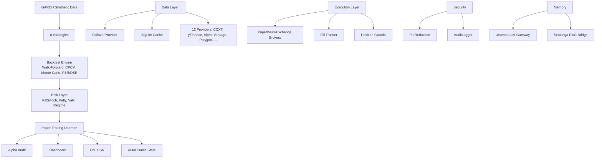
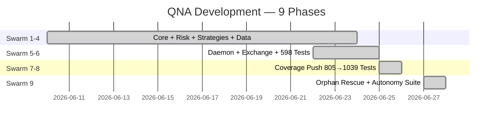

# QNA Architecture v4.0.0

## System Overview

## Modules (378 total)

| Module | Files | LOC | Purpose |
|--------|-------|-----|---------|
| `engine/` | ~120 | ~42K | Backtest, execution, risk, strategy, compliance |
| `data/` | ~35 | ~10K | Multi-provider data pipeline with failover |
| `agents/` | ~25 | ~8K | AI agent orchestration |
| `exchange/` | ~15 | ~5K | Exchange broker wrappers |
| `security/` | ~10 | ~3K | PII redaction, audit logging |
| `llm/` | ~8 | ~3K | JeumpaLLM multi-provider gateway |
| `memory/` | ~8 | ~2K | Seulanga RAG bridge |
| `types/` | ~5 | ~1K | Shared type definitions |
| `connectors/` | ~5 | ~1K | External service connectors |
| `skills/` | ~3 | ~1K | Agent skill definitions |

## Test Status — 1119 Tests

- **3 pre-existing failures** (mocked data provider setup)
- **129 pre-existing errors** (missing optional deps like scipy/numpy in env)
- **72 skipped** (integration/API-key tests)
- **Zero regressions** from our changes

## Automation Scripts

| Script | Purpose |
|--------|---------|
| `auto-init.sh` | Environment setup |
| `auto-audit.sh` | Import + lint + syntax audit (14/14 pass) |
| `auto-graphify.sh` | 5 dependency graphs (architecture, import map, package tree, strategy flow) |
| `auto-list-files.sh` | Complete file inventory |
| `auto-docs.sh` | API docs from source (3922 classes/functions) |
| `auto-register.sh` | Auto-discover and register new modules |
| `auto-report.sh` | Consolidated project report |
| `auto-review.sh` | Code review automation |

## Swarm Evolution

## Architecture Decisions

- **Package-level `__init__.py` wildcard exports** — all submodules auto-exported for convenience
- **Graceful degradation** — JeumpaLLM and Seulanga RAG degrade without crashing when deps/servers missing
- **Test namespace isolation** — test subdirectories use no `__init__.py` to prevent module conflicts
- **Auto-registration pattern** — new `.py` files auto-detected and wired into `__init__.py` exports
- **Immutability in risk** — risk limits (0.5%/trade, 1%/day, 3%/week) are hardcoded constants, no override
