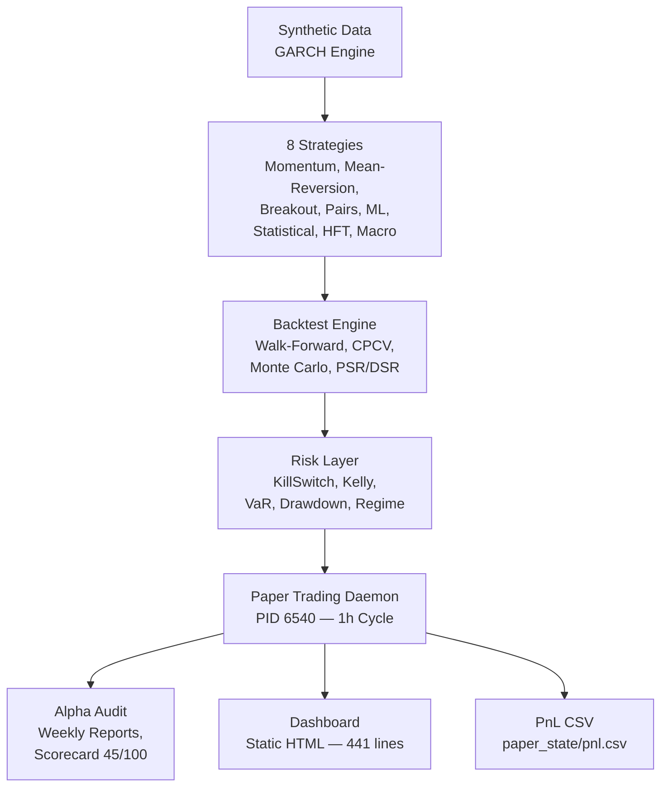
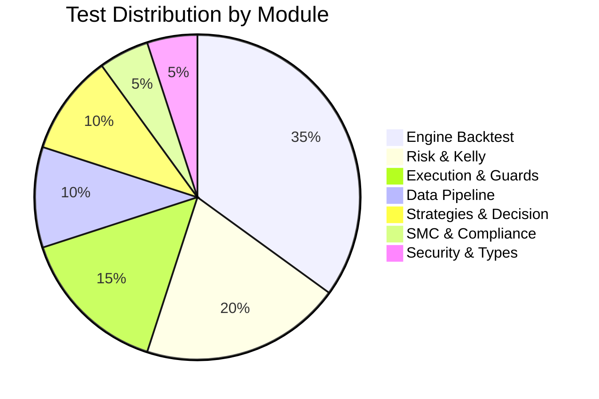
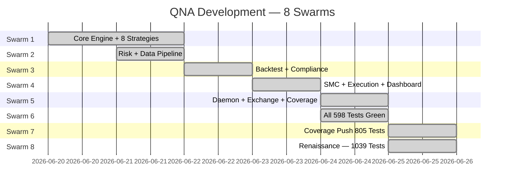
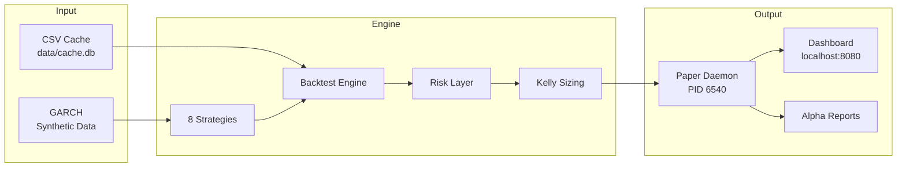

# QNA Architecture

## System Overview

## Test Coverage — 1039/1039 Pass (100%)

## Swarm Evolution — 39 Sub-Agents Across 8 Swarms

## Pipeline Flow

## Status

- **Tests:** 1039/1039 ALL PASS (100%)
- **Coverage:** ~60-62%
- **Daemon:** LIVE PID 6540, 10+ cycles
- **Scorecard:** 45/100 — needs real trading data
- **Exchange:** Prepped, waiting for API keys
- **Sub-agents:** 39 across 8 swarms
