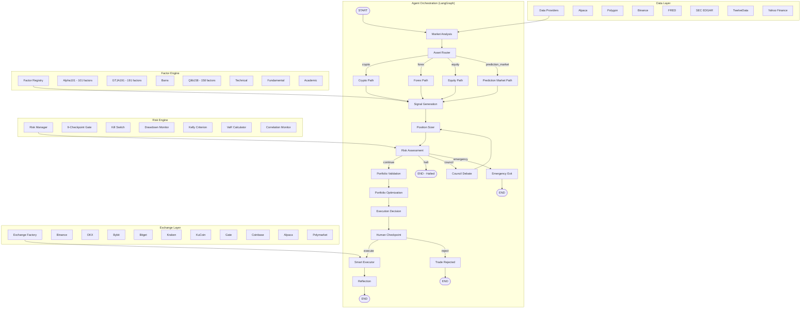
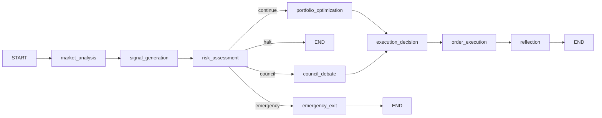
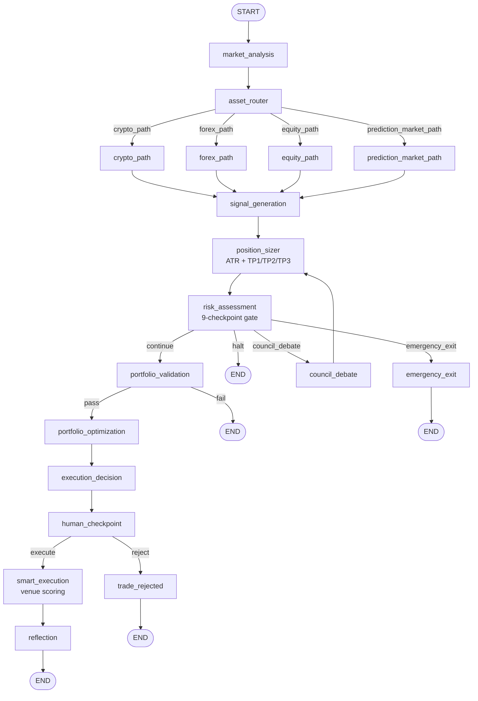
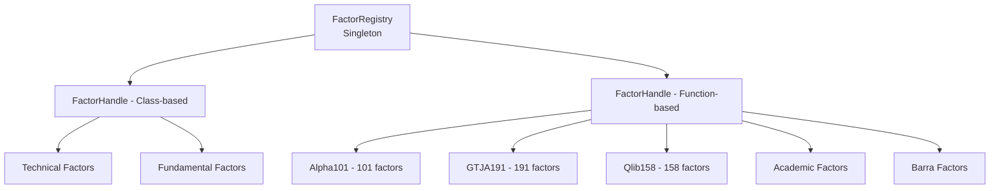
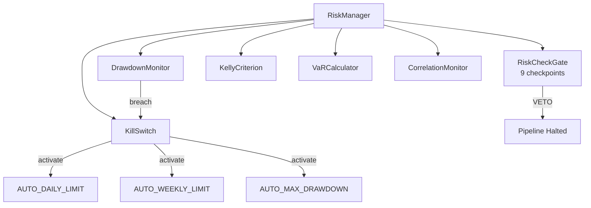
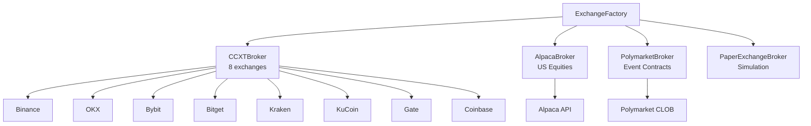
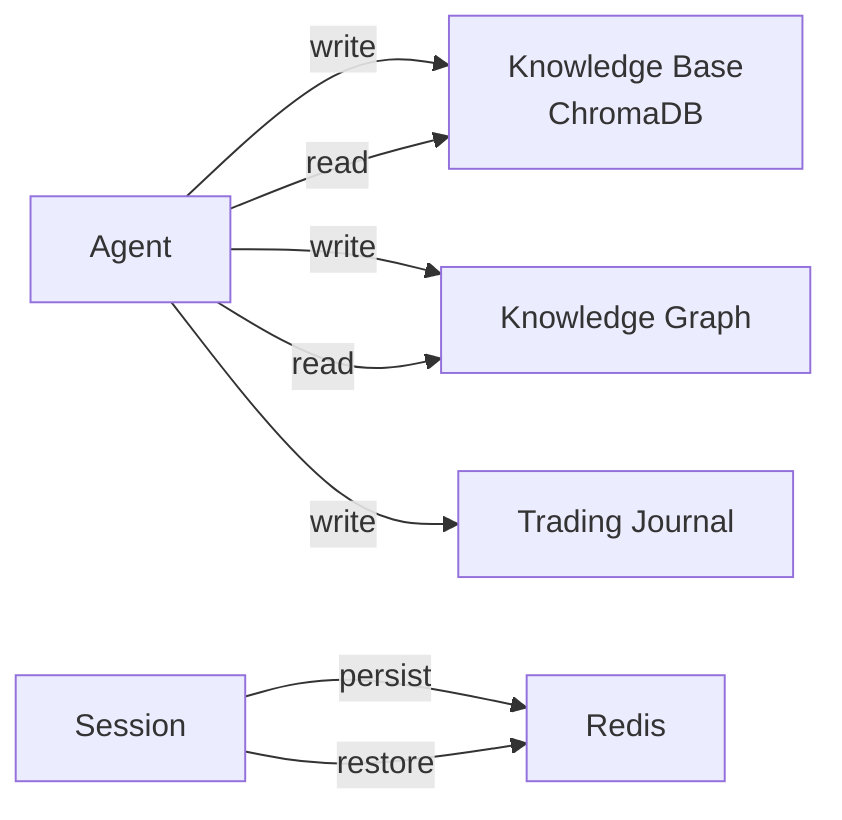

# Quant Nanggroe AI — Complete System Architecture

**Version 4.0.0 | Agentic Trading Intelligence OS**

> This document provides a comprehensive technical reference for the complete system architecture of Quant Nanggroe AI, covering the LangGraph-style graph orchestration, 11-agent council system, multi-path execution, factor engines, risk infrastructure, exchange layer, data providers, memory system, and API layer.

---

## Table of Contents

1. [System Overview](#1-system-overview)
2. [LangGraph Graph Architecture](#2-langgraph-graph-architecture)
3. [11-Agent Council System](#3-11-agent-council-system)
4. [Multi-Path Execution](#4-multi-path-execution)
5. [Factor Engine](#5-factor-engine)
6. [Risk Engine](#6-risk-engine)
7. [Exchange Layer](#7-exchange-layer)
8. [Data Providers](#8-data-providers)
9. [Memory System](#9-memory-system)
10. [API Layer](#10-api-layer)
11. [Security & Key Management](#11-security--key-management)
12. [Backtest Infrastructure](#12-backtest-infrastructure)
13. [Configuration System](#13-configuration-system)
14. [Deployment Architecture](#14-deployment-architecture)

---

## 1. System Overview

Quant Nanggroe AI is a production-grade **Agentic Trading Intelligence OS** built on a LangGraph-style graph architecture that orchestrates 11 specialized AI agents through a deterministic trading pipeline. The system merges the intellectual heritage of 20+ trading and quant repositories into a unified monorepo with constitutional risk limits that cannot be overridden.

### Key Statistics

| Metric | Value |
|---|---|
| Python Modules | 214+ |
| Test Suite | 2,504+ tests passing |
| Alpha Factors | 469 (across 7 zoos) |
| Exchange Integrations | 10 (8 CCXT + Alpaca + Polymarket) |
| Agent Roles | 11 (researcher, trader, strategist, risk, portfolio, execution, macro, crypto, forex, council, prediction_market) |
| Risk Checkpoints | 9 (constitutional, hardcoded) |
| Execution Paths | 4 (crypto, forex, equity, prediction_market) |
| Data Providers | 7+ (alpaca, polygon, binance, fred, sec_edgar, twelvedata, yahoo) |

### Architecture Diagram



---

## 2. LangGraph Graph Architecture

The core orchestration engine uses **LangGraph StateGraph** to define a deterministic trading pipeline with nodes, edges, and conditional routing. The graph is defined in `quant_nanggroe/agents/graph.py` (v1) and `quant_nanggroe/agents/graph_v2.py` (v2, current).

### v1 Graph (Simple Pipeline)

The original graph implements a linear 7-node pipeline:



### v2 Graph (Multi-Path Architecture)

The v2 graph introduces asset-class conditional routing, position sizing, portfolio validation, smart order routing, and human-in-the-loop checkpoints:



### Graph Nodes (v2)

| Node | Agent/Component | Purpose | LLM |
|---|---|---|---|
| `market_analysis` | Researcher + Macro | Gather market data, macro regime | Deep |
| `asset_router` | AssetRouter | Classify symbols → asset class | None |
| `crypto_path` | Crypto Agent | On-chain analysis, DEX monitoring | Deep |
| `forex_path` | Forex Agent | FX rates, carry trades, CB policy | Deep |
| `equity_path` | (uses researcher+macro) | Standard equity analysis | — |
| `prediction_market_path` | Prediction Market Agent | Event contracts, probability | Deep |
| `signal_generation` | Strategist | Combine analysis → trading signals | Deep |
| `position_sizer` | PositionSizer | ATR-based sizing with TP1/TP2/TP3 | None |
| `risk_assessment` | Risk Agent | 9-checkpoint constitutional gate | Deep |
| `council_debate` | CouncilDebate + Voting | Low-confidence fallback | Deep |
| `portfolio_validation` | PortfolioValidator | Concentration/correlation/Kelly | None |
| `portfolio_optimization` | Portfolio Agent | Asset allocation optimization | Deep |
| `execution_decision` | Trader Agent | Final buy/sell/hold decision | Quick |
| `human_checkpoint` | HumanCheckpoint | Human approval for high-risk | None |
| `smart_execution` | SmartExecutor | Venue scoring, order routing | None |
| `trade_rejected` | — | Record rejection, halt | None |
| `reflection` | CouncilDebate | Post-trade analysis | Deep |
| `emergency_exit` | — | Close all positions immediately | None |

### Conditional Edges

| Edge Source | Condition | Target | Logic |
|---|---|---|---|
| `asset_router` | `crypto_path` | crypto_path | Symbol matches crypto patterns |
| `asset_router` | `forex_path` | forex_path | Symbol matches forex patterns |
| `asset_router` | `equity_path` | equity_path | Default / stock symbols |
| `asset_router` | `prediction_market_path` | prediction_market_path | Event contract patterns |
| `risk_assessment` | `continue` | portfolio_validation | All 9 checkpoints pass, confidence ≥ 0.65 |
| `risk_assessment` | `halt` | END | Any checkpoint fails |
| `risk_assessment` | `council_debate` | council_debate | Confidence < 0.65 OR CRISIS regime with confidence < 0.85 |
| `risk_assessment` | `emergency_exit` | emergency_exit | Kill switch active or triggered |
| `portfolio_validation` | `pass` | portfolio_optimization | No blocking errors |
| `portfolio_validation` | `fail` | END | Blocking errors found |
| `human_checkpoint` | `execute` | smart_execution | Human approved or auto-approved |
| `human_checkpoint` | `reject` | trade_rejected | Human rejected |

---

## 3. 11-Agent Council System

The system employs 11 specialized agents, each with distinct roles, tools, and LLM configurations.

### Agent Roles

| Agent | Role Enum | Purpose | LLM Model | Key Tools |
|---|---|---|---|---|
| **Researcher** | `researcher` | Market data analysis, fundamental research | Deep (gpt-4o) | market_data, sentiment |
| **Macro** | `macro` | Macro regime detection, economic indicators | Deep (gpt-4o) | economic_data, fred |
| **Crypto** | `crypto` | On-chain analysis, DEX monitoring, Solana/Jupiter | Deep (gpt-4o) | solana_rpc, jupiter_swap, rugcheck |
| **Forex** | `forex` | Currency analysis, carry trades, CB policy | Deep (gpt-4o) | fx_rates, carry_trade_calc |
| **Strategist** | `strategist` | Signal generation from agent outputs | Deep (gpt-4o) | technical, backtest |
| **Risk** | `risk` | 9-checkpoint risk validation | Deep (gpt-4o) | risk_checks, var, kelly |
| **Portfolio** | `portfolio` | Asset allocation, risk budgeting | Deep (gpt-4o) | optimization, correlation |
| **Trader** | `trader` | Final execution decisions | Quick (gpt-4o-mini) | execution, order_types |
| **Execution** | `execution` | Smart order routing, venue scoring | Quick (gpt-4o-mini) | ccxt, exchange |
| **Council** | `council` | Debate and voting on low-confidence decisions | Deep (gpt-4o) | debate, voting |
| **Prediction Market** | `prediction_market` | Event contracts, probability estimation | Deep (gpt-4o) | polymarket_api |

### Agent Factory

All agents are created through `AgentFactory` (in `quant_nanggroe/agents/registry.py`), which manages:

- **LLM creation** via `create_llm()` with provider routing (OpenAI, Anthropic, Google)
- **Tool injection** based on agent role
- **Prompt configuration** from per-agent prompt modules
- **Deep vs Quick LLM selection** based on task complexity

```python
# Agent creation pattern
factory = AgentFactory(
    llm_provider="openai",
    deep_think_model="gpt-4o",
    quick_think_model="gpt-4o-mini",
    base_url=None,
    api_key=None,
)
researcher = factory.create_agent("researcher")
trader = factory.create_agent("trader")  # Uses quick_llm by default
strategist = factory.create_agent("strategist", use_deep_llm=True)
```

### Council Debate System

The council debate mechanism activates when agent confidence falls below the constitutional threshold (0.65). It consists of two components:

#### Debate (`quant_nanggroe/agents/council/debate.py`)

- **Bull/Bear Debate**: Classic adversarial debate between bullish and bearish arguments
- **Risk Debate**: Three-way debate between conservative, neutral, and aggressive risk perspectives
- **Configurable rounds**: Default 2 rounds, configurable up to N
- **Judge decision**: A final arbiter evaluates all arguments and renders a decision

#### Voting (`quant_nanggroe/agents/council/voting.py`)

- **Weighted voting**: Each council member's vote is weighted by historical accuracy
- **VoteResult**: Captures voter, vote, weight, reasoning, and confidence
- **CouncilResult**: Aggregates votes into a final decision with consensus level
- **Consensus threshold**: If consensus_level < threshold, requires human review

---

## 4. Multi-Path Execution

### Asset Class Detection

The `AssetRouter` (in `quant_nanggroe/agents/nodes/asset_router.py`) classifies trading symbols using regex pattern matching:

| Asset Class | Detection Patterns | Example Symbols |
|---|---|---|
| **CRYPTO** | `.*USDT$`, `.*BTC$`, known coin names | BTCUSDT, ETHUSDT, SOL, BONK |
| **FOREX** | 6-char pairs `^[A-Z]{3}[A-Z]{3}$`, metals | EURUSD, GBPJPY, XAUUSD |
| **EQUITY** | Default (negative matching) | AAPL, MSFT, SPY |
| **PREDICTION_MARKET** | `^POLY:`, `^PM_`, `.YES/.NO` suffixes | POLY:0x123..., TRUMP_WIN.YES |

### Routing Priority

For mixed symbol lists, the dominant class is determined by count with tie-breaking priority:
1. PREDICTION_MARKET (most specific)
2. CRYPTO
3. FOREX
4. EQUITY (default)

### Path-Specific Processing

#### Crypto Path
- **Solana integration**: Jupiter swap aggregator, RugCheck token safety, mempool monitoring
- **On-chain analytics**: Wallet tracking, DEX volume analysis
- **Exchange routing**: Binance, OKX, Bybit, Bitget, Kraken, KuCoin, Gate

#### Forex Path
- **Central bank policy tracking**: Fed, ECB, BOJ, BOE rate decisions
- **Carry trade calculator**: Interest rate differentials
- **Cross-currency dynamics**: Correlation-adjusted position sizing
- **Exchange routing**: Alpaca (forex), OANDA-compatible feeds

#### Equity Path
- **SEC EDGAR filings**: 10-K, 10-Q, 8-K analysis
- **Earnings calendar**: Upcoming earnings dates and estimates
- **Insider trades**: Form 4 filings, insider buying/selling
- **Exchange routing**: Alpaca (US equities)

#### Prediction Market Path
- **Polymarket integration**: CLOB API, condition token trading
- **Probability estimation**: Bayesian probability models
- **Event contract pricing**: Binary outcome token valuation
- **Mandatory human approval**: All prediction market trades require human checkpoint

---

## 5. Factor Engine

The factor engine provides 469+ alpha factors across 7 zoos, managed by a centralized `FactorRegistry`.

### Factor Registry Architecture



### Factor Zoos

| Zoo | Source | Factor Count | Pattern | Theme Examples |
|---|---|---|---|---|
| **Alpha101** | 101 Formulaic Alphas (WorldQuant) | 101 | Function-based | Momentum, reversal, volume |
| **GTJA191** | Guotai Junan 191 Alphas | 191 | Function-based | Chinese A-share specific |
| **Barra** | MSCI Barra Risk Model | 10+ | Function-based | Risk factors, style factors |
| **Qlib158** | Microsoft Qlib 158 Alphas | 158 | Function-based | Cross-sectional, time-series |
| **Technical** | Built-in | 20+ | Class-based | RSI, MACD, Bollinger, ATR |
| **Fundamental** | Built-in | 10+ | Class-based | P/E, P/B, ROE, D/E |
| **Academic** | Literature-derived | Variable | Function-based | Published research alphas |

### Factor Registration Pattern

**Class-based factors** (Technical, Fundamental):
```python
class MyFactor(AlphaFactor):
    name = "my_factor"
    meta = FactorMeta(id="my_factor", zoo="technical", ...)
    def compute(self, df: pd.DataFrame) -> pd.DataFrame: ...
```

**Function-based factors** (Alpha101, GTJA191, etc.):
```python
__alpha_meta_my_factor = {
    "id": "my_factor",
    "zoo": "alpha101",
    "theme": ["momentum"],
    "columns_required": ["close", "volume"],
    ...
}

def compute_my_factor(panel: dict) -> pd.DataFrame: ...
```

### Factor Discovery API

```python
registry = get_default_registry()

# List all factors
all_factors = registry.list()  # 469+

# Filter by zoo
alpha101_factors = registry.list(zoo="alpha101")  # 101

# Filter by theme
momentum_factors = registry.list(theme="momentum")

# Compute a factor
result = registry.compute("alpha_001", panel)

# Health check
health = registry.health()
# {"loaded": 469, "failed": 0, "by_zoo": {"alpha101": 101, ...}}
```

### Output Validation

Every factor computation goes through strict output validation:
- Must return `pd.DataFrame` (not Series, not scalar)
- No `±inf` values allowed
- NaN ratio must be ≤ 95% (otherwise factor is considered broken)
- Lookahead bias validation on class-based factors

---

## 6. Risk Engine

The risk engine is the **constitutional backbone** of the system. All limits are hardcoded and cannot be overridden by any agent, configuration, or runtime modification.

### Constitutional Risk Limits (HARDCODED)

These values are defined in `quant_nanggroe/engine/risk/constants.py` and `quant_nanggroe/agents/state.py`:

| Constant | Value | Description |
|---|---|---|
| `MAX_RISK_PER_TRADE` | 0.005 (0.5%) | Maximum risk per individual trade |
| `MAX_DAILY_LOSS` | 0.01 (1%) | Maximum daily loss before halt |
| `MAX_WEEKLY_LOSS` | 0.03 (3%) | Maximum weekly loss before halt |
| `MIN_RISK_REWARD` | 2.0 | Minimum 1:2 risk:reward ratio |
| `MAX_CORRELATED_POSITIONS` | 3 | Maximum correlated positions |
| `MAX_POSITION_SIZE_PCT` | 0.10 (10%) | Maximum single position as % of portfolio |
| `MAX_LEVERAGE` | 3.0 | Maximum leverage allowed |
| `MAX_DRAWDOWN_PCT` | 0.15 (15%) | Maximum drawdown before kill switch |
| `MAX_DAILY_TRADES` | 5 | Maximum trades per day (anti-overtrading) |
| `CONFIDENCE_THRESHOLD` | 0.65 | Below this → council debate |
| `KILL_SWITCH_DAILY_PNL` | -0.02 (-2%) | Kill switch daily PnL trigger |
| `KILL_SWITCH_WEEKLY_PNL` | -0.05 (-5%) | Kill switch weekly PnL trigger |

### 9-Checkpoint Risk Gate

Every trade must pass through all 9 checkpoints (in `quant_nanggroe/engine/risk/checks.py`):

| # | Checkpoint | Limit | Failure Action |
|---|---|---|---|
| 1 | Risk per trade | ≤ 0.5% | VETO |
| 2 | Daily loss | ≤ 1% | VETO + kill switch check |
| 3 | Weekly loss | ≤ 3% | VETO + kill switch check |
| 4 | Risk:Reward ratio | ≥ 1:2 | VETO |
| 5 | Stop loss exists | Required | VETO |
| 6 | Valid entry price | > 0 | VETO |
| 7 | Valid direction | BUY/SELL/LONG/SHORT | VETO |
| 8 | Not overtrading | < 5 trades/day | VETO |
| 9 | Correlated positions | < 3 correlated | VETO |

**If ANY checkpoint fails, the trade is VETOED. No override is possible.**

### Risk Subsystems



#### Kill Switch (`engine/risk/kill_switch.py`)

Automatic activation triggers:
- Daily PnL ≤ -2%
- Weekly PnL ≤ -5%
- Drawdown ≥ 15%

When activated:
- All positions closed immediately
- System enters cooldown
- Manual reset required after review
- Emergency exit node triggered in graph

#### Drawdown Monitor (`engine/risk/drawdown.py`)

- Tracks peak equity and current equity
- Calculates real-time drawdown percentage
- Triggers kill switch when drawdown ≥ 15%

#### Kelly Criterion (`engine/risk/kelly.py`)

Three methods available:
- **FULL_KELLY**: Optimal Kelly fraction (aggressive)
- **HALF_KELLY**: 50% of optimal (recommended)
- **QUARTER_KELLY**: 25% of optimal (conservative)

All methods are capped at the constitutional `MAX_RISK_PER_TRADE` (0.5%).

#### VaR Calculator (`engine/risk/var.py`)

- Parametric VaR (95% and 99% confidence)
- Historical VaR simulation
- CVaR (Expected Shortfall) calculation
- Used for position sizing and portfolio validation

#### Correlation Monitor (`engine/risk/correlation.py`)

- Rolling pairwise correlation between positions
- Blocks new entries when correlation exceeds threshold
- Maximum 3 correlated positions allowed

### Stress Testing

The `RiskManager.stress_test()` method applies historical-like scenarios:

| Scenario | Return Change | Vol Change | Description |
|---|---|---|---|
| 2008_Crisis | -40% | 2.0x | Global Financial Crisis |
| COVID_Crash | -30% | 1.5x | COVID-19 market crash |
| Rate_Hike | -15% | 1.2x | Aggressive rate hiking |
| Tech_Crash | -25% | 1.5x | Tech sector correction |
| Recovery | +20% | 0.8x | Post-crisis recovery |
| Bull_Market | +30% | 0.9x | Sustained bull market |

### Position Sizing Models

| Model | Description | Parameters |
|---|---|---|
| **Fixed-Fractional ATR** | Risk % of account per trade, ATR-based SL | fractional_risk_pct=0.005, atr_sl_multiplier=1.5 |
| **Kelly Criterion** | Based on win rate and payoff ratio | method=HALF_KELLY, capped at 0.5% |
| **Volatility Targeting** | Scale to target annual volatility | target_volatility=0.10 |
| **VaR-Based** | Scale to VaR limit | max_var_pct=0.02, confidence=0.95 |

### ATR Position Sizing with TP1/TP2/TP3

The v2 position sizer computes three take-profit levels based on ATR:

| Level | Calculation | Risk:Reward |
|---|---|---|
| **Stop Loss** | Entry - 1.5 × ATR | — |
| **TP1** | Entry + 1.0 × ATR | 1:0.67 |
| **TP2** | Entry + 2.0 × ATR | 1:1.33 |
| **TP3** | Entry + 3.0 × ATR | 1:2.00 |

Multipliers are configurable at graph initialization.

---

## 7. Exchange Layer

The exchange layer provides a unified interface to 10 exchanges via the `ExchangeFactory` pattern.

### Architecture



### Exchange Capabilities

| Exchange | Spot | Futures | Perps | Margin | WebSocket | Max Leverage | Passphrase |
|---|---|---|---|---|---|---|---|
| **Binance** | ✅ | ✅ | ✅ | ✅ | ✅ | 125x | No |
| **OKX** | ✅ | ✅ | ✅ | ✅ | ✅ | 125x | Yes |
| **Bybit** | ✅ | ✅ | ✅ | ✅ | ✅ | 100x | No |
| **Bitget** | ✅ | ✅ | ✅ | ✅ | ✅ | 125x | Yes |
| **Kraken** | ✅ | ✅ | ❌ | ✅ | ✅ | 50x | No |
| **KuCoin** | ✅ | ✅ | ✅ | ✅ | ✅ | 100x | Yes |
| **Gate** | ✅ | ✅ | ✅ | ✅ | ✅ | 100x | No |
| **Coinbase** | ✅ | ✅ | ❌ | ❌ | ✅ | 3x | Yes |
| **Alpaca** | ✅ | ❌ | ❌ | ✅ | ✅ | 4x | No |
| **Polymarket** | ❌ | ❌ | ❌ | ❌ | ✅ | 1x | No |

### Exchange Configuration

```python
factory = ExchangeFactory()

# Create a Binance spot exchange
broker = factory.create("binance", api_key="...", api_secret="...", market_type="spot")

# Create an OKX futures exchange
broker = factory.create("okx", api_key="...", api_secret="...", passphrase="...", market_type="futures")

# Create a paper trading broker
broker = factory.create("paper", initial_capital=100_000)

# Create an Alpaca broker (defaults to paper trading)
broker = factory.create("alpaca", api_key="...", api_secret="...")

# Create a Polymarket broker
broker = factory.create("polymarket", api_key="eth_private_key", api_secret="clob_key")
```

### Solana Integration

Specialized Solana tools in `quant_nanggroe/exchange/solana/`:
- **Jupiter**: DEX swap aggregator for Solana tokens
- **RugCheck**: Token safety analysis (honeypot detection)
- **Mempool**: Transaction monitoring for MEV protection
- **Wallet**: Solana wallet management and signing
- **Broker**: Solana-specific order execution

---

## 8. Data Providers

### Provider Matrix

| Provider | Asset Classes | Data Types | Access Method |
|---|---|---|---|
| **Alpaca** | US Equities, Forex | OHLCV, fundamentals, news | alpaca-py SDK |
| **Polygon** | US Equities, Options | Tick-level, aggregates | polygon-api-client |
| **Binance** | Crypto | L1/L2, order book, trades | ccxt |
| **FRED** | Macro | Economic indicators, rates | API |
| **SEC EDGAR** | US Equities | 10-K, 10-Q, 8-K filings | HTTP scraping |
| **TwelveData** | Multi-asset | OHLCV, fundamentals, forex | twelvedata SDK |
| **Yahoo Finance** | Multi-asset | OHLCV, fundamentals | yfinance |

### AutoSwitch Engine

The `AutoSwitch` service (`quant_nanggroe/engine/autoswitch.py`) provides:
- **Exponential backoff retry**: 1s → 2s → 4s → 8s → max
- **Health-based prioritization**: Rank providers by success rate and latency
- **Cooldown mechanisms**: Failed providers enter cooldown
- **Real-time health reporting**: Continuous monitoring

---

## 9. Memory System

The memory system (`quant_nanggroe/memory/`) provides persistent storage for agent knowledge, session state, and trading journals.

### Components

| Module | Purpose | Backend |
|---|---|---|
| `knowledge.py` | Knowledge base for agent learning | ChromaDB (vector) |
| `knowledge_graph.py` | Entity-relationship graph for market knowledge | In-memory |
| `session.py` | Per-session state management | Redis / in-memory |
| `paging.py` | Memory paging for large contexts | LRU cache |
| `journal.py` | Trading journal and decision log | SQLAlchemy / file |

### Memory Flow



---

## 10. API Layer

The API layer is built on **FastAPI** with async support, CORS, and WebSocket streaming.

### Architecture (`quant_nanggroe/api/app.py`)

```python
app = FastAPI(
    title="Quant Nanggroe AI",
    description="Agentic Trading Intelligence OS",
    version="1.0.0",
)
```

### API Routes

| Route | Prefix | Purpose |
|---|---|---|
| Market | `/api/market` | Market data, prices, indicators |
| Trading | `/api/trading` | Trade execution, orders, positions |
| Agents | `/api/agents` | Agent status, control, outputs |
| Backtest | `/api/backtest` | Backtest runs, results, benchmarks |
| Portfolio | `/api/portfolio` | Portfolio state, allocation, PnL |
| WebSocket | `/api/ws` | Real-time streaming updates |

### Health Check

```
GET /health → {"status": "healthy", "service": "quant-nanggroe-ai"}
```

### Middleware Stack

- **CORS**: Allow all origins (configurable for production)
- **Global Exception Handler**: Catches unhandled exceptions, returns 500 with error type
- **Request Logging**: Structured logging via structlog

### Service Initialization

The `lifespan` event handler initializes all services at startup:
- Engine singletons (FactorRegistry, RiskManager)
- Exchange connections
- Database connections (SQLAlchemy)
- Redis cache
- WebSocket manager

---

## 11. Security & Key Management

### Security Modules (`quant_nanggroe/security/`)

| Module | Purpose |
|---|---|
| `auth.py` | Authentication and authorization |
| `keyvault.py` | Secure key storage and retrieval |
| `audit.py` | Security audit logging |
| `credential_inference.py` | Detect and prevent credential leaks |

### Key Principles

1. **No hardcoded secrets**: All API keys loaded from environment variables or KeyVault
2. **Credential inference prevention**: Scans for accidentally committed secrets
3. **Audit trail**: All security events logged with timestamps and context
4. **Kill switch**: Independent of any security mechanism, operates at risk layer

---

## 12. Backtest Infrastructure

### Components (`quant_nanggroe/engine/backtest/`)

| Component | Purpose |
|---|---|
| `engine.py` | Core backtesting engine |
| `monte_carlo.py` | Monte Carlo simulation |
| `walk_forward.py` | Walk-forward optimization |
| `metrics.py` | Performance metrics (Sharpe, Sortino, etc.) |
| `report.py` | Report generation |
| `execution.py` | Execution simulation with slippage/fills |
| `portfolio.py` | Portfolio tracking during backtest |
| `benchmarks.py` | Benchmark comparison |

### Multi-Asset Backtest Engines

| Engine | Asset Class |
|---|---|
| `equity_engine.py` | US/International equities |
| `crypto_engine.py` | Cryptocurrency |
| `forex_engine.py` | Foreign exchange |
| `futures_engine.py` | Futures contracts |
| `composite_engine.py` | Multi-asset portfolios |
| `market_detection.py` | Regime detection for backtests |

### Data Loaders

| Loader | Source |
|---|---|
| `yfinance_loader.py` | Yahoo Finance |
| `ccxt_loader.py` | CCXT-compatible exchanges |
| `base_loader.py` | Abstract base for custom loaders |

### Portfolio Optimizers

| Optimizer | Strategy |
|---|---|
| `mean_variance_optimizer.py` | Markowitz mean-variance |
| `risk_parity_optimizer.py` | Risk parity / equal risk contribution |
| `equal_volatility_optimizer.py` | Equal volatility weighting |

---

## 13. Configuration System

### Settings (`quant_nanggroe/config/settings.py`)

Uses **Pydantic Settings** for type-safe configuration:

```python
from quant_nanggroe.config import get_settings

settings = get_settings()
# settings.app_name
# settings.database_url
# settings.redis_url
# etc.
```

### Configuration Sources (Priority Order)

1. Environment variables
2. `.env` file
3. Default values in Settings class

### Key Configuration Files

| File | Purpose |
|---|---|
| `config/settings.py` | Application settings |
| `config/logging_config.py` | Structured logging setup |
| `pyproject.toml` | Project metadata, dependencies, tools |

---

## 14. Deployment Architecture

### Process Model

```
┌──────────────────────────────────────────────┐
│  API Server (uvicorn)                         │
│  ├── FastAPI Application                       │
│  ├── WebSocket Manager                         │
│  └── Service Initialization                    │
├──────────────────────────────────────────────┤
│  Worker (quant_nanggroe/worker.py)             │
│  ├── Trading Graph Execution                   │
│  ├── Agent Orchestration                       │
│  └── Risk Management                           │
├──────────────────────────────────────────────┤
│  CLI (quant_nanggroe/cli.py)                   │
│  └── Click-based command interface             │
└──────────────────────────────────────────────┘
```

### External Dependencies

| Service | Purpose | Optional |
|---|---|---|
| PostgreSQL | Primary database | Yes (SQLite fallback) |
| Redis | Caching, sessions, pub/sub | Yes (in-memory fallback) |
| ChromaDB | Vector storage for memory | Yes |

### Monitoring & Observability

- **Structured logging**: Via structlog with JSON output
- **Health endpoints**: `/health` for load balancers
- **WebSocket streaming**: Real-time agent state updates
- **Audit trail**: Complete decision traceability

---

## Appendix A: Package Structure

```
quant_nanggroe/
├── agents/           # 11-agent system
│   ├── base.py       # LLM creation, base agent
│   ├── graph.py      # v1 trading graph
│   ├── graph_v2.py   # v2 multi-path graph
│   ├── state.py      # AgentState TypedDict
│   ├── registry.py   # AgentFactory
│   ├── council/      # Debate & voting
│   ├── nodes/        # v2 graph nodes
│   ├── researcher/   # Researcher agent
│   ├── trader/       # Trader agent
│   ├── strategist/   # Strategist agent
│   ├── risk/         # Risk agent
│   ├── portfolio/    # Portfolio agent
│   ├── execution/    # Execution agent
│   ├── macro/        # Macro agent
│   ├── crypto/       # Crypto agent
│   └── forex/        # Forex agent
├── engine/           # Core engines
│   ├── factors/      # 469+ alpha factors
│   ├── risk/         # Risk management
│   ├── backtest/     # Backtesting infrastructure
│   ├── execution/    # Execution management
│   ├── models/       # ML models & ensemble
│   ├── strategy/     # Strategy lifecycle
│   ├── autoswitch.py # Data provider failover
│   ├── decision.py   # Decision synthesis
│   ├── market_state.py # Regime detection
│   └── pressure.py   # Pressure normalization
├── exchange/         # 10 exchange integrations
│   ├── factory.py    # ExchangeFactory
│   ├── ccxt_broker.py # CCXT-backed exchanges
│   ├── alpaca_broker.py # Alpaca integration
│   ├── polymarket_broker.py # Polymarket integration
│   ├── paper_broker.py # Paper trading
│   └── solana/       # Solana/Jupiter tools
├── memory/           # Memory system
├── api/              # FastAPI application
├── security/         # Auth, key vault, audit
├── config/           # Settings & logging
├── mcp/              # Model Context Protocol
├── types/            # Shared type definitions
├── utils/            # Utilities
├── services.py       # Service initialization
├── cli.py            # CLI entry point
└── worker.py         # Background worker
```

---

## Appendix B: Constitutional Limits Quick Reference

```python
# These values are IMMUTABLE — no override possible
MAX_RISK_PER_TRADE      = 0.005   # 0.5%
MAX_DAILY_LOSS          = 0.01    # 1%
MAX_WEEKLY_LOSS         = 0.03    # 3%
MIN_RISK_REWARD         = 2.0     # 1:2
MAX_CORRELATED_POSITIONS = 3
MAX_POSITION_SIZE_PCT   = 0.10    # 10%
MAX_LEVERAGE            = 3.0
MAX_DRAWDOWN_PCT        = 0.15    # 15%
MAX_DAILY_TRADES        = 5
CONFIDENCE_THRESHOLD    = 0.65
KILL_SWITCH_DAILY_PNL   = -0.02   # -2%
KILL_SWITCH_WEEKLY_PNL  = -0.05   # -5%
```

---

© 2025-2026 Quant Nanggroe AI | Architecture Reference v4.0.0
