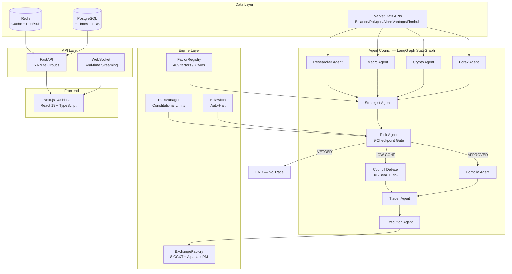
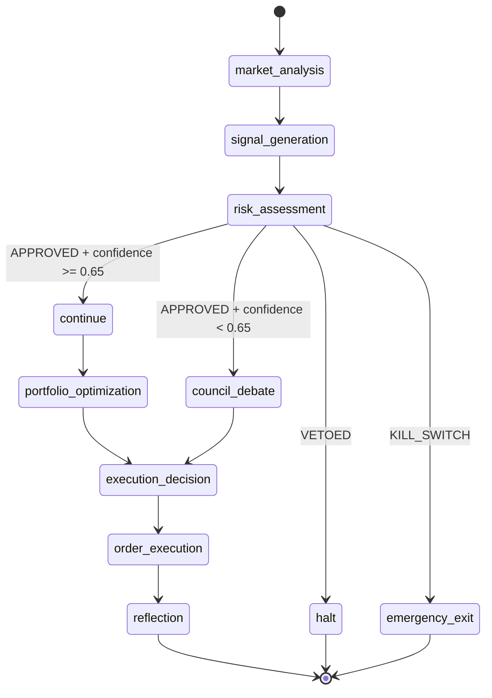
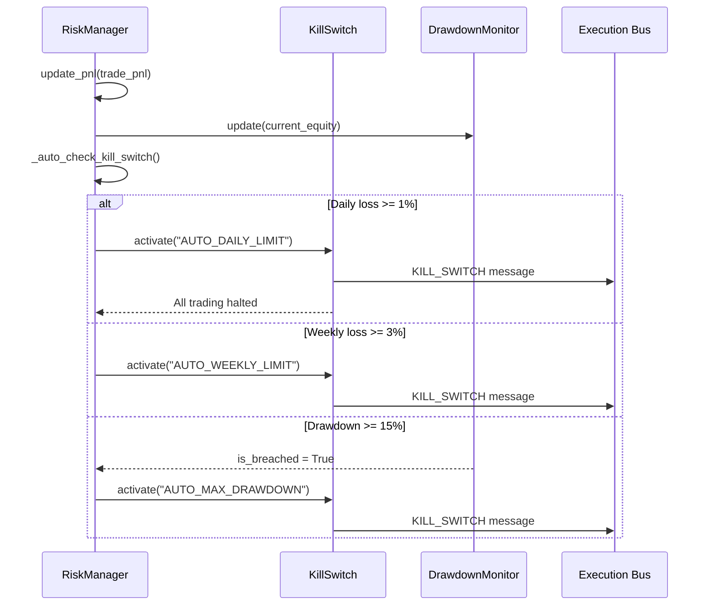
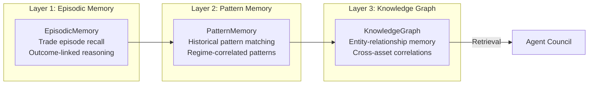

# Quant Nanggroe AI — System Architecture

**Version 4.0.0 | Agentic Trading Intelligence OS**

> Complete system architecture reference for the Quant Nanggroe AI platform — a LangGraph-based multi-agent trading intelligence operating system that merges 20+ trading/quant repositories into a unified, production-grade framework.

---

## Table of Contents

1. [Executive Overview](#1-executive-overview)
2. [High-Level Architecture](#2-high-level-architecture)
3. [Agent Council](#3-agent-council)
4. [Factor Engine](#4-factor-engine)
5. [Risk Engine](#5-risk-engine)
6. [Exchange Layer](#6-exchange-layer)
7. [Memory System](#7-memory-system)
8. [API Layer](#8-api-layer)
9. [Frontend Architecture](#9-frontend-architecture)
10. [Data Flow](#10-data-flow)
11. [Deployment Topology](#11-deployment-topology)

---

## 1. Executive Overview

Quant Nanggroe AI is an **Agentic Trading Intelligence OS** — a graph-orchestrated multi-agent system that combines LLM-driven analysis with deterministic risk enforcement to produce actionable, risk-bounded trading decisions across crypto, equity, forex, and prediction markets.

### Core Design Principles

| Principle | Implementation |
|-----------|---------------|
| **Deterministic Reasoning** | LLMs are constrained by Pydantic schemas; agents output structured data, not free-form text |
| **Constitutional Risk** | Hardcoded limits that no agent, config, or environment variable can override |
| **Graph-Based Orchestration** | LangGraph `StateGraph` with conditional edges for risk gates and council debates |
| **Pressure Normalization** | Agent outputs compressed into scalar pressure values (0.0–1.0) before decision synthesis |
| **Kill Switch First** | Automatic system halt on daily/weekly loss limit breach — no manual intervention required |

### Key Metrics

| Metric | Value |
|--------|-------|
| Agent Council Size | 11 specialized agents |
| Factor Models | 469 across 7 zoos (Alpha101, GTJA191, Barra, Qlib158, Technical, Fundamental, Academic) |
| Backtest Engines | 10 implementations (Equity, Crypto, Forex, Futures, Composite + adapters) |
| Exchange Support | 8 CCXT exchanges + Alpaca + Polymarket + Solana/Jupiter |
| Risk Checkpoints | 9-checkpoint constitutional gate |
| Constitutional Limits | 12 hardcoded constants |
| API Route Groups | 6 (Market, Trading, Agents, Backtest, Portfolio, WebSocket) |

---

## 2. High-Level Architecture



### Component Dependency Graph

```
quant_nanggroe/
├── agents/                    # Agent council + LangGraph orchestration
│   ├── graph.py               # TradingGraph — main LangGraph StateGraph
│   ├── state.py               # AgentState TypedDict + all Pydantic models
│   ├── base.py                # BaseAgent ABC + create_llm() multi-provider factory
│   ├── registry.py            # AgentRegistry + AgentFactory
│   ├── council/               # Council debate + voting mechanisms
│   │   ├── debate.py          # CouncilDebate — bull/bear + risk debate
│   │   └── voting.py          # CouncilVoting — weighted voting
│   ├── researcher/            # Researcher agent + tools
│   ├── macro/                 # Macro agent + tools
│   ├── crypto/                # Crypto agent + tools
│   ├── forex/                 # Forex agent + tools
│   ├── strategist/            # Strategist agent + signal generation tools
│   ├── risk/                  # Risk agent + constitutional gate tools
│   ├── portfolio/             # Portfolio agent + optimization tools
│   ├── trader/                # Trader agent + decision tools
│   ├── execution/             # Execution agent + order routing tools
│   └── tools/                 # Shared agent tools
│       ├── market_data.py     # MarketDataTool
│       ├── sentiment.py       # SentimentTool
│       ├── technical.py       # TechnicalAnalysisTool
│       ├── execution.py       # ExecutionTool
│       ├── backtest.py        # BacktestTool
│       ├── screener_tool.py   # ScreenerTool
│       ├── flow_tool.py       # FlowAgent — whale/COT tracking
│       ├── forecast_tool.py   # ForecastTool
│       ├── intermarket_tool.py# InterMarketTool
│       ├── geopolitical_tool.py# GeopoliticalTool
│       ├── emotional_tool.py  # EmotionalTool
│       ├── skill_tool.py      # SkillTool
│       └── competition_tool.py# CompetitionTool
├── engine/
│   ├── factors/               # Factor engine — 469 factor models
│   │   ├── base.py            # AlphaFactor ABC + FactorMeta
│   │   ├── registry.py        # FactorRegistry + FactorHandle
│   │   ├── alpha101.py        # WorldQuant Alpha101 factors
│   │   ├── gtja191.py         # GuoTaiJunAn 191 factors
│   │   ├── qlib158.py         # Qlib 158 factors
│   │   ├── barra.py           # Barra risk model factors
│   │   ├── technical.py       # Technical indicator factors
│   │   ├── fundamental.py     # Fundamental analysis factors
│   │   └── academic.py        # Academic research factors
│   └── risk/                  # Risk engine — constitutional limits
│       ├── constants.py       # Constitutional limits (SINGLE SOURCE OF TRUTH)
│       ├── manager.py         # RiskManager — top-level orchestrator
│       ├── checks.py          # RiskCheckGate — 9-checkpoint validation
│       ├── kill_switch.py     # KillSwitch — auto-halt mechanism
│       ├── drawdown.py        # DrawdownMonitor — max drawdown tracking
│       ├── kelly.py           # KellyCriterion — position sizing
│       ├── var.py             # VaRCalculator — parametric + historical + Monte Carlo
│       ├── cvar.py            # CVaR — conditional value at risk
│       ├── correlation.py     # CorrelationMonitor — pairwise correlation checks
│       └── portfolio_risk.py  # PortfolioRisk — portfolio-level risk metrics
├── exchange/                  # Exchange layer — 8 CCXT + Alpaca + PM + Solana
│   ├── base.py                # ExchangeInterface ABC + ExchangeConfig
│   ├── factory.py             # ExchangeFactory + ExchangeCapabilities
│   ├── ccxt_broker.py         # CCXTBroker — unified CCXT adapter
│   ├── paper_broker.py        # PaperExchangeBroker — paper trading
│   ├── alpaca_broker.py       # AlpacaBroker — US equity execution
│   ├── polymarket_broker.py   # PolymarketBroker — prediction markets
│   └── jupiter_broker.py      # JupiterBroker — Solana DEX execution
├── api/                       # FastAPI backend
│   ├── app.py                 # FastAPI application + lifespan
│   ├── routes/                # 6 route groups
│   │   ├── market.py          # /api/market
│   │   ├── trading.py         # /api/trading
│   │   ├── agents.py          # /api/agents
│   │   ├── backtest.py        # /api/backtest
│   │   ├── portfolio.py       # /api/portfolio
│   │   └── ws.py              # /api/ws — WebSocket
│   └── middleware.py          # Auth, CORS, rate limiting
├── memory/                    # Three-layer memory system
│   ├── vector.py              # VectorMemory — TF-IDF semantic search
│   ├── episodic.py            # EpisodicMemory — trade episode recall
│   ├── pattern.py             # PatternMemory — historical pattern matching
│   └── knowledge_graph.py     # KnowledgeGraph — entity-relationship memory
├── services/                  # Service initialization
├── config.py                  # Pydantic Settings hierarchy
└── exceptions.py              # Unified exception types
```

---

## 3. Agent Council

### 3.1 Agent Roster

The 11-agent council is orchestrated by `TradingGraph` (in `agents/graph.py`), a LangGraph `StateGraph` with 9 nodes and conditional edges for risk gates, council debates, and emergency exits.

| Agent | Role Enum | LLM Tier | Tools | Output State Key |
|-------|-----------|----------|-------|------------------|
| **Researcher** | `AgentRole.RESEARCHER` | Quick (`gpt-4o-mini`) | MarketDataTool, SentimentTool, ScreenerTool | `research_output` |
| **Macro** | `AgentRole.MACRO` | Quick | GeopoliticalTool, InterMarketTool, ForecastTool | `macro_output` |
| **Crypto** | `AgentRole.CRYPTO` | Quick | MarketDataTool, FlowTool, TechnicalTool | `crypto_output` |
| **Forex** | `AgentRole.FOREX` | Quick | MarketDataTool, InterMarketTool, ForecastTool | `forex_output` |
| **Strategist** | `AgentRole.STRATEGIST` | **Deep** (`gpt-4o`) | TechnicalTool, FactorRegistry, EmotionalTool | `signals`, `strategist_output` |
| **Risk** | `AgentRole.RISK` | **Deep** | RiskCheckGate, VaRCalculator, DrawdownMonitor | `risk_assessment`, `risk_verdict` |
| **Portfolio** | `AgentRole.PORTFOLIO` | Quick | PortfolioOptimizer, KellyCriterion | `portfolio_output` |
| **Trader** | `AgentRole.TRADER` | Quick | ExecutionTool, CompetitionTool | `decisions`, `trader_output` |
| **Execution** | `AgentRole.EXECUTION` | Quick | ExchangeFactory, SmartOrderRouter | `execution_output`, `orders_placed` |
| **Council** | `AgentRole.COUNCIL` | **Deep** | CouncilDebate, CouncilVoting | `council_result`, `debate_state` |

### 3.2 Graph Flow — LangGraph StateGraph



### 3.3 Agent State Schema

The shared state is defined in `agents/state.py` as `AgentState(TypedDict)`:

```python
class AgentState(TypedDict):
    # Core identification
    symbols: Annotated[List[str], "List of trading symbols to analyze"]
    trade_date: Annotated[str, "Current trading date (YYYY-MM-DD)"]
    
    # Market data
    market_data: Annotated[Dict[str, Any], "Market data by symbol"]
    
    # Agent outputs from analysis phase
    research_output: Annotated[str, "Research agent output"]
    macro_output: Annotated[str, "Macro agent output"]
    crypto_output: Annotated[str, "Crypto agent output"]
    forex_output: Annotated[str, "Forex agent output"]
    
    # Signal generation
    signals: Annotated[List[Dict[str, Any]], "Generated trading signals"]
    strategist_output: Annotated[str, "Strategist agent output"]
    
    # Risk assessment
    risk_assessment: Annotated[Dict[str, Any], "Risk assessment results"]
    risk_verdict: Annotated[str, "Risk verdict: APPROVED/VETOED/KILL_SWITCH"]
    
    # Portfolio + Trading
    portfolio_state: Annotated[Dict[str, Any], "Current portfolio state"]
    portfolio_output: Annotated[str, "Portfolio agent output"]
    decisions: Annotated[List[Dict[str, Any]], "Final trading decisions"]
    trader_output: Annotated[str, "Trader agent output"]
    
    # Execution
    execution_output: Annotated[str, "Execution agent output"]
    orders_placed: Annotated[List[Dict[str, Any]], "Orders placed"]
    
    # Council / Debate
    debate_state: Annotated[Dict[str, Any], "Current debate state"]
    council_result: Annotated[Dict[str, Any], "Council voting result"]
    
    # Control flow
    iteration: Annotated[int, "Current iteration count"]
    confidence: Annotated[float, "Overall confidence in the decision"]
    kill_switch_active: Annotated[bool, "Whether kill switch is active"]
    should_halt: Annotated[bool, "Whether to halt the pipeline"]
    
    # Metadata
    metadata: Annotated[Dict[str, Any], "Additional metadata"]
    sender: Annotated[str, "Agent that last sent a message"]
```

### 3.4 Council Debate Mechanisms

The system implements two debate formats via `CouncilDebate` (in `agents/council/debate.py`):

**Investment Debate** (Bull vs. Bear):
- Bull Researcher argues for investing with growth potential, competitive advantages, positive indicators
- Bear Researcher argues against with risk factors, negative indicators, valuation concerns
- Investment Judge renders balanced decision: BUY/SELL/HOLD with confidence

**Risk Debate** (Conservative vs. Neutral vs. Aggressive):
- Conservative Analyst: protect assets, minimize volatility, sustainability focus
- Neutral Analyst: balanced analysis, moderate position
- Aggressive Analyst: maximize returns, higher risk tolerance, opportunity focus
- Risk Judge: final verdict APPROVED/VETOED with specific risk parameters

### 3.5 Council Voting

`CouncilVoting` (in `agents/council/voting.py`) implements weighted voting where:
- Each agent's vote is weighted by historical accuracy (stored in `VoteResult.weight`)
- Consensus level is measured 0.0–1.0
- Low consensus (`consensus_level < 0.65`) triggers human review flag
- Output: `CouncilResult` with `final_decision`, `votes`, `weighted_score`, `consensus_level`

---

## 4. Factor Engine

### 4.1 FactorRegistry Architecture

The `FactorRegistry` (in `engine/factors/registry.py`) provides a centralized catalog of all alpha factors with:

- **Lazy instantiation** via `FactorHandle` wrapper
- **Two factor patterns**: Class-based (`AlphaFactor` subclasses) and Function-based (`__alpha_meta__` + `compute(panel)`)
- **Output validation**: Rejects `inf` values and factors with >95% NaN
- **AST-based metadata extraction**: `load_alpha_meta_from_module()` parses metadata without importing

### 4.2 Factor Zoo Inventory

| Zoo | Count | Pattern | Source Module |
|-----|-------|---------|---------------|
| **Alpha101** | 101 | Function-based | `engine/factors/alpha101.py` |
| **GTJA191** | 191 | Function-based | `engine/factors/gtja191.py` |
| **Barra** | 38 | Class-based | `engine/factors/barra.py` |
| **Qlib158** | 158 | Function-based | `engine/factors/qlib158.py` |
| **Technical** | 25+ | Class-based | `engine/factors/technical.py` |
| **Fundamental** | 20+ | Class-based | `engine/factors/fundamental.py` |
| **Academic** | 40+ | Function-based | `engine/factors/academic.py` |
| **Total** | **469+** | Mixed | — |

### 4.3 Factor Discovery API

```python
registry = FactorRegistry()

# List all factors
all_factors = registry.list()                    # → sorted list of 469+ factor IDs

# Filter by zoo
alpha101_factors = registry.list(zoo="alpha101")  # → 101 factors

# Filter by theme
momentum_factors = registry.list(theme="momentum")

# Filter by universe
crypto_factors = registry.list(universe="crypto")

# Compute a factor
result: pd.DataFrame = registry.compute("alpha001", panel={
    "open": ..., "high": ..., "low": ..., "close": ..., "volume": ...
})

# Health check
health = registry.health()
# → {"loaded": 469, "failed": 0, "by_zoo": {...}, "by_theme": {...}}

# Export manifest
manifest = registry.export_manifest()
```

### 4.4 FactorHandle Interface

Each factor is accessed via `FactorHandle` which provides:

```python
handle = registry.get("alpha001")
handle.id            # → "alpha001"
handle.zoo           # → "alpha101"
handle.theme         # → ["momentum", "reversal"]
handle.universe      # → ["equity_us", "equity_cn"]
handle.columns_required  # → ["close", "volume"]
handle.formula_latex     # → LaTeX formula string
handle.decay_horizon     # → int (days)
handle.min_warmup_bars   # → int (bars needed)
handle.compute(panel)    # → pd.DataFrame
```

---

## 5. Risk Engine

### 5.1 Constitutional Limits — Single Source of Truth

All constitutional limits are defined in `engine/risk/constants.py` and mirrored in `agents/state.py`. These values are **Python constants** — not environment variables, not configuration, not database entries. They **cannot** be overridden at runtime.

```python
# engine/risk/constants.py — THE SINGLE SOURCE OF TRUTH
MAX_RISK_PER_TRADE: float = 0.005       # 0.5% max risk per trade
MAX_DAILY_LOSS: float = 0.01            # 1% max daily loss
MAX_WEEKLY_LOSS: float = 0.03           # 3% max weekly loss
MIN_RISK_REWARD: float = 2.0            # Minimum 1:2 R:R ratio
MAX_CORRELATED_POSITIONS: int = 3       # Max correlated positions
MAX_POSITION_SIZE_PCT: float = 0.10     # Max 10% of portfolio in single position
MAX_LEVERAGE: float = 3.0               # Max 3x leverage
MAX_DRAWDOWN_PCT: float = 0.15          # Max 15% drawdown before kill switch
MAX_DAILY_TRADES: int = 5               # Max 5 trades per day
CONFIDENCE_THRESHOLD: float = 0.65      # Below this, trigger council debate
KILL_SWITCH_DAILY_PNL: float = -0.02    # Kill switch at -2% daily PnL
KILL_SWITCH_WEEKLY_PNL: float = -0.05   # Kill switch at -5% weekly PnL
```

### 5.2 RiskManager Architecture

`RiskManager` (in `engine/risk/manager.py`) is the top-level orchestrator:

```python
class RiskManager:
    def __init__(self, initial_equity: float = 1_000_000.0):
        self.state = RiskState(...)           # Tracks daily/weekly P&L, trade counts
        self.check_gate = RiskCheckGate()     # 9-checkpoint validation
        self.kill_switch = KillSwitch()       # Auto-halt mechanism
        self.drawdown_monitor = DrawdownMonitor(max_drawdown=MAX_DRAWDOWN_PCT)
        self.kelly = KellyCriterion()         # Position sizing
        self.var_calculator = VaRCalculator() # Value at Risk
```

Key methods:
- `check_trade(symbol, direction, lot_size, entry, stop_loss, ...)` → 9-checkpoint validation
- `update_pnl(trade_pnl, symbol)` → Track P&L, auto-check kill switch
- `calculate_position_size(account_balance, risk_pct, stop_loss_pips, ...)` → Risk-capped sizing
- `calculate_kelly_size(win_rate, avg_win, avg_loss, ...)` → Kelly Criterion sizing (capped at constitutional limit)
- `atr_position_size(entry_price, atr, account_balance, ...)` → ATR-based sizing (2×ATR stop distance)
- `stress_test(returns, scenarios)` → Scenario analysis (2008 Crisis, COVID, Rate Hike, etc.)
- `optimal_f_position_size(returns, target_volatility)` → Volatility targeting

### 5.3 9-Checkpoint Risk Gate

`RiskCheckGate` (in `engine/risk/checks.py`) validates every trade through 9 checkpoints. **Any single failure = VETO**:

| Checkpoint | Rule | Constitutional Limit | Implementation |
|------------|------|---------------------|----------------|
| 1 | Risk per trade | ≤ 0.5% of account | `risk_pct = abs(entry - stop_loss) * lot_size * 100000 / account_balance` |
| 2 | Daily loss | < 1.0% | `daily_loss_pct = abs(min(0, daily_pnl)) / account_balance` |
| 3 | Weekly loss | < 3.0% | `weekly_loss_pct = abs(min(0, weekly_pnl)) / account_balance` |
| 4 | Risk:Reward ratio | ≥ 1:2 | `rr_ratio = abs(take_profit - entry) / abs(entry - stop_loss)` |
| 5 | Stop loss exists | Required, > 0 | `stop_loss is not None and stop_loss > 0` |
| 6 | Valid entry price | > 0 | `entry > 0` |
| 7 | Valid direction | BUY/SELL/LONG/SHORT | `direction.upper() in valid_dirs` |
| 8 | Not overtrading | ≤ 5 trades/day | `trade_count_today < MAX_DAILY_TRADES` |
| 9 | Correlated positions | ≤ 3 correlated | `correlation_monitor.count_correlated_positions(symbol, active_positions)` |

### 5.4 Kill Switch Flow



---

## 6. Exchange Layer

### 6.1 ExchangeFactory

`ExchangeFactory` (in `exchange/factory.py`) provides dynamic exchange client creation with:

- **8 CCXT exchanges**: Binance, OKX, Bybit, Bitget, Kraken, KuCoin, Gate, Coinbase
- **Market type routing**: Spot, Futures, Perps — validated against exchange capabilities
- **Passphrase validation**: Auto-warns when passphrase-required exchanges (OKX, KuCoin, Bitget, Coinbase) are missing it
- **Paper trading**: Built-in `PaperExchangeBroker` with commission + slippage simulation

### 6.2 Exchange Capabilities Registry

| Exchange | Spot | Futures | Perps | Margin | WebSocket | Passphrase | Max Leverage |
|----------|------|---------|-------|--------|-----------|------------|--------------|
| Binance | ✅ | ✅ | ✅ | ✅ | ✅ | No | 125x |
| OKX | ✅ | ✅ | ✅ | ✅ | ✅ | **Yes** | 125x |
| Bybit | ✅ | ✅ | ✅ | ✅ | ✅ | No | 100x |
| Bitget | ✅ | ✅ | ✅ | ✅ | ✅ | **Yes** | 125x |
| Kraken | ✅ | ✅ | ❌ | ✅ | ✅ | No | 50x |
| KuCoin | ✅ | ✅ | ✅ | ✅ | ✅ | **Yes** | 100x |
| Gate | ✅ | ✅ | ✅ | ✅ | ✅ | No | 100x |
| Coinbase | ✅ | ✅ | ❌ | ❌ | ✅ | **Yes** | 3x |

### 6.3 Exchange Creation Flow

```python
factory = ExchangeFactory()

# Create Binance spot broker
broker = factory.create("binance", api_key="...", api_secret="...", market_type="spot")

# Create OKX futures broker with passphrase
broker = factory.create("okx", api_key="...", api_secret="...", passphrase="...", market_type="futures")

# Create paper trading broker
broker = factory.create("paper", initial_capital=100_000, commission_rate=0.001, slippage_bps=5.0)

# Check capabilities
caps = factory.get_capabilities("binance")
# → ExchangeCapabilities(supports_spot=True, supports_futures=True, max_leverage=125.0, ...)

# List exchanges by capability
futures_exchanges = factory.list_exchanges_by_capability("supports_futures")
# → ["binance", "bitget", "bybit", "coinbase", "gate", "kucoin", "kraken", "okx"]
```

### 6.4 Additional Exchange Adapters

| Adapter | Target | Protocol | Status |
|---------|--------|----------|--------|
| `AlpacaBroker` | US Equities | REST API (alpaca-trade-api) | Active |
| `PolymarketBroker` | Prediction Markets | CLOB API + EIP-712 signing (Polygon chain_id=137) | Active |
| `JupiterBroker` | Solana DEX | Jupiter Aggregator API | In Development |

---

## 7. Memory System

### 7.1 Three-Layer Memory Architecture



| Layer | Implementation | Capacity | Persistence | Purpose |
|-------|---------------|----------|-------------|---------|
| **Episodic** | `VectorMemory` (TF-IDF + cosine similarity) | ~100k documents | PostgreSQL-backed | Research note retrieval, trade episode recall |
| **Pattern** | `PatternMemory` (regime-correlated pattern DB) | ~50k patterns | PostgreSQL | Match current market conditions to historical patterns |
| **Knowledge Graph** | `KnowledgeGraph` (entity-relationship store) | ~10k entities | PostgreSQL + pgvector | Cross-asset correlations, macro-entity relationships |

### 7.2 Event-Sourced Audit Trail

Every state transition in the LangGraph is persisted as an immutable event in the `audit_events` PostgreSQL table:

```sql
CREATE TABLE audit_events (
    id          BIGSERIAL PRIMARY KEY,
    timestamp   TIMESTAMPTZ NOT NULL DEFAULT NOW(),
    layer       TEXT NOT NULL,  -- market|sensor|pressure|decision|risk|execution
    severity    TEXT NOT NULL,  -- INFO|WARNING|ERROR|CRITICAL
    event_type  TEXT NOT NULL,
    payload     JSONB,
    source      TEXT
);
```

---

## 8. API Layer

### 8.1 FastAPI Application

The API server is defined in `api/app.py` using FastAPI with async lifespan management:

```python
def create_app() -> FastAPI:
    app = FastAPI(
        title=settings.app_name,
        description="Agentic Trading Intelligence OS",
        version="1.0.0",
        lifespan=lifespan,
    )
    
    # CORS (permissive for development)
    app.add_middleware(CORSMiddleware, allow_origins=["*"], ...)
    
    # 6 Route Groups
    app.include_router(market.router,    prefix="/api/market",    tags=["Market"])
    app.include_router(trading.router,   prefix="/api/trading",   tags=["Trading"])
    app.include_router(agents.router,    prefix="/api/agents",    tags=["Agents"])
    app.include_router(backtest.router,  prefix="/api/backtest",  tags=["Backtest"])
    app.include_router(portfolio.router, prefix="/api/portfolio", tags=["Portfolio"])
    app.include_router(ws.router,        prefix="/api/ws",        tags=["WebSocket"])
    
    # Health check
    @app.get("/health")
    async def health_check(): return {"status": "healthy", "service": "quant-nanggroe-ai"}
```

### 8.2 Route Group Details

| Route Group | Prefix | Key Endpoints | Purpose |
|-------------|--------|---------------|---------|
| Market | `/api/market` | OHLCV, current price, order book | Real-time + historical market data |
| Trading | `/api/trading` | Submit order, cancel order, positions | Order management + execution |
| Agents | `/api/agents` | Run pipeline, agent status, council vote | Agent orchestration + monitoring |
| Backtest | `/api/backtest` | Run backtest, walk-forward, results | Strategy validation |
| Portfolio | `/api/portfolio` | Portfolio state, allocation, risk metrics | Portfolio management |
| WebSocket | `/api/ws` | Real-time agent state, execution events, risk alerts | Live streaming |

### 8.3 Service Initialization

During startup, `init_all_services(app)` is called eagerly to surface import errors before the first request:

```python
@asynccontextmanager
async def lifespan(app: FastAPI) -> AsyncGenerator[None, None]:
    settings = get_settings()
    try:
        from quant_nanggroe.services import init_all_services
        init_all_services(app)
    except Exception as exc:
        logger.warning("startup_services_unavailable", extra={"error": str(exc)})
    yield
```

---

## 9. Frontend Architecture

The Next.js dashboard (React 19 + TypeScript) provides:

- **Taskbar/Dock**: Application launcher + system status
- **OmniBar**: Spotlight-style command parser + AI-powered search
- **ControlCenter**: Security matrix, risk dashboard, configuration
- **WindowFrame**: Draggable, resizable window containers
- **TradingTerminalWindow**: Order entry, positions, PnL
- **MarketWindow**: OHLCV charts, order book
- **PortfolioWindow**: Portfolio summary, allocation
- **ResearchAgentWindow**: AI research chat interface
- **KnowledgeBaseWindow**: Vector search, document management
- **AgentHud**: Real-time agent state dashboard

---

## 10. Data Flow

### 10.1 Complete Trading Pipeline

```
Step 1: MARKET ANALYSIS (market_analysis node)
  ├── Researcher Agent → research_output
  ├── Macro Agent → macro_output
  ├── Crypto Agent → crypto_output
  └── Forex Agent → forex_output

Step 2: SIGNAL GENERATION (signal_generation node)
  └── Strategist Agent → signals[], confidence

Step 3: RISK ASSESSMENT (risk_assessment node)
  └── Risk Agent → risk_assessment, risk_verdict

Step 4: CONDITIONAL ROUTING (_risk_conditional)
  ├── KILL_SWITCH → emergency_exit (close all positions)
  ├── VETOED → END (no trade)
  ├── confidence < 0.65 → council_debate
  └── APPROVED → portfolio_optimization

Step 5: PORTFOLIO OPTIMIZATION (portfolio_optimization node)
  └── Portfolio Agent → portfolio_output

Step 6: EXECUTION DECISION (execution_decision node)
  └── Trader Agent → decisions[], trader_output

Step 7: ORDER EXECUTION (order_execution node)
  └── Execution Agent → execution_output, orders_placed[]

Step 8: REFLECTION (reflection node)
  └── Council Debate → debate_state (post-trade analysis)
```

### 10.2 Risk Gate Decision Logic

```python
def _risk_conditional(self, state: AgentState) -> str:
    # Kill switch active → emergency exit
    if state.get("kill_switch_active", False):
        return "emergency_exit"
    
    # Risk vetoed → halt
    risk_verdict = state.get("risk_verdict", "VETOED")
    if risk_verdict == RiskVerdict.VETOED.value:
        return "halt"
    
    if risk_verdict == RiskVerdict.KILL_SWITCH.value:
        return "emergency_exit"
    
    # Low confidence → council debate
    confidence = state.get("confidence", 0.0)
    if confidence < self._confidence_threshold:  # 0.65
        return "council_debate"
    
    # Continue to portfolio optimization
    return "continue"
```

---

## 11. Deployment Topology

### 11.1 Docker Compose Stack

```yaml
services:
  api:
    build: .
    ports: ["8000:8000"]
    environment:
      - DATABASE_URL=postgresql+asyncpg://...
      - REDIS_URL=redis://redis:6379/0
    depends_on: [postgres, redis]
    read_only: true
    security_opt: [no-new-privileges:true]
    cap_drop: [ALL]
    cap_add: [NET_BIND_SERVICE]
    
  postgres:
    image: postgres:16-alpine
    volumes: [postgres_data:/var/lib/postgresql/data]
    
  redis:
    image: redis:7-alpine
    command: redis-server --requirepass ${REDIS_PASSWORD} --maxmemory 512mb
```

### 11.2 Network Isolation

```
qna-network (bridge):
  ├── api:8000     → Exposed to host
  ├── postgres:5432 → Internal only
  └── redis:6379    → Internal only
```

---

*© 2025-2026 Quant Nanggroe AI | Architecture Document v4.0.0*
