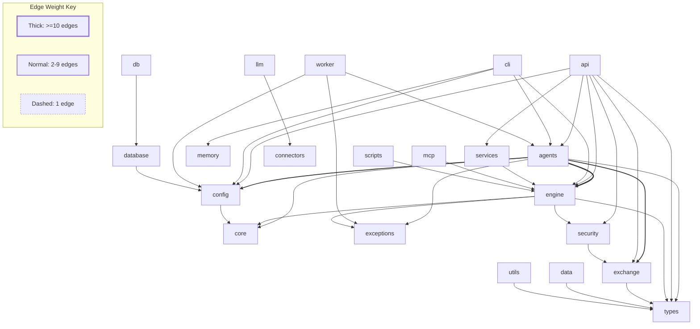

# QNA Architecture Report

**Generated:** 2026-06-24
**Tool:** `scripts/qna-architect.py` (pure stdlib, AST-parser)
**Repo:** Quant-Nanggroe-AI

---

## 1. Overview

| Metric | Value |
|--------|-------|
| Python files scanned | 417 |
| Total LOC | 124,874 |
| Packages (directories with `__init__.py`) | 68 |
| Import dependency edges | 699 |
| Circular imports | **0** |
| Missing imports | **0** |
| Orphan files (zero incoming imports) | **92** (22.1%) |
| Dead `__init__.py` exports | 622 |
| Entrypoints defined | 4 |

The codebase is large (417 files, ~125k lines) with a clean import graph — no circular dependencies and no unresolvable imports. The main architectural concerns are the high orphan count (92 files) and the extremely low entrypoint coverage (mean 5.9%).

---

## 2. Package Structure

| Package | Files | LOC | % of Codebase |
|---------|-------|-----|---------------|
| `engine/` | 209 | 64,698 | 51.8% |
| `agents/` | 83 | 20,527 | 16.4% |
| `exchange/` | 31 | 15,919 | 12.8% |
| `mcp/` | 5 | 3,992 | 3.2% |
| `memory/` | 7 | 3,612 | 2.9% |
| `api/` | 16 | 3,048 | 2.4% |
| `data/` | 11 | 2,412 | 1.9% |
| `security/` | 5 | 1,721 | 1.4% |
| `database/` | 7 | 1,424 | 1.1% |
| `types/` | 8 | 846 | 0.7% |
| `core/` | 3 | 422 | 0.3% |
| `utils/` | 4 | 390 | 0.3% |
| `config/` | 3 | 354 | 0.3% |
| `connectors/` | 2 | 584 | 0.5% |
| `llm/` | 1 | 37 | <0.1% |
| `db/` | 2 | 111 | 0.1% |
| Root (`*.py`) | 7 | 2,284 | 1.8% |

### Key Modules per Package

- **`engine/`** — The largest package. Contains: backtest (`engine/backtest/`), execution (`engine/execution/`), risk (`engine/risk/`), strategies, factors, regime detection, kelly, ML, pattern recorder, stress testing, visualization. ~209 files, heavily subdivided.
- **`agents/`** — Multi-agent system. Includes: researcher, trader, strategist, risk, portfolio, execution, macro, crypto, forex, personas (Buffett, Burry, Lynch, Dalio, etc.), geopolitics, debate, SMC, council, bridges.
- **`exchange/`** — Exchange connectivity layer. Supports: Alpaca, CCXT, IBKR, MT5, Polymarket, Solana, Paper broker. REST clients for Bitfinex, Bitget, Coinbase, Gate, Kraken, KuCoin, Longbridge.
- **`types/`** — Shared type definitions: market, orders, positions, risk, signals, decisions. Low file count (8) but highest import centrality.
- **`api/`** — FastAPI-based REST API with routes for trading, backtest, market, portfolio, agents, memory, colony, ecosystem, WhatsApp, WebSocket.
- **`mcp/`** — Model Context Protocol implementation (client, server, protocol, tools).
- **`memory/`** — Agent memory system: vector store, knowledge graph, session, journal, paging.

---

## 3. Import Dependency Graph

### Top 10 Most Imported Modules

| Rank | Module | Incoming Edges |
|------|--------|---------------|
| 1 | `agents/state.py` | 32 |
| 2 | `agents/registry.py` | 24 |
| 3 | `types/market.py` | 22 |
| 4 | `types/orders.py` | 19 |
| 5 | `exchange/base.py` | 18 |
| 6 | `types/positions.py` | 17 |
| 7 | `agents/base.py` | 15 |
| 8 | `agents/tools/market_data.py` | 13 |
| 9 | `engine/execution/base.py` | 11 |
| 10 | `config/settings.py` | 11 |

### Cross-Package Edge Summary

| Source | Target | Edges |
|--------|--------|-------|
| `exchange` | `types` | 49 |
| `agents` | `engine` | 24 |
| `scripts` | `engine` | 19 |
| `engine` | `types` | 11 |
| `api` | `engine` | 8 |
| `services.py` | `engine` | 7 |
| `agents` | `config` | 6 |
| `agents` | `exceptions.py` | 4 |
| `api` | `services.py` | 4 |
| `agents` | `exchange` | 3 |
| `api` | `exchange` | 3 |
| `data` | `types` | 3 |
| `engine` | `exceptions.py` | 3 |
| `database` | `config` | 1 |
| `security` | `exchange` | 1 |
| `utils` | `types` | 1 |
| _+ 22 more edges_ | | |

**Total cross-package edges:** ~178 (25.5% of all edges)

### Package-Level Dependency Graph (Mermaid)

### Entrypoint Coverage

| Entrypoint | Coverage | Assessment |
|-----------|----------|------------|
| `cli.py` | 8.9% | LOW |
| `api.py` | 8.4% | LOW |
| `worker.py` | 0.2% | VERY LOW |
| `services.py` | 6.2% | LOW |
| **Mean** | **5.9%** | **LOW** |

Entrypoint coverage measures what fraction of modules are reachable from each entrypoint. All four are below 10%, with `worker.py` at 0.2% — effectively unreachable. This indicates that most modules (325 non-orphans) are loaded lazily, via plugins, or through dynamic dispatch rather than direct import chains.

---

## 4. Circular Import Analysis

**Cycles detected: 0**

The dependency graph has no circular imports. This is excellent for a codebase of this size — it means the module layering discipline is well-maintained.

---

## 5. Missing Import Analysis

**Missing imports: 0**

All imports resolve correctly. No dangling references.

---

## 6. Orphan Analysis

**Total orphans: 92 files (22.1% of all files)**

Orphans are files with zero incoming imports — nothing imports them (directly or transitively) from within `quant_nanggroe/`. They may be entrypoints, CLI tools, configuration files, or genuinely dead code.

### Notable Orphans by Category

| Category | Files | Examples |
|----------|-------|----------|
| Agent personas | 6 | `ray_dalio.py`, `warren_buffett.py`, `michael_burry.py`, `peter_lynch.py`, `cathie_wood.py`, `stanley_druckenmiller.py` |
| Geopolitics agents | 5 | `american_order.py`, `chinese_order.py`, `european_order.py`, `islamic_finance.py`, `multipolar.py` |
| Hermes engine modules | 14 | `hermes_auditor.py`, `hermes_decision.py`, `hermes_market_state.py`, `hermes_pressure.py`, etc. |
| Backtest variants | 6 | `cpcv.py`, `fama_french.py`, `psr.py`, `risk_models.py`, `nautilus_adapter.py`, `hermes_backtest.py` |
| Factor libraries | 5 | `academic.py`, `alpha101.py`, `gtja191.py`, `hermes_ta.py`, `qlib158.py` |
| Database setup | 3 | `init_db.py`, `migrations.py`, `alembic/env.py` |
| Root | 1 | `_compat.py` |

### Key Concern

14+ Hermes engine modules are orphaned — this suggests the Hermes agent system is either unused, loaded dynamically, or its integration layer is incomplete. Similarly, the agent personas and geopolitics modules are never imported from any production code path.

**Reference:** See `docs/ORPHAN_TRIAGE.md` for a full triage plan (to be created).

---

## 7. Key Metrics

| Metric | Value |
|--------|-------|
| Mean imports per file | 1.67 |
| Mean lines per file | 299 |
| Non-orphan files | 325 |
| Edges per non-orphan file | 2.15 |
| Cross-package edges | ~178 (25.5%) |
| Orphan rate | 22.1% |
| Dead export symbols | 622 |
| Entrypoint coverage (mean) | 5.9% |
| Circular imports | 0 |
| Missing imports | 0 |

### Coupling Scores

- **Overall graph density:** 699 / (417 × 416 / 2) = **0.008** (very sparse — typical for large Python projects)
- **Hub modules:** `agents/state.py` (32 imports), `agents/registry.py` (24), `types/market.py` (22) — these are the architectural keystones
- **Most coupled package pair:** `exchange → types` (49 edges) — every exchange broker imports the shared type system

---

## 8. Recommendations

### 1. Audit and Triage the 92 Orphans

**Impact:** High — 22.1% of files have zero incoming imports. Likely a mix of dead code, dynamically loaded modules, and misconfigured `__init__.py` re-exports.

**Action:**
- For agent personas and geopolitics modules: decide if they are actively used via plugin/reflection loading. If not, archive or delete.
- For Hermes engine modules: verify they are reachable through the Hermes lifecycle or `engine/hermes_*.py` pipeline. If they are dynamically imported, ensure they appear in `__init__.py` re-exports or add explicit import paths.
- Create `docs/ORPHAN_TRIAGE.md` to track per-file disposition.

### 2. Improve Entrypoint Coverage

**Impact:** Medium — mean coverage of 5.9% means most modules are not reachable from `cli.py`, `api.py`, `worker.py`, or `services.py`. This makes dependency analysis incomplete and risks dead code accumulation.

**Action:**
- `worker.py` at 0.2% should be investigated — is it a standalone process? Does it need explicit imports?
- Ensure all agent types are referenced from the agent registry or an agent factory (currently `agents/registry.py` is heavily imported, which is good).
- Consider adding `--check --coverage-threshold` to CI to prevent coverage from dropping further.

### 3. Reduce Dead `__init__.py` Exports

**Impact:** Medium — 622 dead export symbols pollute the public API surface and make refactoring harder.

**Action:**
- Audit each package's `__init__.py` for symbols that are never imported by any other module.
- Use `__all__` explicitly to declare intended public APIs.
- Consider a one-time cleanup pass: remove unused exports, then re-run the architect tool to validate.

---

*Report generated by `scripts/qna-architect.py`. For raw data, run with `--json` flag.*
