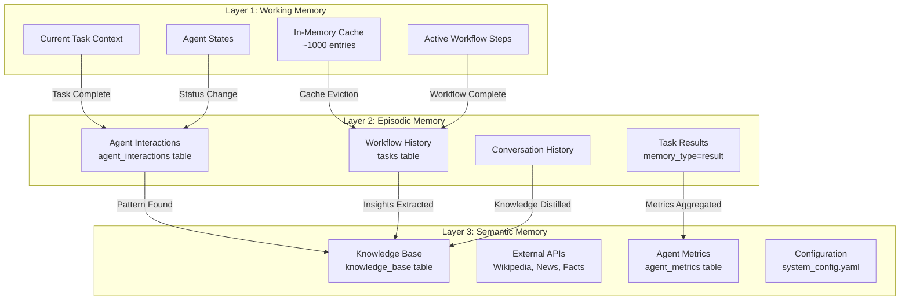
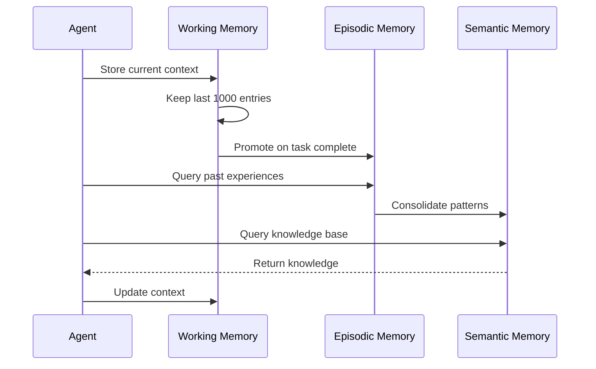
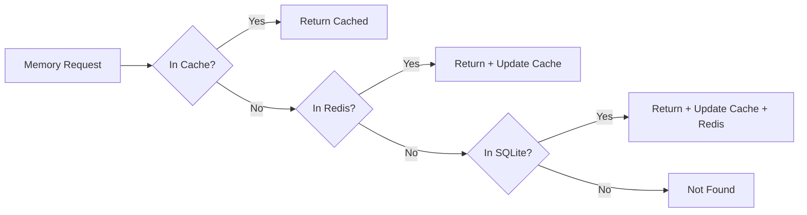
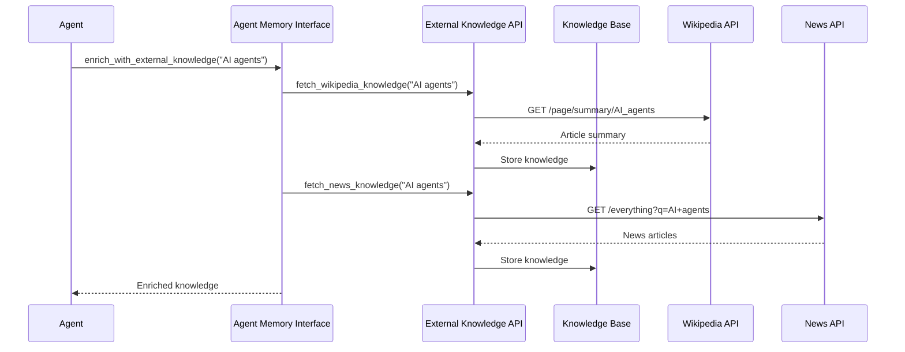
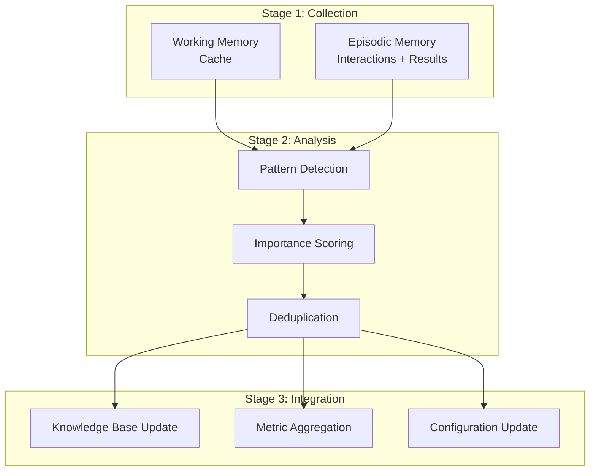
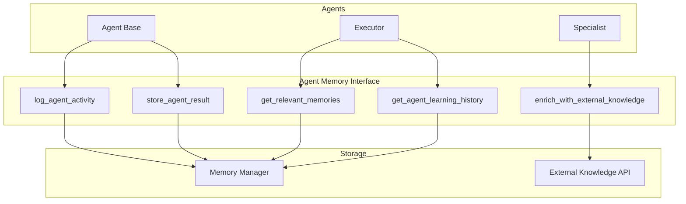
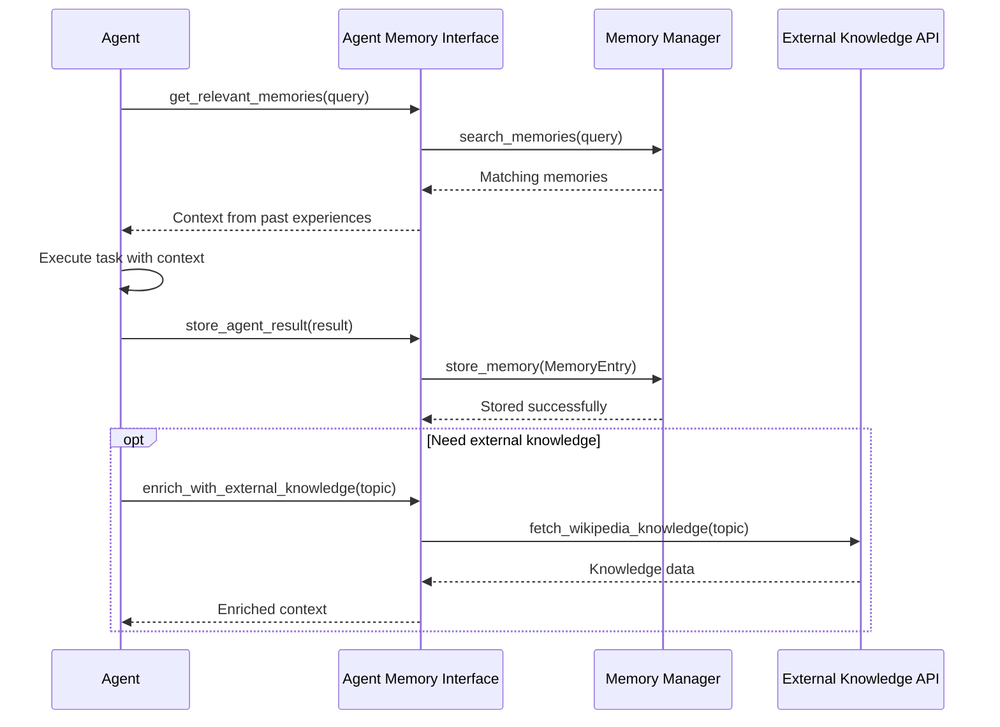

# Memory Architecture — AI-MultiColony-Ecosystem

> Complete design of the multi-layer memory system: working, episodic, and semantic memory
> Version 2.0.0 | Cluster 2 — AI-MULTICOLONY-ECOSYSTEM

---

## Table of Contents

1. [Overview](#overview)
2. [Three-Layer Memory Model](#three-layer-memory-model)
3. [Working Memory](#working-memory)
4. [Episodic Memory](#episodic-memory)
5. [Semantic Memory](#semantic-memory)
6. [Memory Consolidation Process](#memory-consolidation-process)
7. [Memory Retrieval Strategies](#memory-retrieval-strategies)
8. [Integration with Agents](#integration-with-agents)
9. [Storage Backend](#storage-backend)
10. [Memory API Reference](#memory-api-reference)

---

## Overview

The AI-MultiColony-Ecosystem implements a sophisticated three-layer memory architecture inspired by cognitive science. This design enables agents to maintain context during tasks (working memory), recall past experiences (episodic memory), and access structured knowledge (semantic memory).

### Design Principles

| Principle | Implementation |
|-----------|---------------|
| **Layered Architecture** | Working → Episodic → Semantic progression |
| **Gradual Consolidation** | Memories are promoted from short-term to long-term |
| **Importance Weighting** | Each memory has a 1-10 importance score |
| **Time-To-Live** | Memories can expire automatically via TTL |
| **Multi-Backend** | SQLite (persistent) + Redis (fast cache) + JSON (simple) |
| **Thread Safety** | All memory operations are lock-protected |

### Memory System Components

| Component | Location | Purpose |
|-----------|----------|---------|
| Memory Manager | `src/core/memory_manager.py` | Core memory CRUD + knowledge base |
| Memory Bus | `core/memory_bus.py` | Shared memory bus with SQLite/Redis/JSON |
| Agent Memory Interface | `src/core/memory_manager.py` | Agent-specific memory access |
| External Knowledge API | `src/core/memory_manager.py` | External knowledge enrichment |
| AI Selector History | `core/ai_selector.py` | Agent selection history |

---

## Three-Layer Memory Model



### Data Flow Between Layers



---

## Working Memory

Working memory holds the current task context, active agent states, and recent data needed for immediate processing.

### Implementation: In-Memory Cache

The `MemoryBus` maintains an in-memory cache loaded from the last hour of data:

```python
def _load_recent_memory(self):
    """Load recent memory into cache"""
    conn = sqlite3.connect(self.db_path)
    cursor = conn.execute("""
        SELECT entry_id, agent_id, data_type, content, timestamp
        FROM memory 
        WHERE timestamp > datetime('now', '-1 hour')
        ORDER BY timestamp DESC
        LIMIT 1000
    """)
    for row in cursor:
        self.cache[row[0]] = {
            "agent_id": row[1],
            "data_type": row[2],
            "content": json.loads(row[3]),
            "timestamp": row[4]
        }
```

### Working Memory Contents

| Data Type | Source | Retention | Example |
|-----------|--------|-----------|---------|
| `task` | Task submission | Until task complete | Current task details |
| `conversation` | User interactions | 30 days TTL | Chat history |
| `workflow_step` | Agent execution | Until workflow complete | Step results |
| `metric` | Agent performance | 7 days | Response time, CPU |

### Cache Strategy



### Working Memory Statistics

```python
def get_usage_stats(self) -> Dict[str, Any]:
    return {
        "memory_entries": memory_count,
        "tasks": tasks_count,
        "metrics": metrics_count,
        "database_size_mb": db_size,
        "cache_entries": len(self.cache),
        "redis_connected": self.redis_client is not None
    }
```

---

## Episodic Memory

Episodic memory stores past experiences — interactions between agents, completed tasks, and workflow results. This enables agents to learn from past behavior.

### Implementation: SQLite + Agent Interactions Table

The `MemoryManager` maintains three core tables:

#### Table: `agent_memory`

| Column | Type | Description |
|--------|------|-------------|
| `id` | TEXT PK | Unique memory entry ID (MD5 hash) |
| `agent_id` | TEXT | Owning agent identifier |
| `task_id` | TEXT | Associated task ID |
| `content` | TEXT | Memory content (JSON-serialized) |
| `metadata` | TEXT | Additional metadata (JSON) |
| `timestamp` | TEXT | ISO 8601 timestamp |
| `memory_type` | TEXT | `interaction`, `knowledge`, `result`, `external` |
| `importance` | INTEGER | 1-10 importance score |
| `embedding` | BLOB | Vector embedding (future use) |
| `created_at` | DATETIME | Record creation time |

#### Table: `agent_interactions`

| Column | Type | Description |
|--------|------|-------------|
| `id` | TEXT PK | Interaction ID (MD5 hash) |
| `from_agent` | TEXT | Sending agent |
| `to_agent` | TEXT | Receiving agent |
| `interaction_type` | TEXT | Type of interaction |
| `content` | TEXT | Interaction content |
| `context` | TEXT | Context metadata (JSON) |
| `timestamp` | TEXT | ISO 8601 timestamp |

#### Table: `tasks` (Memory Bus)

| Column | Type | Description |
|--------|------|-------------|
| `task_id` | TEXT PK | Task identifier |
| `prompt` | TEXT | Original prompt |
| `task_type` | TEXT | Task category |
| `status` | TEXT | `pending`, `running`, `completed`, `failed` |
| `assigned_agent` | TEXT | Agent handling the task |
| `created_at` | DATETIME | Creation time |
| `completed_at` | DATETIME | Completion time |
| `result` | TEXT | Task result (JSON) |

### Memory Types

| Type | Importance Range | Description | Example |
|------|-----------------|-------------|---------|
| `interaction` | 3-7 | Agent-to-agent communication | Planner → Executor delegation |
| `knowledge` | 5-10 | Learned knowledge | Best practices, patterns |
| `result` | 7-9 | Task execution results | Generated code, analysis |
| `external` | 4-8 | External API knowledge | Wikipedia data, news |

### Memory Entry Data Structure

```python
@dataclass
class MemoryEntry:
    id: str                    # Unique ID (MD5 hash)
    agent_id: str              # Owning agent
    task_id: str               # Associated task
    content: str               # Memory content
    metadata: Dict[str, Any]   # Additional metadata
    timestamp: str             # ISO 8601 timestamp
    memory_type: str           # interaction, knowledge, result, external
    importance: int            # 1-10 scale
```

---

## Semantic Memory

Semantic memory is the system's long-term knowledge base — structured information that persists across sessions and can be enriched from external sources.

### Implementation: Knowledge Base Table + External APIs

#### Table: `knowledge_base`

| Column | Type | Description |
|--------|------|-------------|
| `id` | TEXT PK | Knowledge ID (MD5 hash) |
| `topic` | TEXT | Knowledge topic |
| `content` | TEXT | Knowledge content |
| `source` | TEXT | Source name (Wikipedia, News, etc.) |
| `source_url` | TEXT | Source URL |
| `last_updated` | TEXT | Last update timestamp |
| `relevance_score` | REAL | Relevance score (0.0-1.0) |

### External Knowledge Sources

The `ExternalKnowledgeAPI` provides access to multiple knowledge sources:

| Source | API | Data Type | Rate Limit |
|--------|-----|-----------|-----------|
| Wikipedia | REST API | Encyclopedic knowledge | Free tier |
| News API | NewsAPI.org | Current news articles | Free tier |
| Quotable | quotable.io | Inspirational quotes | Free tier |
| Useless Facts | jsph.pl | Random facts | Free tier |

### Knowledge Enrichment Flow



---

## Memory Consolidation Process

Memory consolidation is the process of promoting information from short-term (working/episodic) to long-term (semantic) memory.

### Consolidation Pipeline



### Automatic Cleanup

The `MemoryBus.cleanup_expired()` method handles automatic memory cleanup:

| Cleanup Target | Retention Period | Schedule |
|---------------|-----------------|----------|
| Expired memory entries | Based on TTL field | Daily at 2 AM |
| Old tasks | 30 days | Daily at 2 AM |
| Old metrics | 7 days | Daily at 2 AM |
| Cache overflow | Last 1000 entries | Continuous |

```python
def cleanup_expired(self):
    # Clean up expired memory entries (TTL-based)
    conn.execute("""
        DELETE FROM memory 
        WHERE ttl IS NOT NULL 
        AND datetime(timestamp, '+' || ttl || ' seconds') < datetime('now')
    """)
    
    # Clean up old tasks (older than 30 days)
    conn.execute("""
        DELETE FROM tasks 
        WHERE created_at < datetime('now', '-30 days')
    """)
    
    # Clean up old metrics (older than 7 days)
    conn.execute("""
        DELETE FROM agent_metrics 
        WHERE timestamp < datetime('now', '-7 days')
    """)
```

---

## Memory Retrieval Strategies

### Retrieval Methods

| Method | Implementation | Use Case |
|--------|---------------|---------|
| **Direct Lookup** | `retrieve(entry_id)` | Known entry ID |
| **Agent Filter** | `retrieve_memories(agent_id=)` | Agent-specific history |
| **Type Filter** | `retrieve_memories(memory_type=)` | All results, all interactions |
| **Content Search** | `search_memories(query=)` | Keyword search |
| **Importance Sort** | `get_relevant_memories(query=)` | Prioritized retrieval |
| **Recent History** | `get_recent_tasks(limit=)` | Recent activity |

### Retrieval Strategy: Relevance-Based

The `AgentMemoryInterface.get_relevant_memories()` combines multiple retrieval strategies:

```python
def get_relevant_memories(self, agent_id, query, limit=10):
    # Step 1: Search by content keyword
    memories = self.memory_manager.search_memories(query, agent_id)
    
    # Step 2: Get recent high-importance memories
    recent_memories = self.memory_manager.retrieve_memories(
        agent_id=agent_id, limit=limit
    )
    
    # Step 3: Combine and deduplicate
    all_memories = {}
    for memory in memories + recent_memories:
        all_memories[memory.id] = memory
    
    # Step 4: Sort by importance and recency
    sorted_memories = sorted(
        all_memories.values(),
        key=lambda m: (m.importance, m.timestamp),
        reverse=True
    )
    
    return sorted_memories[:limit]
```

### Retrieval Performance

| Strategy | Avg Latency | Best For |
|----------|------------|----------|
| Direct Lookup | < 1ms | Known entry IDs |
| Cache Hit | < 5ms | Recently accessed data |
| Redis Lookup | < 10ms | Frequently used data |
| SQLite Query | 10-100ms | Complex searches |
| External API | 100-3000ms | Knowledge enrichment |

---

## Integration with Agents

### Agent Memory Interface

The `AgentMemoryInterface` provides a simplified API for agents:



### Agent Activity Logging

```python
# Log agent activity
agent_memory_interface.log_agent_activity(
    agent_id="agent_04_executor",
    task_id="task_123",
    activity="Executed Python script for data processing",
    metadata={"script": "process_data.py", "duration": 12.5},
    importance=7
)
```

### Memory-Enhanced Task Execution



### Learning History Analysis

```python
def get_agent_learning_history(self, agent_id):
    memories = self.memory_manager.retrieve_memories(agent_id=agent_id, limit=100)
    interactions = self.memory_manager.get_agent_interactions(agent_id, limit=50)
    
    return {
        'total_memories': len(memories),
        'memory_breakdown': memory_types,  # Count by type
        'recent_interactions': len(interactions),
        'avg_importance': avg_importance,
        'most_recent_activity': most_recent
    }
```

---

## Storage Backend

### SQLite Schema

The primary storage backend is SQLite, with the following database files:

| Database | Path | Purpose |
|----------|------|---------|
| Agent Memory | `data/agent_memory.db` | Core memory + knowledge + interactions |
| Memory Bus | `data/memory.db` | Tasks, metrics, workflow steps |
| Marketing | `data/marketing/marketing.db` | Campaigns, content, influencers |

### Indexes

```sql
-- Agent Memory indexes
CREATE INDEX idx_agent_memory_agent_id ON agent_memory(agent_id);
CREATE INDEX idx_agent_memory_timestamp ON agent_memory(timestamp);
CREATE INDEX idx_knowledge_base_topic ON knowledge_base(topic);

-- Memory Bus indexes
CREATE INDEX idx_agent_id ON memory(agent_id);
CREATE INDEX idx_data_type ON memory(data_type);
CREATE INDEX idx_timestamp ON memory(timestamp);
```

### Redis Integration

Redis provides fast caching for frequently accessed memories:

```python
# Store in Redis with optional TTL
if self.redis_client:
    redis_key = f"memory:{entry.entry_id}"
    redis_data = json.dumps(asdict(entry), default=str)
    if entry.ttl:
        self.redis_client.setex(redis_key, entry.ttl, redis_data)
    else:
        self.redis_client.set(redis_key, redis_data)
```

### JSON Storage

Simple key-value storage for configuration and registry data:

```python
# JSON storage structure
{
    "system_config": {},
    "agent_registry": {},
    "conversations": {},
    "workflows": {}
}
```

---

## Memory API Reference

### MemoryManager API

| Method | Parameters | Returns | Description |
|--------|-----------|---------|-------------|
| `store_memory(entry)` | `MemoryEntry` | `bool` | Store a memory entry |
| `retrieve_memories(agent_id, memory_type, limit)` | `str, str, int` | `List[MemoryEntry]` | Retrieve memories by agent |
| `search_memories(query, agent_id)` | `str, str` | `List[MemoryEntry]` | Search by content keyword |
| `store_agent_interaction(from, to, type, content, context)` | Various | `bool` | Log inter-agent interaction |
| `get_agent_interactions(agent_id, limit)` | `str, int` | `List[Dict]` | Get agent's interactions |

### MemoryBus API

| Method | Parameters | Returns | Description |
|--------|-----------|---------|-------------|
| `store(entry)` | `MemoryEntry` | `bool` | Store entry (SQLite + Redis + Cache) |
| `retrieve(entry_id)` | `str` | `Optional[MemoryEntry]` | Retrieve by ID (Cache → Redis → SQLite) |
| `search(agent_id, data_type, tags, limit)` | Various | `List[MemoryEntry]` | Search with filters |
| `store_task(task)` | `Task` | `bool` | Store task information |
| `get_task(task_id)` | `str` | `Optional[Dict]` | Get task by ID |
| `get_recent_tasks(limit)` | `int` | `List[Dict]` | Get recent tasks |
| `store_workflow_step(task_id, agent_name, result)` | Various | `bool` | Store workflow step |
| `store_metric(agent_id, metric_type, value)` | Various | `bool` | Store performance metric |
| `get_agent_metrics(agent_id, metric_type, hours)` | Various | `List[Dict]` | Get agent metrics |
| `store_conversation(user_id, message, response)` | Various | `bool` | Store conversation exchange |
| `get_conversation_history(user_id, limit)` | Various | `List[Dict]` | Get conversation history |
| `cleanup_expired()` | None | None | Remove expired entries |
| `get_usage_stats()` | None | `Dict` | Get storage statistics |

### AgentMemoryInterface API

| Method | Parameters | Returns | Description |
|--------|-----------|---------|-------------|
| `log_agent_activity(agent_id, task_id, activity, metadata, importance)` | Various | `bool` | Log agent activity |
| `get_relevant_memories(agent_id, query, limit)` | Various | `List[MemoryEntry]` | Get task-relevant memories |
| `enrich_with_external_knowledge(topic)` | `str` | `Dict` | Fetch external knowledge |
| `store_agent_result(agent_id, task_id, result, metadata)` | Various | `bool` | Store task result |
| `get_agent_learning_history(agent_id)` | `str` | `Dict` | Get learning statistics |

---

*This memory architecture document is maintained as part of the AI-MultiColony-Ecosystem project. Last updated: 2025-07-13.*
