# Quant Nanggroe AI — Merge Plan

**Version 4.0.0 | 20+ Repository Consolidation Strategy**

> This document details how each of the 20+ source repositories is merged into the Quant Nanggroe AI monorepo, including merge priority, strategy, what we keep, what we reject, and integration notes.

---

## Table of Contents

1. [Merge Strategy Overview](#1-merge-strategy-overview)
2. [Merge Priority Definitions](#2-merge-priority-definitions)
3. [Merge Strategy Definitions](#3-merge-strategy-definitions)
4. [Per-Repository Analysis](#4-per-repository-analysis)
5. [Merge Dependencies](#5-merge-dependencies)
6. [Conflict Resolution](#6-conflict-resolution)
7. [Quality Gates](#7-quality-gates)
8. [Post-Merge Validation](#8-post-merge-validation)

---

## 1. Merge Strategy Overview

### Merge Statistics

| Metric | Count |
|---|---|
| Total source repos | 21 |
| CRITICAL priority | 4 |
| HIGH priority | 5 |
| MEDIUM priority | 8 |
| LOW priority | 4 |
| FULL merge | 5 |
| PARTIAL merge | 6 |
| REFERENCE only | 8 |
| REJECTED | 2 |

### Merge Progress

| Phase | Repos | Status |
|---|---|---|
| Phase 1: Foundation | AutoTrader, HermesQuantOS, TradingAgents, Vibe-Trading | ✅ Complete |
| Phase 2: Core engines | AI-Trader, AutoHedge, QuantDinger, SolSniperX | ✅ Complete |
| Phase 3: Agent implementations | FinceptTerminal, OpenAlice, Misi-Screener, PromptForgeAI | 🔄 In Progress |
| Phase 4: Exchange integration | Clipper-AI, Kronos, Pentaract, ZeroInject | 📋 Planned |
| Phase 5: Production hardening | Crucix, QuantMuse, Dhaher-Corporation, MoneyPrinterTurbo, Trading-Plan-AI-Interactive | 📋 Planned |

---

## 2. Merge Priority Definitions

| Priority | Definition | Timeline | Criteria |
|---|---|---|---|
| **CRITICAL** | Must merge first; blocking other merges | Phase 1 | Core architecture, risk, agents |
| **HIGH** | Important; needed for core functionality | Phase 2 | Key features, exchanges, factors |
| **MEDIUM** | Valuable; enhances functionality | Phase 3-4 | Screening, UI, optimization |
| **LOW** | Nice to have; reference material | Phase 5 | Concepts, patterns, minor features |

---

## 3. Merge Strategy Definitions

| Strategy | Definition | Code Integration | Test Coverage |
|---|---|---|---|
| **FULL** | Complete code adoption with refactoring | Direct integration into modules | Full test coverage required |
| **PARTIAL** | Selected components adopted | Cherry-picked modules | Partial test coverage |
| **REFERENCE** | Design patterns and concepts only | No code integration | N/A |
| **REJECT** | Not suitable for monorepo | None | N/A |

---

## 4. Per-Repository Analysis

### 4.1 AutoTrader (CRITICAL — FULL)

| Attribute | Details |
|---|---|
| **Repository** | AutoTrader |
| **Priority** | CRITICAL |
| **Strategy** | FULL |
| **Phase** | 1 |
| **Status** | ✅ Merged |

**What We Keep:**
- Auto-trading loop and signal processing pipeline
- Order execution framework
- Multi-symbol analysis capability
- Strategy pattern (entry/exit logic)

**What We Reject:**
- Monolithic single-agent architecture
- Custom LLM wrapper (replaced by LangChain)
- No constitutional risk management
- Hardcoded exchange configurations

**Integration Points:**
- `quant_nanggroe/agents/trader/` — Trader agent logic
- `quant_nanggroe/engine/execution/` — Execution framework
- `quant_nanggroe/agents/graph.py` — Trading loop pattern

**Migration Notes:**
- Trading loop refactored from monolithic to LangGraph nodes
- Order execution separated into dedicated Execution agent
- Signal processing moved to Strategist agent

---

### 4.2 HermesQuantOS (CRITICAL — FULL)

| Attribute | Details |
|---|---|
| **Repository** | HermesQuantOS |
| **Priority** | CRITICAL |
| **Strategy** | FULL |
| **Phase** | 1 |
| **Status** | ✅ Merged |

**What We Keep:**
- Risk Officer with 9-checkpoint gate
- Strategy lifecycle management (Darwinian selection)
- 5-layer deterministic execution stack
- Audit trail system
- Correlation monitor
- Drawdown monitor
- Kill switch mechanism

**What We Reject:**
- TypeScript/JavaScript components
- Browser-only architecture (IndexedDB, LocalStorage)
- Custom Gemini-only LLM integration
- React frontend (separate concern)

**Integration Points:**
- `quant_nanggroe/engine/risk/checks.py` — 9-checkpoint gate
- `quant_nanggroe/engine/risk/kill_switch.py` — Kill switch
- `quant_nanggroe/engine/risk/drawdown.py` — Drawdown monitor
- `quant_nanggroe/engine/risk/correlation.py` — Correlation monitor
- `quant_nanggroe/engine/strategy_lifecycle.py` — Darwinian lifecycle
- `quant_nanggroe/engine/audit.py` — Audit trail
- `quant_nanggroe/engine/market_state.py` — Regime detection
- `quant_nanggroe/engine/pressure.py` — Pressure normalization

**Migration Notes:**
- TypeScript → Python conversion completed
- Browser storage → SQLAlchemy/Redis migration
- Gemini-only → Multi-provider LLM (OpenAI, Anthropic, Google)
- React UI → FastAPI backend (frontend is separate project)

---

### 4.3 TradingAgents (CRITICAL — FULL)

| Attribute | Details |
|---|---|
| **Repository** | TradingAgents (AI-Hedge-Fund) |
| **Priority** | CRITICAL |
| **Strategy** | FULL |
| **Phase** | 1 |
| **Status** | ✅ Merged |

**What We Keep:**
- Multi-agent debate mechanism (bull/bear)
- Risk debate (conservative/neutral/aggressive)
- Stress testing scenarios (2008_Crisis, COVID_Crash, etc.)
- Agent role pattern (analyst, trader, risk)
- Signal aggregation approach

**What We Reject:**
- Simple risk management (no constitutional limits)
- No exchange execution capability
- Limited to US equities
- No multi-path routing

**Integration Points:**
- `quant_nanggroe/agents/council/debate.py` — Council debate
- `quant_nanggroe/agents/council/voting.py` — Council voting
- `quant_nanggroe/engine/risk/manager.py` — Stress testing
- `quant_nanggroe/agents/state.py` — DebateState, RiskDebateState

**Migration Notes:**
- Bull/bear debate adopted as CouncilDebate
- Risk debate adopted as RiskDebateState
- Stress testing integrated into RiskManager
- Agent roles expanded from 4 to 11

---

### 4.4 Vibe-Trading (CRITICAL — FULL)

| Attribute | Details |
|---|---|
| **Repository** | Vibe-Trading |
| **Priority** | CRITICAL |
| **Strategy** | FULL |
| **Phase** | 1 |
| **Status** | ✅ Merged |

**What We Keep:**
- Alpha101 factor zoo (101 factors)
- GTJA191 factor zoo (191 factors)
- Qlib158 factor zoo (158 factors)
- Academic factor zoo
- Function-based factor pattern (`__alpha_meta__` + `compute()`)
- Factor computation pipeline

**What We Reject:**
- Custom orchestration (replaced by LangGraph)
- No risk management
- No exchange integration
- Single-asset focus

**Integration Points:**
- `quant_nanggroe/engine/factors/alpha101.py` — 101 factors
- `quant_nanggroe/engine/factors/gtja191.py` — 191 factors
- `quant_nanggroe/engine/factors/qlib158.py` — 158 factors
- `quant_nanggroe/engine/factors/academic.py` — Academic factors
- `quant_nanggroe/engine/factors/registry.py` — FactorRegistry (adapted)
- `quant_nanggroe/engine/factors/pipeline.py` — Factor pipeline

**Migration Notes:**
- Factor zoo modules ported with minimal changes
- Function-based pattern adopted as FactorHandle
- Registry adapted with thread-safe singleton
- AST-based metadata extraction added for discovery

---

### 4.5 AI-Trader (HIGH — FULL)

| Attribute | Details |
|---|---|
| **Repository** | AI-Trader |
| **Priority** | HIGH |
| **Strategy** | FULL |
| **Phase** | 2 |
| **Status** | ✅ Merged |

**What We Keep:**
- AI-driven trading agent architecture
- Market analysis patterns
- LLM prompt engineering for trading
- Technical analysis integration

**What We Reject:**
- Legacy Python 3.8 code
- Custom LLM wrappers (replaced by LangChain)
- Hardcoded model configurations
- No multi-agent support

**Integration Points:**
- `quant_nanggroe/agents/researcher/` — Research patterns
- `quant_nanggroe/agents/tools/technical.py` — Technical analysis tools
- `quant_nanggroe/agents/tools/market_data.py` — Market data tools

---

### 4.6 AutoHedge (HIGH — PARTIAL)

| Attribute | Details |
|---|---|
| **Repository** | AutoHedge |
| **Priority** | HIGH |
| **Strategy** | PARTIAL |
| **Phase** | 2 |
| **Status** | ✅ Merged |

**What We Keep:**
- Hedging strategy patterns
- Risk parity computation
- Correlation monitoring algorithms
- Portfolio rebalancing logic

**What We Reject:**
- Custom database layer (replaced by SQLAlchemy)
- Outdated API (replaced by FastAPI)
- No agent architecture
- Single-exchange only

**Integration Points:**
- `quant_nanggroe/engine/risk/risk_parity.py` — Risk parity
- `quant_nanggroe/engine/risk/correlation.py` — Correlation algorithms
- `quant_nanggroe/engine/backtest/optimizers/risk_parity_optimizer.py` — Risk parity optimizer

---

### 4.7 QuantDinger (HIGH — PARTIAL)

| Attribute | Details |
|---|---|
| **Repository** | QuantDinger |
| **Priority** | HIGH |
| **Strategy** | PARTIAL |
| **Phase** | 2 |
| **Status** | ✅ Merged |

**What We Keep:**
- Factor computation engine
- Alpha generation patterns
- Backtesting framework
- Signal quality metrics

**What We Reject:**
- Proprietary data pipeline
- No multi-agent support
- Limited factor diversity

**Integration Points:**
- `quant_nanggroe/engine/factors/` — Factor patterns
- `quant_nanggroe/engine/backtest/` — Backtesting patterns
- `quant_nanggroe/engine/models/signal_generator.py` — Signal generation

---

### 4.8 SolSniperX (HIGH — FULL)

| Attribute | Details |
|---|---|
| **Repository** | SolSniperX |
| **Priority** | HIGH |
| **Strategy** | FULL |
| **Phase** | 2 |
| **Status** | ✅ Merged |

**What We Keep:**
- Solana blockchain integration
- Jupiter swap aggregator
- RugCheck token safety analysis
- Wallet management and signing
- Mempool monitoring
- DEX trading tools

**What We Reject:**
- Meme-coin-only focus
- No risk management
- No multi-chain support

**Integration Points:**
- `quant_nanggroe/exchange/solana/jupiter.py` — Jupiter swap
- `quant_nanggroe/exchange/solana/rugcheck.py` — RugCheck
- `quant_nanggroe/exchange/solana/broker.py` — Solana broker
- `quant_nanggroe/exchange/solana/mempool.py` — Mempool monitor
- `quant_nanggroe/exchange/solana/wallet.py` — Wallet management

---

### 4.9 FinceptTerminal (HIGH — PARTIAL)

| Attribute | Details |
|---|---|
| **Repository** | FinceptTerminal |
| **Priority** | HIGH |
| **Strategy** | PARTIAL |
| **Phase** | 3 |
| **Status** | 🔄 In Progress |

**What We Keep:**
- Terminal UI design patterns
- Real-time data streaming via WebSocket
- Market data visualization concepts
- Dashboard layout architecture

**What We Reject:**
- Frontend-only architecture (no backend trading)
- Custom data format
- No agent system

**Integration Points:**
- `quant_nanggroe/api/routes/ws.py` — WebSocket streaming
- `quant_nanggroe/api/routes/market.py` — Market data API
- `quant_nanggroe/api/routes/portfolio.py` — Portfolio dashboard

---

### 4.10 OpenAlice (MEDIUM — PARTIAL)

| Attribute | Details |
|---|---|
| **Repository** | OpenAlice |
| **Priority** | MEDIUM |
| **Strategy** | PARTIAL |
| **Phase** | 3 |
| **Status** | 🔄 In Progress |

**What We Keep:**
- Open order management system
- Exchange connectivity patterns
- Order type handling

**What We Reject:**
- Limited exchange support (only 2-3 exchanges)
- No risk management
- No multi-agent

**Integration Points:**
- `quant_nanggroe/engine/execution/order.py` — Order management
- `quant_nanggroe/exchange/order_types.py` — Order type definitions

---

### 4.11 Misi-Screener (MEDIUM — PARTIAL)

| Attribute | Details |
|---|---|
| **Repository** | Misi-Screener |
| **Priority** | MEDIUM |
| **Strategy** | PARTIAL |
| **Phase** | 3 |
| **Status** | 🔄 In Progress |

**What We Keep:**
- Stock screening logic
- Fundamental analysis filters
- Screening criteria framework

**What We Reject:**
- Limited to Malaysian market only
- No international market support
- Basic screening only

**Integration Points:**
- `quant_nanggroe/agents/researcher/tools.py` — Screening tools
- `quant_nanggroe/engine/factors/fundamental.py` — Fundamental factors

---

### 4.12 PromptForgeAI (MEDIUM — PARTIAL)

| Attribute | Details |
|---|---|
| **Repository** | PromptForgeAI |
| **Priority** | MEDIUM |
| **Strategy** | PARTIAL |
| **Phase** | 3 |
| **Status** | 🔄 In Progress |

**What We Keep:**
- Prompt engineering patterns
- LLM prompt optimization
- System prompt templates
- Chain-of-thought patterns

**What We Reject:**
- General-purpose focus (we need trading-specific)
- No domain knowledge
- No tool integration

**Integration Points:**
- `quant_nanggroe/agents/*/prompts.py` — All agent prompts
- `quant_nanggroe/agents/council/debate.py` — Debate prompts

---

### 4.13 Clipper-AI (MEDIUM — PARTIAL)

| Attribute | Details |
|---|---|
| **Repository** | Clipper-AI |
| **Priority** | MEDIUM |
| **Strategy** | PARTIAL |
| **Phase** | 4 |
| **Status** | 📋 Planned |

**What We Keep:**
- Quick-profit / scalping strategies
- Fast execution patterns
- Short timeframe analysis

**What We Reject:**
- No risk management
- Aggressive position sizing
- No kill switch

**Integration Points:**
- `quant_nanggroe/engine/execution/manager.py` — Execution patterns
- `quant_nanggroe/agents/strategist/tools.py` — Strategy tools

---

### 4.14 Kronos (MEDIUM — REFERENCE)

| Attribute | Details |
|---|---|
| **Repository** | Kronos |
| **Priority** | MEDIUM |
| **Strategy** | REFERENCE |
| **Phase** | 4 |
| **Status** | 📋 Planned |

**What We Keep:**
- Time-series analysis patterns
- Temporal factor computation concepts

**What We Reject:**
- Custom framework (no LangGraph)
- No multi-agent support
- No exchange integration

**Integration Points:**
- Conceptual reference only — no direct code integration

---

### 4.15 Pentaract (LOW — REFERENCE)

| Attribute | Details |
|---|---|
| **Repository** | Pentaract |
| **Priority** | LOW |
| **Strategy** | REFERENCE |
| **Phase** | 5 |
| **Status** | 📋 Planned |

**What We Keep:**
- Multi-dimensional analysis concept
- Five-factor evaluation framework

**What We Reject:**
- Academic-only (no production code)
- No exchange integration
- Theoretical only

**Integration Points:**
- Conceptual reference for multi-factor evaluation

---

### 4.16 ZeroInject (LOW — REFERENCE)

| Attribute | Details |
|---|---|
| **Repository** | ZeroInject |
| **Priority** | LOW |
| **Strategy** | REFERENCE |
| **Phase** | 5 |
| **Status** | 📋 Planned |

**What We Keep:**
- Zero-latency execution concept
- Low-latency order placement patterns

**What We Reject:**
- Custom exchange protocol (not standard)
- No multi-exchange support
- Latency-only focus (no analysis)

**Integration Points:**
- Conceptual reference for execution optimization

---

### 4.17 Crucix (MEDIUM — REFERENCE)

| Attribute | Details |
|---|---|
| **Repository** | Crucix |
| **Priority** | MEDIUM |
| **Strategy** | REFERENCE |
| **Phase** | 5 |
| **Status** | 📋 Planned |

**What We Keep:**
- Cross-validation approach for signals
- Signal quality metrics and evaluation

**What We Reject:**
- Proprietary data format
- No factor framework
- Limited to backtesting

**Integration Points:**
- Conceptual reference for signal validation patterns

---

### 4.18 QuantMuse (MEDIUM — REFERENCE)

| Attribute | Details |
|---|---|
| **Repository** | QuantMuse |
| **Priority** | MEDIUM |
| **Strategy** | REFERENCE |
| **Phase** | 5 |
| **Status** | 📋 Planned |

**What We Keep:**
- Research methodology
- Factor documentation standards
- Academic rigor in alpha research

**What We Reject:**
- No production infrastructure
- No live trading
- Research-only focus

**Integration Points:**
- Methodological reference for factor development

---

### 4.19 MoneyPrinterTurbo (LOW — REFERENCE)

| Attribute | Details |
|---|---|
| **Repository** | MoneyPrinterTurbo |
| **Priority** | LOW |
| **Strategy** | REFERENCE |
| **Phase** | 5 |
| **Status** | 📋 Planned |

**What We Keep:**
- Yield farming concepts
- DeFi yield optimization patterns

**What We Reject:**
- DeFi-only (no CEX trading)
- No risk management
- No traditional market support

**Integration Points:**
- Conceptual reference for yield strategies (future crypto agent enhancement)

---

### 4.20 Trading-Plan-AI-Interactive (MEDIUM — REFERENCE)

| Attribute | Details |
|---|---|
| **Repository** | Trading-Plan-AI-Interactive |
| **Priority** | MEDIUM |
| **Strategy** | REFERENCE |
| **Phase** | 5 |
| **Status** | 📋 Planned |

**What We Keep:**
- Interactive trading plan generation
- Human-in-the-loop trading plan review
- Plan-based trading execution concepts

**What We Reject:**
- No automated execution
- Plan-only (no market monitoring)
- No multi-agent

**Integration Points:**
- Conceptual reference for human-in-the-loop patterns (already implemented)

---

### 4.21 Dhaher-Corporation (MEDIUM — REFERENCE)

| Attribute | Details |
|---|---|
| **Repository** | Dhaher-Corporation |
| **Priority** | MEDIUM |
| **Strategy** | REFERENCE |
| **Phase** | 5 |
| **Status** | 📋 Planned |

**What We Keep:**
- Enterprise security patterns
- Audit logging standards
- Authentication/authorization patterns

**What We Reject:**
- Java/TypeScript components
- Custom identity management
- Non-Python codebase

**Integration Points:**
- `quant_nanggroe/security/` — Security patterns
- `quant_nanggroe/security/audit.py` — Audit logging

---

## 5. Merge Dependencies

### Dependency Graph

```mermaid
graph TD
    AT[AutoTrader<br/>CRITICAL] --> GV2[TradingGraphV2]
    HQ[HermesQuantOS<br/>CRITICAL] --> RE[RiskEngine]
    TA[TradingAgents<br/>CRITICAL] --> CD[CouncilDebate]
    VT[Vibe-Trading<br/>CRITICAL] --> FR[FactorRegistry]
    
    AIT[AI-Trader<br/>HIGH] --> RA[ResearcherAgent]
    AH[AutoHedge<br/>HIGH] --> RP[RiskParity]
    QD[QuantDinger<br/>HIGH] --> FE[FactorEngine]
    SSX[SolSniperX<br/>HIGH] --> SOL[SolanaModule]
    
    FT[FinceptTerminal<br/>HIGH] --> API[APILayer]
    OA[OpenAlice<br/>MEDIUM] --> EX[ExecutionEngine]
    MS[Misi-Screener<br/>MEDIUM] --> FUND[FundamentalFactors]
    PF[PromptForgeAI<br/>MEDIUM] --> PROMPT[AgentPrompts]
    
    CA[Clipper-AI<br/>MEDIUM] --> EXEC[ExecutionManager]
    KR[Kronos<br/>MEDIUM] -.->|reference| FR
    PE[Pentaract<br/>LOW] -.->|reference| FE
    ZI[ZeroInject<br/>LOW] -.->|reference| EXEC
```

### Critical Path

1. **Vibe-Trading** → FactorRegistry (blocking: Strategist, Risk agents need factors)
2. **HermesQuantOS** → RiskEngine (blocking: all agents need risk validation)
3. **TradingAgents** → CouncilDebate (blocking: low-confidence fallback)
4. **AutoTrader** → TradingGraph (blocking: entire pipeline)

---

## 6. Conflict Resolution

### Common Conflict Patterns

| Pattern | Example | Resolution |
|---|---|---|
| **Duplicate risk modules** | AutoTrader risk + HermesQuantOS risk | HermesQuantOS wins (9-checkpoint gate) |
| **Duplicate exchange code** | AI-Trader exchange + AutoTrader exchange | Unified via ExchangeFactory |
| **Duplicate LLM wrappers** | Multiple custom LLM wrappers | Unified via LangChain + create_llm() |
| **Different state formats** | Various AgentState definitions | Merged into unified TypedDict |
| **Different config systems** | Multiple config patterns | Unified via Pydantic Settings |

### Resolution Principles

1. **HermesQuantOS wins for risk** — Most comprehensive risk framework
2. **Vibe-Trading wins for factors** — 469+ factors with proven patterns
3. **TradingAgents wins for debate** — Bull/bear and risk debate mechanisms
4. **LangGraph wins for orchestration** — Replaces all custom orchestration
5. **CCXT wins for exchanges** — Replaces all custom exchange clients
6. **Pydantic wins for data models** — Replaces all custom model classes

---

## 7. Quality Gates

Each merge must pass these quality gates:

| Gate | Criteria | Tool |
|---|---|---|
| **Type checking** | mypy --strict passes | mypy |
| **Linting** | ruff check passes | ruff |
| **Unit tests** | 100% new code coverage | pytest-cov |
| **Integration tests** | End-to-end pipeline runs | pytest |
| **Security scan** | No credential leaks | credential_inference.py |
| **Import check** | No circular imports | Python import |
| **Performance** | No regression > 10% | Custom benchmarks |

---

## 8. Post-Merge Validation

### Validation Checklist per Repo

- [ ] All kept functionality works in monorepo
- [ ] Tests migrated and passing (2504+ total)
- [ ] No circular imports
- [ ] No duplicate code with other merged repos
- [ ] Constitutional risk limits enforced
- [ ] Documentation updated
- [ ] API backward compatibility maintained

### Integration Test Matrix

| Component | Test | Expected Result |
|---|---|---|
| FactorRegistry | `registry.health()` | `{"loaded": 469, "failed": 0}` |
| RiskManager | `rm.check_trade(...)` | VETOED if limits breached |
| ExchangeFactory | `factory.create("binance")` | CCXTBroker created |
| TradingGraphV2 | `graph.run(["AAPL"])` | Pipeline completes |
| CouncilDebate | `debate.run_full_debate(state)` | Debate produces decision |
| KillSwitch | `ks.activate("TEST")` | Switch activates |
| API | `GET /health` | `{"status": "healthy"}` |

---

© 2025-2026 Quant Nanggroe AI | Merge Plan v4.0.0
