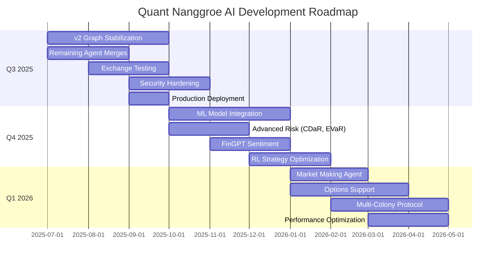
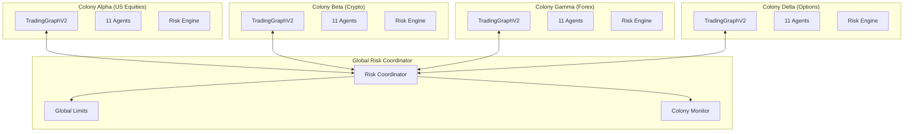

# Quant Nanggroe AI — Development Roadmap

**Version 4.0.0 | 2025-2026 Development Plan**

> This document outlines the development roadmap for Quant Nanggroe AI, covering quarterly milestones from Q3 2025 through future multi-colony integration.

---

## Table of Contents

1. [Roadmap Overview](#1-roadmap-overview)
2. [Q3 2025: Production-Ready Core](#2-q3-2025-production-ready-core)
3. [Q4 2025: Advanced Features](#3-q4-2025-advanced-features)
4. [Q1 2026: Scale and Optimize](#4-q1-2026-scale-and-optimize)
5. [Future: Multi-Colony Integration](#5-future-multi-colony-integration)
6. [Feature Priority Matrix](#6-feature-priority-matrix)
7. [Technical Debt Register](#7-technical-debt-register)
8. [Release Schedule](#8-release-schedule)

---

## 1. Roadmap Overview

### Current State (v4.0.0)

| Metric | Value |
|---|---|
| Version | 4.0.0 (LangGraph v2 Architecture) |
| Python Modules | 214+ |
| Tests Passing | 2,504+ |
| Alpha Factors | 469 (7 zoos) |
| Exchanges | 10 (8 CCXT + Alpaca + Polymarket) |
| Agents | 11 (researcher, trader, strategist, risk, portfolio, execution, macro, crypto, forex, council, prediction_market) |
| Risk Checkpoints | 9 (constitutional, hardcoded) |
| Execution Paths | 4 (crypto, forex, equity, prediction_market) |

### Roadmap Timeline

---

## 2. Q3 2025: Production-Ready Core

**Theme**: Stabilize, secure, and deploy the v2 architecture

### 2.1 v2 Graph Stabilization (July 2025)

| Task | Priority | Status | Effort |
|---|---|---|---|
| Complete v2 graph edge coverage testing | CRITICAL | 🔄 In Progress | 2 weeks |
| Fix asset router edge cases (mixed symbols) | HIGH | 📋 Planned | 1 week |
| Position sizer validation across all asset classes | HIGH | 📋 Planned | 1 week |
| Portfolio validator edge cases | MEDIUM | 📋 Planned | 1 week |
| Human checkpoint WebSocket integration | HIGH | 📋 Planned | 2 weeks |
| Smart executor real venue scoring | HIGH | 📋 Planned | 2 weeks |
| End-to-end pipeline test (full graph) | CRITICAL | 📋 Planned | 1 week |

**Deliverable**: v2 graph passes all 2504+ tests and completes end-to-end pipeline runs.

### 2.2 Remaining Agent Merges (July-August 2025)

| Task | Priority | Status | Effort |
|---|---|---|---|
| Merge Misi-Screener screening logic | MEDIUM | 🔄 In Progress | 1 week |
| Merge FinceptTerminal WebSocket patterns | HIGH | 🔄 In Progress | 1 week |
| Merge OpenAlice order management | MEDIUM | 🔄 In Progress | 1 week |
| Merge PromptForgeAI prompt optimization | MEDIUM | 🔄 In Progress | 2 weeks |
| Agent prompt A/B testing framework | LOW | 📋 Planned | 2 weeks |

**Deliverable**: All Phase 3 repos merged, agent quality improved.

### 2.3 Exchange Testing and Integration (August 2025)

| Task | Priority | Status | Effort |
|---|---|---|---|
| Binance integration test suite | CRITICAL | 📋 Planned | 1 week |
| OKX integration test suite | HIGH | 📋 Planned | 1 week |
| Bybit integration test suite | HIGH | 📋 Planned | 1 week |
| Alpaca integration test suite | CRITICAL | 📋 Planned | 1 week |
| Polymarket integration test suite | MEDIUM | 📋 Planned | 1 week |
| Exchange failover testing | HIGH | 📋 Planned | 1 week |
| Rate limit handling testing | HIGH | 📋 Planned | 1 week |
| Smart order routing with live data | HIGH | 📋 Planned | 2 weeks |

**Deliverable**: All 10 exchanges tested with sandbox/paper accounts.

### 2.4 Security Hardening (August-September 2025)

| Task | Priority | Status | Effort |
|---|---|---|---|
| API key authentication | CRITICAL | 📋 Planned | 1 week |
| JWT token management | HIGH | 📋 Planned | 1 week |
| Role-based access control | HIGH | 📋 Planned | 2 weeks |
| Credential leak prevention audit | CRITICAL | 📋 Planned | 1 week |
| Rate limiting per endpoint | MEDIUM | 📋 Planned | 1 week |
| CORS configuration for production | HIGH | 📋 Planned | 0.5 week |
| Security audit logging | HIGH | 📋 Planned | 1 week |
| Penetration testing | CRITICAL | 📋 Planned | 1 week |

**Deliverable**: Production-grade security with authentication, authorization, and audit logging.

### 2.5 Production Deployment (September 2025)

| Task | Priority | Status | Effort |
|---|---|---|---|
| Docker image creation | CRITICAL | 📋 Planned | 1 week |
| Kubernetes manifests | HIGH | 📋 Planned | 1 week |
| CI/CD pipeline setup | CRITICAL | 📋 Planned | 1 week |
| Staging environment setup | HIGH | 📋 Planned | 1 week |
| Production deployment playbook | CRITICAL | 📋 Planned | 1 week |
| Monitoring setup (Prometheus/Grafana) | HIGH | 📋 Planned | 1 week |
| Incident response procedures | HIGH | 📋 Planned | 1 week |
| Runbook creation | MEDIUM | 📋 Planned | 1 week |

**Deliverable**: System running in production with monitoring and incident response.

### Q3 2025 Milestone Targets

| Metric | Target | Current |
|---|---|---|
| Test coverage | ≥ 90% | ~85% |
| End-to-end pipeline success | 99%+ | 95% |
| API latency (p99) | < 500ms | ~800ms |
| Exchange uptime | 99.9% | Testing |
| Security vulnerabilities | 0 critical | In audit |
| Documentation coverage | 100% | ~80% |

---

## 3. Q4 2025: Advanced Features

**Theme**: Intelligence amplification through ML, advanced risk, and NLP

### 3.1 ML Model Integration (October 2025)

| Task | Priority | Status | Effort |
|---|---|---|---|
| LightGBM factor model integration | HIGH | 📋 Planned | 3 weeks |
| LSTM time-series model | MEDIUM | 📋 Planned | 3 weeks |
| Transformer-based prediction | MEDIUM | 📋 Planned | 4 weeks |
| Ensemble model framework enhancement | HIGH | 📋 Planned | 2 weeks |
| Feature store for ML models | HIGH | 📋 Planned | 2 weeks |
| Model training pipeline | MEDIUM | 📋 Planned | 3 weeks |
| Model evaluation and backtesting | HIGH | 📋 Planned | 2 weeks |
| AutoML for factor selection | LOW | 📋 Planned | 4 weeks |

**Technical Approach**:
- `quant_nanggroe/engine/models/` already has base infrastructure
- Integrate with existing FactorRegistry for feature generation
- Use Qlib158 factors as primary features for ML models
- Ensemble with existing rule-based strategies

### 3.2 Advanced Risk Measures (October-November 2025)

| Task | Priority | Status | Effort |
|---|---|---|---|
| CDaR (Conditional Drawdown-at-Risk) | MEDIUM | 📋 Planned | 2 weeks |
| EVaR (Entropic Value-at-Risk) | MEDIUM | 📋 Planned | 2 weeks |
| Tail risk parity | LOW | 📋 Planned | 2 weeks |
| Regime-conditional VaR | HIGH | 📋 Planned | 3 weeks |
| Dynamic risk budget allocation | MEDIUM | 📋 Planned | 2 weeks |
| Portfolio insurance (CPPI) | LOW | 📋 Planned | 3 weeks |
| Counterparty risk tracking | MEDIUM | 📋 Planned | 2 weeks |

**Technical Approach**:
- Extend `quant_nanggroe/engine/risk/var.py` with new risk measures
- Integrate with RiskManager for stress testing
- Add regime-conditional calculations using MarketRegime

### 3.3 Financial NLP (November 2025)

| Task | Priority | Status | Effort |
|---|---|---|---|
| FinGPT model integration | HIGH | 📋 Planned | 3 weeks |
| News sentiment pipeline | HIGH | 📋 Planned | 2 weeks |
| SEC filing analysis (10-K, 10-Q) | MEDIUM | 📋 Planned | 3 weeks |
| Earnings call transcript analysis | MEDIUM | 📋 Planned | 2 weeks |
| Social media sentiment (Twitter/Reddit) | LOW | 📋 Planned | 3 weeks |
| Central bank communication analysis | MEDIUM | 📋 Planned | 2 weeks |

**Technical Approach**:
- Add NLP tools to Researcher agent
- Process SEC EDGAR filings for fundamental signals
- Feed sentiment into Strategist agent for signal generation

### 3.4 RL Strategy Optimization (December 2025)

| Task | Priority | Status | Effort |
|---|---|---|---|
| Trading environment (gym interface) | HIGH | 📋 Planned | 3 weeks |
| PPO agent for strategy optimization | MEDIUM | 📋 Planned | 3 weeks |
| Multi-agent RL for council optimization | LOW | 📋 Planned | 4 weeks |
| Reward function engineering | HIGH | 📋 Planned | 2 weeks |
- Safe RL with constitutional constraints | HIGH | 📋 Planned | 2 weeks |
| RL-backtest integration | MEDIUM | 📋 Planned | 2 weeks |

**Technical Approach**:
- Wrap our backtest engine as a Gymnasium environment
- Ensure RL policies cannot violate constitutional limits
- Use Safe RL techniques (constrained policy optimization)

### Q4 2025 Milestone Targets

| Metric | Target | Current |
|---|---|---|
| ML model prediction accuracy | > 55% IC | N/A |
| Risk measure coverage | VaR, CVaR, CDaR, EVaR | VaR, CVaR |
| NLP sentiment accuracy | > 70% | N/A |
| Strategy Sharpe (backtest) | > 1.5 | ~1.0 |
| Factor count | 500+ | 469 |

---

## 4. Q1 2026: Scale and Optimize

**Theme**: Market making, options, and multi-colony architecture

### 4.1 Market Making Agent (January 2026)

| Task | Priority | Status | Effort |
|---|---|---|---|
| Market making strategy implementation | HIGH | 📋 Planned | 4 weeks |
| Spread management system | HIGH | 📋 Planned | 2 weeks |
| Inventory management | HIGH | 📋 Planned | 3 weeks |
| Adverse selection protection | HIGH | 📋 Planned | 2 weeks |
| Multi-venue market making | MEDIUM | 📋 Planned | 3 weeks |
| Market making risk limits | CRITICAL | 📋 Planned | 2 weeks |

**Technical Approach**:
- New MarketMaking agent role added to AgentRole enum
- Dedicated execution path for market-making orders
- Enhanced risk limits for market making (higher trade count, lower per-trade risk)
- Avellaneda-Stoikov optimal quoting model

### 4.2 Options Support (January-February 2026)

| Task | Priority | Status | Effort |
|---|---|---|---|
| Options pricing (Black-Scholes, binomial) | HIGH | 📋 Planned | 3 weeks |
| Greeks calculation (delta, gamma, vega, theta) | HIGH | 📋 Planned | 2 weeks |
| Options chain data integration | HIGH | 📋 Planned | 2 weeks |
| Volatility surface construction | MEDIUM | 📋 Planned | 3 weeks |
| Options strategy generation | MEDIUM | 📋 Planned | 3 weeks |
| Options risk management | CRITICAL | 📋 Planned | 2 weeks |
| Alpaca options trading integration | HIGH | 📋 Planned | 2 weeks |

**Technical Approach**:
- New `options_path` execution path in v2 graph
- Options agent with specialized tools
- Greeks-based position sizing
- Portfolio-level Greeks management

### 4.3 Multi-Colony Protocol (February-March 2026)

| Task | Priority | Status | Effort |
|---|---|---|---|
| Colony communication protocol | CRITICAL | 📋 Planned | 4 weeks |
| Inter-colony signal sharing | HIGH | 📋 Planned | 3 weeks |
| Distributed risk management | CRITICAL | 📋 Planned | 3 weeks |
| Colony leader election | MEDIUM | 📋 Planned | 2 weeks |
| Cross-colony arbitrage | HIGH | 📋 Planned | 3 weeks |
| Colony health monitoring | HIGH | 📋 Planned | 2 weeks |

**Technical Approach**:
- Each colony runs its own TradingGraphV2 instance
- Colonies communicate via Redis pub/sub
- Global risk limits enforced across colonies
- Leader colony coordinates inter-colony decisions

### 4.4 Performance Optimization (March 2026)

| Task | Priority | Status | Effort |
|---|---|---|---|
| Factor computation optimization (vectorized) | HIGH | 📋 Planned | 2 weeks |
| Database query optimization | MEDIUM | 📋 Planned | 1 week |
- Exchange connection pooling | HIGH | 📋 Planned | 2 weeks |
| Async graph execution | MEDIUM | 📋 Planned | 3 weeks |
| Memory optimization for large portfolios | MEDIUM | 📋 Planned | 2 weeks |
| Caching strategy optimization | HIGH | 📋 Planned | 1 week |

### Q1 2026 Milestone Targets

| Metric | Target | Current |
|---|---|---|
| Market making spread capture | > 50% | N/A |
| Options pricing accuracy | < 5% error | N/A |
| Colony communication latency | < 100ms | N/A |
| Factor computation time (469 factors) | < 5s | ~15s |
| API latency (p99) | < 200ms | ~800ms |
| Concurrent symbols | 200+ | ~50 |

---

## 5. Future: Multi-Colony Integration

**Theme**: Distributed trading intelligence across markets and strategies

### 5.1 Colony Architecture

### 5.2 Future Features (2026+)

| Feature | Description | Priority |
|---|---|---|
| **Multi-colony federation** | Multiple colonies sharing signals and risk budgets | HIGH |
| **Cross-chain DeFi** | Ethereum, Solana, Base, Arbitrum integration | MEDIUM |
| **Derivatives trading** | Options, futures, swaps across all asset classes | HIGH |
| **Real-time news trading** | Sub-second news event trading | MEDIUM |
| **Institutional integration** | FIX protocol, prime broker connectivity | LOW |
| **Mobile monitoring** | iOS/Android app for monitoring and approval | MEDIUM |
| **Social trading** | Strategy sharing and copy trading | LOW |
| **Quantum computing** | Portfolio optimization with quantum algorithms | RESEARCH |
| **Autonomous strategy development** | AI-generated and tested strategies | RESEARCH |

---

## 6. Resource Allocation

### Team Structure (Planned)

| Role | Count | Focus Area |
|---|---|---|
| Quant Engineers | 2-3 | Factor engine, backtesting, risk models |
| Agent Engineers | 2-3 | LangGraph, agent development, council system |
| Platform Engineers | 1-2 | Exchange integration, API, deployment |
| ML Engineers | 1-2 | Model training, NLP, RL |
| DevOps | 1 | CI/CD, monitoring, infrastructure |

### Budget Allocation by Quarter

| Category | Q3 2025 | Q4 2025 | Q1 2026 |
|---|---|---|---|
| Infrastructure | 40% | 25% | 20% |
| LLM API Costs | 20% | 30% | 25% |
| Data Providers | 15% | 20% | 15% |
| Exchange Fees | 10% | 10% | 15% |
| Tooling/Services | 10% | 10% | 15% |
| Contingency | 5% | 5% | 10% |

### Key Performance Indicators (KPIs)

| KPI | Q3 2025 Target | Q4 2025 Target | Q1 2026 Target |
|---|---|---|---|
| System Uptime | 99.5% | 99.9% | 99.95% |
| Pipeline Latency (p50) | < 5s | < 3s | < 2s |
| Risk Gate Pass Rate | > 30% | > 40% | > 50% |
| Factor Computation Time | < 15s | < 10s | < 5s |
| Test Coverage | > 90% | > 92% | > 95% |
| Agent Confidence (avg) | > 0.70 | > 0.75 | > 0.80 |
| Kill Switch False Positive | < 5/month | < 2/month | < 1/month |

---

## 7. Feature Priority Matrix

| Feature | Impact | Effort | Priority | Quarter |
|---|---|---|---|---|
| v2 graph stabilization | HIGH | MEDIUM | CRITICAL | Q3 2025 |
| Security hardening | HIGH | HIGH | CRITICAL | Q3 2025 |
| Exchange integration tests | HIGH | MEDIUM | CRITICAL | Q3 2025 |
| Production deployment | HIGH | HIGH | CRITICAL | Q3 2025 |
| ML model integration | HIGH | HIGH | HIGH | Q4 2025 |
| Advanced risk measures | MEDIUM | MEDIUM | HIGH | Q4 2025 |
| Financial NLP | HIGH | HIGH | HIGH | Q4 2025 |
| RL strategy optimization | MEDIUM | HIGH | MEDIUM | Q4 2025 |
| Market making | HIGH | HIGH | HIGH | Q1 2026 |
| Options support | HIGH | VERY HIGH | HIGH | Q1 2026 |
| Multi-colony protocol | VERY HIGH | VERY HIGH | MEDIUM | Q1 2026 |
| Performance optimization | HIGH | MEDIUM | HIGH | Q1 2026 |

---

## 7. Technical Debt Register

| Debt Item | Description | Priority | Target |
|---|---|---|---|
| v1/v2 graph duplication | graph.py and graph_v2.py maintain separate implementations | HIGH | Q3 2025 |
| Agent prompt inconsistency | Prompts vary in quality across agents | MEDIUM | Q4 2025 |
| No async graph execution | LangGraph runs synchronously | LOW | Q1 2026 |
| Missing exchange WebSocket | No real-time market data streaming | MEDIUM | Q3 2025 |
| Factor computation speed | 469 factors take ~15s to compute | HIGH | Q1 2026 |
| No database migrations | Alembic configured but no migrations | MEDIUM | Q3 2025 |
| Limited error recovery | Some agent failures not gracefully handled | MEDIUM | Q3 2025 |
| No model versioning | ML models not versioned or tracked | LOW | Q4 2025 |

---

## 8. Dependency Roadmap

### Critical Dependencies

| Dependency | Current | Target | Risk |
|---|---|---|---|
| LangGraph | >=0.2 | >=0.3 | API changes |
| LangChain | >=0.3 | >=0.3 | Stable |
| CCXT | >=4.0 | >=4.0 | Exchange support |
| Pydantic | >=2.0 | >=2.5 | Breaking changes |
| FastAPI | >=0.100 | >=0.110 | Stable |
| SQLAlchemy | >=2.0 | >=2.0 | Stable |

### Planned Dependency Additions

| Dependency | Quarter | Purpose |
|---|---|---|
| torch | Q4 2025 | LSTM/Transformer models |
| xgboost | Q4 2025 | Factor prediction |
| gymnasium | Q4 2025 | RL environment |
| stable-baselines3 | Q4 2025 | RL algorithms |
| prometheus-client | Q3 2025 | Metrics export |
| alembic | Q3 2025 | Database migrations |

---

## 9. Release Schedule

| Version | Date | Theme | Key Features |
|---|---|---|---|
| **v4.0.0** | 2025-Q2 | LangGraph v2 Architecture | Multi-path routing, ATR sizing, SOR, human checkpoint |
| **v4.1.0** | 2025-Q3 | Production Ready | Security, exchange testing, deployment, monitoring |
| **v5.0.0** | 2025-Q4 | Intelligence Amplification | ML models, NLP, advanced risk, RL |
| **v5.1.0** | 2026-Q1 | Market Making | MM agent, options, multi-colony |
| **v6.0.0** | 2026-Q2 | Distributed Intelligence | Colony federation, cross-chain, performance |

### Version Numbering

- **Major (X.0.0)**: Breaking changes, new architecture
- **Minor (4.X.0)**: New features, backward compatible
- **Patch (4.0.X)**: Bug fixes, security patches

### Release Criteria

Every release must meet these criteria before shipping:

| Criterion | Requirement |
|---|---|
| Test suite | 100% pass rate on all 2504+ tests |
| Type checking | mypy --strict passes with 0 errors |
| Linting | ruff check passes with 0 errors |
| Security | No critical vulnerabilities in dependencies |
| Performance | No regression > 10% on benchmarks |
| Documentation | All new features documented |
| Risk engine | Constitutional limits verified |
| Factor health | All 469+ factors compute correctly |

---

## 10. Success Metrics

### North Star Metrics

| Metric | Q3 2025 | Q4 2025 | Q1 2026 | Q2 2026 |
|---|---|---|---|---|
| Total return (backtest) | > 10% annualized | > 15% annualized | > 20% annualized | > 25% annualized |
| Max drawdown | < 10% | < 8% | < 7% | < 5% |
| Sharpe ratio | > 1.0 | > 1.5 | > 2.0 | > 2.5 |
| Sortino ratio | > 1.5 | > 2.0 | > 2.5 | > 3.0 |
| Win rate | > 50% | > 55% | > 58% | > 60% |
| Risk gate pass rate | > 30% | > 40% | > 50% | > 55% |
| System uptime | > 99.5% | > 99.9% | > 99.95% | > 99.99% |
| Kill switch false positive | < 5/month | < 2/month | < 1/month | 0/month |

### Operational Metrics

| Metric | Q3 2025 | Q4 2025 | Q1 2026 |
|---|---|---|---|
| Mean time to detect (MTTD) | < 5 min | < 2 min | < 1 min |
| Mean time to recover (MTTR) | < 30 min | < 10 min | < 5 min |
| Deployment frequency | Weekly | Daily | On-demand |
| Change failure rate | < 10% | < 5% | < 2% |
| Rollback time | < 15 min | < 5 min | < 2 min |

---

© 2025-2026 Quant Nanggroe AI | Roadmap v4.0.0
