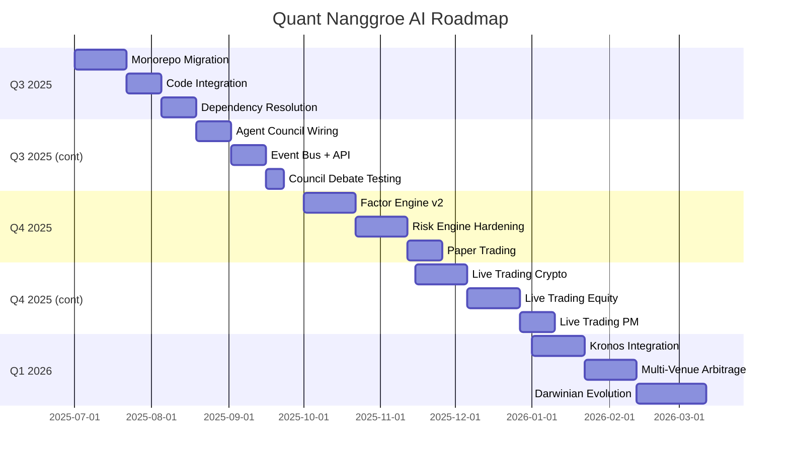

# Quant Nanggroe AI — Development Roadmap

**Version 4.0.0 | Q3 2025 through Q1 2026+**

> Complete roadmap with milestones, KPIs, feature priority, and go/no-go criteria for each development phase.

---

## Table of Contents

1. [Roadmap Overview](#1-roadmap-overview)
2. [Q3 2025: Monorepo Foundation](#2-q3-2025-monorepo-foundation)
3. [Q3 2025: Agent Council Activation](#3-q3-2025-agent-council-activation)
4. [Q4 2025: Engine Hardening](#4-q4-2025-engine-hardening)
5. [Q4 2025: Production Deployment](#5-q4-2025-production-deployment)
6. [Q1 2026: Scale & Intelligence](#6-q1-2026-scale--intelligence)
7. [KPI Dashboard](#7-kpi-dashboard)
8. [Feature Priority Matrix](#8-feature-priority-matrix)

---

## 1. Roadmap Overview



### Key Milestones

| Milestone | Target Date | Description |
|-----------|-------------|-------------|
| **M1: Monorepo Green** | 2025-08-15 | All 21 repos merged, all tests passing |
| **M2: Council Live** | 2025-09-30 | 11-agent council operational with debate |
| **M3: Paper Validated** | 2025-10-31 | 48-hour paper trading passes all checks |
| **M4: Live Trading** | 2025-12-15 | Live crypto trading with $500 capital |
| **M5: Production Scale** | 2026-02-28 | Multi-venue + Kronos + Darwinian evolution |

---

## 2. Q3 2025: Monorepo Foundation

**July 1 – August 15, 2025**

### 2.1 Milestone: M1 — Monorepo Green

### Deliverables

| Deliverable | Description | Target Date | KPI |
|-------------|-------------|-------------|-----|
| Repository merge | All 21 repos merged via git subtree | Jul 21 | 21 repos in monorepo |
| Import normalization | All `quant_nanggroe.xxx` imports resolve | Jul 28 | 0 import errors |
| Dependency consolidation | Single `pyproject.toml` + `poetry.lock` | Aug 4 | `poetry install` succeeds |
| Type system unification | Single `AgentState` + Pydantic models | Aug 4 | 0 duplicate type defs |
| Pydantic v2 migration | All code upgraded from v1 | Aug 8 | `mypy --strict` passes |
| SQLAlchemy 2.0 migration | All DB queries upgraded | Aug 8 | All DB operations work |
| Test suite green | All existing + new tests pass | Aug 15 | ≥175 tests passing |
| Docker build | Full stack builds + starts | Aug 15 | `docker-compose up` works |

### Weekly Breakdown

```
Week 1 (Jul 1-7): Subtree Merge
  ├── Create monorepo branch
  ├── Configure git remotes (21 repos)
  ├── Execute git subtree add for P0-P1 repos (9 repos)
  └── Validate: git log shows subtree merges

Week 2 (Jul 8-14): P2-P3 Merge + Import Fix
  ├── Execute git subtree add for remaining repos (12 repos)
  ├── Normalize all imports to quant_nanggroe.xxx
  ├── Fix circular imports with TYPE_CHECKING
  └── Validate: python -c "from quant_nanggroe import *"

Week 3 (Jul 15-21): Configuration + Dependencies
  ├── Consolidate pyproject.toml
  ├── Consolidate package.json
  ├── Merge all Settings classes
  └── Validate: poetry install succeeds

Week 4 (Jul 22-28): De-duplication
  ├── Remove duplicate MarketDataTool, SentimentTool
  ├── Remove duplicate risk check implementations
  ├── Remove duplicate exchange wrappers
  └── Validate: no duplicate class definitions

Week 5 (Jul 29 - Aug 4): Pydantic Migration
  ├── Upgrade all Pydantic v1 → v2
  ├── Fix @validator → @field_validator
  ├── Fix class Config → model_config = ConfigDict(...)
  └── Validate: mypy --strict passes

Week 6 (Aug 5-15): Testing + Validation
  ├── Write missing tests for new integrations
  ├── Run full pytest suite
  ├── Docker build validation
  └── Validate: all exit criteria met
```

### Risk Gates

| Risk | Probability | Impact | Mitigation |
|------|------------|--------|------------|
| Pydantic v1→v2 breaks legacy repos | High | Medium | Keep legacy repos as frozen `contrib/` |
| Circular imports between modules | Medium | High | Lazy imports + TYPE_CHECKING |
| `poetry install` fails on dependency conflicts | Medium | High | Pin minimum compatible versions |

---

## 3. Q3 2025: Agent Council Activation

**August 16 – September 30, 2025**

### 3.1 Milestone: M2 — Council Live

### Deliverables

| Deliverable | Description | Target Date | KPI |
|-------------|-------------|-------------|-----|
| LangGraph graph operational | TradingGraph compiles + runs | Aug 23 | `graph.invoke()` succeeds |
| 11 agents registered | All agents in AgentRegistry | Aug 30 | `AgentRegistry.list_agents()` returns 11 |
| 9-checkpoint risk gate | RiskCheckGate validates trades | Sep 6 | All 9 checkpoints tested |
| Council debate mechanism | Bull/Bear + Risk debate works | Sep 13 | Debate produces judge decision |
| Redis execution bus | Low-latency order messaging | Sep 13 | Messages < 10ms |
| Redis agent reasoning bus | High-throughput agent events | Sep 20 | Messages < 5s |
| FastAPI routes (6 groups) | All API endpoints operational | Sep 20 | All endpoints return 200 |
| WebSocket streaming | Real-time agent state updates | Sep 27 | Frontend receives updates |
| Audit trail | PostgreSQL audit_events populated | Sep 27 | All state transitions persisted |

### Key Architecture Validation

```
End-to-End Pipeline Test:
  Input: symbols=["BTCUSDT"], trade_date="2025-09-01"
  → Market Analysis: research_output, macro_output, crypto_output, forex_output
  → Signal Generation: signals[], confidence=0.72
  → Risk Assessment: risk_verdict="APPROVED" (all 9 checkpoints pass)
  → Portfolio Optimization: portfolio_output
  → Execution Decision: decisions[]
  → Order Execution: orders_placed[]
  → Reflection: debate_state

  Expected: Full pipeline completes in < 5 seconds
  Kill Switch Test: Verify VETO when risk_pct > 0.005
  Low Confidence Test: Verify council_debate when confidence < 0.65
```

### Exit Criteria

- [ ] `TradingGraph.run(["BTCUSDT"])` completes successfully
- [ ] All 11 agents registered and callable
- [ ] RiskCheckGate VETOES a trade with risk_pct > 0.005
- [ ] Council debate produces structured judge decision
- [ ] All 6 API route groups respond to requests
- [ ] WebSocket delivers real-time updates

---

## 4. Q4 2025: Engine Hardening

**October 1 – October 31, 2025**

### 4.1 Milestone: M3 — Paper Validated

### Deliverables

| Deliverable | Description | Target Date | KPI |
|-------------|-------------|-------------|-----|
| Factor engine v2 | All 469 factors registered + validated | Oct 7 | `registry.health()["loaded"] >= 469` |
| Factor output validation | No inf values, <5% NaN | Oct 7 | All factors produce valid DataFrames |
| Risk engine hardening | Kill switch + drawdown + VaR tested | Oct 14 | All risk methods work |
| Walk-forward validation | 12-month rolling out-of-sample | Oct 21 | Walk-forward Sharpe ≥ 1.0 |
| 48-hour paper trading | Continuous paper trading session | Oct 28 | No crashes, all orders tracked |
| Execution reality validation | Slippage/spread/latency models | Oct 31 | Model deviation < 20% |

### Paper Trading Configuration

```
Paper Trading Session:
  Broker: PaperExchangeBroker
  Initial Capital: $100,000
  Commission Rate: 0.001 (0.1%)
  Slippage: 5 bps
  Symbols: BTCUSDT, ETHUSDT, SOLUSDT
  Duration: 48 hours continuous
  
  Constitutional Limits (HARDCODED):
    max_risk_per_trade: 0.005 (0.5%)
    max_daily_loss: 0.01 (1%)
    max_weekly_loss: 0.03 (3%)
    min_risk_reward: 2.0 (1:2 R:R)
    max_daily_trades: 5
    max_drawdown: 0.15 (15%)
```

### Exit Criteria

- [ ] 48-hour paper trading with zero unhandled exceptions
- [ ] Kill switch activates correctly on daily loss limit breach
- [ ] All 9 risk checkpoints VETO invalid trades
- [ ] Walk-forward Sharpe ratio ≥ 1.0
- [ ] FactorRegistry loads 469+ factors with 0 failures
- [ ] Execution reality model deviation from paper trading < 20%

---

## 5. Q4 2025: Production Deployment

**November 1 – December 31, 2025**

### 5.1 Milestone: M4 — Live Trading

### Deliverables

| Deliverable | Description | Target Date | KPI |
|-------------|-------------|-------------|-----|
| Production Docker images | Hardened, minimal images | Nov 7 | Trivy scan clean |
| Live crypto trading (Binance) | $500 initial capital | Nov 15 | First live trade executed |
| Live crypto trading (Bybit) | Secondary venue | Nov 30 | Cross-venue routing works |
| Live equity trading (Alpaca) | US equities paper → live | Dec 7 | Alpaca orders fill |
| Live prediction markets (Polymarket) | Prediction market trading | Dec 15 | PM orders execute |
| Monitoring + alerting | Prometheus + Grafana + PagerDuty | Dec 7 | Dashboards live |
| Disaster recovery | Automated backup + failover | Dec 21 | DR test passes |

### Live Trading Rollout Plan

```
Phase 1 (Nov 1-7): Infrastructure
  ├── Build hardened Docker images (distroless base)
  ├── Deploy to production server
  ├── Configure monitoring (Prometheus + Grafana)
  └── Configure alerting (PagerDuty for kill switch, daily loss > 0.5%)

Phase 2 (Nov 8-15): Controlled Live
  ├── Deploy with $500 initial capital
  ├── Feature flags: ENABLE_LIVE_TRADING=true, ENABLE_KILL_SWITCH=true
  ├── Conservative settings: max 3 trades/day, max 1 position
  ├── Monitor continuously for 72 hours
  └── Daily review of execution quality + decision quality

Phase 3 (Nov 16-30): Multi-Venue
  ├── Enable Bybit as secondary crypto venue
  ├── Enable cross-venue smart order routing
  └── Portfolio-level risk management across venues

Phase 4 (Dec 1-15): Expansion
  ├── Enable Alpaca for US equity trading
  ├── Enable Polymarket for prediction markets
  └── Full portfolio risk across all venues

Phase 5 (Dec 16-31): Scaling
  ├── Increase capital allocation based on performance
  ├── Enable multi-position mode (max 3 concurrent)
  ├── Enable multi-symbol trading (BTC, ETH, SOL)
  └── Automated Darwinian strategy lifecycle
```

### Exit Criteria

- [ ] Live trading runs for 30 days without system failure
- [ ] Daily loss limit (1%) never breached
- [ ] Weekly loss limit (3%) never breached
- [ ] Kill switch activates within 5 seconds of limit breach
- [ ] All audit events are persisted and queryable
- [ ] Monitoring dashboards are live and accurate

---

## 6. Q1 2026: Scale & Intelligence

**January 1 – March 31, 2026**

### 6.1 Milestone: M5 — Production Scale

### Deliverables

| Deliverable | Description | Target Date | KPI |
|-------------|-------------|-------------|-----|
| Kronos C++ integration | PyO3 bindings for low-latency execution | Jan 15 | Bridge latency < 5ms |
| Multi-venue arbitrage | Cross-venue price detection | Feb 1 | Arbitrage signals generated |
| Darwinian evolution | Strategy lifecycle management | Feb 15 | Strategy auto-kill on negative expectancy |
| Memory system v2 | Episodic + Pattern + Knowledge Graph | Mar 1 | Memory retrieval < 100ms |
| Reinforcement learning | FinRL-based strategy optimization | Mar 15 | RL agent outperforms baseline |
| Advanced factor synthesis | GpLearn symbolic regression | Mar 31 | New alpha factors discovered |

### Kronos Integration Plan

```
Week 1-2: Build
  ├── Build Kronos C++ library
  ├── Generate PyO3 bindings
  ├── Write Python wrapper for order submission
  └── Benchmark: Python → PyO3 → C++ → Exchange round-trip

Week 3: Integration
  ├── Replace ccxt hot path with Kronos for supported venues
  ├── Fallback: verify ccxt Python execution still works
  └── End-to-end test with paper trading

Week 4: Validation
  ├── Latency benchmark: < 5ms bridge + < 50ms exchange = < 55ms total
  ├── Reliability test: 1000 consecutive orders without error
  └── Failover test: Kronos → ccxt fallback works
```

### Darwinian Strategy Evolution

```
Strategy Lifecycle States:
  INCUBATING → TESTING → LIVE → KILLED

  Incubating: Strategy under development
  Testing: Walk-forward validation in progress
  Live: Active in production with allocated capital
  Killed: Negative expectancy over statistically significant sample

  Auto-kill Trigger:
    - Expectancy < 0 over last 100 trades
    - Max drawdown > 15% (constitutional)
    - Sharpe ratio < 0.5 over last 30 days
```

---

## 7. KPI Dashboard

### 7.1 System Health KPIs

| KPI | Target | Measurement | Frequency |
|-----|--------|-------------|-----------|
| Test pass rate | 100% | `pytest --tb=short` | Every commit |
| Type check errors | 0 | `mypy --strict` | Every commit |
| Lint violations | 0 | `ruff check` | Every commit |
| Factor load rate | 100% (469/469) | `registry.health()["loaded"]` | Daily |
| Exchange connectivity | 8/8 | `factory.list_supported_exchanges()` | Hourly |
| API response time | < 200ms p95 | API metrics | Continuous |
| WebSocket latency | < 100ms | Client measurement | Continuous |

### 7.2 Trading Performance KPIs

| KPI | Target | Measurement | Frequency |
|-----|--------|-------------|-----------|
| Daily max drawdown | < 1% (constitutional) | RiskManager.status() | Per trade |
| Weekly max drawdown | < 3% (constitutional) | RiskManager.status() | Per trade |
| Kill switch activation | Only on limit breach | Audit trail | Continuous |
| VaR 95% violation rate | < 5% | Backtest vs. realized | Weekly |
| Sharpe ratio | ≥ 1.0 (walk-forward) | Backtest engine | Monthly |
| Win rate | ≥ 55% | Trade journal | Weekly |
| Average R:R achieved | ≥ 1.5:1 | Trade journal | Weekly |
| Execution slippage | < 10bps | Fill price vs. signal price | Per trade |
| Decision-to-fill latency | < 3s | Timestamps | Per trade |
| Council debate trigger rate | < 30% of trades | Agent state log | Weekly |

### 7.3 Risk KPIs

| KPI | Target | Measurement | Frequency |
|-----|--------|-------------|-----------|
| Max risk per trade | ≤ 0.5% (constitutional) | RiskCheckGate checkpoint 1 | Per trade |
| Correlated positions | ≤ 3 (constitutional) | RiskCheckGate checkpoint 9 | Per trade |
| Kelly fraction used | ≤ HALF_KELLY | RiskManager.calculate_kelly_size() | Per trade |
| ATR stop distance | 2× ATR14 | RiskManager.atr_position_size() | Per trade |
| Stress test pass | All 6 scenarios | RiskManager.stress_test() | Daily |

---

## 8. Feature Priority Matrix

### 8.1 Priority Classification

| Priority | Description | Examples |
|----------|-------------|----------|
| **P0** | Must have for production | Constitutional risk, kill switch, 9-checkpoint gate, LangGraph graph |
| **P1** | Should have for launch | Council debate, ATR sizing, factor registry, exchange factory |
| **P2** | Nice to have at launch | Walk-forward validation, stress testing, memory system |
| **P3** | Future enhancement | Kronos C++, RL strategies, Darwinian evolution, multi-venue arbitrage |

### 8.2 Feature Priority by Quarter

| Feature | Q3 2025 | Q4 2025 | Q1 2026 |
|---------|---------|---------|---------|
| LangGraph trading graph | **P0** | ✅ | ✅ |
| 11-agent council | **P0** | ✅ | ✅ |
| 9-checkpoint risk gate | **P0** | ✅ | ✅ |
| Constitutional limits | **P0** | ✅ | ✅ |
| Kill switch | **P0** | ✅ | ✅ |
| FactorRegistry (469 factors) | **P1** | ✅ | ✅ |
| ExchangeFactory (8 exchanges) | **P1** | ✅ | ✅ |
| Council debate mechanism | **P1** | ✅ | ✅ |
| ATR position sizing | **P1** | ✅ | ✅ |
| Kelly Criterion sizing | **P1** | ✅ | ✅ |
| Dual-bus architecture | **P2** | ✅ | ✅ |
| Walk-forward validation | **P2** | **P1** | ✅ |
| Stress testing (6 scenarios) | **P2** | **P1** | ✅ |
| VaR/CVaR calculation | **P1** | ✅ | ✅ |
| Memory system (3-layer) | **P2** | **P2** | **P1** |
| Paper trading validation | — | **P0** | ✅ |
| Live trading (crypto) | — | **P0** | ✅ |
| Live trading (equity) | — | **P1** | ✅ |
| Live trading (prediction) | — | **P2** | ✅ |
| Kronos C++ execution | — | — | **P3** |
| Darwinian evolution | — | — | **P3** |
| Multi-venue arbitrage | — | — | **P3** |
| RL strategy optimization | — | — | **P3** |
| GpLearn factor synthesis | — | — | **P3** |

---

*© 2025-2026 Quant Nanggroe AI | Roadmap v4.0.0*
