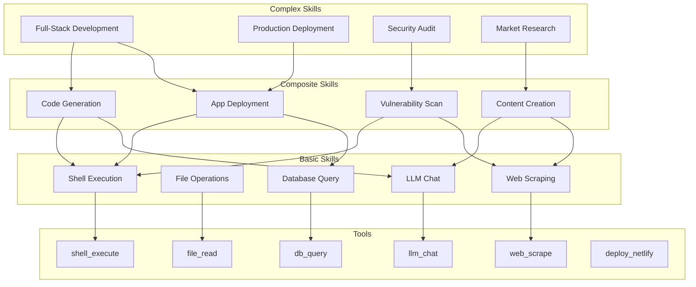
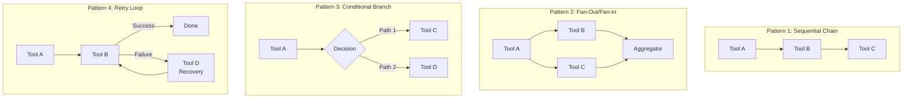
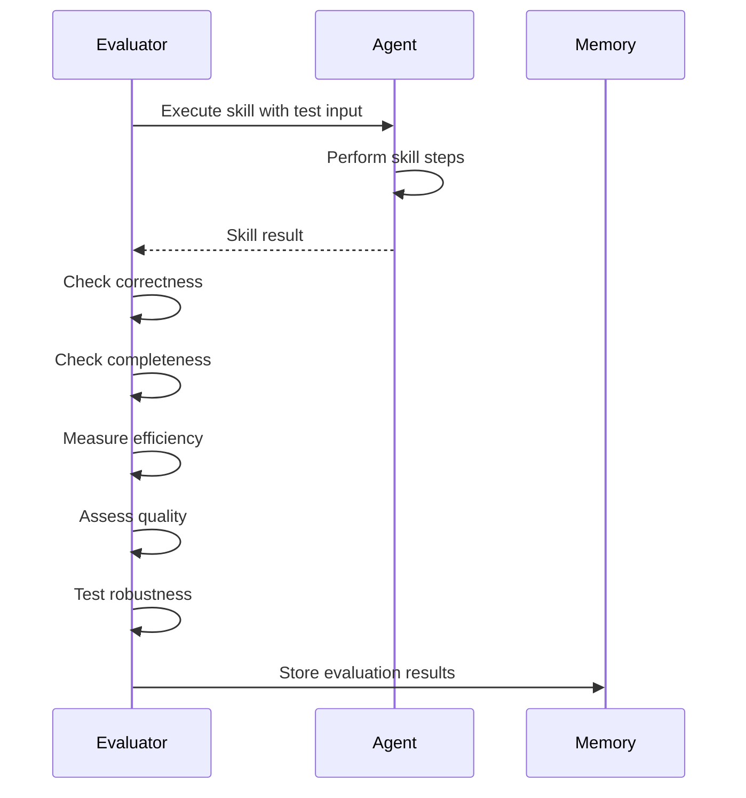
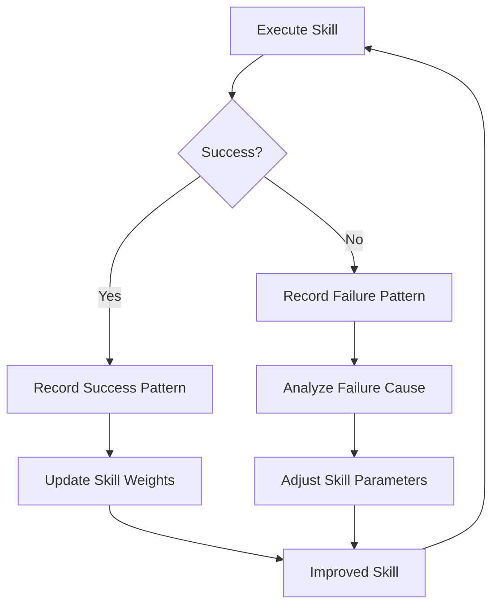

# Skill Registry — AI-MultiColony-Ecosystem

> Complete catalog of skills, their composition from tools, evaluation criteria, and learning mechanisms
> Version 2.0.0 | Cluster 2 — AI-MULTICOLONY-ECOSYSTEM

---

## Table of Contents

1. [Overview](#overview)
2. [Skill Definition](#skill-definition)
3. [Available Skills](#available-skills)
4. [Skill Composition](#skill-composition)
5. [Skill Evaluation Criteria](#skill-evaluation-criteria)
6. [Skill Learning and Improvement](#skill-learning-and-improvement)
7. [Skill-to-Agent Mapping](#skill-to-agent-mapping)
8. [Skill Benchmarking](#skill-benchmarking)

---

## Overview

Skills are higher-order capabilities built by composing one or more tools. While tools are atomic operations (e.g., "execute shell command"), skills represent meaningful task outcomes (e.g., "deploy a web application"). The skill registry provides a structured catalog of all available skills, their tool compositions, and quality metrics.

### Skill Hierarchy



### Key Concepts

| Concept | Definition | Example |
|---------|-----------|---------|
| **Skill** | A named, composable capability | "Deploy to Netlify" |
| **Tool** | An atomic operation | `deploy_netlify` |
| **Composition** | How tools combine into skills | Shell → Build → Deploy |
| **Complexity** | Number of tools and steps | Low (1-2), Medium (3-5), High (6+) |
| **Reliability** | Historical success rate | 95% = high reliability |

---

## Skill Definition

### Skill Schema

```python
class SkillDefinition:
    name: str                    # Unique skill identifier
    description: str             # Human-readable description
    category: str                # Skill category
    tools_used: List[str]        # List of tool names composed
    agents_capable: List[str]    # Agents that can execute this skill
    complexity: str              # low, medium, high, very_high
    reliability: float           # 0.0 to 1.0 success rate
    avg_execution_time: float    # Average time in seconds
    prerequisites: List[str]     # Required skills to be available first
    input_schema: Dict           # Expected input format
    output_schema: Dict          # Expected output format
    evaluation_criteria: Dict    # Quality metrics and thresholds
```

---

## Available Skills

### Coding Skills

| Skill Name | Description | Tools Used | Complexity | Reliability | Agents |
|-----------|-------------|------------|------------|-------------|--------|
| `code_generation` | Generate code from specifications using LLM | `llm_chat`, `file_write` | Medium | 85% | Fullstack Dev, Code Executor |
| `code_review` | Review code quality and suggest improvements | `file_read`, `llm_chat`, `memory_store` | Medium | 90% | Quality Control |
| `code_execution` | Execute code in sandboxed environment | `python_execute`, `shell_execute` | Low | 95% | Code Executor, CyberShell |
| `project_scaffolding` | Create project from template with features | `project_scaffold`, `shell_execute`, `file_write` | Medium | 92% | Dev Engine, Fullstack Dev |
| `bug_fixing` | Identify and fix bugs in code | `file_read`, `llm_chat`, `code_execution`, `file_write` | High | 78% | Bug Hunter, Fullstack Dev |
| `refactoring` | Restructure code for better quality | `file_read`, `llm_chat`, `code_execution`, `file_write`, `test_run` | High | 75% | Quality Control, Fullstack Dev |
| `test_writing` | Generate and run test suites | `llm_chat`, `file_write`, `test_run` | Medium | 82% | Quality Control |
| `git_management` | Version control operations | `git_operation`, `shell_execute` | Low | 98% | CyberShell |

### Debugging Skills

| Skill Name | Description | Tools Used | Complexity | Reliability | Agents |
|-----------|-------------|------------|------------|-------------|--------|
| `error_analysis` | Analyze error messages and stack traces | `llm_chat`, `memory_retrieve`, `file_read` | Medium | 88% | Agent 04, Bug Hunter |
| `log_analysis` | Parse and analyze application logs | `log_analyze`, `llm_chat` | Medium | 85% | System Optimizer |
| `performance_profiling` | Profile application performance | `system_monitor`, `process_list`, `llm_chat` | High | 80% | Agent 02, System Optimizer |
| `dependency_debugging` | Resolve package dependency conflicts | `shell_execute`, `llm_chat`, `file_read` | Medium | 82% | CyberShell, Fullstack Dev |

### Deploying Skills

| Skill Name | Description | Tools Used | Complexity | Reliability | Agents |
|-----------|-------------|------------|------------|-------------|--------|
| `deploy_static` | Deploy static site to hosting | `shell_execute`, `deploy_netlify` | Low | 90% | Deploy Manager |
| `deploy_serverless` | Deploy to serverless platform | `shell_execute`, `deploy_vercel` | Medium | 88% | Deploy Manager |
| `deploy_container` | Build and deploy Docker container | `shell_execute`, `deploy_docker` | Medium | 92% | Deploy Manager |
| `deploy_fullstack` | Deploy full-stack app (frontend + backend + DB) | `shell_execute`, `deploy_railway`, `db_migrate`, `service_check` | High | 75% | Deploy Manager, Fullstack Dev |
| `deploy_cloud` | Deploy to cloud (AWS/GCP) | `shell_execute`, `deploy_aws`, `deploy_gcp`, `service_check` | High | 70% | Deploy Manager |
| `rollback_deployment` | Rollback failed deployment | `shell_execute`, `deploy_*`, `service_check` | Medium | 85% | Deploy Manager |
| `health_monitoring` | Monitor deployed service health | `service_check`, `system_monitor`, `memory_store` | Low | 95% | Deploy Manager, Commander AGI |

### Testing Skills

| Skill Name | Description | Tools Used | Complexity | Reliability | Agents |
|-----------|-------------|------------|------------|-------------|--------|
| `unit_testing` | Create and run unit tests | `llm_chat`, `file_write`, `test_run` | Medium | 85% | Quality Control |
| `integration_testing` | Test component interactions | `llm_chat`, `file_write`, `test_run`, `api_test` | High | 78% | Quality Control |
| `e2e_testing` | End-to-end test suites | `web_navigate`, `api_test`, `llm_chat`, `file_write` | High | 72% | Quality Control, Web Automation |
| `load_testing` | Performance under load | `shell_execute`, `api_test`, `system_monitor` | High | 80% | System Optimizer |
| `security_testing` | Find security vulnerabilities | `vulnerability_scan`, `port_scan`, `ssl_check`, `llm_chat` | High | 75% | Bug Hunter |

### Research Skills

| Skill Name | Description | Tools Used | Complexity | Reliability | Agents |
|-----------|-------------|------------|------------|-------------|--------|
| `web_research` | Research topics using web sources | `web_scrape`, `llm_chat`, `knowledge_enrich`, `memory_store` | Medium | 88% | AI Research Agent |
| `paper_analysis` | Analyze academic papers | `research_search`, `llm_chat`, `memory_store` | High | 82% | AI Research Agent |
| `trend_analysis` | Identify technology trends | `research_search`, `web_scrape`, `llm_chat`, `knowledge_enrich` | High | 80% | AI Research Agent |
| `competitive_analysis` | Analyze competitive landscape | `web_scrape`, `llm_chat`, `memory_store`, `knowledge_enrich` | High | 78% | Marketing Agent, AI Research |
| `market_research` | Research market conditions | `web_scrape`, `llm_chat`, `knowledge_enrich`, `db_query` | High | 75% | Marketing Agent |

### Marketing Skills

| Skill Name | Description | Tools Used | Complexity | Reliability | Agents |
|-----------|-------------|------------|------------|-------------|--------|
| `content_creation` | Generate marketing content | `llm_chat`, `file_write`, `memory_retrieve` | Medium | 85% | Marketing Agent |
| `social_media_post` | Create and schedule social media posts | `llm_chat`, `http_request`, `memory_store` | Low | 90% | Marketing Agent |
| `seo_optimization` | Optimize content for search engines | `web_scrape`, `llm_chat`, `file_write` | Medium | 80% | Marketing Agent |
| `campaign_management` | Create and manage marketing campaigns | `llm_chat`, `http_request`, `db_query`, `memory_store` | High | 78% | Marketing Agent |
| `brand_monitoring` | Monitor brand mentions and sentiment | `web_scrape`, `llm_chat`, `memory_store`, `knowledge_enrich` | Medium | 82% | Marketing Agent |

---

## Skill Composition

### Composition Patterns



### Composition Example: Full Deployment

```
Skill: deploy_fullstack
├── Step 1: shell_execute (npm install)
│   ├── Tool: shell_execute
│   └── On Failure: → Retry (up to 3 times)
├── Step 2: shell_execute (npm run build)
│   ├── Tool: shell_execute
│   └── On Failure: → bug_fixing skill
├── Step 3: db_migrate (run migrations)
│   ├── Tool: db_migrate
│   └── On Failure: → rollback
├── Step 4: deploy_railway (deploy backend)
│   ├── Tool: deploy_railway
│   └── On Failure: → rollback_deployment
├── Step 5: deploy_vercel (deploy frontend)
│   ├── Tool: deploy_vercel
│   └── On Failure: → rollback_deployment
└── Step 6: service_check (verify health)
    ├── Tool: service_check
    └── On Failure: → rollback_deployment
```

---

## Skill Evaluation Criteria

### Quality Dimensions

| Dimension | Weight | Measurement | Threshold |
|-----------|--------|-------------|-----------|
| **Correctness** | 30% | Task completed successfully | > 90% success rate |
| **Completeness** | 20% | All subtasks addressed | > 85% coverage |
| **Efficiency** | 15% | Time to complete vs estimate | < 1.5x estimate |
| **Quality** | 20% | Output quality (code, content, etc.) | > 85% quality score |
| **Robustness** | 15% | Handles edge cases and errors | > 80% error recovery |

### Evaluation Process



### Scoring Formula

```
skill_score = (correctness * 0.30) + 
              (completeness * 0.20) + 
              (efficiency * 0.15) + 
              (quality * 0.20) + 
              (robustness * 0.15)
```

| Score Range | Rating | Action |
|-------------|--------|--------|
| 90-100 | Excellent | Production ready |
| 75-89 | Good | Minor improvements needed |
| 60-74 | Adequate | Significant improvements needed |
| 0-59 | Poor | Requires redesign |

---

## Skill Learning and Improvement

### Learning Mechanisms

| Mechanism | Description | Implementation |
|-----------|-------------|---------------|
| **Performance Tracking** | Track success/failure of each skill execution | `Agent.performance_metrics` |
| **Pattern Recognition** | Identify successful tool composition patterns | `AISelector.optimize_selection_weights()` |
| **Feedback Integration** | Learn from user feedback on skill results | `MemoryManager.store_agent_result()` |
| **Self-Optimization** | Adjust skill parameters based on history | `AISelector.capability_weights` |
| **Meta-Learning** | Meta Agent Creator improves templates | `MetaAgentCreator._select_best_template()` |

### Improvement Cycle



### Weight Optimization Algorithm

The `AISelector.optimize_selection_weights()` method adjusts capability weights:

```python
for capability in self.capability_weights:
    success_with_cap = count_successful_selections(capability)
    total_with_cap = count_total_selections(capability)
    
    if total_with_cap > 10:  # Need sufficient data
        success_rate = success_with_cap / total_with_cap
        
        if success_rate > 0.8:
            weight *= 1.1   # Increase weight
        elif success_rate < 0.6:
            weight *= 0.9   # Decrease weight
        
        # Clamp to [0.1, 2.0] range
        weight = max(0.1, min(2.0, weight))
```

---

## Skill-to-Agent Mapping

### Agent Skill Profiles

| Agent | Primary Skills | Secondary Skills | Skill Count |
|-------|---------------|-----------------|-------------|
| Agent Base | task_coordination, delegation | planning, analysis | 4 |
| CyberShell | shell_execution, file_operations, process_management | git_management, log_analysis | 8 |
| Deploy Manager | deploy_static, deploy_container, deploy_fullstack, rollback | health_monitoring | 8 |
| Fullstack Dev | code_generation, project_scaffolding, deploy_fullstack | test_writing, bug_fixing | 9 |
| AI Research | web_research, paper_analysis, trend_analysis | competitive_analysis | 5 |
| Marketing | content_creation, social_media_post, campaign_management | seo_optimization, brand_monitoring | 5 |
| Bug Hunter | security_testing, vulnerability_scan, error_analysis | log_analysis, dependency_debugging | 5 |
| Quality Control | code_review, unit_testing, integration_testing | refactoring, test_writing | 6 |
| Commander AGI | health_monitoring, error_analysis | performance_profiling | 4 |
| System Optimizer | performance_profiling, log_analysis | load_testing | 4 |

---

## Skill Benchmarking

### 25+ Framework Benchmarks

| Framework | Skill Category | Benchmark Focus | Integration Status |
|-----------|---------------|----------------|-------------------|
| LangGraph | Orchestration | Graph-based workflow execution | ✅ Implemented |
| CrewAI | Collaboration | Crew-based task delegation | ✅ Implemented |
| AutoGen | Conversation | Multi-agent group chat | ✅ Implemented |
| PydanticAI | Validation | Type-safe agent I/O | Planned |
| DSPy | Prompting | Prompt optimization | Planned |
| SmolAgents | Lightweight | Minimal agent framework | Planned |
| Semantic Kernel | Enterprise | .NET/Java/Python integration | Planned |
| Haystack | RAG | Document retrieval & generation | Planned |
| LlamaIndex | Indexing | Document indexing & querying | Planned |
| LangChain | Chaining | Sequential LLM calls | Planned |
| MetaGPT | Software Dev | Multi-agent SDLC | Planned |
| ChatDev | Dev Chat | Chat-driven development | Planned |
| OpenDevin | Coding | Autonomous coding agent | Planned |
| Devin | Coding | Full autonomous developer | Planned |
| SWE-Agent | SWE | Software engineering tasks | Planned |
| AgentGPT | Planning | Goal decomposition | Planned |
| BabyAGI | Task Management | Task-driven execution | Planned |
| AutoGPT | Autonomy | Self-directed agent | Planned |
| SuperAGI | Framework | Agent framework | Planned |
| CrewAI Tools | Tooling | Extended tool library | Planned |
| Composio | Integration | Service integrations | Planned |
| Toolhouse | Tooling | Tool management | Planned |
| Mintlify | Documentation | Auto-documentation | Planned |
| ReAct | Reasoning | Reasoning + Acting | Planned |

### Benchmark Metrics

| Metric | Measurement Method | Target |
|--------|-------------------|--------|
| Skill Execution Time | Wall clock from start to finish | < 60s for medium complexity |
| Skill Success Rate | Successful completions / total attempts | > 90% |
| Skill Quality Score | Automated quality assessment | > 85% |
| Agent Utilization | Time agent is active / total time | > 70% |
| Memory Efficiency | Memory used / memory available | < 80% |
| Tool Reuse | Reused tools / total tools available | > 60% |

---

*This skill registry document is maintained as part of the AI-MultiColony-Ecosystem project. Last updated: 2025-07-13.*
