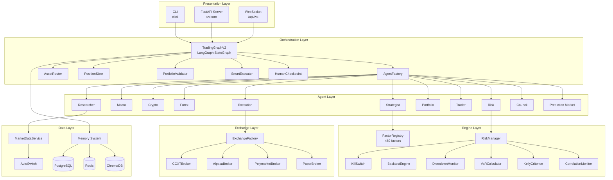
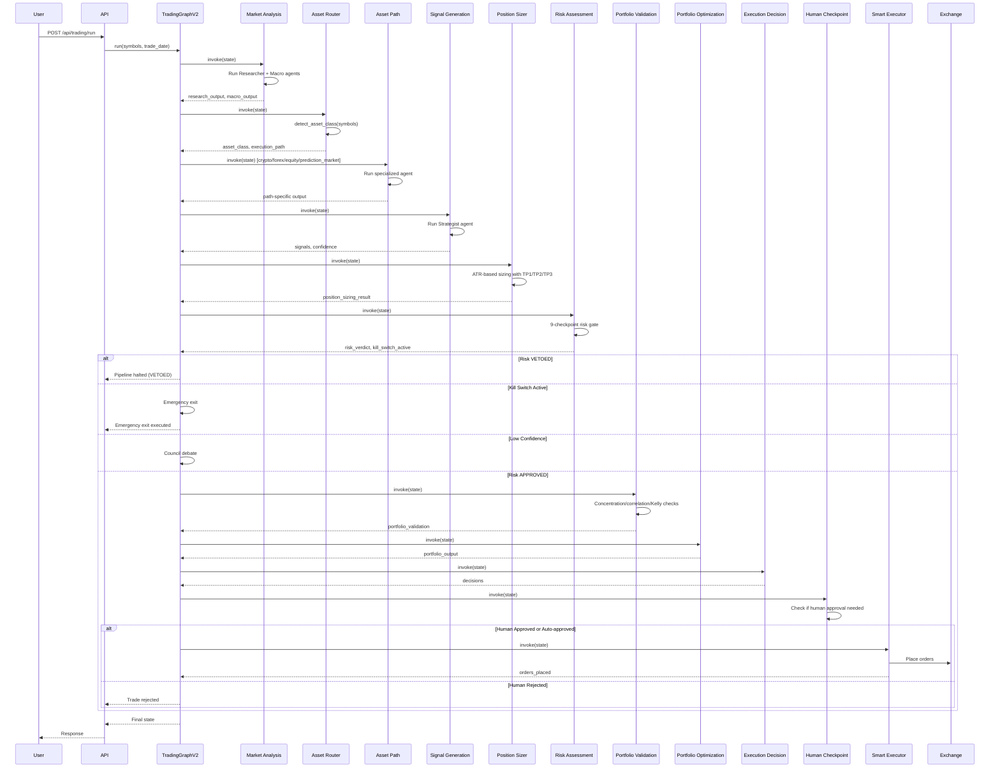
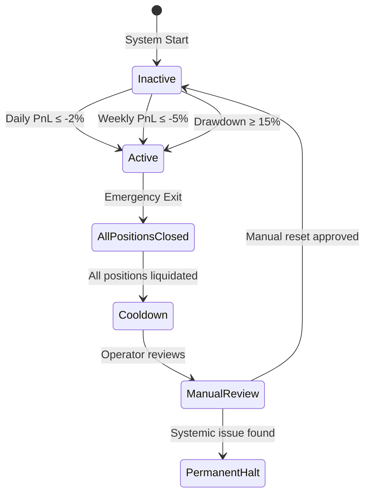
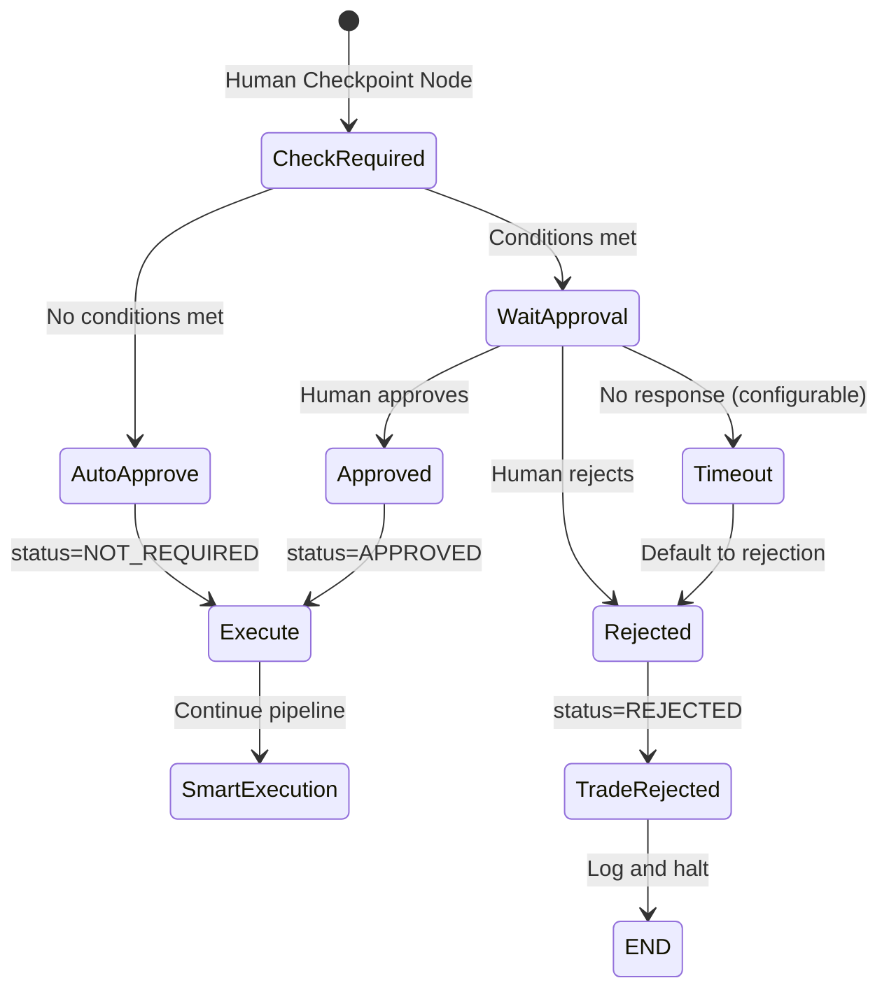
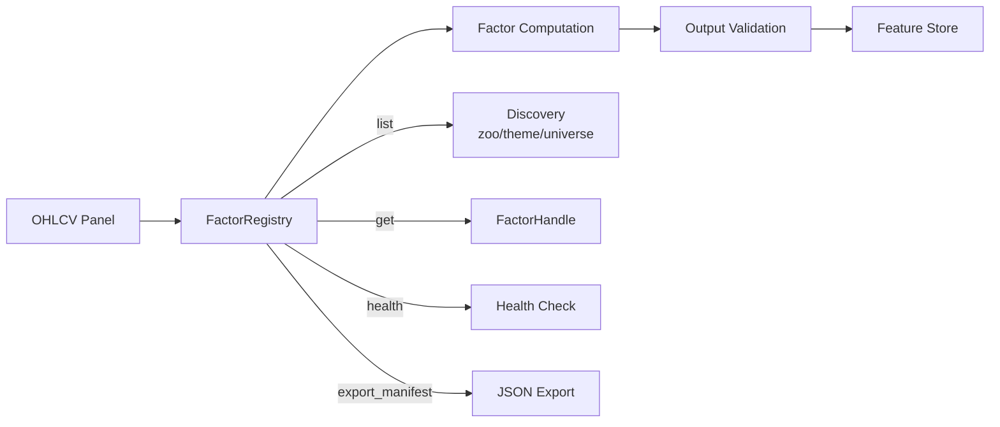
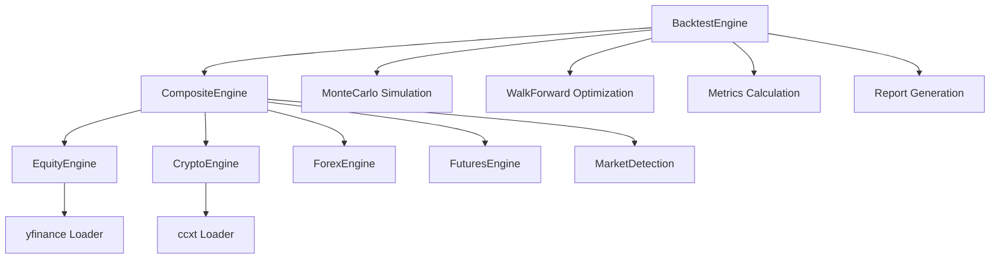

# Quant Nanggroe AI — System Design Document

**Version 4.0.0 | Detailed Technical Design**

> This document provides the detailed technical design of the Quant Nanggroe AI system, including component diagrams, data flow, state management, risk limits, routing logic, position sizing, smart order routing, and human-in-the-loop checkpoints.

---

## Table of Contents

1. [Component Architecture](#1-component-architecture)
2. [Data Flow Diagrams](#2-data-flow-diagrams)
3. [State Management (AgentState)](#3-state-management-agentstate)
4. [Constitutional Risk Limits](#4-constitutional-risk-limits)
5. [Multi-Path Routing Logic](#5-multi-path-routing-logic)
6. [Position Sizing (ATR-Based with TP1/TP2/TP3)](#6-position-sizing-atr-based-with-tp1tp2tp3)
7. [Smart Order Routing](#7-smart-order-routing)
8. [Human-in-the-Loop Checkpoints](#8-human-in-the-loop-checkpoints)
9. [Council Debate System](#9-council-debate-system)
10. [Factor Pipeline Design](#10-factor-pipeline-design)
11. [Backtest Engine Design](#11-backtest-engine-design)
12. [Memory System Design](#12-memory-system-design)
13. [Security Design](#13-security-design)
14. [Error Handling & Recovery](#14-error-handling--recovery)
15. [Performance Considerations](#15-performance-considerations)

---

## 1. Component Architecture

### High-Level Component Diagram



### Component Dependency Matrix

| Component | Depends On | Used By |
|---|---|---|
| TradingGraphV2 | AgentFactory, AssetRouter, PositionSizer, PortfolioValidator, SmartExecutor, HumanCheckpoint | API, CLI, Worker |
| AgentFactory | base.create_llm, agent modules | TradingGraphV2 |
| AssetRouter | state.AssetClass | TradingGraphV2 |
| PositionSizer | state.PositionSizingResult | TradingGraphV2 |
| RiskManager | RiskCheckGate, KillSwitch, DrawdownMonitor, KellyCriterion, VaRCalculator | Risk Agent |
| FactorRegistry | AlphaFactor, FactorMeta, factor modules | Strategist Agent |
| ExchangeFactory | ExchangeConfig, CCXTBroker, AlpacaBroker, PolymarketBroker, PaperBroker | Execution Agent |

---

## 2. Data Flow Diagrams

### Complete Trading Pipeline Data Flow



### Data Flow Through AgentState

The `AgentState` TypedDict flows through the entire graph, with each node reading and writing specific fields:

| Node | Reads | Writes |
|---|---|---|
| `market_analysis` | symbols, trade_date, market_data | research_output, macro_output, agent_outputs |
| `asset_router` | symbols | asset_class, execution_path |
| `crypto_path` | symbols, market_data, research_output | crypto_output |
| `forex_path` | symbols, market_data, research_output | forex_output |
| `equity_path` | research_output, macro_output | (metadata enrichment) |
| `prediction_market_path` | symbols | prediction_market_output |
| `signal_generation` | All agent outputs, market_data | signals, strategist_output, confidence |
| `position_sizer` | signals, portfolio_state | position_sizing_result |
| `risk_assessment` | signals, position_sizing_result, portfolio_state | risk_assessment, risk_verdict, kill_switch_active |
| `council_debate` | signals, agent_outputs, confidence | debate_state, council_result, decisions |
| `portfolio_validation` | position_sizing_result, portfolio_state | portfolio_validation |
| `portfolio_optimization` | signals, risk_assessment, portfolio_state | portfolio_output |
| `execution_decision` | signals, risk_assessment, portfolio_output | decisions, trader_output |
| `human_checkpoint` | decisions, risk_assessment | human_approval_status |
| `smart_execution` | decisions, venue_scores, smart_routing_result | execution_output, orders_placed |
| `reflection` | All outputs | debate_state |

---

## 3. State Management (AgentState)

The `AgentState` TypedDict is the central state object that flows through the LangGraph graph. It is defined in `quant_nanggroe/agents/state.py`.

### Complete AgentState Schema

```python
class AgentState(TypedDict):
    # ── Core Identification ────────────────────────────
    symbols: Annotated[List[str], "List of trading symbols"]
    trade_date: Annotated[str, "Current trading date (YYYY-MM-DD)"]

    # ── Market Data ─────────────────────────────────────
    market_data: Annotated[Dict[str, Any], "Market data by symbol"]

    # ── Agent Outputs (Analysis Phase) ──────────────────
    research_output: Annotated[str, "Research agent output"]
    macro_output: Annotated[str, "Macro agent output"]
    crypto_output: Annotated[str, "Crypto agent output"]
    forex_output: Annotated[str, "Forex agent output"]
    prediction_market_output: Annotated[str, "Prediction market agent output"]

    # ── V2 Multi-Path Routing ──────────────────────────
    asset_class: Annotated[str, "Detected asset class"]
    execution_path: Annotated[str, "Selected execution path"]

    # ── Signal Generation ───────────────────────────────
    signals: Annotated[List[Dict[str, Any]], "Generated trading signals"]
    strategist_output: Annotated[str, "Strategist agent output"]

    # ── Risk Assessment ─────────────────────────────────
    risk_assessment: Annotated[Dict[str, Any], "Risk assessment results"]
    risk_verdict: Annotated[str, "APPROVED/VETOED/KILL_SWITCH"]

    # ── V2 Position Sizing ─────────────────────────────
    position_sizing_result: Annotated[Dict[str, Any], "ATR-based sizing"]

    # ── V2 Portfolio Validation ─────────────────────────
    portfolio_validation: Annotated[Dict[str, Any], "Validation result"]

    # ── Portfolio ───────────────────────────────────────
    portfolio_state: Annotated[Dict[str, Any], "Current portfolio state"]
    portfolio_output: Annotated[str, "Portfolio agent output"]

    # ── Trading Decision ────────────────────────────────
    decisions: Annotated[List[Dict[str, Any]], "Final trading decisions"]
    trader_output: Annotated[str, "Trader agent output"]

    # ── Execution ───────────────────────────────────────
    execution_output: Annotated[str, "Execution agent output"]
    orders_placed: Annotated[List[Dict[str, Any]], "Orders placed"]

    # ── V2 Smart Order Routing ─────────────────────────
    venue_scores: Annotated[List[Dict[str, Any]], "Venue scores"]
    smart_routing_result: Annotated[Dict[str, Any], "SOR result"]

    # ── V2 Human-in-the-Loop ───────────────────────────
    human_approval_required: Annotated[bool, "Whether human approval needed"]
    human_approval_status: Annotated[str, "PENDING/APPROVED/REJECTED/TIMEOUT"]
    human_approval_reason: Annotated[str, "Reason for requiring approval"]

    # ── Council / Debate ────────────────────────────────
    debate_state: Annotated[Dict[str, Any], "Current debate state"]
    council_result: Annotated[Dict[str, Any], "Council voting result"]

    # ── All Agent Outputs ───────────────────────────────
    agent_outputs: Annotated[Dict[str, Any], "All outputs by name"]

    # ── Control Flow ────────────────────────────────────
    iteration: Annotated[int, "Current iteration count"]
    confidence: Annotated[float, "Overall confidence"]
    kill_switch_active: Annotated[bool, "Kill switch state"]
    should_halt: Annotated[bool, "Whether to halt"]

    # ── Metadata ────────────────────────────────────────
    metadata: Annotated[Dict[str, Any], "Additional metadata"]
    sender: Annotated[str, "Last sender agent"]
```

### Initial State Factory

```python
def create_initial_state(symbols: List[str], trade_date: str) -> Dict[str, Any]:
    return {
        "symbols": symbols,
        "trade_date": trade_date,
        "market_data": {},
        "research_output": "",
        "macro_output": "",
        "crypto_output": "",
        "forex_output": "",
        "prediction_market_output": "",
        "asset_class": AssetClass.UNKNOWN.value,
        "execution_path": "equity_path",
        "signals": [],
        "strategist_output": "",
        "risk_assessment": {},
        "risk_verdict": RiskVerdict.VETOED.value,
        "position_sizing_result": {},
        "portfolio_validation": {},
        "portfolio_state": {},
        "portfolio_output": "",
        "decisions": [],
        "trader_output": "",
        "execution_output": "",
        "orders_placed": [],
        "venue_scores": [],
        "smart_routing_result": {},
        "human_approval_required": False,
        "human_approval_status": "NOT_REQUIRED",
        "human_approval_reason": "",
        "debate_state": {
            "bull_history": "",
            "bear_history": "",
            "history": "",
            "current_response": "",
            "judge_decision": "",
            "count": 0,
        },
        "council_result": {},
        "agent_outputs": {},
        "iteration": 0,
        "confidence": 0.0,
        "kill_switch_active": False,
        "should_halt": False,
        "metadata": {
            "created_at": datetime.now().isoformat(),
            "constitutional_limits": {
                "max_risk_per_trade": 0.005,
                "max_daily_loss": 0.01,
                "max_weekly_loss": 0.03,
                "min_risk_reward": 2.0,
                "max_correlated_positions": 3,
                "max_position_size_pct": 0.10,
                "max_leverage": 3.0,
                "max_drawdown_pct": 0.15,
                "max_trades_per_day": 5,
                "override_possible": False,
            },
        },
        "sender": "system",
    }
```

### Supporting Data Models

The state references several Pydantic models for structured data:

| Model | Fields | Purpose |
|---|---|---|
| `MarketData` | symbol, price, open, high, low, close, volume, bid, ask, vwap | Market data for a single symbol |
| `Signal` | symbol, direction, action, confidence, entry_price, stop_loss, take_profit, timeframe, source_agents, reasoning, indicators | Trading signal from Strategist |
| `Decision` | symbol, action, quantity, entry_price, stop_loss, take_profit, confidence, risk_reward_ratio, reasoning, position_size_pct | Final trading decision |
| `RiskCheckpoint` | name, value, limit, passed, details | Single risk checkpoint result |
| `RiskAssessment` | verdict, checkpoints (9), var_95, var_99, cvar_95, max_drawdown, kelly_fraction, position_sizing_approved, correlation_risk, kill_switch_active | Complete risk assessment |
| `PortfolioState` | total_value, cash, positions, unrealized_pnl, realized_pnl, daily_pnl, weekly_pnl, allocation, risk_budget_used | Current portfolio snapshot |
| `PositionInfo` | symbol, quantity, entry_price, current_price, unrealized_pnl, direction, stop_loss, take_profit | Single position details |
| `PositionSizingResult` | symbol, position_size_units, position_size_usd, position_size_pct, atr_value, stop_loss, tp1, tp2, tp3, tp1_rr, tp2_rr, tp3_rr | ATR-based sizing with TP levels |
| `PortfolioValidation` | is_valid, concentration_check, correlation_check, kelly_check, total_risk_budget_used, warnings, errors | Portfolio validation result |
| `VenueScore` | venue_id, venue_name, score, latency_ms, fee_bps, fill_rate, slippage_bps, supports_asset_class, recommended | Venue scoring for SOR |
| `SmartOrderRouting` | symbol, primary_venue, venue_scores, routing_decision, estimated_slippage_bps, estimated_latency_ms | Smart order routing result |
| `CouncilResult` | final_decision, debate_summary, votes, weighted_score, consensus_level, requires_human_review | Council voting result |
| `VoteResult` | voter, vote, weight, reasoning, confidence | Individual council vote |
| `AgentOutput` | agent_name, agent_role, content, data, confidence, success, error, tool_calls | Single agent output |

### Enumerations

| Enum | Values | Usage |
|---|---|---|
| `TradeAction` | BUY, SELL, HOLD, CLOSE, EMERGENCY_EXIT | Trade actions |
| `SignalDirection` | BULLISH, BEARISH, NEUTRAL | Signal directions |
| `RiskVerdict` | APPROVED, VETOED, CONDITIONAL, KILL_SWITCH | Risk verdicts |
| `MarketRegime` | RISK_ON, RISK_OFF, TRANSITIONING, CRISIS, RECOVERY | Market regimes |
| `AssetClass` | crypto, forex, equity, prediction_market, unknown | Asset classes |
| `AgentRole` | researcher, trader, strategist, risk, portfolio, execution, macro, crypto, forex, council, prediction_market | Agent roles |

---

## 4. Constitutional Risk Limits

### Design Philosophy

The constitutional risk limits are **hardcoded constants** that cannot be overridden at runtime. This is an architectural guarantee, not a configuration option. The limits exist in two locations:

1. `quant_nanggroe/agents/state.py` — Used by the agent layer
2. `quant_nanggroe/engine/risk/constants.py` — Used by the risk engine

Both files must remain in sync. The constants are the **single source of truth** for risk limits.

### Complete Limit Table

| Constant | Value | Rationale |
|---|---|---|
| `MAX_RISK_PER_TRADE = 0.005` | 0.5% | Professional risk management standard; limits single-trade impact |
| `MAX_DAILY_LOSS = 0.01` | 1% | Prevents catastrophic daily drawdowns |
| `MAX_WEEKLY_LOSS = 0.03` | 3% | Allows recovery while preventing cascading losses |
| `MIN_RISK_REWARD = 2.0` | 1:2 | Ensures positive expectancy over time |
| `MAX_CORRELATED_POSITIONS = 3` | 3 | Prevents concentration risk from correlated assets |
| `MAX_POSITION_SIZE_PCT = 0.10` | 10% | Diversification enforcement |
| `MAX_LEVERAGE = 3.0` | 3x | Conservative leverage cap for all asset classes |
| `MAX_DRAWDOWN_PCT = 0.15` | 15% | Kill switch trigger for maximum drawdown |
| `MAX_DAILY_TRADES = 5` | 5 | Anti-overtrading; prevents emotional/revenge trading |
| `CONFIDENCE_THRESHOLD = 0.65` | 65% | Below this, council debate is triggered |
| `KILL_SWITCH_DAILY_PNL = -0.02` | -2% | Automatic kill switch at -2% daily PnL |
| `KILL_SWITCH_WEEKLY_PNL = -0.05` | -5% | Automatic kill switch at -5% weekly PnL |

### Immutability Guarantee

The immutability is enforced at multiple levels:

1. **Python constants**: Module-level variables, not class attributes. No setter methods exist.
2. **RiskManager**: All methods that use these constants do `min(input, CONSTANT)` — they cap, never exceed.
3. **RiskCheckGate**: Checks are direct comparisons against constants, not configurable thresholds.
4. **AgentState**: The `override_possible` field is hardcoded to `False`.
5. **KillSwitch**: Activation is automatic when limits are breached. Deactivation requires manual reset.

### Kill Switch State Machine



---

## 5. Multi-Path Routing Logic

### Asset Class Detection Algorithm

The `AssetRouter` uses a priority-based regex pattern matching algorithm:

```
FOR each symbol in symbols:
    IF matches PREDICTION_MARKET patterns → classify as PREDICTION_MARKET
    ELSE IF matches CRYPTO patterns → classify as CRYPTO
    ELSE IF matches FOREX patterns → classify as FOREX
    ELSE → classify as EQUITY (default)

IF all symbols same class → use that class
ELSE → use dominant class (most symbols)
    Tie-breaking: PREDICTION_MARKET > CRYPTO > FOREX > EQUITY
```

### Pattern Match Details

#### Crypto Detection

| Pattern | Examples |
|---|---|
| `.*USDT$` | BTCUSDT, ETHUSDT |
| `.*BUSD$` | BTCEBUSD |
| `.*USDC$` | BTCUSDC |
| `.*BTC$` | ETHBTC |
| `.*ETH$` | BTCETH |
| `.*SOL$` | JUPSOL |
| `.*BNB$` | BTCBNB |
| Exact coin names | BTC, ETH, SOL, BONK, PEPE, etc. |

#### Forex Detection

| Pattern | Examples |
|---|---|
| `^[A-Z]{3}[A-Z]{3}$` | EURUSD, GBPJPY |
| `^[A-Z]{3}\/[A-Z]{3}$` | EUR/USD, GBP/JPY |
| Precious metals | XAUUSD (Gold), XAGUSD (Silver) |
| Exotic pairs | USDMXN, USDBRL, USDZAR |

#### Prediction Market Detection

| Pattern | Examples |
|---|---|
| `^POLY:` | POLY:0xabc123... |
| `^PM_` | PM_ELECTION_2024 |
| `^EVENT:` | EVENT:SUPER_BOWL |
| `\.(YES|NO)$` | TRUMP_WIN.YES, TRUMP_WIN.NO |
| `\.(DEM|REP)$` | SENATE.DEM |
| `^KALSHI:` | KALSHI:FED_RATE |
| `^META:` | META:CLIMATE_TARGET |

### Path-Specific Tool Sets

| Path | Tools | Data Sources |
|---|---|---|
| `crypto_path` | solana_rpc, jupiter_swap, on_chain_analytics, rugcheck | Binance, OKX, Bybit, on-chain |
| `forex_path` | fx_rates, carry_trade_calc, cb_policy_tracker | Alpaca FX, TwelveData, FRED |
| `equity_path` | sec_filings, earnings_calendar, insider_trades | Alpaca, Polygon, SEC EDGAR |
| `prediction_market_path` | polymarket_api, kalshi_api, probability_estimator | Polymarket CLOB |

---

## 6. Position Sizing (ATR-Based with TP1/TP2/TP3)

### Design Overview

The `PositionSizer` node (`quant_nanggroe/agents/nodes/position_sizer.py`) implements a fixed-fractional ATR-based position sizing model with three take-profit levels.

### Algorithm

```
INPUT: entry_price, atr, account_balance, fractional_risk_pct, atr_sl_multiplier, atr_tp_multipliers

1. Calculate risk amount:
   risk_amount = account_balance × min(fractional_risk_pct, MAX_RISK_PER_TRADE)
   
2. Calculate stop loss distance:
   stop_distance = atr × atr_sl_multiplier (default: 1.5)
   stop_loss = entry_price - stop_distance

3. Calculate position size:
   position_size_units = risk_amount / stop_distance
   position_size_usd = position_size_units × entry_price
   position_size_pct = position_size_usd / account_balance × 100

4. Calculate take-profit levels:
   TP1 = entry_price + atr × atr_tp1_multiplier (default: 1.0)
   TP2 = entry_price + atr × atr_tp2_multiplier (default: 2.0)
   TP3 = entry_price + atr × atr_tp3_multiplier (default: 3.0)

5. Calculate risk:reward ratios:
   TP1_RR = (TP1 - entry_price) / stop_distance = 1.0/1.5 = 0.67
   TP2_RR = (TP2 - entry_price) / stop_distance = 2.0/1.5 = 1.33
   TP3_RR = (TP3 - entry_price) / stop_distance = 3.0/1.5 = 2.00

6. Enforce constitutional limits:
   IF position_size_pct > MAX_POSITION_SIZE_PCT (10%):
       position_size_pct = MAX_POSITION_SIZE_PCT
       Recalculate units and USD

OUTPUT: PositionSizingResult
```

### PositionSizingResult Model

```python
class PositionSizingResult(BaseModel):
    symbol: str
    position_size_units: float     # Number of shares/contracts
    position_size_usd: float       # Dollar value of position
    position_size_pct: float       # Percentage of portfolio
    risk_per_unit: float           # Risk amount per unit in USD
    atr_value: float               # Current ATR value
    stop_loss: float               # Entry - 1.5×ATR
    tp1: float                     # Entry + 1.0×ATR
    tp2: float                     # Entry + 2.0×ATR
    tp3: float                     # Entry + 3.0×ATR
    tp1_rr: float                  # R:R at TP1 (~0.67)
    tp2_rr: float                  # R:R at TP2 (~1.33)
    tp3_rr: float                  # R:R at TP3 (~2.00)
    fractional_risk_pct: float     # Risk % used
    model: str                     # "fixed_fractional_atr"
```

### Example Calculation

Given:
- Entry price: $150.00
- ATR(14): $3.50
- Account balance: $100,000
- Fractional risk: 0.5%

```
risk_amount = $100,000 × 0.005 = $500
stop_distance = $3.50 × 1.5 = $5.25
stop_loss = $150.00 - $5.25 = $144.75

position_size_units = $500 / $5.25 = 95.24 shares
position_size_usd = 95.24 × $150.00 = $14,285.71
position_size_pct = $14,285.71 / $100,000 × 100 = 14.29%

→ CAPPED at 10% (MAX_POSITION_SIZE_PCT)
→ Recalculated: 66.67 shares, $10,000, 10%

TP1 = $150.00 + $3.50 = $153.50 (R:R = 0.67)
TP2 = $150.00 + $7.00 = $157.00 (R:R = 1.33)
TP3 = $150.00 + $10.50 = $160.50 (R:R = 2.00)
```

---

## 7. Smart Order Routing

### Architecture

The `SmartExecutor` node (`quant_nanggroe/agents/nodes/smart_executor.py`) implements venue scoring and smart order routing to select the best execution venue.

### Venue Scoring Algorithm

```
FOR each venue:
    score = 0
    
    # Fee component (lower is better)
    fee_score = (MAX_FEE - venue.fee_bps) / MAX_FEE × 30
    
    # Fill rate component (higher is better)
    fill_score = venue.fill_rate × 30
    
    # Latency component (lower is better)
    latency_score = (MAX_LATENCY - venue.latency_ms) / MAX_LATENCY × 20
    
    # Slippage component (lower is better)
    slippage_score = (MAX_SLIPPAGE - venue.slippage_bps) / MAX_SLIPPAGE × 20
    
    score = fee_score + fill_score + latency_score + slippage_score
    
    # Asset class compatibility
    IF NOT venue.supports_asset_class:
        score = 0

RECOMMENDED = venue with highest score > 0
```

### VenueScore Model

```python
class VenueScore(BaseModel):
    venue_id: str
    venue_name: str
    score: float                # 0-100 overall score
    latency_ms: float           # Estimated latency
    fee_bps: float              # Execution fee in bps
    fill_rate: float            # Historical fill rate (0-1)
    slippage_bps: float         # Expected slippage in bps
    supports_asset_class: bool  # Compatibility
    recommended: bool           # Top-scored venue
```

### SmartOrderRouting Model

```python
class SmartOrderRouting(BaseModel):
    symbol: str
    primary_venue: str               # Selected venue
    venue_scores: List[VenueScore]   # All scored venues
    routing_decision: str            # Explanation
    estimated_slippage_bps: float    # Expected slippage
    estimated_latency_ms: float      # Expected latency
```

### Routing by Asset Class

| Asset Class | Candidate Venues | Primary Considerations |
|---|---|---|
| Crypto | Binance, OKX, Bybit, Bitget, Kraken, KuCoin, Gate, Coinbase | Liquidity, fee tiers |
| Forex | Alpaca (FX) | Spread, execution quality |
| Equity | Alpaca | Commission-free, order types |
| Prediction Market | Polymarket | Only venue available |

---

## 8. Human-in-the-Loop Checkpoints

### Design

The `HumanCheckpoint` node (`quant_nanggroe/agents/nodes/human_checkpoint.py`) provides a mechanism for human oversight on high-risk or ambiguous trades.

### Activation Conditions

Human approval is required when:

| Condition | Threshold | Reason |
|---|---|---|
| Position size > 5% of portfolio | `MAX_POSITION_SIZE_PCT / 2` | Large concentration |
| Kill switch recently deactivated | Within 24h | Post-emergency caution |
| Prediction market trade | Always | Novel asset class |
| Council debate with low consensus | < 0.50 | No clear agent agreement |
| New symbol (not in history) | First trade | Unknown risk profile |
| Leverage > 1.5x | Above conservative threshold | Amplified risk |

### Approval Flow



### State Fields

| Field | Type | Values |
|---|---|---|
| `human_approval_required` | bool | True if any condition met |
| `human_approval_status` | str | NOT_REQUIRED, PENDING, APPROVED, REJECTED, TIMEOUT |
| `human_approval_reason` | str | Human-readable reason for the checkpoint |

---

## 9. Council Debate System

### Debate Mechanisms

#### Bull/Bear Debate (`DebateState`)

```python
class DebateState(TypedDict):
    bull_history: Annotated[str, "Bull argument history"]
    bear_history: Annotated[str, "Bear argument history"]
    history: Annotated[str, "Full conversation history"]
    current_response: Annotated[str, "Latest response"]
    judge_decision: Annotated[str, "Final judge decision"]
    count: Annotated[int, "Number of debate rounds"]
```

Flow:
1. Bull agent argues for the trade
2. Bear agent argues against the trade
3. Each can respond to the other's arguments
4. After N rounds (default: 2), a Judge evaluates
5. Judge renders a final decision

#### Risk Debate (`RiskDebateState`)

```python
class RiskDebateState(TypedDict):
    conservative_history: Annotated[str, "Conservative debater"]
    neutral_history: Annotated[str, "Neutral debater"]
    aggressive_history: Annotated[str, "Aggressive debater"]
    history: Annotated[str, "Full conversation history"]
    latest_speaker: Annotated[str, "Last debater"]
    current_conservative_response: Annotated[str]
    current_neutral_response: Annotated[str]
    current_aggressive_response: Annotated[str]
    judge_decision: Annotated[str, "Risk judge decision"]
    count: Annotated[int, "Number of rounds"]
```

### Voting Mechanism

After debate, the council votes:

```python
class VoteResult(BaseModel):
    voter: str              # Agent name
    vote: TradeAction       # BUY, SELL, HOLD, CLOSE
    weight: float           # Historical accuracy weight
    reasoning: str          # Why they voted this way
    confidence: float       # Their confidence

class CouncilResult(BaseModel):
    final_decision: TradeAction     # Weighted majority
    debate_summary: str             # Key points from debate
    votes: List[VoteResult]         # All individual votes
    weighted_score: Dict[str, float] # Per-action scores
    consensus_level: float          # 0-1 agreement level
    requires_human_review: bool     # If consensus < threshold
```

### Weight Calculation

Each council member's voting weight is based on their historical accuracy:

```
weight = (correct_predictions / total_predictions) × confidence_factor

Where confidence_factor scales from 0.5 (poor) to 1.5 (excellent)
based on the agent's recent prediction performance.
```

---

## 10. Factor Pipeline Design

### Pipeline Architecture



### Factor Computation Flow

```
1. User requests factor computation:
   result = registry.compute("alpha_001", panel)

2. Registry looks up FactorHandle:
   handle = self._handles["alpha_001"]

3. Column requirements checked:
   missing = [c for c in handle.columns_required if c not in panel]
   IF missing: raise ValueError

4. Computation dispatched:
   IF function-based: handle._compute_fn(panel)
   IF class-based: handle._class_instance.compute(df)

5. Output validation:
   - Must be pd.DataFrame
   - No ±inf values
   - NaN ratio ≤ 95%

6. Return validated DataFrame
```

### Thread-Safe Singleton

```python
_registry_cache: Optional[FactorRegistry] = None
_registry_cache_lock = threading.Lock()

def get_default_registry() -> FactorRegistry:
    global _registry_cache
    with _registry_cache_lock:
        if _registry_cache is None:
            _registry_cache = FactorRegistry()
        return _registry_cache
```

---

## 11. Backtest Engine Design

### Multi-Asset Backtest Architecture



### Execution Simulation Parameters

| Parameter | Default | Description |
|---|---|---|
| Dynamic spread | Volatility-adjusted | Widens during high vol |
| Slippage | Random within vol bounds | Market impact simulation |
| Partial fill | 2-15% probability | Size-dependent |
| Order rejection | Volatility-based | Extreme conditions |
| Latency | 100-500ms random | Decision-to-execution delay |

---

## 12. Memory System Design

### Storage Backends

| Backend | Purpose | Capacity | Query Type |
|---|---|---|---|
| ChromaDB | Vector embeddings for knowledge | Large | Similarity search |
| SQLAlchemy | Structured data (trades, signals) | Large | SQL queries |
| Redis | Session state, caching, pub/sub | Medium | Key-value |
| In-memory | Fast LRU cache | Small | Direct access |

### Knowledge Graph

The `knowledge_graph.py` module maintains entity-relationship graphs:
- **Nodes**: Assets, agents, strategies, signals
- **Edges**: Dependencies, correlations, causal links
- **Queries**: "What factors influenced the AAPL signal?" → Graph traversal

---

## 13. Security Design

### Security Layers

| Layer | Component | Protection |
|---|---|---|
| Transport | HTTPS, WSS | Encryption in transit |
| Authentication | API keys, JWT | Identity verification |
| Authorization | Role-based access | Permission enforcement |
| Key Management | KeyVault | Secure secret storage |
| Credential Safety | credential_inference.py | Leak prevention |
| Audit | audit.py | Full action logging |

### KeyVault Design

```python
# Keys are never stored in plaintext
# Environment variables → KeyVault → Encrypted storage
# Access via get_secret(key_name) → decrypted value
```

---

## 14. Error Handling & Recovery

### Graph-Level Error Handling

Each node in the graph wraps its execution in try/except:

```python
def _risk_assessment_node(self, state):
    try:
        risk = self._factory.create_agent("risk")
        result = risk(state)
        return {...}  # Success path
    except Exception as e:
        logger.error(f"Risk agent failed: {e}")
        return {
            "risk_assessment": {"error": str(e)},
            "risk_verdict": RiskVerdict.VETOED.value,  # Fail-safe: VETO
            "kill_switch_active": False,
            "should_halt": True,
            "sender": "risk_assessment",
        }
```

### Fail-Safe Defaults

| Component | Failure Mode | Default Behavior |
|---|---|---|
| Risk Assessment | Exception | VETOED, should_halt=True |
| Signal Generation | Exception | Empty signals, confidence=0.0 |
| Exchange Execution | Exception | No orders placed, error logged |
| Data Provider | Timeout | AutoSwitch to backup provider |
| Kill Switch | Triggered | All positions closed, system halted |
| Human Checkpoint | Timeout | Default to REJECTED |

### Recovery Procedures

1. **Agent failure**: Skip agent, continue with available data
2. **Exchange failure**: Smart executor routes to alternative venue
3. **Data provider failure**: AutoSwitch to backup provider
4. **Kill switch**: Manual reset required after review
5. **Graph execution failure**: Return initial state with error flag

---

## 15. Performance Considerations

### Caching Strategy

| Component | Cache Type | TTL | Invalidation |
|---|---|---|---|
| FactorRegistry | Process-wide singleton | Permanent | reset_default_registry() |
| Market Data | Redis | 60s | On new candle |
| Agent Outputs | In-memory | Per-session | On new iteration |
| Exchange Capabilities | Factory-level dict | Permanent | On factory recreation |

### Async Considerations

- All API endpoints are async (FastAPI)
- Exchange operations use async HTTP (httpx, aiohttp)
- WebSocket streaming for real-time updates
- Graph execution is synchronous (LangGraph limitation)

### Memory Management

- Factor computation uses numpy/pandas arrays (efficient)
- Large factor results paginated via memory paging
- Knowledge base vectors stored in ChromaDB (off-heap)
- Session state compressed before Redis storage

### Scalability Limits

| Dimension | Current Limit | Scaling Path |
|---|---|---|
| Concurrent symbols | ~50 | Parallel graph execution |
| Factor computation | 469 factors | Lazy evaluation, per-symbol |
| Exchange connections | 10 | Factory pooling |
| WebSocket clients | ~1000 | Redis pub/sub |
| API throughput | ~1000 req/s | Horizontal scaling |

---

© 2025-2026 Quant Nanggroe AI | System Design Reference v4.0.0
