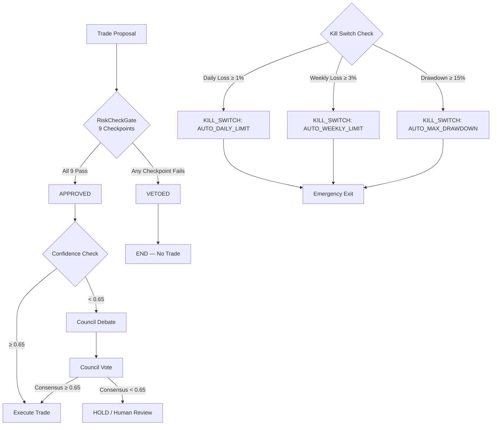

# Quant Nanggroe AI — System Design

**Version 4.0.0 | Agentic Trading Intelligence OS — Technical Design Specification**

> Complete technical design specification covering the LangGraph state machine, AgentState schema, constitutional risk limits, multi-path routing, ATR position sizing, smart order routing, dual-bus architecture, and the full pre-trade evaluation flow.

---

## Table of Contents

1. [LangGraph State Machine](#1-langgraph-state-machine)
2. [AgentState Schema](#2-agentstate-schema)
3. [Constitutional Risk Limits](#3-constitutional-risk-limits)
4. [Multi-Path Routing](#4-multi-path-routing)
5. [ATR Position Sizing](#5-atr-position-sizing)
6. [Smart Order Routing](#6-smart-order-routing)
7. [Pre-Trade Evaluation Sequence](#7-pre-trade-evaluation-sequence)
8. [Dual-Bus Architecture](#8-dual-bus-architecture)
9. [Pydantic Settings Hierarchy](#9-pydantic-settings-hierarchy)
10. [Security Model](#10-security-model)

---

## 1. LangGraph State Machine

### 1.1 Graph Construction

The trading graph is constructed in `agents/graph.py` via the `TradingGraph` class:

```python
class TradingGraph:
    def __init__(
        self,
        llm_provider: str = "openai",
        deep_think_model: str = "gpt-4o",
        quick_think_model: str = "gpt-4o-mini",
        base_url: Optional[str] = None,
        api_key: Optional[str] = None,
        max_debate_rounds: int = 2,
        max_risk_rounds: int = 2,
        confidence_threshold: float = CONFIDENCE_THRESHOLD,  # 0.65
    ):
```

The graph is built using LangGraph's `StateGraph` API with 9 nodes and conditional edges:

```python
def _build_graph(self) -> StateGraph:
    workflow = StateGraph(AgentState)
    
    # Add nodes
    workflow.add_node("market_analysis", self._market_analysis_node)
    workflow.add_node("signal_generation", self._signal_generation_node)
    workflow.add_node("risk_assessment", self._risk_assessment_node)
    workflow.add_node("portfolio_optimization", self._portfolio_optimization_node)
    workflow.add_node("execution_decision", self._execution_decision_node)
    workflow.add_node("order_execution", self._order_execution_node)
    workflow.add_node("reflection", self._reflection_node)
    workflow.add_node("council_debate", self._council_debate_node)
    workflow.add_node("emergency_exit", self._emergency_exit_node)
    
    # Main flow
    workflow.add_edge(START, "market_analysis")
    workflow.add_edge("market_analysis", "signal_generation")
    workflow.add_edge("signal_generation", "risk_assessment")
    
    # Conditional edge after risk assessment
    workflow.add_conditional_edges(
        "risk_assessment",
        self._risk_conditional,
        {
            "continue": "portfolio_optimization",
            "halt": END,
            "council_debate": "council_debate",
            "emergency_exit": "emergency_exit",
        },
    )
    
    workflow.add_edge("portfolio_optimization", "execution_decision")
    workflow.add_edge("execution_decision", "order_execution")
    workflow.add_edge("order_execution", "reflection")
    workflow.add_edge("reflection", END)
    workflow.add_edge("council_debate", "execution_decision")
    workflow.add_edge("emergency_exit", END)
    
    return workflow.compile()
```

### 1.2 Node Specifications

| Node | Method | LLM Tier | Input State Keys | Output State Keys | Veto Authority |
|------|--------|----------|-----------------|-------------------|----------------|
| `market_analysis` | `_market_analysis_node` | Quick | `symbols`, `market_data` | `research_output`, `macro_output`, `crypto_output`, `forex_output`, `agent_outputs` | None |
| `signal_generation` | `_signal_generation_node` | **Deep** | `agent_outputs`, `market_data` | `signals`, `strategist_output`, `confidence` | None |
| `risk_assessment` | `_risk_assessment_node` | **Deep** | `signals`, `portfolio_state` | `risk_assessment`, `risk_verdict`, `kill_switch_active`, `should_halt` | **FULL VETO** |
| `portfolio_optimization` | `_portfolio_optimization_node` | Quick | `risk_verdict`, `signals` | `portfolio_output` | Conditional |
| `execution_decision` | `_execution_decision_node` | Quick | `decisions`, `portfolio_output` | `decisions`, `trader_output`, `confidence` | None |
| `order_execution` | `_order_execution_node` | Quick | `decisions` | `execution_output`, `orders_placed` | None |
| `reflection` | `_reflection_node` | **Deep** | `debate_state` | `debate_state` | None |
| `council_debate` | `_council_debate_node` | **Deep** | `signals`, `confidence` | `debate_state`, `council_result`, `decisions` | None |
| `emergency_exit` | `_emergency_exit_node` | None | `symbols` | `decisions` (EMERGENCY_EXIT), `should_halt`, `kill_switch_active` | **KILL SWITCH** |

### 1.3 LLM Provider Configuration

`create_llm()` (in `agents/base.py`) supports 5 providers:

```python
def create_llm(provider, model, base_url=None, api_key=None, temperature=0.0):
    provider_lower = provider.lower()
    if provider_lower in ("openai", "ollama", "openrouter"):
        return ChatOpenAI(model=model, base_url=base_url, api_key=api_key, temperature=temperature)
    elif provider_lower == "anthropic":
        return ChatAnthropic(model=model, base_url=base_url, api_key=api_key, temperature=temperature)
    elif provider_lower == "google":
        return ChatGoogleGenerativeAI(model=model, api_key=api_key, temperature=temperature)
```

| Provider | Default Deep Model | Default Quick Model | Use Case |
|----------|-------------------|-------------------|----------|
| OpenAI | `gpt-4o` | `gpt-4o-mini` | Primary production provider |
| Anthropic | `claude-3.5-sonnet` | `claude-3-haiku` | Alternative provider |
| Google | `gemini-1.5-pro` | `gemini-1.5-flash` | Google Cloud deployments |
| Ollama | `llama3.1:70b` | `llama3.1:8b` | Local/self-hosted |
| OpenRouter | `anthropic/claude-3.5-sonnet` | `openai/gpt-4o-mini` | Multi-provider gateway |

---

## 2. AgentState Schema

### 2.1 Complete Type Definitions

The `AgentState` is defined as a `TypedDict` (not a Pydantic `BaseModel`) because LangGraph's `StateGraph` requires dictionary-based state for mutable updates between nodes.

```python
class AgentState(TypedDict):
    # ─── Core Identification ───
    symbols: Annotated[List[str], "List of trading symbols to analyze"]
    trade_date: Annotated[str, "Current trading date (YYYY-MM-DD)"]

    # ─── Market Data ───
    market_data: Annotated[Dict[str, Any], "Market data by symbol → MarketData dict"]

    # ─── Analysis Phase Outputs ───
    research_output: Annotated[str, "Research agent output"]
    macro_output: Annotated[str, "Macro agent output"]
    crypto_output: Annotated[str, "Crypto agent output"]
    forex_output: Annotated[str, "Forex agent output"]

    # ─── Signal Generation ───
    signals: Annotated[List[Dict[str, Any]], "Generated trading signals"]
    strategist_output: Annotated[str, "Strategist agent output"]

    # ─── Risk Assessment ───
    risk_assessment: Annotated[Dict[str, Any], "Risk assessment results"]
    risk_verdict: Annotated[str, "Risk verdict: APPROVED/VETOED/KILL_SWITCH"]

    # ─── Portfolio ───
    portfolio_state: Annotated[Dict[str, Any], "Current portfolio state"]
    portfolio_output: Annotated[str, "Portfolio agent output"]

    # ─── Trading Decision ───
    decisions: Annotated[List[Dict[str, Any]], "Final trading decisions"]
    trader_output: Annotated[str, "Trader agent output"]

    # ─── Execution ───
    execution_output: Annotated[str, "Execution agent output"]
    orders_placed: Annotated[List[Dict[str, Any]], "Orders placed"]

    # ─── Council / Debate ───
    debate_state: Annotated[Dict[str, Any], "Current debate state"]
    council_result: Annotated[Dict[str, Any], "Council voting result"]

    # ─── All Agent Outputs ───
    agent_outputs: Annotated[Dict[str, Any], "All agent outputs by name"]

    # ─── Control Flow ───
    iteration: Annotated[int, "Current iteration count"]
    confidence: Annotated[float, "Overall confidence in the decision"]
    kill_switch_active: Annotated[bool, "Whether kill switch is active"]
    should_halt: Annotated[bool, "Whether to halt the pipeline"]

    # ─── Metadata ───
    metadata: Annotated[Dict[str, Any], "Additional metadata"]
    sender: Annotated[str, "Agent that last sent a message"]
```

### 2.2 Supporting Pydantic Models

All structured data within the state uses Pydantic models with `ConfigDict(extra="allow")`:

| Model | Purpose | Key Fields |
|-------|---------|------------|
| `MarketData` | Per-symbol market snapshot | `symbol`, `price`, `open/high/low/close`, `volume`, `change_pct`, `bid/ask`, `vwap` |
| `Signal` | Strategist-generated signal | `symbol`, `direction` (BULLISH/BEARISH/NEUTRAL), `action` (BUY/SELL/HOLD/CLOSE/EMERGENCY_EXIT), `confidence`, `entry_price`, `stop_loss`, `take_profit`, `risk_reward_ratio`, `source_agents`, `reasoning`, `indicators` |
| `Decision` | Trader's final decision | `symbol`, `action`, `quantity`, `entry_price`, `stop_loss`, `take_profit`, `confidence`, `risk_reward_ratio`, `position_size_pct`, `reasoning` |
| `RiskCheckpoint` | Single checkpoint result | `name`, `value`, `limit`, `passed`, `details` |
| `RiskAssessment` | Complete risk assessment | `verdict`, `checkpoints` (9), `var_95`, `var_99`, `cvar_95`, `max_drawdown`, `kelly_fraction`, `position_sizing_approved`, `correlation_risk`, `kill_switch_active`, `daily_pnl_pct`, `weekly_pnl_pct`, `trade_count_today`, `override_possible` (always False) |
| `PortfolioState` | Portfolio snapshot | `total_value`, `cash`, `positions` (Dict[str, PositionInfo]), `unrealized_pnl`, `realized_pnl`, `daily_pnl`, `weekly_pnl`, `allocation`, `risk_budget_used`, `open_orders` |
| `PositionInfo` | Single position details | `symbol`, `quantity`, `entry_price`, `current_price`, `unrealized_pnl`, `direction`, `stop_loss`, `take_profit` |
| `AgentOutput` | Agent execution output | `agent_name`, `agent_role`, `content`, `data`, `confidence`, `success`, `error`, `tool_calls` |
| `VoteResult` | Council vote | `voter`, `vote` (TradeAction), `weight`, `reasoning`, `confidence` |
| `CouncilResult` | Council decision | `final_decision`, `debate_summary`, `votes`, `weighted_score`, `consensus_level`, `requires_human_review` |

### 2.3 Enumerations

| Enum | Values | Purpose |
|------|--------|---------|
| `TradeAction` | `BUY`, `SELL`, `HOLD`, `CLOSE`, `EMERGENCY_EXIT` | Possible trade actions |
| `SignalDirection` | `BULLISH`, `BEARISH`, `NEUTRAL` | Signal direction types |
| `RiskVerdict` | `APPROVED`, `VETOED`, `CONDITIONAL`, `KILL_SWITCH` | Risk assessment verdicts |
| `MarketRegime` | `RISK_ON`, `RISK_OFF`, `TRANSITIONING`, `CRISIS`, `RECOVERY` | Macro market regime types |
| `AgentRole` | `RESEARCHER`, `TRADER`, `STRATEGIST`, `RISK`, `PORTFOLIO`, `EXECUTION`, `MACRO`, `CRYPTO`, `FOREX`, `COUNCIL` | Agent role types |

### 2.4 Initial State Factory

```python
def create_initial_state(symbols: List[str], trade_date: str) -> Dict[str, Any]:
    return {
        "symbols": symbols,
        "trade_date": trade_date,
        "market_data": {},
        "research_output": "",
        "macro_output": "",
        "crypto_output": "",
        "forex_output": "",
        "signals": [],
        "strategist_output": "",
        "risk_assessment": {},
        "risk_verdict": RiskVerdict.VETOED.value,  # Default: VETOED (safe default)
        "portfolio_state": {},
        "portfolio_output": "",
        "decisions": [],
        "trader_output": "",
        "execution_output": "",
        "orders_placed": [],
        "debate_state": {
            "bull_history": "", "bear_history": "",
            "history": "", "current_response": "",
            "judge_decision": "", "count": 0,
        },
        "council_result": {},
        "agent_outputs": {},
        "iteration": 0,
        "confidence": 0.0,
        "kill_switch_active": False,
        "should_halt": False,
        "metadata": {
            "created_at": datetime.now().isoformat(),
            "constitutional_limits": {
                "max_risk_per_trade": MAX_RISK_PER_TRADE,    # 0.005
                "max_daily_loss": MAX_DAILY_LOSS,            # 0.01
                "max_weekly_loss": MAX_WEEKLY_LOSS,          # 0.03
                "min_risk_reward": MIN_RISK_REWARD,          # 2.0
                "max_correlated_positions": MAX_CORRELATED_POSITIONS,  # 3
                "max_position_size_pct": MAX_POSITION_SIZE_PCT,        # 0.10
                "max_leverage": MAX_LEVERAGE,                # 3.0
                "max_drawdown_pct": MAX_DRAWDOWN_PCT,        # 0.15
                "max_trades_per_day": MAX_TRADES_PER_DAY,    # 5
                "override_possible": False,
            },
        },
        "sender": "system",
    }
```

---

## 3. Constitutional Risk Limits

### 3.1 Single Source of Truth

Constitutional limits are defined in exactly two places:
1. **`engine/risk/constants.py`** — The canonical source, imported by all risk modules
2. **`agents/state.py`** — Mirrored for access within the agent layer

Both files must maintain identical values. The `constants.py` file exists specifically to **avoid circular imports** between the risk engine and the agent state module.

### 3.2 Complete Limit Table

| Constant | Value | Description | Rationale |
|----------|-------|-------------|-----------|
| `MAX_RISK_PER_TRADE` | `0.005` (0.5%) | Maximum risk per individual trade | Professional money management standard; prevents catastrophic single-trade losses |
| `MAX_DAILY_LOSS` | `0.01` (1%) | Maximum daily portfolio loss | Forces pause after bad day; prevents revenge trading |
| `MAX_WEEKLY_LOSS` | `0.03` (3%) | Maximum weekly portfolio loss | Allows for 2-3 bad days before forced halt |
| `MIN_RISK_REWARD` | `2.0` | Minimum risk:reward ratio (1:2) | Positive expectancy requires winners > 2x losers |
| `MAX_CORRELATED_POSITIONS` | `3` | Maximum correlated positions | Prevents concentration risk in same sector/asset class |
| `MAX_POSITION_SIZE_PCT` | `0.10` (10%) | Maximum single position as % of portfolio | Diversification enforcement |
| `MAX_LEVERAGE` | `3.0` | Maximum leverage multiplier | Prevents excessive leverage; conservative vs. 125x exchange max |
| `MAX_DRAWDOWN_PCT` | `0.15` (15%) | Maximum drawdown before kill switch | Capital preservation; 15% loss requires 17.6% gain to recover |
| `MAX_DAILY_TRADES` | `5` | Maximum trades per day | Prevents overtrading, reduces commission drag |
| `CONFIDENCE_THRESHOLD` | `0.65` | Minimum confidence for direct execution | Below this, council debate is triggered |
| `KILL_SWITCH_DAILY_PNL` | `-0.02` (-2%) | Kill switch daily PnL trigger | Auto-halt when daily losses exceed 2% |
| `KILL_SWITCH_WEEKLY_PNL` | `-0.05` (-5%) | Kill switch weekly PnL trigger | Auto-halt when weekly losses exceed 5% |

### 3.3 Override Prevention

```python
# In RiskManager.calculate_position_size():
effective_risk = min(risk_pct, MAX_RISK_PER_TRADE)  # HARDCODED: Cap risk at maximum
capped = risk_pct > MAX_RISK_PER_TRADE
return {
    "requested_risk_pct": risk_pct,
    "effective_risk_pct": effective_risk,
    "capped": capped,
    "note": "Risk percentage capped at hardcoded maximum. No override possible.",
}

# In RiskManager.calculate_kelly_size():
if result.adjusted_fraction > max_fraction:
    result = result._replace(
        adjusted_fraction=max_fraction,
        recommendation=f"CONSTITUTIONAL LIMIT: Position capped at {max_fraction:.1%}",
    )

# In RiskAssessment model:
override_possible: bool = Field(False, description="Constitutional limits cannot be overridden")
```

### 3.4 Risk Verdict Flow



---

## 4. Multi-Path Routing

### 4.1 Conditional Edge Logic

The `_risk_conditional` method in `TradingGraph` implements the core routing decision:

```python
def _risk_conditional(self, state: AgentState) -> str:
    # Priority 1: Kill switch active → emergency exit
    if state.get("kill_switch_active", False):
        logger.warning("Kill switch active - routing to emergency exit")
        return "emergency_exit"

    # Priority 2: Risk VETOED → halt
    risk_verdict = state.get("risk_verdict", "VETOED")
    if risk_verdict == RiskVerdict.VETOED.value:
        logger.info("Risk assessment vetoed - halting pipeline")
        return "halt"

    # Priority 3: Risk triggered kill switch → emergency exit
    if risk_verdict == RiskVerdict.KILL_SWITCH.value:
        logger.critical("Risk assessment triggered kill switch - emergency exit")
        return "emergency_exit"

    # Priority 4: Low confidence → council debate
    confidence = state.get("confidence", 0.0)
    if confidence < self._confidence_threshold:  # 0.65
        logger.info(f"Low confidence ({confidence:.2f}) - routing to council debate")
        return "council_debate"

    # Priority 5: Continue to portfolio optimization
    return "continue"
```

### 4.2 Routing Decision Matrix

| `kill_switch_active` | `risk_verdict` | `confidence` | Route | Description |
|---------------------|-----------------|--------------|-------|-------------|
| `True` | Any | Any | `emergency_exit` | System halted — close all positions |
| `False` | `KILL_SWITCH` | Any | `emergency_exit` | Risk triggered halt |
| `False` | `VETOED` | Any | `halt` → END | Trade rejected, no action |
| `False` | `APPROVED` or `CONDITIONAL` | < 0.65 | `council_debate` | Low confidence — seek council consensus |
| `False` | `APPROVED` or `CONDITIONAL` | ≥ 0.65 | `continue` → `portfolio_optimization` | High confidence — proceed to execution |

### 4.3 Council Debate Path

When confidence is below `CONFIDENCE_THRESHOLD` (0.65), the system routes to the `council_debate` node:

1. **Investment Debate**: Bull Researcher vs. Bear Researcher (2 rounds default)
2. **Risk Debate**: Conservative vs. Neutral vs. Aggressive (2 rounds default)
3. **Judge Decision**: Investment Judge + Risk Judge render verdicts
4. **Council Voting**: All agents vote with historical-accuracy weights
5. **Consensus Check**: If `consensus_level >= 0.65`, execute; otherwise HOLD

---

## 5. ATR Position Sizing

### 5.1 ATR-Based Stop Loss Geometry

The `RiskManager.atr_position_size()` method implements ATR (Average True Range) based position sizing:

```python
def atr_position_size(
    self,
    entry_price: float,
    atr: float,
    account_balance: float,
    risk_per_trade: float = 0.02,
    max_risk_per_trade: float = 0.05,
) -> Dict[str, Any]:
    # Cap risk at constitutional limit
    effective_risk = min(risk_per_trade, max_risk_per_trade, MAX_RISK_PER_TRADE)
    risk_amount = account_balance * effective_risk

    # Stop distance = 2 × ATR (standard for swing trading)
    stop_distance = 2 * atr

    position_size = risk_amount / stop_distance
    stop_loss = entry_price - stop_distance

    return {
        "position_size": position_size,
        "stop_loss": stop_loss,
        "risk_amount": risk_amount,
        "effective_risk_pct": effective_risk,
    }
```

### 5.2 ATR Geometry for BUY (LONG)

```
                    Take Profit 2: entry + 4×ATR  (1:4 R:R)
                    ─────────────────────────────
                    Take Profit 1: entry + 2×ATR  (1:2 R:R)
                    ─────────────────────────────
Entry Price ─────── ─────────────────────────────
                    ─────────────────────────────
Stop Loss:    entry - 2×ATR
                    ─────────────────────────────

Position Size = (account_balance × effective_risk) / (2 × ATR)
```

### 5.3 ATR Geometry for SELL (SHORT)

```
Stop Loss:    entry + 2×ATR
                    ─────────────────────────────
Entry Price ─────── ─────────────────────────────
                    ─────────────────────────────
                    Take Profit 1: entry - 2×ATR  (1:2 R:R)
                    ─────────────────────────────
                    Take Profit 2: entry - 4×ATR  (1:4 R:R)
                    ─────────────────────────────
```

### 5.4 Position Sizing Methods Comparison

| Method | Function | Stop Calculation | Risk Control |
|--------|----------|-----------------|--------------|
| **Fixed Risk** | `calculate_position_size()` | `stop_loss_pips × pip_value` | Capped at `MAX_RISK_PER_TRADE` |
| **ATR-Based** | `atr_position_size()` | `2 × ATR` | Capped at `MAX_RISK_PER_TRADE` |
| **Kelly Criterion** | `calculate_kelly_size()` | N/A (fraction-based) | Capped at `MAX_RISK_PER_TRADE`; default HALF_KELLY |
| **Volatility Targeting** | `optimal_f_position_size()` | N/A (vol-targeted) | Bounded to [0.1, 3.0] |
| **VaR-Based** | `calculate_position_size_with_var()` | N/A (VaR-limited) | Scales so VaR ≤ `max_var_pct` of portfolio |

---

## 6. Smart Order Routing

### 6.1 Exchange Selection Logic

The `ExchangeFactory` supports market-type-aware routing:

```python
# Market type → CCXT default type mapping
if effective_market == MarketType.FUTURES:
    options["defaultType"] = "future"
elif effective_market == MarketType.PERPS:
    options["defaultType"] = "swap"
else:
    options["defaultType"] = "spot"
```

### 6.2 Market Type Routing

| Asset Class | Primary Route | Market Type | Backup Route |
|-------------|--------------|-------------|--------------|
| Crypto Spot | Binance via CCXT | `spot` | OKX → Bybit |
| Crypto Futures | Binance via CCXT | `futures` | OKX → Bybit |
| Crypto Perps | Binance via CCXT | `perps` | OKX → Bybit |
| US Equities | Alpaca | `spot` | Paper Trading |
| Prediction Markets | Polymarket (CLOB) | N/A | Paper Trading |
| Solana DEX | Jupiter Aggregator | N/A | Paper Trading |
| Paper Trading | PaperExchangeBroker | N/A | N/A |

### 6.3 Exchange Capability Validation

```python
def _resolve_market_type(self, exchange_name, market_type=None) -> MarketType:
    if market_type is None:
        return self._config.default_market_type  # Default: SPOT
    
    mt = MarketType(market_type.lower().strip())
    caps = _CAPABILITY_REGISTRY.get(exchange_name)
    
    if mt == MarketType.SPOT and not caps.supports_spot:
        raise ExchangeFactoryError(f"Exchange '{exchange_name}' does not support spot")
    if mt == MarketType.FUTURES and not caps.supports_futures:
        raise ExchangeFactoryError(f"Exchange '{exchange_name}' does not support futures")
    if mt == MarketType.PERPS and not caps.supports_perps:
        raise ExchangeFactoryError(f"Exchange '{exchange_name}' does not support perpetual swaps")
    
    return mt
```

---

## 7. Pre-Trade Evaluation Sequence

### 7.1 Complete Decision Flow

```
Step 1: MARKET ANALYSIS (market_analysis node)
  ├── Researcher: MarketDataTool.get_ohlcv(symbol, timeframe)
  │   └── Output: research_output, agent_outputs["researcher"]
  ├── Macro: GeopoliticalTool + InterMarketTool + ForecastTool
  │   └── Output: macro_output, agent_outputs["macro"]
  ├── Crypto: MarketDataTool + FlowTool + TechnicalTool
  │   └── Output: crypto_output, agent_outputs["crypto"]
  └── Forex: MarketDataTool + InterMarketTool + ForecastTool
      └── Output: forex_output, agent_outputs["forex"]

Step 2: SIGNAL GENERATION (signal_generation node)
  ├── Strategist (Deep LLM): Analyzes all agent outputs
  │   ├── Factor evaluation via FactorRegistry
  │   ├── Pressure normalization (weighted sensor aggregation)
  │   └── Signal generation with confidence scoring
  └── Output: signals[], strategist_output, confidence

Step 3: RISK ASSESSMENT (risk_assessment node)
  ├── RiskCheckGate.evaluate() — 9 checkpoints:
  │   ├── Checkpoint 1: risk_pct ≤ 0.005 (0.5%)
  │   ├── Checkpoint 2: daily_loss_pct < 0.01 (1%)
  │   ├── Checkpoint 3: weekly_loss_pct < 0.03 (3%)
  │   ├── Checkpoint 4: rr_ratio ≥ 2.0 (1:2 R:R)
  │   ├── Checkpoint 5: stop_loss exists and > 0
  │   ├── Checkpoint 6: entry_price > 0
  │   ├── Checkpoint 7: direction in {BUY, SELL, LONG, SHORT}
  │   ├── Checkpoint 8: trade_count_today < 5
  │   └── Checkpoint 9: correlated_positions < 3
  └── Output: risk_verdict (APPROVED/VETOED/KILL_SWITCH)

Step 4: CONDITIONAL ROUTING (_risk_conditional)
  ├── KILL_SWITCH → emergency_exit
  ├── VETOED → END (no trade)
  ├── LOW CONFIDENCE (< 0.65) → council_debate
  └── APPROVED → portfolio_optimization

Step 5: PORTFOLIO OPTIMIZATION (portfolio_optimization node)
  ├── Verify risk clearance is APPROVED
  ├── Calculate position size (ATR/Kelly/volatility-targeting)
  ├── Check portfolio-level constraints
  └── Output: portfolio_output

Step 6: EXECUTION DECISION (execution_decision node)
  ├── Trader agent makes final decision
  ├── Applies position sizing from portfolio optimization
  └── Output: decisions[], trader_output

Step 7: ORDER EXECUTION (order_execution node)
  ├── Execution agent routes to appropriate broker
  ├── Submit order via ExchangeFactory
  ├── Record execution details
  └── Output: execution_output, orders_placed[]

Step 8: REFLECTION (reflection node)
  ├── Council debate for post-trade analysis
  ├── Update memory system with trade results
  └── Output: debate_state
```

### 7.2 RiskAssessment Output Schema

```python
class RiskAssessment(BaseModel):
    verdict: RiskVerdict = Field(RiskVerdict.VETOED)
    checkpoints: List[RiskCheckpoint] = Field(default_factory=list)
    var_95: Optional[float] = Field(None, description="VaR at 95% confidence")
    var_99: Optional[float] = Field(None, description="VaR at 99% confidence")
    cvar_95: Optional[float] = Field(None, description="CVaR at 95%")
    max_drawdown: Optional[float] = Field(None)
    kelly_fraction: Optional[float] = Field(None)
    position_sizing_approved: bool = Field(False)
    correlation_risk: Optional[float] = Field(None)
    kill_switch_active: bool = Field(False)
    daily_pnl_pct: float = Field(0.0)
    weekly_pnl_pct: float = Field(0.0)
    trade_count_today: int = Field(0)
    override_possible: bool = Field(False)  # ALWAYS FALSE
```

---

## 8. Dual-Bus Architecture

### 8.1 Execution Bus (Low-Latency)

| Property | Value |
|----------|-------|
| Transport | Redis Pub/Sub |
| Channel | `pubsub:execution` |
| Latency Target | < 10ms (local), < 100ms (cross-container) |
| Priority | P0 (highest) |
| Persistence | Redis only (volatile) |
| Retry Policy | 3 retries, exponential backoff |
| Message Ordering | FIFO per symbol |
| Backpressure | Drop oldest if queue > 1000 |

Message Types:
- `ORDER_NEW` — New order submission
- `ORDER_CANCEL` — Cancel existing order
- `ORDER_FILL` — Fill confirmation
- `KILL_SWITCH` — Emergency close all positions
- `POSITION_SYNC` — Position reconciliation

### 8.2 Agent Reasoning Bus (High-Throughput)

| Property | Value |
|----------|-------|
| Transport | Redis Pub/Sub + PostgreSQL |
| Channel | `pubsub:agent` |
| Latency Target | 100ms–5s (acceptable for reasoning) |
| Priority | P2 |
| Persistence | Redis + PostgreSQL (durable) |
| Retry Policy | Fire-and-forget + audit log |
| Message Ordering | Best-effort |
| Backpressure | Buffer up to 10000 |

Message Types:
- `AGENT_START` / `AGENT_COMPLETE` / `AGENT_ERROR`
- `STATE_DELTA` — State mutation
- `REGIME_CHANGE` — Market regime transition
- `PRESSURE_UPDATE` — Pressure vector updated
- `RISK_VETO` — Risk manager vetoed a trade

---

## 9. Pydantic Settings Hierarchy

### 9.1 Configuration Model

```
Settings (Master)
 ├── DatabaseSettings     (env_prefix: DB_)
 │   ├── url: str = "postgresql+asyncpg://..."
 │   ├── pool_size: int = 10
 │   └── max_overflow: int = 20
 ├── RedisSettings        (env_prefix: REDIS_)
 │   ├── url: str = "redis://localhost:6379/0"
 │   └── password: Optional[str] = None
 ├── LLMSettings          (env_prefix: LLM_)
 │   ├── provider: str = "openai"
 │   ├── default_model: str = "gpt-4o"
 │   ├── deep_think_model: str = "gpt-4o"
 │   ├── quick_think_model: str = "gpt-4o-mini"
 │   ├── api_key: Optional[str] = None
 │   └── base_url: Optional[str] = None
 ├── DataSourceSettings   (env_prefix: DATA_)
 │   ├── polygon_api_key: Optional[str] = None
 │   ├── binance_api_key: Optional[str] = None
 │   ├── alphavantage_api_key: Optional[str] = None
 │   └── finnhub_api_key: Optional[str] = None
 └── FeatureFlags         (env_prefix: FEATURE_)
     ├── enable_live_trading: bool = False
     ├── enable_paper_trading: bool = True
     ├── enable_kill_switch: bool = True
     └── enable_autoswitch: bool = True
```

### 9.2 Environment Variable Resolution

```
.env file ──► Pydantic Settings
                  │
                  ├── APP_ENV (development|staging|production|test)
                  ├── DATABASE_URL
                  ├── REDIS_URL
                  ├── LLM__OPENAI_API_KEY
                  ├── LLM__DEFAULT_MODEL
                  ├── DATA__POLYGON_API_KEY
                  ├── DATA__BINANCE_API_KEY
                  └── FEATURE__ENABLE_LIVE_TRADING
```

---

## 10. Security Model

### 10.1 Docker Sandboxing

```yaml
services:
  api:
    read_only: true
    security_opt: [no-new-privileges:true]
    cap_drop: [ALL]
    cap_add: [NET_BIND_SERVICE]
    deploy:
      resources:
        limits: { cpus: '2.0', memory: 4G }
        reservations: { cpus: '0.5', memory: 512M }
```

### 10.2 API Key Security

- Keys are **never** embedded in client-side bundles
- All keys loaded from environment variables via Pydantic Settings
- `structlog` processors redact fields matching `*_api_key`, `*_secret`, `*_password`, `*_token`
- Polymarket wallet key stored as private attribute, never logged, only used for EIP-712 signing

### 10.3 Network Isolation

```
qna-network (bridge):
  ├── api:8000     → Exposed to host (only port)
  ├── postgres:5432 → Internal only
  └── redis:6379    → Internal only
```

### 10.4 Tool Registry Security

| Tool | Access Level | Write Capability | Network Access |
|------|-------------|-----------------|----------------|
| MarketDataTool | Read-only | None | External APIs |
| SentimentTool | Read-only | None | News APIs |
| TechnicalAnalysisTool | Read-only | None | Internal |
| ExecutionTool | Write (broker-routed) | Orders only | Broker APIs only |
| BacktestTool | Read-only | None | Internal |

---

*© 2025-2026 Quant Nanggroe AI | System Design Document v4.0.0*
