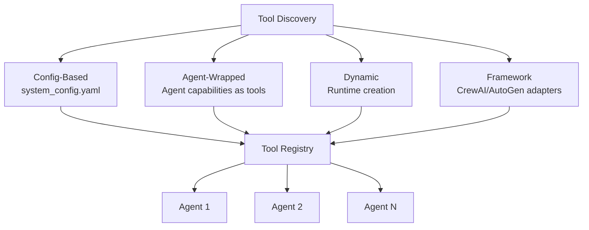
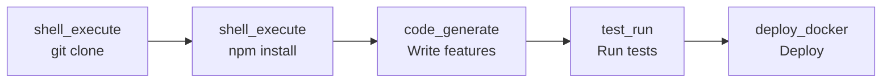
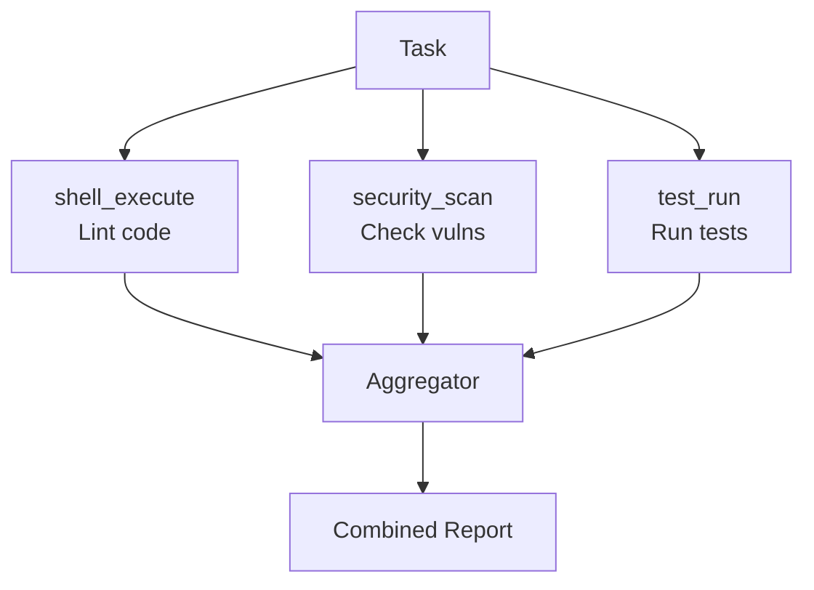
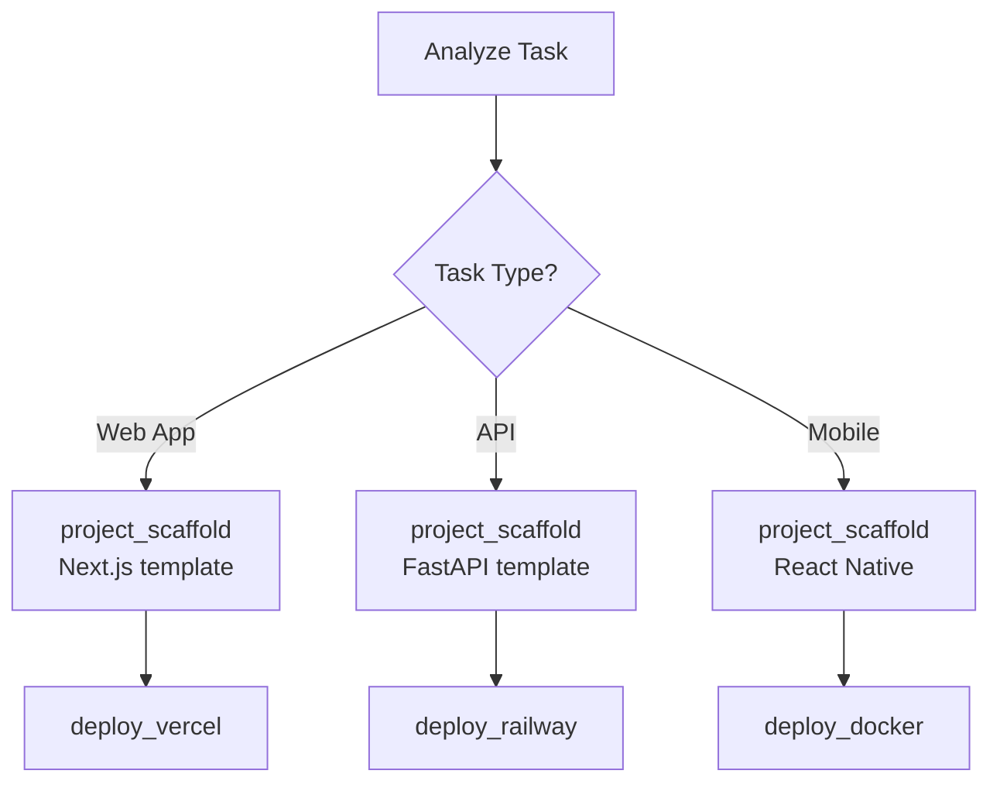

# Tool Registry — AI-MultiColony-Ecosystem

> Complete catalog of tools, their interfaces, discovery mechanisms, and composition patterns
> Version 2.0.0 | Cluster 2 — AI-MULTICOLONY-ECOSYSTEM

---

## Table of Contents

1. [Overview](#overview)
2. [Tool Interface Specification](#tool-interface-specification)
3. [Tool Categories](#tool-categories)
4. [Complete Tool Catalog](#complete-tool-catalog)
5. [Tool Discovery Mechanism](#tool-discovery-mechanism)
6. [Tool Composition Patterns](#tool-composition-patterns)
7. [CrewAI Tool Wrappers](#crewai-tool-wrappers)
8. [Security Considerations](#security-considerations)

---

## Overview

The AI-MultiColony-Ecosystem provides a rich set of tools that agents can use to accomplish tasks. Tools are the atomic units of capability — skills are built by composing tools. The tool registry is the central catalog that enables agents to discover, access, and combine tools.

### Tool System Principles

| Principle | Description |
|-----------|-------------|
| **Atomicity** | Each tool performs one well-defined function |
| **Composability** | Tools can be combined to create complex capabilities |
| **Discoverability** | Tools are registered and searchable |
| **Security** | Tools enforce safety constraints (whitelists, validation) |
| **Observability** | All tool invocations are logged with metrics |

### Tool Count by Category

| Category | Count | Key Agents |
|----------|-------|-----------|
| Browser & Web | 4 | Web Automation Agent |
| Code & Execution | 6 | CyberShell, Code Executor, Fullstack Dev |
| Deployment | 7 | Deploy Manager |
| File Operations | 5 | CyberShell |
| Memory & Knowledge | 4 | Memory Manager, Memory Bus |
| Network & API | 5 | CyberShell, AI Selector, LLM Client |
| System & Monitoring | 6 | Commander AGI, Agent 02 |
| Security | 4 | Commander AGI, Bug Hunter, Auth Agent |
| Database | 4 | Data Sync Agent |
| AI & LLM | 3 | LLM Client, AI Research, Prompt Generator |
| **Total** | **48** | |

---

## Tool Interface Specification

### Base Tool Interface

Every tool in the system conforms to this interface:

```python
class ToolInterface:
    """Base interface for all tools"""
    
    # Metadata
    name: str                    # Unique tool identifier (snake_case)
    description: str             # Human-readable description
    version: str                 # Tool version (semver)
    category: str                # Tool category
    
    # Schema
    inputs: Dict[str, Any]      # Input parameter schema
    outputs: Dict[str, Any]     # Output schema
    
    # Capabilities
    capabilities: List[str]     # List of capabilities provided
    requirements: List[str]     # Dependencies (packages, services)
    
    # Methods
    async def execute(self, params: Dict) -> Dict:
        """Execute the tool with given parameters"""
        pass
    
    def validate_inputs(self, params: Dict) -> bool:
        """Validate input parameters against schema"""
        pass
    
    def get_schema(self) -> Dict:
        """Return full tool schema"""
        pass
```

### Input/Output Schema Format

```python
# Example schema definition
inputs = {
    "command": {
        "type": "string",
        "required": True,
        "description": "Shell command to execute",
        "max_length": 1000
    },
    "timeout": {
        "type": "integer",
        "required": False,
        "default": 300,
        "description": "Execution timeout in seconds",
        "min_value": 1,
        "max_value": 600
    }
}

outputs = {
    "success": {
        "type": "boolean",
        "description": "Whether execution succeeded"
    },
    "stdout": {
        "type": "string",
        "description": "Standard output from command"
    },
    "return_code": {
        "type": "integer",
        "description": "Process exit code"
    }
}
```

---

## Tool Categories

```mermaid
graph TB
    REG[Tool Registry] --> BR[Browser & Web]
    REG --> CD[Code & Execution]
    REG --> DP[Deployment]
    REG --> FL[File Operations]
    REG --> MM[Memory & Knowledge]
    REG --> NT[Network & API]
    REG --> SY[System & Monitoring]
    REG --> SC[Security]
    REG --> DB[Database]
    REG --> AI[AI & LLM]

    BR --> T1[Web Navigation]
    BR --> T2[Web Scraping]
    BR --> T3[API Testing]
    BR --> T4[Screenshot Capture]

    CD --> T5[Shell Execution]
    CD --> T6[Python Runner]
    CD --> T7[Code Generation]
    CD --> T8[Project Scaffolding]
    CD --> T9[Test Runner]
    CD --> T10[Git Operations]

    DP --> T11[Netlify Deploy]
    DP --> T12[Vercel Deploy]
    DP --> T13[Railway Deploy]
    DP --> T14[Heroku Deploy]
    DP --> T15[AWS Deploy]
    DP --> T16[GCP Deploy]
    DP --> T17[Docker Deploy]
```



---

## Complete Tool Catalog

### Browser & Web Tools

| # | Tool Name | Description | Inputs | Outputs | Agent |
|---|-----------|-------------|--------|---------|-------|
| 1 | `web_navigate` | Navigate to URL and capture page content | `url: str`, `wait: int` | `content: str`, `title: str`, `status: int` | Web Automation Agent |
| 2 | `web_scrape` | Extract structured data from web pages | `url: str`, `selector: str`, `fields: List[str]` | `data: List[Dict]`, `count: int` | Web Automation Agent |
| 3 | `api_test` | Test REST API endpoints | `method: str`, `url: str`, `headers: Dict`, `body: Dict` | `status: int`, `response: Dict`, `latency: float` | CyberShell |
| 4 | `screenshot` | Capture webpage screenshot | `url: str`, `viewport: Dict`, `full_page: bool` | `image: bytes`, `url: str` | Web Automation Agent |

### Code & Execution Tools

| # | Tool Name | Description | Inputs | Outputs | Agent |
|---|-----------|-------------|--------|---------|-------|
| 5 | `shell_execute` | Execute shell commands with security validation | `command: str`, `working_dir: str`, `timeout: int`, `env: Dict` | `success: bool`, `stdout: str`, `stderr: str`, `return_code: int`, `execution_time: float` | CyberShell |
| 6 | `python_execute` | Run Python code in sandboxed environment | `code: str`, `dependencies: List[str]`, `timeout: int` | `output: str`, `error: str`, `exit_code: int` | Code Executor |
| 7 | `code_generate` | Generate code using LLM | `prompt: str`, `language: str`, `context: str` | `code: str`, `language: str`, `explanation: str` | Fullstack Dev |
| 8 | `project_scaffold` | Create project from template | `name: str`, `template: str`, `features: List[str]` | `path: str`, `files_created: int`, `structure: Dict` | Dev Engine |
| 9 | `test_run` | Execute test suite | `test_path: str`, `framework: str`, `coverage: bool` | `passed: int`, `failed: int`, `coverage: float`, `report: str` | Quality Control |
| 10 | `git_operation` | Perform git operations | `action: str`, `args: List[str]`, `repo_path: str` | `success: bool`, `output: str` | CyberShell |

### Deployment Tools

| # | Tool Name | Description | Inputs | Outputs | Agent |
|---|-----------|-------------|--------|---------|-------|
| 11 | `deploy_netlify` | Deploy static site to Netlify | `app_name: str`, `project_path: str`, `build_dir: str`, `config: Dict` | `success: bool`, `url: str`, `logs: List[str]` | Deploy Manager |
| 12 | `deploy_vercel` | Deploy to Vercel serverless platform | `app_name: str`, `project_path: str`, `config: Dict` | `success: bool`, `url: str`, `logs: List[str]` | Deploy Manager |
| 13 | `deploy_railway` | Deploy container to Railway | `app_name: str`, `project_path: str`, `config: Dict` | `success: bool`, `url: str`, `logs: List[str]` | Deploy Manager |
| 14 | `deploy_heroku` | Deploy to Heroku PaaS | `app_name: str`, `project_path: str`, `config: Dict` | `success: bool`, `url: str`, `logs: List[str]` | Deploy Manager |
| 15 | `deploy_aws` | Deploy to AWS (Lambda, EC2, S3, CloudFront) | `app_name: str`, `project_path: str`, `service: str`, `config: Dict` | `success: bool`, `url: str`, `arn: str` | Deploy Manager |
| 16 | `deploy_gcp` | Deploy to Google Cloud (Cloud Run, App Engine) | `app_name: str`, `project_path: str`, `service: str`, `config: Dict` | `success: bool`, `url: str`, `logs: List[str]` | Deploy Manager |
| 17 | `deploy_docker` | Build and run Docker container | `app_name: str`, `project_path: str`, `port: int`, `config: Dict` | `success: bool`, `url: str`, `container_id: str` | Deploy Manager |

### File Operations Tools

| # | Tool Name | Description | Inputs | Outputs | Agent |
|---|-----------|-------------|--------|---------|-------|
| 18 | `file_read` | Read file content with security checks | `file_path: str` | `content: str`, `size: int`, `lines: int` | CyberShell |
| 19 | `file_write` | Write content to file | `file_path: str`, `content: str`, `create_dirs: bool` | `success: bool`, `bytes_written: int` | CyberShell |
| 20 | `directory_list` | List directory contents | `directory: str`, `pattern: str` | `entries: List[Dict]`, `count: int` | CyberShell |
| 21 | `directory_create` | Create directory structure | `directory: str`, `parents: bool` | `success: bool`, `path: str` | CyberShell |
| 22 | `file_delete` | Delete file (with safety checks) | `file_path: str`, `confirm: bool` | `success: bool` | CyberShell |

### Memory & Knowledge Tools

| # | Tool Name | Description | Inputs | Outputs | Agent |
|---|-----------|-------------|--------|---------|-------|
| 23 | `memory_store` | Store data in memory system | `agent_id: str`, `task_id: str`, `content: str`, `memory_type: str`, `importance: int` | `success: bool`, `entry_id: str` | Memory Manager |
| 24 | `memory_retrieve` | Retrieve memories by criteria | `agent_id: str`, `memory_type: str`, `limit: int` | `memories: List[MemoryEntry]` | Memory Manager |
| 25 | `memory_search` | Search memories by content | `query: str`, `agent_id: str` | `results: List[MemoryEntry]` | Memory Manager |
| 26 | `knowledge_enrich` | Enrich knowledge from external sources | `topic: str` | `knowledge: Dict`, `sources: List[str]` | External Knowledge API |

### Network & API Tools

| # | Tool Name | Description | Inputs | Outputs | Agent |
|---|-----------|-------------|--------|---------|-------|
| 27 | `http_request` | Make HTTP requests | `method: str`, `url: str`, `headers: Dict`, `body: Dict`, `timeout: int` | `status: int`, `body: Dict`, `headers: Dict` | CyberShell |
| 28 | `dns_lookup` | Perform DNS resolution | `hostname: str`, `record_type: str` | `records: List[Dict]` | CyberShell |
| 29 | `port_scan` | Scan target ports | `host: str`, `ports: List[int]`, `timeout: int` | `open_ports: List[Dict]` | Bug Hunter |
| 30 | `ssl_check` | Check SSL certificate | `hostname: str` | `valid: bool`, `issuer: str`, `expiry: str` | Bug Hunter |
| 31 | `ip_lookup` | Get IP address information | `hostname: str` | `ip: str`, `location: Dict`, `isp: str` | CyberShell |

### System & Monitoring Tools

| # | Tool Name | Description | Inputs | Outputs | Agent |
|---|-----------|-------------|--------|---------|-------|
| 32 | `system_monitor` | Monitor system resources (CPU, RAM, disk) | `interval: int`, `metrics: List[str]` | `cpu: float`, `memory: float`, `disk: float`, `network: Dict` | Commander AGI |
| 33 | `process_list` | List running processes | `filter: str`, `sort_by: str` | `processes: List[Dict]`, `count: int` | CyberShell |
| 34 | `process_kill` | Terminate a running process | `process_id: int`, `force: bool` | `success: bool` | CyberShell |
| 35 | `service_check` | Check service health | `url: str`, `expected_status: int`, `timeout: int` | `healthy: bool`, `status: int`, `latency: float` | Deploy Manager |
| 36 | `log_analyze` | Analyze log files | `log_path: str`, `pattern: str`, `level: str` | `matches: List[Dict]`, `summary: Dict` | System Optimizer |
| 37 | `performance_report` | Generate system performance report | `time_range: str`, `agents: List[str]` | `report: Dict`, `recommendations: List[str]` | Agent 02 |

### Security Tools

| # | Tool Name | Description | Inputs | Outputs | Agent |
|---|-----------|-------------|--------|---------|-------|
| 38 | `vulnerability_scan` | Scan for vulnerabilities | `target: str`, `scan_type: str` | `vulnerabilities: List[Dict]`, `risk_score: float` | Bug Hunter |
| 39 | `credential_store` | Securely store credentials | `key: str`, `value: str`, `service: str` | `success: bool`, `key_id: str` | Credential Manager |
| 40 | `credential_retrieve` | Retrieve stored credentials | `key: str`, `service: str` | `value: str`, `metadata: Dict` | Credential Manager |
| 41 | `auth_check` | Verify authentication | `token: str`, `required_role: str` | `valid: bool`, `user: Dict`, `permissions: List[str]` | Authentication Agent |

### Database Tools

| # | Tool Name | Description | Inputs | Outputs | Agent |
|---|-----------|-------------|--------|---------|-------|
| 42 | `db_query` | Execute database query | `query: str`, `params: Dict`, `database: str` | `rows: List[Dict]`, `count: int`, `execution_time: float` | Data Sync |
| 43 | `db_migrate` | Run database migration | `migration_file: str`, `direction: str` | `success: bool`, `applied: List[str]` | Data Sync |
| 44 | `db_backup` | Create database backup | `database: str`, `destination: str`, `compress: bool` | `success: bool`, `backup_path: str`, `size: int` | Backup Colony |
| 45 | `db_sync` | Synchronize data between sources | `source: str`, `target: str`, `conflict_strategy: str` | `synced: int`, `conflicts: List[Dict]` | Data Sync |

### AI & LLM Tools

| # | Tool Name | Description | Inputs | Outputs | Agent |
|---|-----------|-------------|--------|---------|-------|
| 46 | `llm_chat` | Multi-provider LLM chat completion | `messages: List[Dict]`, `model: str`, `temperature: float`, `max_tokens: int`, `provider: str` | `content: str`, `provider: str`, `model: str`, `usage: Dict`, `response_time: float` | LLM Client |
| 47 | `llm_simple_prompt` | Simple prompt interface | `prompt: str`, `model: str` | `content: str` | LLM Client |
| 48 | `research_search` | Search AI research papers | `query: str`, `sources: List[str]`, `max_results: int` | `papers: List[Dict]`, `trends: List[Dict]` | AI Research Agent |

---

## Tool Discovery Mechanism

### Discovery Methods



### Config-Based Discovery

Tools are registered in `config/system_config.yaml`:

```yaml
agents:
  cybershell:
    enabled: true
    allowed_commands:
      - "ls"
      - "cat"
      - "grep"
      - "git"
      - "npm"
      - "pip"
      - "python"
```

### Agent-Wrapped Discovery

The CrewAI adapter wraps agent capabilities as tools:

```python
# Creating a tool from an agent
tool = adapter.create_custom_tool(
    tool_name="code_executor_tool",
    agent_id="agent_04_executor"
)
```

### Dynamic Discovery

Tools created at runtime by the Meta Agent Creator:

```python
# Meta Agent Creator generates new tools as part of agent creation
result = await meta_agent_creator.create_agent({
    'type': 'create_agent',
    'requirements': {
        'name': 'data_pipeline_agent',
        'capabilities': ['data_extraction', 'data_transform', 'data_load']
    }
})
```

---

## Tool Composition Patterns

### Sequential Composition

Tools execute in sequence, each feeding input to the next:



### Parallel Composition

Multiple tools execute simultaneously and results are aggregated:



### Conditional Composition

Tool selection based on task analysis:



### Composite Skill Examples

| Skill | Tools Composed | Flow |
|-------|---------------|------|
| Full Deploy | `shell_execute` → `deploy_netlify` | Build then deploy |
| Security Audit | `vulnerability_scan` → `port_scan` → `ssl_check` | Parallel scans |
| Code Review | `file_read` → `llm_chat` → `memory_store` | Read, analyze, store |
| Research | `research_search` → `llm_chat` → `knowledge_enrich` | Find, analyze, enrich |

---

## CrewAI Tool Wrappers

The `CrewAIAdapter` provides a mechanism to wrap our agents as CrewAI tools:

```python
class AgenticTool(BaseTool):
    name: str = tool_name
    description: str = f"Tool that uses {original_agent.name} capabilities"
    
    def _run(self, query: str) -> str:
        """Execute the tool"""
        task = {
            'task_id': f'tool_{agent_id}_{timestamp}',
            'request': query,
            'context': {
                'integration': 'crewai_tool',
                'tool_name': tool_name
            }
        }
        result = original_agent.process_task(task)
        return result.get('content', str(result))
```

---

## Security Considerations

### Tool Security Layers

| Layer | Mechanism | Example |
|-------|-----------|---------|
| Input Validation | Schema validation, type checking | `validate_inputs()` on every call |
| Command Whitelisting | Only allowed commands in CyberShell | `allowed_commands` list |
| Pattern Blocking | Dangerous command patterns | `rm -rf /`, fork bombs |
| Sensitive File Protection | File path checking | `/etc/passwd`, `id_rsa` blocked |
| Rate Limiting | Request throttling | 100 req/min API limit |
| Output Sanitization | Sensitive data redaction | Credentials stripped from logs |

### Tool Access Control Matrix

| Agent | Shell | Deploy | File | Memory | Security | DB | LLM |
|-------|-------|--------|------|--------|----------|-----|-----|
| Agent Base | ✗ | ✗ | ✗ | ✓ | ✗ | ✗ | ✓ |
| CyberShell | ✓ | ✗ | ✓ | ✗ | ✗ | ✗ | ✗ |
| Deploy Manager | ✗ | ✓ | ✓ | ✗ | ✗ | ✗ | ✗ |
| Commander AGI | ✗ | ✗ | ✗ | ✓ | ✓ | ✗ | ✗ |
| Fullstack Dev | ✓ | ✓ | ✓ | ✗ | ✗ | ✓ | ✓ |
| Data Sync | ✗ | ✗ | ✓ | ✓ | ✗ | ✓ | ✗ |
| LLM Client | ✗ | ✗ | ✗ | ✗ | ✗ | ✗ | ✓ |

---

*This tool registry document is maintained as part of the AI-MultiColony-Ecosystem project. Last updated: 2025-07-13.*
