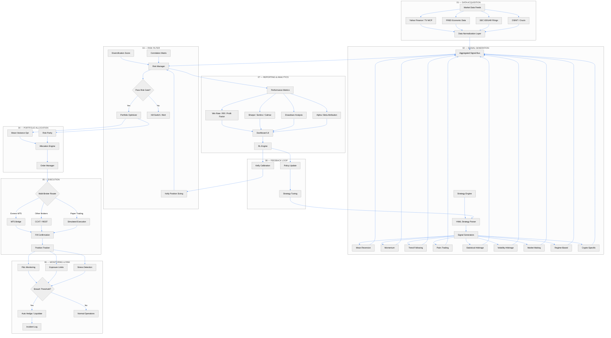

# Quant-Nanggroe-AI — Workflow Pipeline

> **Hedge-Fund-Grade Quant Platform** — End-to-end pipeline: data acquisition → signal generation → risk filtering → portfolio allocation → execution → monitoring → reporting.



## Pipeline Stages

### 01 — Data Acquisition
| Component | Role | Source |
|-----------|------|--------|
| Market Data Feeds | Real-time & historical price data | Yahoo Finance, TradingView MCP |
| FRED Data | Macroeconomic indicators | FRED API (via `/api/fred`) |
| SEC EDGAR | Corporate filings | SEC EDGAR MCP |
| OSINT / Crucix | Alternative data / public intelligence | Crucix agent |
| Data Normalization | Unifies formats, timestamps, symbols | `quant_nanggroe/engine/data/` |

### 02 — Signal Generation
| Strategy | Type | Key Parameters | RR Range | Best For |
|----------|------|---------------|----------|----------|
| MeanReversion | Mean Reversion | lookback=20, std=2 | 1:2–1:3 | Range-bound markets |
| Momentum | Trend Following | lookback=50, strength=1.5 | 1:1.5–1:2 | Trending markets |
| TrendFollow | Breakout | ema_short=20, ema_long=50 | 1:2–1:4 | Strong trends |
| PairsTrading | Statistical Arb | window=60, z_entry=2 | 1:1.5–1:2.5 | Mean-reverting pairs |
| StatisticalArbitrage | Cointegration | half_life=20, z_entry=2.5 | 1:2–1:3 | Cointegrated assets |
| VolatilityArbitrage | Vol Arb | lookback=20, vix_threshold=25 | 1:1.5–1:3 | High volatility |
| MarketMaking | Liquidity | spread=0.001, inventory=100 | 1:1–1:1.5 | Liquid markets |
| RegimeBased | Adaptive | volatility_regime, trend_regime | Varies | All markets |
| CryptoSpecific | Crypto | funding_rate, open_interest | 1:2–1:5 | Crypto markets |

### 03 — Risk Filter (Gate)
- **Kelly Position Sizing**: Fractional Kelly (FULL=0.4, HALF=0.2, QUARTER=0.1, ADAPTIVE=0.08)
- **Diversification Score**: 0.0–1.0 based on portfolio correlation matrix
- **Kill Switch**: Auto-activates at 5% daily loss; 30-minute deactivation cooldown
- **Stress Detection**: VaR, max drawdown, sector exposure limits

### 04 — Portfolio Allocation
- Mean-Variance Optimization (Markowitz)
- Risk Parity Allocation
- Target: max Sharpe with constraint-based diversification

### 05 — Execution
- **Multi-Broker Router**: Routes orders to Exness MT5, CCXT-compatible brokers, or paper trading
- **Order Types**: MARKET, LIMIT, STOP, OCO, TRAILING_STOP
- **Execution Modes**: LIVE, PAPER, BACKTEST

### 06 — Monitoring
- Real-time P&L tracking per position and aggregate
- Exposure limits: max 10% per position, 40% per sector
- Auto-hedge on breach; liquidation on critical threshold

### 07 — Reporting
- Performance dashboard with all metrics
- Win rate, RR, profit factor, Sharpe/Sortino/Calmar
- Drawdown analysis, alpha/beta attribution

### 08 — Feedback Loop (RL)
- Reinforcement learning engine tunes strategy parameters
- Kelly fraction calibrated based on historical outcomes
- Strategy weights adjusted via multi-armed bandit

## Execution Modes

```
┌──────────────┐    ┌──────────────┐    ┌──────────────┐
│  BACKTEST    │ →  │  PAPER       │ →  │  LIVE        │
│  (historical)│    │  (simulated) │    │  (real money)│
└──────────────┘    └──────────────┘    └──────────────┘
     ↑                    ↑                    ↑
     Validation           Confidence           Production
```

## Data Flow Summary

```
Raw Data → Normalized → Signal → Risk Filter → Allocation → Execution → Monitor → Report → Tune
```

## Related Documents
- [ARCHITECTURE.md](./ARCHITECTURE.md) — System architecture
- [STRATEGY_CATALOG.md](./STRATEGY_CATALOG.md) — Complete strategy reference
- [README.md](./README.md) — Quick start & overview
- [docs/RESEARCH.md](./docs/RESEARCH.md) — Research sources
- [docs/RUNBOOK.md](./docs/RUNBOOK.md) — Operations runbook

---

*Last updated: 2026-07-12 | Quant-Nanggroe-AI v0.9.2*
