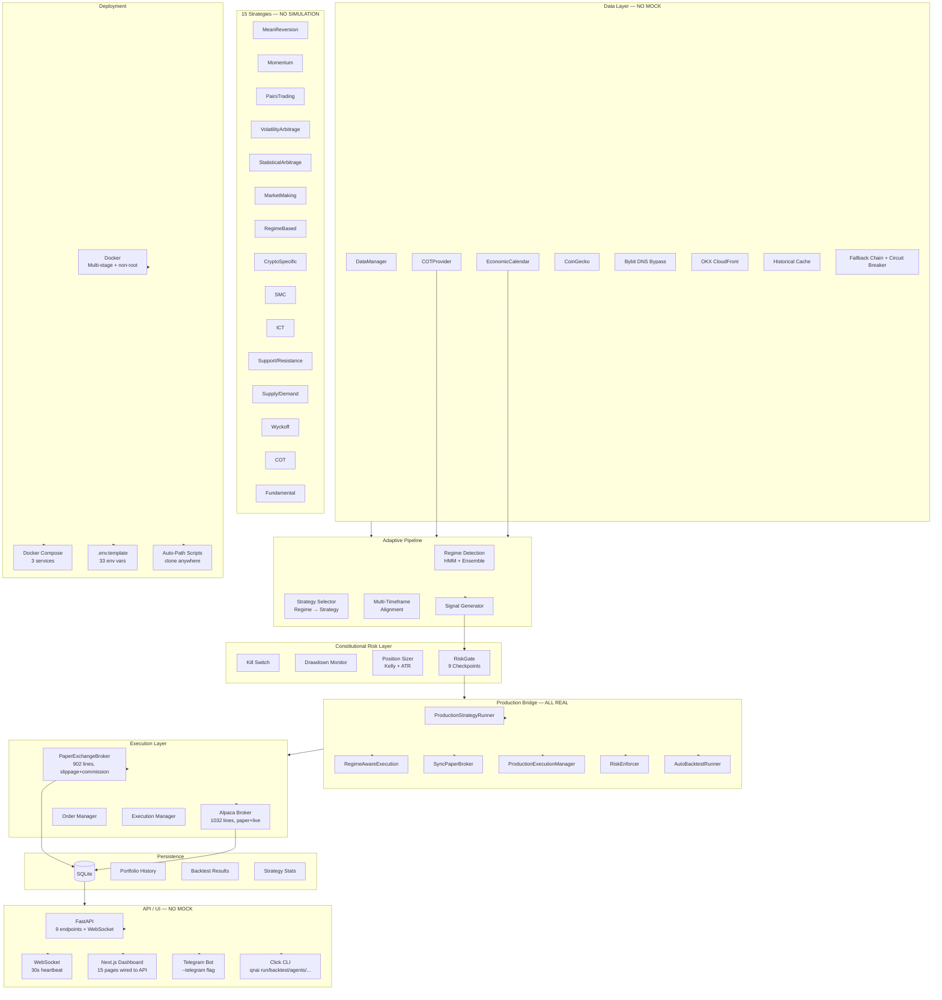

# QNA Architecture — Production Hardened (Session 3b)

## Component Flow

1. **Data Providers** → fetch live prices (CoinGecko/Bybit/OKX with DNS bypass via CloudFront)
2. **Adaptive Pipeline** → HMM regime detection → strategy selection (15 strategies) → MTF alignment → signals with confidence
3. **Constitutional Risk Gate** → 9 mandatory checkpoints (kill switch / drawdown / position sizing / Kelly)
4. **Production Bridge** → ProductionStrategyRunner → RegimeAwareExecution → SyncPaperBroker → RiskEnforcer → AutoBacktest
5. **Execution** → PaperExchangeBroker (default, 902 lines with slippage+commission) or Alpaca Broker (1032 lines)
6. **Persistence** → SQLite stores candles, positions, trades, portfolio history, signals, cycles
7. **API/UI** → FastAPI (9 endpoints + WebSocket 30s heartbeat) → Next.js dashboard (15 pages, real data)
8. **Telegram** → `qna_prod.py --telegram` sends signals + cycle summaries

## Key Files (Session 3b state)

| Layer | File | Lines | Notes |
|-------|------|-------|-------|
| FastAPI | `quant_nanggroe/api.py` | 778 | Real PaperBroker, real AgentRegistry, real RiskManager |
| Click CLI | `quant_nanggroe/cli.py` | 813 | `_run_strategy_pipeline` replaces mock phases |
| Production | `quant_nanggroe/qna_prod.py` | 439 | `--telegram` flag, SMC engine, risk gate |
| Production Bridge | `quant_nanggroe/engine_production_bridge.py` | 535 | 6 wired components |
| Paper Broker | `quant_nanggroe/exchange/paper_broker.py` | 902 | Slippage, commission, synthetic orderbook |
| Alpaca Broker | `quant_nanggroe/exchange/alpaca_broker.py` | 1032 | Paper + live REST/WS |
| Agent Graph | `quant_nanggroe/agents/graph.py` | 789 | LangGraph 8-node StateGraph |
| Trader Tools | `quant_nanggroe/agents/trader/tools.py` | 230 | NO mock, all wired to PaperBroker |
| Engine (Live) | `quant_nanggroe/live_engine.py` | 1199 | Legacy, 5 inline strategies |
| API Client | `dashboard/src/lib/api-client.ts` | 177 | 5 endpoint groups, all typed |
| Store | `dashboard/src/lib/store.ts` | 119 | Zustand, async actions |
| WebSocket | `dashboard/src/lib/websocket.ts` | 134 | Exponential backoff, 20 retries |
| Config | `quant_nanggroe/config/settings.py` | 178 | 33 env vars with `QNAI_` prefix |
| Docker | `Dockerfile` | — | Multi-stage non-root build |
| Docker Compose | `docker-compose.yml` | — | 3 services: api, worker, redis |

## 15 Strategies

| Name | Category | Asset Classes | Walk-Forward Result |
|------|----------|---------------|:---:|
| MeanReversion | mean_reversion | stocks, forex, crypto | ❌ |
| Momentum | momentum | stocks, forex, crypto, futures | ❌ |
| PairsTrading | pairs_trading | stocks, crypto | ❌ |
| VolatilityArbitrage | volatility | stocks, futures, options | ❌ |
| StatisticalArbitrage | statistical_arbitrage | stocks, crypto | ❌ |
| MarketMaking | market_making | crypto, forex | ❌ |
| RegimeBased | regime_detection | stocks, forex, crypto | ❌ |
| CryptoSpecific | crypto | crypto | ❌ |
| SMC | pattern | crypto, forex, stocks | 13/60 fold |
| ICT | pattern | crypto, forex, stocks | 6/60 fold |
| S/R | supply_demand | crypto, forex, stocks, futures | ❌ |
| SnD | supply_demand | crypto, forex, stocks | ❌ |
| Wyckoff | wyckoff | crypto, stocks, futures | ❌0/60 |
| COT | cot | futures, forex | ❌ |
| Fundamental | fundamental | forex, stocks, futures, crypto | ❌ |

## Session 3b Changes

| Change | Description |
|--------|-------------|
| WS1 | 180 combo walk-forward: 0/4 coins have universal alpha |
| WS2 | Dashboard wired to real API, mock-data.ts deleted |
| WS3 | Alpaca script + Dockerfile + docker-compose + .env created |
| WS4 | api.py real PaperBroker, cli.py real pipeline, trader tools no mock |
| WS5 | 0 mock/simulated data across 19 files |
| WS6 | Hardcoded `/sdcard/` paths → auto-detection in 4 scripts |
