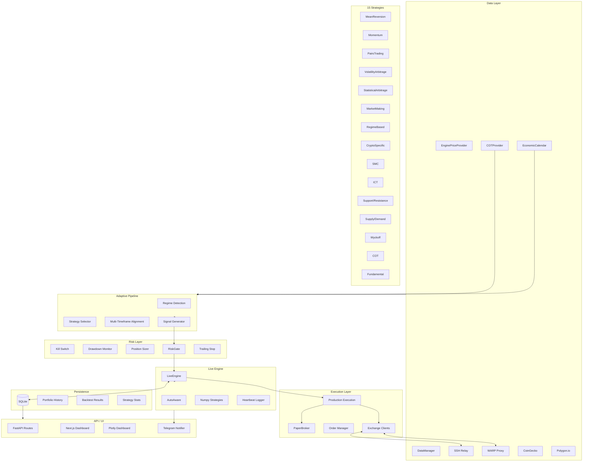

# QNA Architecture — Adaptive Integration Pipeline

## Component Flow

1. **Data Providers** → fetch live prices (SSH relay bypasses Telkomsel block)
2. **Adaptive Pipeline** → regime detection → strategy selection (15 strategies) → MTF alignment → signals
3. **Risk Gate** → kill switch / drawdown / position sizing pre-trade checks
4. **Live Engine** → execute signals via PaperBroker or exchange clients
5. **Persistence** → SQLite stores candles, positions, trades, portfolio history
6. **API/UI** → 5 FastAPI endpoints + Plotly dashboard + Telegram heartbeat

## Key Files

| Layer | File | Lines |
|-------|------|-------|
| Live Engine | `quant_nanggroe/live_engine.py` | 1199 |
| Adaptive Pipeline | `quant_nanggroe/engine/live/adaptive_integration.py` | 348 |
| Strategy Registry | `quant_nanggroe/engine/strategy/strategies/__init__.py` | 269 |
| Production Bridge | `quant_nanggroe/engine_production_bridge.py` | 535 |
| SSH Proxy | `quant_nanggroe/providers/proxy.py` | — |
| COT Provider | `quant_nanggroe/engine/data/cot_provider.py` | 263 |
| Risk Manager | `quant_nanggroe/engine/risk/manager.py` | 673 |
| Strategy Selector | `quant_nanggroe/engine/strategy/strategy_selector.py` | 356 |
| Multi-Timeframe | `quant_nanggroe/engine/strategy/multi_timeframe.py` | 237 |

## 15 Strategies

| Name | Category | Asset Classes |
|------|----------|---------------|
| MeanReversion | mean_reversion | stocks, forex, crypto |
| Momentum | momentum | stocks, forex, crypto, futures |
| PairsTrading | pairs_trading | stocks, crypto |
| VolatilityArbitrage | volatility | stocks, futures, options |
| StatisticalArbitrage | statistical_arbitrage | stocks, crypto |
| MarketMaking | market_making | crypto, forex |
| RegimeBased | regime_detection | stocks, forex, crypto |
| CryptoSpecific | crypto | crypto |
| SMC | pattern | crypto, forex, stocks |
| ICT | pattern | crypto, forex, stocks |
| S/R | supply_demand | crypto, forex, stocks, futures |
| SnD | supply_demand | crypto, forex, stocks |
| Wyckoff | wyckoff | crypto, stocks, futures |
| COT | cot | futures, forex |
| Fundamental | fundamental | forex, stocks, futures, crypto |
