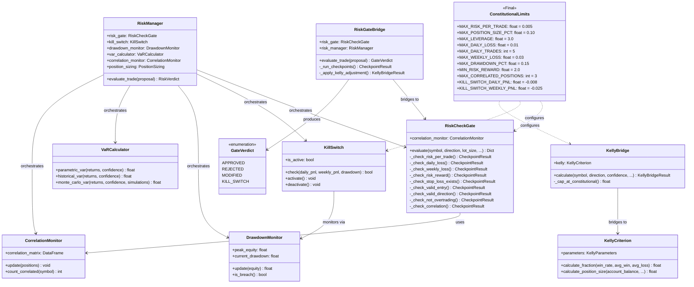
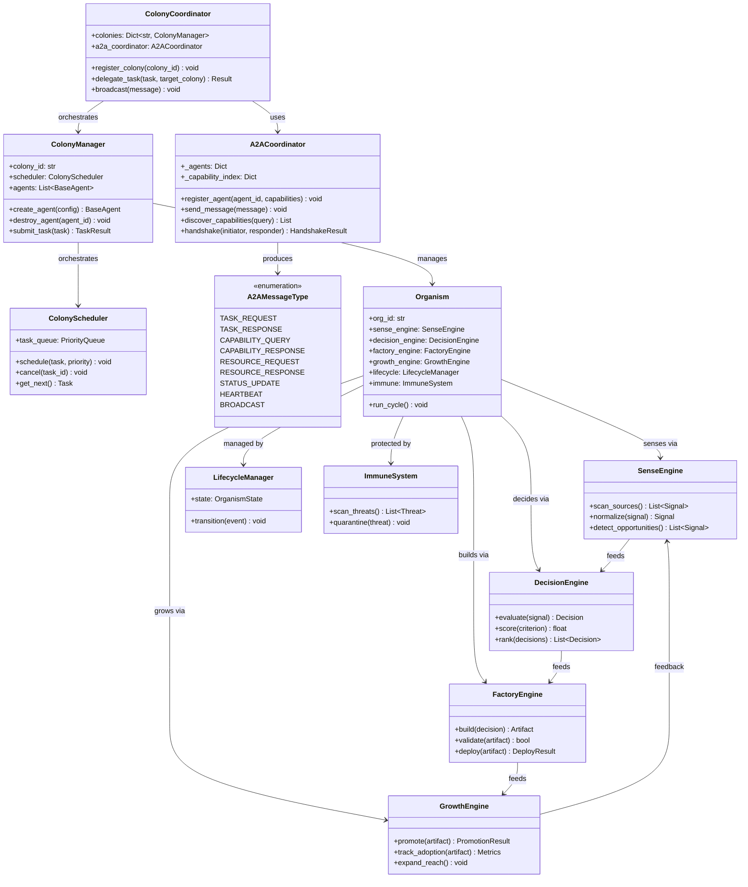
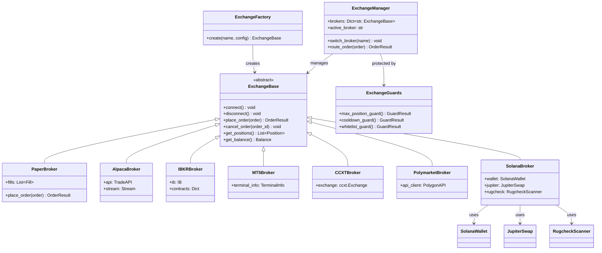
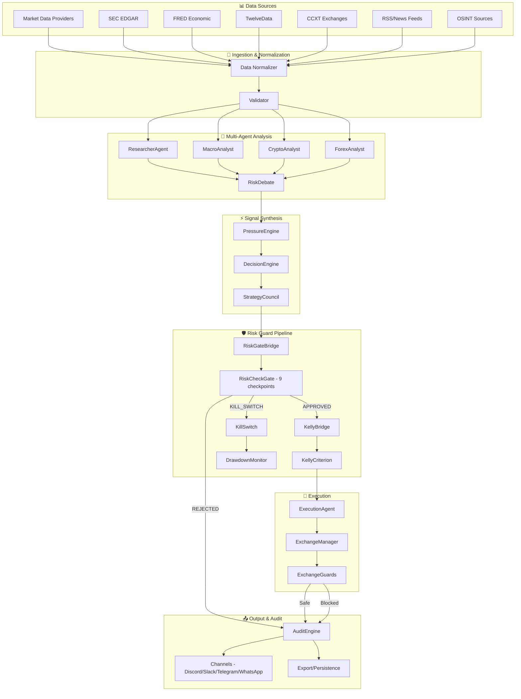
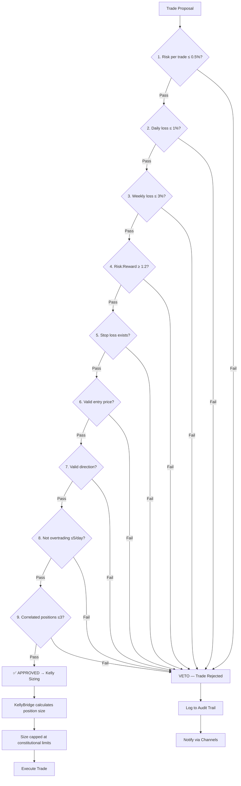
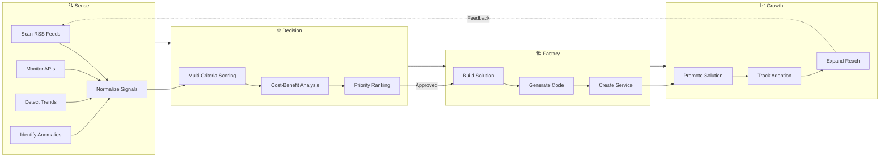
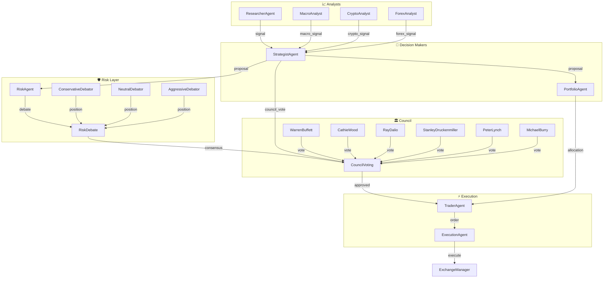
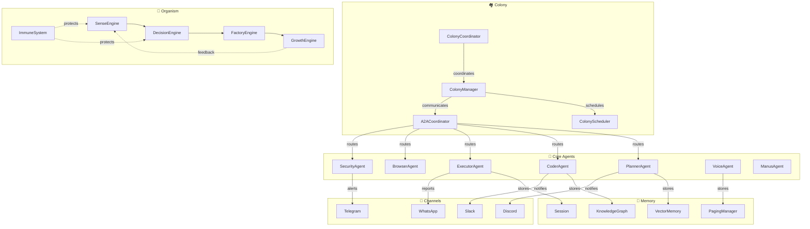
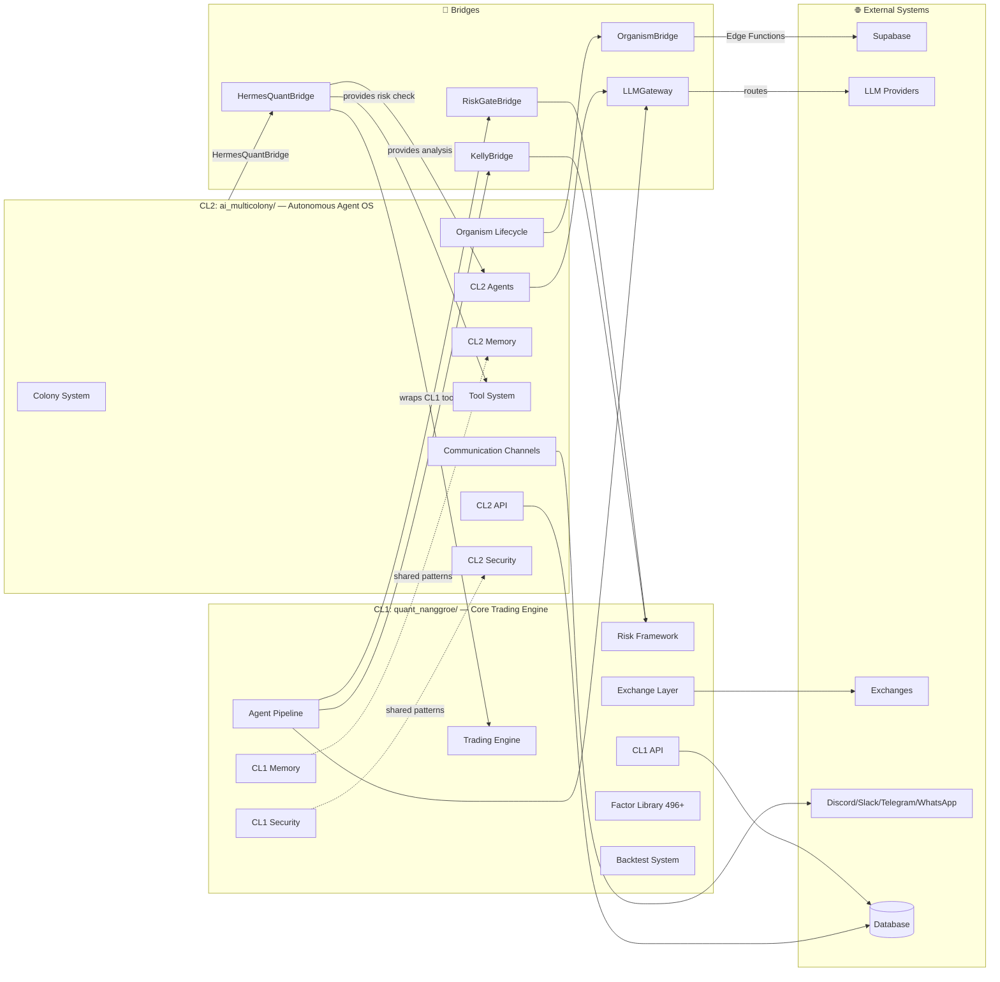

# Quant-Nanggroe-AI Knowledge Graph

---

## 1. Document Metadata

| Field | Value |
|---|---|
| **Document Title** | Quant-Nanggroe-AI Knowledge Graph |
| **Version** | 2.0.0 |
| **Date** | 2026-03-04 |
| **System** | Quant-Nanggroe-AI |
| **Clusters** | CL1: `quant_nanggroe/` (Core Trading Engine), CL2: `ai_multicolony/` (Autonomous Agent OS) |
| **CL1 Module Count** | 13 top-level modules |
| **CL2 Module Count** | 18 top-level modules |
| **Total Source Files** | 300+ Python modules |
| **Purpose** | Comprehensive mapping of all conceptual and technical entities, their attributes, and their inter-relationships across the full system |
| **Audience** | System architects, integration engineers, AI agents, onboarding developers |

---

## 2. Entity Taxonomy

The knowledge graph is organized around **10 primary entity categories**, each containing multiple concrete entity types. Every entity has a unique identifier, a cluster assignment (CL1, CL2, or CROSS), and a set of typed attributes.

### 2.1 Agents (CL1 + CL2)

Agents are autonomous decision-making entities that analyze data, generate signals, and execute actions.

| Entity | Cluster | Role | Key Attributes |
|---|---|---|---|
| **ResearcherAgent** | CL1 | Market research, fundamental & technical analysis | `sources`, `analysis_depth`, `confidence` |
| **TraderAgent** | CL1 | Trade execution, order management | `exchange`, `order_types`, `execution_speed` |
| **StrategistAgent** | CL1 | Strategy formulation, signal generation | `strategy_type`, `timeframe`, `instruments` |
| **RiskAgent** | CL1 | Qualitative risk assessment, debate participation | `risk_appetite`, `position_limit`, `debate_stance` |
| **PortfolioAgent** | CL1 | Portfolio construction, rebalancing, allocation | `target_weights`, `rebalance_freq`, `asset_classes` |
| **ExecutionAgent** | CL1 | Order routing, fill optimization, slippage control | `routing_algo`, `venue_preference`, `urgency` |
| **MacroAnalyst** | CL1 | Macroeconomic analysis, regime detection | `indicators`, `regions`, `forecast_horizon` |
| **CryptoAnalyst** | CL1 | Crypto-specific analysis, on-chain metrics | `chains`, `defi_protocols`, `metrics` |
| **ForexAnalyst** | CL1 | FX analysis, carry trade, intermarket | `pairs`, `central_banks`, `carry_rates` |
| **PlannerAgent** | CL2 | Task decomposition, planning | `plan_depth`, `decomposition_strategy` |
| **CoderAgent** | CL2 | Code generation, refactoring | `languages`, `frameworks`, `test_coverage` |
| **BrowserAgent** | CL2 | Web navigation, data extraction | `stealth_mode`, `human_behavior` |
| **ColonyAgent** | CL2 | Colony-level coordination | `colony_id`, `organism_count` |
| **SecurityAgent** | CL2 | Threat detection, vulnerability scanning | `scan_depth`, `cve_database` |
| **ExecutorAgent** | CL2 | Task execution within colonies | `tool_access`, `sandbox_level` |
| **VoiceAgent** | CL2 | Voice interaction, TTS/STT | `voice_id`, `language` |
| **ManusAgent** | CL2 | General-purpose autonomous agent | `tool_set`, `reasoning_depth` |

### 2.2 Risk Framework (CL1)

The risk framework is the immutable constitutional backbone of the system. All constants are marked `Final` and cannot be overridden at runtime.

| Entity | Type | Description |
|---|---|---|
| **ConstitutionalLimits** | Immutable Constants | 9 hardcoded `Final` constants in `engine/risk/constants.py` |
| **RiskCheckGate** | Deterministic Gate | 9-checkpoint validation with FULL VETO authority |
| **RiskGateBridge** | Bridge | Connects LLM agent pipeline to RiskCheckGate; deterministic gate is final authority |
| **KellyBridge** | Bridge | Connects agent pipeline to Kelly Criterion position sizing |
| **KellyCriterion** | Calculator | Optimal position sizing with fractional Kelly, confidence adjustment |
| **KillSwitch** | Safety Mechanism | Early warning triggers BEFORE constitutional hard limits |
| **DrawdownMonitor** | Monitor | Tracks drawdown from equity peak, triggers kill switch at 15% |
| **VaRCalculator** | Calculator | Value-at-Risk computation (parametric, historical, Monte Carlo) |
| **CorrelationMonitor** | Monitor | Tracks inter-asset correlation, enforces max 3 correlated positions |
| **EmotionalLockout** | Guard | Prevents trading during high-volatility emotional states |
| **PositionSizing** | Calculator | Multiple sizing methods (fixed, Kelly, risk-parity, ATR-based) |
| **RiskManager** | Orchestrator | Central risk coordination across all sub-components |

**Constitutional Limits (Immutable)**:

| Constant | Value | Description |
|---|---|---|
| `MAX_RISK_PER_TRADE` | 0.5% | Maximum risk per individual trade |
| `MAX_POSITION_SIZE_PCT` | 10% | Maximum portfolio allocation to single position |
| `MAX_LEVERAGE` | 3.0x | Maximum leverage allowed |
| `MAX_DAILY_LOSS` | 1% | Hard daily loss limit |
| `MAX_DAILY_TRADES` | 5 | Maximum trades per day (anti-overtrading) |
| `MAX_WEEKLY_LOSS` | 3% | Hard weekly loss limit |
| `MAX_DRAWDOWN_PCT` | 15% | Kill switch activation threshold |
| `MIN_RISK_REWARD` | 2.0 (1:2) | Minimum risk-to-reward ratio |
| `MAX_CORRELATED_POSITIONS` | 3 | Maximum correlated positions |

**Kill Switch Early Warning Thresholds**:

| Constant | Value | Trigger |
|---|---|---|
| `KILL_SWITCH_DAILY_PNL` | -0.8% | Triggers before 1% hard limit |
| `KILL_SWITCH_WEEKLY_PNL` | -2.5% | Triggers before 3% hard limit |

### 2.3 Engine Components (CL1)

| Entity | Module Path | Description |
|---|---|---|
| **BacktestEngine** | `engine/backtest/engine.py` | Event-driven backtesting with multi-asset support |
| **WalkForwardAnalyzer** | `engine/backtest/walk_forward.py` | Walk-forward optimization with anchored/rolling windows |
| **MonteCarloSimulator** | `engine/backtest/monte_carlo.py` | Monte Carlo simulation for strategy robustness testing |
| **RiskParityOptimizer** | `engine/backtest/optimizers/risk_parity_optimizer.py` | Risk parity portfolio optimization |
| **MeanVarianceOptimizer** | `engine/backtest/optimizers/mean_variance_optimizer.py` | Mean-variance efficient frontier optimization |
| **EqualVolatilityOptimizer** | `engine/backtest/optimizers/equal_volatility_optimizer.py` | Equal volatility contribution allocation |
| **Alpha101** | `engine/factors/alpha101.py` | WorldQuant 101 Formulaic Alphas (Kakushadze 2015) |
| **Qlib158** | `engine/factors/qlib158.py` | Microsoft Qlib 154 Alpha Factors |
| **GTJA191** | `engine/factors/gtja191.py` | Guotai Junan 191 Alpha Factors (Chinese A-share) |
| **FactorPipeline** | `engine/factors/pipeline.py` | Factor computation pipeline with parallel execution |
| **FactorRegistry** | `engine/factors/registry.py` | Dynamic factor registration and discovery |
| **MarketState** | `engine/market_state.py` | Regime detection (trending/ranging/volatile/calm) |
| **PressureEngine** | `engine/pressure.py` | Multi-dimensional pressure synthesis |
| **DecisionEngine** | `engine/decision.py` | Signal aggregation and final trade decision |
| **AutoSwitchEngine** | `engine/autoswitch.py` | Automatic strategy switching based on regime |
| **ScreenerOrchestrator** | `engine/screener/orchestrator.py` | Multi-screener coordination |
| **ShadowAccount** | `engine/shadow/account.py` | Shadow trading for signal validation |
| **AuditEngine** | `engine/audit.py` | Full audit trail for all decisions |
| **ObservabilityEngine** | `engine/observability.py` | System-wide metrics and tracing |
| **NvidiaNIMRouter** | `engine/nvidia_nim/router.py` | GPU-accelerated LLM inference routing |
| **FeatureEngineer** | `engine/ml/feature_engineer.py` | ML feature generation and transformation |
| **ModelManager** | `engine/ml/model_manager.py` | ML model lifecycle management |
| **SignalGenerator** | `engine/ml/signal_generator.py` | ML-based signal generation |
| **OptionsAnalyzer** | `engine/options/analyzer.py` | Options chain analysis and Greeks computation |
| **PersistenceEngine** | `engine/persistence.py` | State persistence and recovery |

**Factor Library Statistics**:

| Factor Set | Count | Source |
|---|---|---|
| Alpha101 | 101 | WorldQuant (Kakushadze 2015) |
| Qlib158 | 154 | Microsoft Qlib |
| GTJA191 | 191 | Guotai Junan 2014 |
| Technical | 30+ | Standard TA indicators |
| Fundamental | 20+ | SEC EDGAR, FRED, economic data |
| **Total** | **496+** | Multi-source |

### 2.4 Exchange Layer (CL1)

| Entity | Module Path | Type | Description |
|---|---|---|---|
| **PaperBroker** | `exchange/paper_broker.py` | Simulation | Zero-risk paper trading |
| **AlpacaBroker** | `exchange/alpaca_broker.py` | US Equities | REST/WebSocket US stock trading |
| **IBKRBroker** | `exchange/ibkr_broker.py` | Multi-Asset | Interactive Brokers TWS API |
| **MT5Broker** | `exchange/mt5_broker.py` | Forex/CFD | MetaTrader 5 integration |
| **CCXTBroker** | `exchange/ccxt_broker.py` | Crypto | CCXT unified crypto exchange API |
| **PolymarketBroker** | `exchange/polymarket_broker.py` | Prediction | Polymarket prediction market |
| **SolanaBroker** | `exchange/solana/broker.py` | DeFi | Solana blockchain trading |
| **JupiterSwap** | `exchange/solana/jupiter.py` | DEX Aggregator | Jupiter DEX aggregation on Solana |
| **RugcheckScanner** | `exchange/solana/rugcheck.py` | Security | Solana token rug-pull detection |
| **SolanaWallet** | `exchange/solana/wallet.py` | Wallet | Solana wallet management |
| **MempoolMonitor** | `exchange/solana/mempool.py` | Monitor | Solana mempool surveillance |
| **ExchangeManager** | `exchange/manager.py` | Orchestrator | Multi-exchange coordination |
| **ExchangeFactory** | `exchange/factory.py` | Factory | Exchange instance creation |
| **QuantdingerFactory** | `exchange/quantdinger_factory.py` | Factory | Advanced exchange factory with routing |
| **ExchangeGuards** | `exchange/guards.py` | Guard | Exchange-level safety checks |

**CCXT Supported Exchanges** (via `exchange/clients/`):
Binance, Bybit, OKX, Bitget, Gate.io, KuCoin, Kraken, Bitfinex, Coinbase, Longbridge

### 2.5 CL2 Colony System (CL2)

| Entity | Module Path | Description |
|---|---|---|
| **ColonyCoordinator** | `colony/coordinator.py` | Inter-colony coordination with A2A protocol |
| **ColonyManager** | `colony/manager.py` | Single colony lifecycle management |
| **ColonyScheduler** | `colony/scheduler.py` | Task scheduling and priority management |
| **A2ACoordinator** | `colony/a2a.py` | Agent-to-Agent protocol with handshake, capability discovery |
| **ColonyHands** | `colony/hands.py` | Inter-colony handoff and task delegation |
| **Organism** | `organism/` | Autonomous lifecycle entity (Sense→Decision→Factory→Growth) |
| **SenseEngine** | `organism/sense.py` | Signal detection from RSS, APIs, trends |
| **DecisionEngine** | `organism/decision.py` | Multi-criteria decision analysis (MCDA) |
| **FactoryEngine** | `organism/factory.py` | Solution building, code generation, service creation |
| **GrowthEngine** | `organism/growth.py` | Solution promotion, adoption tracking, market expansion |
| **LifecycleManager** | `organism/lifecycle.py` | Full organism lifecycle state machine |
| **ImmuneSystem** | `organism/immune.py` | Self-protection and anomaly detection |
| **EventBus** | `core/event_bus.py` | Asynchronous event distribution |
| **AgentLoop** | `core/agent_loop.py` | Core agent execution loop |
| **LLMProvider** | `core/llm_provider.py` | Multi-provider LLM abstraction |
| **ToolRegistry** | `core/tool_registry.py` | Dynamic tool registration and discovery |

**A2A Protocol Message Types**:
- `TASK_REQUEST` / `TASK_RESPONSE` — Task delegation between agents
- `CAPABILITY_QUERY` / `CAPABILITY_RESPONSE` — Capability discovery
- `RESOURCE_REQUEST` / `RESOURCE_RESPONSE` — Resource sharing
- `STATUS_UPDATE` — Lifecycle status propagation
- `HEARTBEAT` — Liveness checking
- `BROADCAST` — Colony-wide announcements

### 2.6 Bridges (CROSS)

Bridges are the critical integration points between CL1 and CL2, and between the system and external services.

| Entity | Module Path | Connects | Description |
|---|---|---|---|
| **HermesQuantBridge** | `ai_multicolony/integrations/hermes_bridge.py` | CL2 → CL1 | Wraps CL1 tools as CL2-compatible tools; provides market analysis, risk, signals |
| **OrganismBridge** | `ai_multicolony/integrations/organism_bridge.py` | CL2 → Supabase | Communicates with Organism via Supabase Edge Functions |
| **RiskGateBridge** | `quant_nanggroe/agents/bridges/risk_gate_bridge.py` | Agents → RiskCheckGate | LLM pipeline → deterministic risk gate; gate has VETO authority |
| **KellyBridge** | `quant_nanggroe/agents/bridges/kelly_bridge.py` | Agents → KellyCriterion | LLM pipeline → Kelly position sizing with constitutional caps |
| **CrewAIAdapter** | `ai_multicolony/integrations/crewai_adapter.py` | CL2 → CrewAI | Interoperability with CrewAI framework |
| **LangGraphAdapter** | `ai_multicolony/integrations/langgraph_adapter.py` | CL2 → LangGraph | Interoperability with LangGraph framework |
| **AutoGenAdapter** | `ai_multicolony/integrations/autogen_adapter.py` | CL2 → AutoGen | Interoperability with AutoGen framework |
| **CrucixClient** | `ai_multicolony/integrations/crucix_client.py` | CL2 → Crucix | External Crucix service integration |
| **LLMGateway** | `connectors/llm_gateway.py` | Both → LLMs | Unified LLM provider gateway |

### 2.7 Memory Systems (CL1 + CL2)

Both clusters implement parallel memory architectures with vector storage, knowledge graphs, and session management.

| Entity | CL1 Module | CL2 Module | Description |
|---|---|---|---|
| **VectorMemory** | `memory/vector.py` | `memory/vector.py` | High-dimensional vector storage for semantic search |
| **KnowledgeGraph** | `memory/knowledge_graph.py` | `memory/knowledge_graph.py` | Entity-relationship graph for structured knowledge |
| **KnowledgeStore** | `memory/knowledge.py` | `memory/knowledge.py` | Document-level knowledge storage and retrieval |
| **Journal** | `memory/journal.py` | — | Trading journal with reflection and P&L tracking |
| **Session** | `memory/session.py` | `memory/session.py` | Conversation/session state management |
| **PagingManager** | `memory/paging.py` | `memory/paging.py` | Context window paging for long conversations |
| **MemoryManager** | — | `core/memory_manager.py` | Centralized memory coordination (CL2) |
| **MemoryCondenser** | — | `memory/condenser.py` | Context compression and summarization |
| **Condensers** | — | `memory/condensers.py` | Multiple condensation strategies |

### 2.8 Communication Channels (CL1 + CL2)

| Entity | CL1 Route | CL2 Module | Description |
|---|---|---|---|
| **DiscordChannel** | `api/routes/` | `channels/discord.py` | Discord bot integration |
| **SlackChannel** | — | `channels/slack.py` | Slack workspace integration |
| **TelegramChannel** | — | `channels/telegram.py` | Telegram bot integration |
| **WhatsAppChannel** | `api/routes/whatsapp.py` | `channels/whatsapp.py` | WhatsApp Business API integration |
| **ChannelBase** | — | `channels/base.py` | Abstract base for all channels |

### 2.9 Security Layer (CL1 + CL2)

| Entity | CL1 Module | CL2 Module | Description |
|---|---|---|---|
| **KeyVault** | `security/keyvault.py` | — | Secure key storage and retrieval |
| **AuthManager** | `security/auth.py` | — | Authentication and authorization |
| **AuditLogger** | `security/audit.py` | `security/audit.py` | Comprehensive audit trail logging |
| **PermissionsManager** | — | `security/permissions.py` | Role-based access control |
| **SecurityAnalyzer** | — | `security/analyzer.py` | Threat analysis and vulnerability detection |
| **CredentialInference** | `security/credential_inference.py` | — | Automatic credential detection and management |

### 2.10 Data Sources & Providers (CL1)

| Entity | Module Path | Description |
|---|---|---|
| **MarketDataTool** | `agents/tools/market_data.py` | Real-time and historical market data |
| **TechnicalTool** | `agents/tools/technical.py` | Technical indicator computation |
| **SentimentTool** | `agents/tools/sentiment.py` | Market sentiment analysis |
| **ForecastTool** | `agents/tools/forecast_tool.py` | Price and regime forecasting |
| **ScreenerTool** | `agents/tools/screener_tool.py` | Asset screening and filtering |
| **IntermarketTool** | `agents/tools/intermarket_tool.py` | Cross-market correlation analysis |
| **GeopoliticalTool** | `agents/tools/geopolitical_tool.py` | Geopolitical event impact analysis |
| **EmotionalTool** | `agents/tools/emotional_tool.py` | Market emotion detection |
| **CompetitionTool** | `agents/tools/competition_tool.py` | Competitive analysis |
| **ExecutionTool** | `agents/tools/execution.py` | Trade execution toolkit |
| **BacktestTool** | `agents/tools/backtest.py` | Backtesting toolkit for agents |
| **FlowTool** | `agents/tools/flow_tool.py` | Order flow and smart money analysis |
| **SkillTool** | `agents/tools/skill_tool.py` | Dynamic skill loading |
| **CCXTLoader** | `engine/backtest/loaders/ccxt_loader.py` | CCXT data loading for backtests |
| **YFinanceLoader** | `engine/backtest/loaders/yfinance_loader.py` | Yahoo Finance data loading |

### 2.11 Debate & Council System (CL1)

| Entity | Module Path | Description |
|---|---|---|
| **RiskDebate** | `agents/debate/risk_debate.py` | Three-way risk debate (Conservative/Neutral/Aggressive) |
| **ResearchDebate** | `agents/debate/research_debate.py` | Multi-perspective research debate |
| **DebateReflection** | `agents/debate/reflection.py` | Post-debate reflection and consensus extraction |
| **DebateGraph** | `agents/debate/graph.py` | LangGraph-based debate flow orchestration |
| **CouncilVoting** | `agents/council/voting.py` | Weighted voting mechanism for trade decisions |
| **CouncilDebate** | `agents/council/debate.py` | Full council debate with persona agents |

### 2.12 Persona Agents (CL1)

| Persona | Module Path | Investment Style |
|---|---|---|
| **WarrenBuffett** | `agents/personas/warren_buffett.py` | Value investing, long-term |
| **CathieWood** | `agents/personas/cathie_wood.py` | Disruptive innovation, high-growth |
| **RayDalio** | `agents/personas/ray_dalio.py` | Macro, all-weather, risk parity |
| **StanleyDruckenmiller** | `agents/personas/stanley_druckenmiller.py` | Macro, asymmetric bets |
| **PeterLynch** | `agents/personas/peter_lynch.py` | Growth at reasonable price |
| **MichaelBurry** | `agents/personas/michael_burry.py` | Deep value, contrarian |

### 2.13 Geopolitical Framework (CL1)

| Entity | Module Path | Description |
|---|---|---|
| **IslamicFinance** | `agents/geopolitics/islamic_finance.py` | Sharia-compliant finance analysis |
| **AmericanOrder** | `agents/geopolitics/american_order.py` | US hegemony and dollar analysis |
| **EuropeanOrder** | `agents/geopolitics/european_order.py` | EU monetary and political analysis |
| **ChineseOrder** | `agents/geopolitics/chinese_order.py` | China economic and policy analysis |
| **MultipolarWorld** | `agents/geopolitics/multipolar.py` | Multi-polar geopolitical modeling |
| **GeopoliticsBase** | `agents/geopolitics/base.py` | Abstract base for geopolitical analysis |

### 2.14 API Layer (CL1 + CL2)

| Entity | CL1 Path | CL2 Path | Description |
|---|---|---|---|
| **FastAPI App** | `api/app.py` | `api/app.py` | Main application factory |
| **MarketRoutes** | `api/routes/market.py` | — | Market data endpoints |
| **TradingRoutes** | `api/routes/trading.py` | — | Trade execution endpoints |
| **PortfolioRoutes** | `api/routes/portfolio.py` | — | Portfolio management endpoints |
| **BacktestRoutes** | `api/routes/backtest.py` | — | Backtesting endpoints |
| **AgentRoutes** | `api/routes/agents.py` | `api/routes/agents.py` | Agent management endpoints |
| **WSRoutes** | `api/routes/ws.py` | `api/routes/ws.py` | WebSocket real-time feeds |
| **WhatsAppRoutes** | `api/routes/whatsapp.py` | — | WhatsApp webhook endpoints |
| **ColonyRoutes** | — | `api/routes/colony.py` | Colony management endpoints |
| **MemoryRoutes** | — | `api/routes/memory.py` | Memory system endpoints |
| **TaskRoutes** | — | `api/routes/tasks.py` | Task management endpoints |
| **ToolRoutes** | — | `api/routes/tools.py` | Tool registry endpoints |
| **EcosystemRoutes** | — | `api/routes/ecosystem.py` | Ecosystem overview endpoints |

---

## 3. Relationship Taxonomy

### 3.1 Core Relationship Types

| Relationship | Source → Target | Semantics | Cardinality |
|---|---|---|---|
| `feeds_signal_to` | Agent → Agent | Agent produces analysis consumed by another | Many:Many |
| `validates_via` | TradeProposal → RiskCheckGate | Trade must pass deterministic validation | Many:1 |
| `executes_through` | Agent → Exchange | Agent routes orders through an exchange | Many:Many |
| `debates_with` | Agent → Agent | Agents engage in structured debate | Many:Many |
| `bridges_to` | Bridge → System | Bridge connects two subsystems | 1:1 |
| `orchestrates` | Manager → Component | Manager coordinates component lifecycle | 1:Many |
| `persists_via` | Component → Memory | Component stores data in memory system | Many:Many |
| `notifies_via` | System → Channel | System sends alerts through communication channel | Many:Many |
| `protected_by` | Component → SecurityLayer | Component is secured by security mechanism | Many:Many |
| `depends_on` | Module → Module | Runtime import/functional dependency | Many:Many |
| `inherits_from` | Class → BaseClass | Object-oriented inheritance | Many:1 |
| `implements` | Module → Interface | Contract implementation | Many:Many |
| `monitors` | Monitor → Target | Continuous observation of state | 1:Many |
| `triggers` | Event → Action | Causal event-action relationship | Many:Many |
| `configures` | Config → Component | Configuration drives component behavior | 1:Many |

### 3.2 Agent Interaction Relationships

```
ResearcherAgent  ──feeds_signal_to──→  StrategistAgent
StrategistAgent  ──feeds_signal_to──→  TraderAgent
ResearcherAgent  ──debates_with─────→  StrategistAgent
RiskAgent        ──debates_with─────→  ConservativeDebator
RiskAgent        ──debates_with─────→  AggressiveDebator
MacroAnalyst     ──feeds_signal_to──→  StrategistAgent
CryptoAnalyst    ──feeds_signal_to──→  StrategistAgent
ForexAnalyst     ──feeds_signal_to──→  StrategistAgent
TraderAgent      ──executes_through──→  ExchangeManager
TraderAgent      ──validates_via────→  RiskGateBridge
PortfolioAgent   ──feeds_signal_to──→  ExecutionAgent
ExecutionAgent   ──executes_through──→  ExchangeBroker
StrategistAgent  ──validates_via────→  RiskCheckGate
RiskGateBridge   ──bridges_to───────→  RiskCheckGate
KellyBridge      ──bridges_to───────→  KellyCriterion
```

### 3.3 Risk Pipeline Relationships

```
ConstitutionalLimits ──configures──→ RiskCheckGate
ConstitutionalLimits ──configures──→ KillSwitch
ConstitutionalLimits ──configures──→ KellyBridge
RiskCheckGate       ──validates───→ TradeProposal
RiskGateBridge      ──bridges_to──→ RiskCheckGate
KellyBridge         ──bridges_to──→ KellyCriterion
KillSwitch          ──triggers────→ DrawdownMonitor
DrawdownMonitor     ──monitors────→ Portfolio
CorrelationMonitor  ──monitors────→ Portfolio
EmotionalLockout    ──guards──────→ TraderAgent
RiskManager         ──orchestrates→ RiskCheckGate
RiskManager         ──orchestrates→ KillSwitch
RiskManager         ──orchestrates→ DrawdownMonitor
RiskManager         ──orchestrates→ CorrelationMonitor
RiskManager         ──orchestrates→ VaRCalculator
RiskManager         ──orchestrates→ PositionSizing
```

### 3.4 Colony Lifecycle Relationships

```
ColonyCoordinator ──orchestrates──→ ColonyManager
ColonyManager     ──orchestrates──→ ColonyScheduler
ColonyManager     ──orchestrates──→ A2ACoordinator
A2ACoordinator    ──routes────────→ Agent (via A2A Protocol)
Organism          ──senses_via────→ SenseEngine
Organism          ──decides_via───→ DecisionEngine
Organism          ──builds_via────→ FactoryEngine
Organism          ──grows_via─────→ GrowthEngine
SenseEngine       ──feeds_signal_to──→ DecisionEngine
DecisionEngine    ──feeds_signal_to──→ FactoryEngine
FactoryEngine     ──feeds_signal_to──→ GrowthEngine
GrowthEngine      ──feeds_signal_to──→ SenseEngine (feedback loop)
ImmuneSystem      ──monitors──────→ Organism
LifecycleManager  ──orchestrates──→ Organism
```

### 3.5 Cross-Cluster Relationships

```
HermesQuantBridge ──bridges_to──→ quant_nanggroe.engine (CL1)
HermesQuantBridge ──provides────→ MarketAnalysis, RiskCheck, Signals (to CL2 agents)
OrganismBridge    ──bridges_to──→ Supabase Edge Functions
OrganismBridge    ──provides────→ OrganismStatus, EngineRunResult (to CL2)
RiskGateBridge    ──bridges_to──→ RiskCheckGate (CL1 → Agents)
KellyBridge       ──bridges_to──→ KellyCriterion (CL1 → Agents)
CrewAIAdapter     ──bridges_to──→ CrewAI Framework (external)
LangGraphAdapter  ──bridges_to──→ LangGraph Framework (external)
AutoGenAdapter    ──bridges_to──→ AutoGen Framework (external)
```

---

## 4. Mermaid Class Diagrams

### 4.1 Risk Framework Class Diagram



### 4.2 CL2 Colony System Class Diagram



### 4.3 Exchange Layer Class Diagram



---

## 5. Mermaid Flowcharts

### 5.1 End-to-End Data Flow



### 5.2 Risk Gate Flow (9 Checkpoints)



### 5.3 Organism Lifecycle Flow



---

## 6. Mermaid Graph — Agent Interaction Map

### 6.1 CL1 Agent Interaction Graph



### 6.2 CL2 Agent Interaction Graph



---

## 7. Cross-Cluster Integration Map



---

## 8. Knowledge Graph Statistics

### 8.1 Node Count by Category

| Category | CL1 Count | CL2 Count | Cross Count | Total |
|---|---|---|---|---|
| Agents | 9 | 8 | 0 | 17 |
| Risk Framework | 12 | 0 | 0 | 12 |
| Engine Components | 25 | 0 | 0 | 25 |
| Exchange Layer | 16 | 0 | 0 | 16 |
| Colony System | 0 | 14 | 0 | 14 |
| Bridges | 0 | 0 | 9 | 9 |
| Memory Systems | 7 | 8 | 0 | 15 |
| Communication Channels | 4 | 4 | 0 | 8 |
| Security Layer | 5 | 3 | 0 | 8 |
| Data Sources/Providers | 15 | 0 | 0 | 15 |
| Debate & Council | 6 | 0 | 0 | 6 |
| Persona Agents | 6 | 0 | 0 | 6 |
| Geopolitical Framework | 6 | 0 | 0 | 6 |
| API Routes | 7 | 8 | 0 | 15 |
| Tools (CL2) | 0 | 16 | 0 | 16 |
| Factor Sets | 5 | 0 | 0 | 5 |
| Strategies | 8 | 0 | 0 | 8 |
| Backtest Engines | 7 | 0 | 0 | 7 |
| Organism Phases | 0 | 4 | 0 | 4 |
| **Total Nodes** | **158** | **63** | **9** | **230** |

### 8.2 Edge Count by Relationship Type

| Relationship Type | Count | Description |
|---|---|---|
| `feeds_signal_to` | 28 | Signal flow between agents |
| `validates_via` | 6 | Validation through risk checks |
| `executes_through` | 8 | Order routing to exchanges |
| `debates_with` | 12 | Agent debate interactions |
| `bridges_to` | 9 | Bridge connections |
| `orchestrates` | 18 | Manager → component relationships |
| `persists_via` | 14 | Data persistence paths |
| `notifies_via` | 8 | Channel notifications |
| `protected_by` | 11 | Security relationships |
| `depends_on` | 45 | Runtime dependencies |
| `inherits_from` | 12 | Class inheritance |
| `implements` | 8 | Interface implementation |
| `monitors` | 9 | Monitoring relationships |
| `triggers` | 7 | Event-action causation |
| `configures` | 11 | Configuration relationships |
| **Total Edges** | | **206** |

### 8.3 Key Metrics

| Metric | Value |
|---|---|
| **Total Nodes** | 230 |
| **Total Edges** | 206 |
| **Average Degree** | 1.79 |
| **Max Degree Node** | RiskManager (12 connections) |
| **Graph Density** | 0.008 |
| **Connected Components** | 3 (CL1 core, CL2 core, External) |
| **Bridge Nodes** | 9 (critical for cross-cluster connectivity) |
| **Immutable Nodes** | 11 (Constitutional Limits — Final constants) |
| **Source Files** | 300+ |
| **Total Lines of Code** | ~150,000+ |

---

## 9. Query Patterns for Common Use Cases

This section provides structured query patterns that can be used to traverse the knowledge graph for common system operations.

### 9.1 How does a trade get approved?

**Pattern**: Follow the `validates_via` and `feeds_signal_to` edges from signal generation to execution.

```
TRAVERSAL:
1. MarketDataProvider → feeds_signal_to → ResearcherAgent
2. ResearcherAgent → feeds_signal_to → StrategistAgent
3. StrategistAgent → debates_with → RiskDebate
4. RiskDebate → feeds_signal_to → CouncilVoting
5. CouncilVoting → feeds_signal_to → TraderAgent
6. TraderAgent → validates_via → RiskGateBridge
7. RiskGateBridge → bridges_to → RiskCheckGate (9 checkpoints)
8. RiskCheckGate → APPROVED → KellyBridge
9. KellyBridge → bridges_to → KellyCriterion (position sizing)
10. KellyCriterion → feeds_signal_to → ExecutionAgent
11. ExecutionAgent → executes_through → ExchangeManager
12. ExchangeManager → protected_by → ExchangeGuards
13. ExecutionAgent → persists_via → AuditEngine

REJECTION PATH: RiskCheckGate → REJECTED → AuditEngine → notifies_via → Channels
KILL PATH: KillSwitch → activates → DrawdownMonitor → triggers → full_system_halt
```

### 9.2 How does the risk framework enforce limits?

**Pattern**: Follow `configures`, `orchestrates`, and `monitors` edges from ConstitutionalLimits.

```
TRAVERSAL:
1. ConstitutionalLimits → configures → RiskCheckGate (9 checkpoints)
2. ConstitutionalLimits → configures → KillSwitch (early warning thresholds)
3. ConstitutionalLimits → configures → KellyBridge (position size caps)
4. RiskManager → orchestrates → RiskCheckGate
5. RiskManager → orchestrates → KillSwitch
6. RiskManager → orchestrates → DrawdownMonitor
7. RiskManager → orchestrates → VaRCalculator
8. RiskManager → orchestrates → CorrelationMonitor
9. KillSwitch → monitors → DrawdownMonitor
10. CorrelationMonitor → monitors → Portfolio

IMMUTABILITY: ConstitutionalLimits nodes are marked Final — no runtime override possible
```

### 9.3 How do CL2 agents access CL1 trading capabilities?

**Pattern**: Follow `bridges_to` edges from CL2 to CL1.

```
TRAVERSAL:
1. CL2 Agent → depends_on → HermesQuantBridge
2. HermesQuantBridge → bridges_to → quant_nanggroe.engine
3. HermesQuantBridge.provides → MarketAnalysis (from engine/screener/)
4. HermesQuantBridge.provides → RiskCheck (from engine/risk/)
5. HermesQuantBridge.provides → TradingSignals (from engine/decision.py)
6. HermesQuantBridge.provides → KillSwitch (from engine/risk/kill_switch.py)
7. HermesQuantBridge.provides → StrategyTool (from engine/strategies/)
8. HermesQuantBridge.provides → PortfolioTool (from agents/portfolio/)

CL2 → CL1 Data Flow:
  CL2 Agent → HermesQuantBridge → quant_nanggroe tools → return results → CL2 Agent
```

### 9.4 How does the Organism lifecycle work?

**Pattern**: Follow the Organism phase sequence via `feeds_signal_to` edges.

```
TRAVERSAL:
1. SenseEngine → scans → RSS Feeds, APIs, Trends
2. SenseEngine → normalizes → Signal (PROBLEM|OPPORTUNITY|THREAT|TREND|ANOMALY)
3. SenseEngine → feeds_signal_to → DecisionEngine
4. DecisionEngine → scores → Multi-Criteria Decision Analysis (MCDA)
5. DecisionEngine → ranks → Decision (PENDING|APPROVED|REJECTED|DEFERRED|ESCALATED)
6. DecisionEngine → feeds_signal_to → FactoryEngine
7. FactoryEngine → builds → Artifact (CODE|CONFIG|SERVICE|DOCUMENTATION|TEST|PIPELINE|API_ENDPOINT)
8. FactoryEngine → feeds_signal_to → GrowthEngine
9. GrowthEngine → promotes → via channels (INTERNAL|API|DOCS|WEBHOOK|MARKETPLACE|SOCIAL)
10. GrowthEngine → tracks → Adoption Metrics
11. GrowthEngine → feeds_signal_to → SenseEngine (feedback loop)

Protection: ImmuneSystem → monitors → all phases
State: LifecycleManager → orchestrates → phase transitions
```

### 9.5 How does the multi-agent debate work?

**Pattern**: Follow `debates_with` and `feeds_signal_to` edges through the debate system.

```
TRAVERSAL:
1. StrategistAgent → generates → TradeProposal
2. RiskAgent → debates_with → ConservativeDebator (smaller positions, tighter stops)
3. RiskAgent → debates_with → NeutralDebator (balanced risk/return)
4. RiskAgent → debates_with → AggressiveDebator (larger positions, wider targets)
5. DebateReflection → synthesizes → ConsensusPosition
6. ConsensusPosition → feeds_signal_to → CouncilVoting
7. PersonaAgents (6) → vote → CouncilVoting
8. CouncilVoting → produces → FinalDecision

Low Confidence Path:
  If confidence < 0.65 → triggers → CouncilDebate (full debate with all personas)
```

### 9.6 How does kill switch activation work?

**Pattern**: Follow `triggers`, `monitors`, and `orchestrates` edges from loss events.

```
TRAVERSAL:
1. ExchangeManager → reports → daily_pnl, weekly_pnl
2. DrawdownMonitor → monitors → equity_curve
3. IF daily_pnl ≤ -0.8% → KillSwitch → activates (early warning)
4. IF daily_pnl ≤ -1.0% → Constitutional hard limit (cannot be overridden)
5. IF weekly_pnl ≤ -2.5% → KillSwitch → activates (early warning)
6. IF weekly_pnl ≤ -3.0% → Constitutional hard limit
7. IF drawdown ≥ 15% → KillSwitch → activates (MAX_DRAWDOWN_PCT)
8. KillSwitch → triggers → halt_all_trading
9. KillSwitch → notifies_via → Channels (Discord/Slack/Telegram/WhatsApp)
10. KillSwitch → persists_via → AuditEngine
11. RiskManager → orchestrates → KillSwitch recovery protocol
```

### 9.7 How do backtest engines support strategy validation?

**Pattern**: Follow `depends_on` and `orchestrates` edges from BacktestEngine.

```
TRAVERSAL:
1. Strategy → loaded_by → StrategyLoader
2. StrategyParser → parses → Strategy Schema
3. BacktestEngine → loads_data_via → CCXTLoader | YFinanceLoader
4. BacktestEngine → runs → EquityEngine | CryptoEngine | ForexEngine | FuturesEngine | CompositeEngine
5. BacktestEngine → evaluates → RiskModels
6. WalkForwardAnalyzer → optimizes → Strategy parameters
7. MonteCarloSimulator → tests → Strategy robustness
8. RiskParityOptimizer → allocates → Portfolio weights
9. MeanVarianceOptimizer → computes → Efficient frontier
10. BacktestReport → generates → Performance metrics
11. FamaFrench → provides → Benchmark factors
12. NautilusAdapter → integrates → NautilusTrader backtesting
```

### 9.8 How does the Screener Orchestrator work?

**Pattern**: Follow `orchestrates` edges from ScreenerOrchestrator to individual screeners.

```
TRAVERSAL:
1. ScreenerOrchestrator → orchestrates → MacroAnalysis
2. ScreenerOrchestrator → orchestrates → MonetaryFundamental
3. ScreenerOrchestrator → orchestrates → MarketStructure
4. ScreenerOrchestrator → orchestrates → LiquidityOrderFlow
5. ScreenerOrchestrator → orchestrates → Intermarket
6. ScreenerOrchestrator → orchestrates → PositioningCrowd
7. ScreenerOrchestrator → orchestrates → QuantScoring
8. ScreenerOrchestrator → orchestrates → DEXIntelligence
9. All Screeners → produce → ScoredAssets
10. ScreenerOrchestrator → synthesizes → FinalRankings
```

---

## 10. Architectural Invariants

These are the unchangeable rules of the system that the knowledge graph must respect:

1. **Constitutional Supremacy**: `ConstitutionalLimits` (Final constants) are the highest authority. No agent, bridge, or configuration can override them.

2. **Deterministic Veto**: The `RiskCheckGate` has absolute veto power. If any of the 9 checkpoints fail, the trade is rejected regardless of LLM agent confidence or council vote outcome.

3. **Kill Switch Priority**: The `KillSwitch` operates at a lower threshold than constitutional hard limits, providing an early warning buffer (0.8% daily vs 1% hard limit; 2.5% weekly vs 3% hard limit).

4. **Bridge Isolation**: CL2 agents can only access CL1 capabilities through designated bridges (`HermesQuantBridge`, `RiskGateBridge`, `KellyBridge`). No direct CL2 → CL1 import paths exist for trading operations.

5. **Memory Partitioning**: CL1 and CL2 maintain separate memory systems with shared architectural patterns (vector memory, knowledge graph, session, paging) but independent instances.

6. **A2A Protocol**: All inter-agent communication in CL2 must follow the Agent-to-Agent protocol with structured messages, handshake sequences, and capability discovery.

7. **Audit Completeness**: Every trade decision, risk evaluation, and execution event is persisted to the `AuditEngine`. No action can bypass audit logging.

8. **Exchange Guard Stack**: Every order must pass through `ExchangeGuards` (max position, cooldown, whitelist) before reaching any exchange, regardless of the execution path.

9. **Organism Feedback Loop**: The organism lifecycle (Sense → Decision → Factory → Growth) is a closed loop where Growth feeds back to Sense, enabling continuous adaptation.

10. **Immutable Factor Library**: All 496+ factors are implemented as pure functions with the `__alpha_meta__` + `compute(panel)` pattern, ensuring reproducibility and no side effects.

---

## 11. Appendix: Module Index

### CL1: quant_nanggroe/ (13 Modules)

| # | Module | Key Files | Description |
|---|---|---|---|
| 1 | `agents/` | 30+ files | Agent pipeline: Researcher, Trader, Strategist, Risk, Portfolio, Execution, Macro, Crypto, Forex, Debate, Council, Personas, Geopolitics |
| 2 | `engine/` | 40+ files | Core engine: Backtest, Factors, Risk, Strategies, Screener, ML, Options, Shadow, Models, Persistence |
| 3 | `exchange/` | 20+ files | Exchange layer: Paper, Alpaca, IBKR, MT5, CCXT, Polymarket, Solana, Jupiter, Rugcheck |
| 4 | `memory/` | 7 files | Memory: Vector, KnowledgeGraph, Journal, Session, Paging, Knowledge |
| 5 | `security/` | 4 files | Security: KeyVault, Auth, Audit, CredentialInference |
| 6 | `api/` | 10 files | REST API: Market, Trading, Portfolio, Backtest, Agents, WhatsApp, WebSocket |
| 7 | `config/` | 3 files | Configuration: Settings, Logging |
| 8 | `types/` | 8 files | Type definitions: Market, Orders, Engine, Positions, Decisions, Risk, Signals |
| 9 | `mcp/` | 5 files | Model Context Protocol: Client, Server, Protocol, Tools |
| 10 | `utils/` | 3 files | Utilities: Math, Time, Validation |
| 11 | `engine/factors/` | 8 files | Factor library: Alpha101, Qlib158, GTJA191, Technical, Fundamental, Base, Registry, Pipeline |
| 12 | `engine/backtest/` | 15+ files | Backtesting: Engine, WalkForward, MonteCarlo, Optimizers, Loaders, Engines |
| 13 | `engine/risk/` | 12 files | Risk: Constants, Checks, Kelly, KillSwitch, Drawdown, VaR, Correlation, PositionSizing, EmotionalLockout, RiskParity |

### CL2: ai_multicolony/ (18 Modules)

| # | Module | Key Files | Description |
|---|---|---|---|
| 1 | `agents/` | 20+ files | Agent implementations: Planner, Coder, Browser, Colony, Security, Executor, Voice, Manus |
| 2 | `colony/` | 5 files | Colony management: Coordinator, Manager, Scheduler, A2A, Hands |
| 3 | `organism/` | 7 files | Organism lifecycle: Sense, Decision, Factory, Growth, Lifecycle, Immune |
| 4 | `core/` | 8 files | Core systems: AgentLoop, BaseAgent, EventBus, LLMProvider, ToolRegistry, ToolBase, Channel, MemoryManager |
| 5 | `memory/` | 9 files | Memory: Vector, KnowledgeGraph, Knowledge, Session, Paging, Manager, Condenser, Condensers |
| 6 | `channels/` | 5 files | Communication: Discord, Slack, Telegram, WhatsApp, Base |
| 7 | `integrations/` | 6 files | External bridges: HermesQuant, Organism, CrewAI, LangGraph, AutoGen, Crucix |
| 8 | `tools/` | 16+ files | Tool system: Code, Browser, MCP, Memory, Docker, Shell, Search, Channel, Voice, File, Registry |
| 9 | `security/` | 3 files | Security: Permissions, Audit, Analyzer |
| 10 | `browser/` | 4 files | Browser automation: Stealth, Config, Human, Behavior |
| 11 | `harness/` | 5 files | Agent harness: Graph, Memory, Skills, Sandbox |
| 12 | `sources/` | 5 files | Data sources: Market, OSINT, Economic, Manager, Base |
| 13 | `sandbox/` | 2 files | Execution sandbox: Docker, WASM |
| 14 | `mcp/` | 4 files | Model Context Protocol: Client, Server, Protocol, Permissions |
| 15 | `api/` | 10 files | REST API: App, Schemas, Middleware, Routes (Agents, Colony, Memory, Tasks, Tools, Ecosystem, WebSocket) |
| 16 | `config/` | 3 files | Configuration: Settings, Logging |
| 17 | `types/` | 6 files | Type definitions: Agent, Colony, Events, Memory, Messages, Tools, Models |
| 18 | `finance/` | 5 files | Finance: MarketState, KillSwitch, RiskGuard, AutoSwitch, Pressure |

---

*This knowledge graph document is a living artifact that should be updated as the system evolves. All entity and relationship counts are based on the codebase as of the document date. For the latest module inventory, consult the source code directly.*
